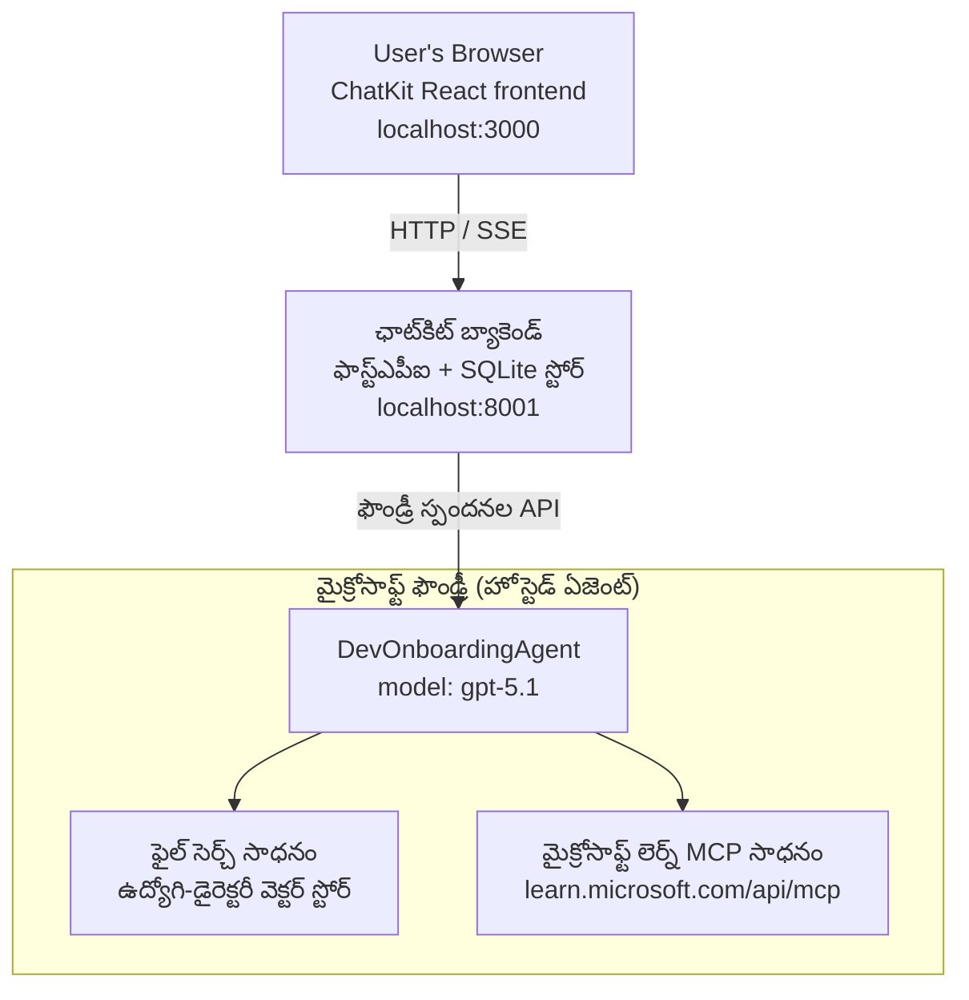

# పాఠం 4: Microsoft Foundry హోస్టెడ్ ఏజెంట్లతో ఏజెంట్ డిప్లాయ్‌మెంట్ + ChatKit

ఈ పాఠం ఒక టూల్-ఉపయోగించే ఏజెంట్‌ను Microsoft Foundryలో హోస్టెడ్ ఏజెంట్‌గా డిప్లాయ్ చేయడం మరియు దానితో ఇంటరాక్ట్ చేయడానికి ChatKit ఆధారిత ఫ్రంట్‌ఎండ్‌ను సృష్టించడం ఎలా చేయాలో చూపిస్తుంది.

## నిర్మాణం

హోస్టెడ్ ఏజెంట్ ఒక **ఒక్కటి `DevOnboardingAgent`** (అది `gpt-5.1` పై నడుస్తోంది) ఇది డెవలపర్-ఆన్‌బోర్డింగ్ ప్రశ్నలకు రెండు హోస్టెడ్ టూల్స్ ఉపయోగించి జవాబిస్తుంది: ఉద్యోగి-డైరెక్టరీ వెక్టర్ స్టోర్‌పై ఫైల్ సెర్చ్ టూల్ మరియు **Microsoft Learn MCP** టూల్. ఒక ChatKit React ఫ్రంట్‌ఎండ్ FastAPI బెక్‌ఎండ్‌తో మాట్లాడుతుంది, అది Foundry **Responses API** ద్వారా ఏజెంట్‌ను పిలుస్తుంది.



## ముందస్తు అవసరాలు

1. నార్త్ సెంట్రల్ US ప్రాంతంలో **Microsoft Foundry ప్రాజెక్ట్**
2. **Azure CLI** ధృవీకృతం (`az login`)
3. **Azure Developer CLI** (`azd`) ఇన్స్టాల్ చేయబడింది
4. **Python 3.12+** మరియు **Node.js 18+**
5. ఉద్యోగి డేటాతో **వెక్టర్ స్టోర్** సృష్టించబడింది

## తక్షణ ప్రారంభం

### 1. పర్యావరణ వేరియబుల్స్ సెట్ చేయండి

```bash
cd lesson-4-agentdeployment
cp .env.example .env
# మీ Microsoft Foundry ప్రాజెక్ట్ వివరాలతో .env ను సవరించండి
```

### 2. హోస్టెడ్ ఏజెంట్‌ను డిప్లాయ్ చేయండి

**ఎంపిక A: Azure Developer CLI ఉపయోగించడం (సిఫార్సు)**

```bash
cd hosted-agent
azd auth login
azd agent deploy
```

**ఎంపిక B: Docker + Azure Container Registry ఉపయోగించడం**

```bash
cd hosted-agent

# కంటైనర్ నిర్మించండి
docker build -t developer-onboarding-agent:latest .

# ACR కొరకు ట్యాగ్
docker tag developer-onboarding-agent:latest <your-acr>.azurecr.io/developer-onboarding-agent:latest

# ACR కి పుష్ చేయండి
az acr login --name <your-acr>
docker push <your-acr>.azurecr.io/developer-onboarding-agent:latest

# Microsoft Foundry పోర్టల్ లేదా SDK ద్వారా జమచేయండి
```

### 3. ChatKit బెక్‌ఎండ్ ప్రారంభించండి

```bash
cd chatkit-server
python -m venv .venv
source .venv/bin/activate  # విండోస్‌లో: .venv\Scripts\activate
pip install -r requirements.txt
python app.py
```

సర్వర్ `http://localhost:8001` పై ప్రారంభమవుతుంది

### 4. ChatKit ఫ్రంట్‌ఎండ్ ప్రారంభించండి

```bash
cd chatkit-server/frontend
npm install
npm run dev
```

ఫ్రంట్‌ఎండ్ `http://localhost:3000` పై ప్రారంభమవుతుంది

### 5. అప్లికేషన్‌ను పరీక్షించండి

మీ బ్రౌజర్‌లో `http://localhost:3000` ఎక్కించుకొని ఈ ప్రశ్నలు ప్రయత్నించండి:

**ఉద్యోగి సెర్చ్:**
- "నేను ఇక్కడ కొత్తవాణ్ని! Microsoftలో ఎవరైనా పనిచేసార?"
- "Azure Functionsలో ఎవరు అనుభవం కలిగి ఉన్నారు?"

**అభ్యాస వనరులు:**
- "Kubernetes కోసం ఒక అభ్యాస మార్గాన్ని సృష్టించండి"
- "క్లౌడ్ ఆర్కిటెక్చర్ కోసం నేను ఏ సర్టిఫికేషన్లు చేయాలి?"

**కోడింగ్ సహాయం:**
- "CosmosDBతో కనెక్ట్ కావడానికి Python కోడ్ వ్రాయడానికి సహాయం చేయండి"
- "Azure Function సృష్టించడం ఎలా అనేది చూపండి"

**బహుళ ఏజెంట్ ప్రశ్నలు:**
- "నేను క్లౌడ్ ఇంజినీర్‌గా ప్రారంభిస్తున్నాను. నేను ఎవరి తో కనెక్ట్ కావాలి మరియు ఏది నేర్చుకోవాలి?"

## ప్రాజెక్ట్ నిర్మాణం

```
lesson-4-agentdeployment/
├── .env.example                 # Environment variables template
├── implementation-plan.md       # Detailed implementation guide
├── README.md                    # This file
├── hosted-agent/               # Microsoft Foundry hosted agent
│   ├── main.py                 # Multi-agent workflow implementation
│   ├── requirements.txt        # Python dependencies
│   ├── Dockerfile              # Container definition
│   └── agent.yaml              # Agent deployment configuration
└── chatkit-server/             # ChatKit server application
    ├── app.py                  # FastAPI backend
    ├── store.py                # SQLite persistence layer
    ├── requirements.txt        # Python dependencies
    └── frontend/               # React frontend
        ├── package.json
        ├── vite.config.ts
        ├── tsconfig.json
        ├── index.html
        └── src/
            ├── main.tsx
            ├── App.tsx
            ├── App.css
            └── index.css
```

## ఏజెంట్ మరియు దాని టూల్స్

హోస్టెడ్ ఏజెంట్ ఒక **ఒక్క ఏజెంట్** (`DevOnboardingAgent`, `hosted-agent/main.py` లో నిర్వచించబడింది) ఇది మూడు ఆన్‌బోర్డింగ్ డొమైన్‌లను నిర్వహిస్తుంది. వేరే ఉపఏజెంట్లను ఒర్కెస్ట్రేట్ చేయడమంటే కాకుండా, ఇది ప్రతి సామర్థ్యాన్ని ఒక టూల్‌గా (లేదా మోడల్‌ నేరుగా ఆధారపడుతుంది):

| సామర్థ్యం | ఎలా నిర్వహించబడుతుంది | టూల్ |
|-----------|------------------|------|
| **ఉద్యోగి సెర్చ్ & కనెక్షన్స్** | ఉద్యోగి-డైరెక్టరీ వెక్టర్ స్టోర్‌పై Foundry హోస్టెడ్ ఫైల్ సెర్చ్ | `client.get_file_search_tool(vector_store_ids=[...])` |
| **అభ్యాస & శిక్షణ** | Microsoft Learn MCP సర్వర్ (హోస్టెడ్ MCP టూల్) | `client.get_mcp_tool(url="https://learn.microsoft.com/api/mcp")` |
| **కోడింగ్ సహాయం** | నేరుగా `gpt-5.1` మోడల్ ద్వారా నిర్వహించబడుతుంది — బయటి టూల్ అవసరం లేదు | — |


ఏజెంట్ `client.as_agent(name="DevOnboardingAgent", instructions=..., tools=[file_search_tool, learn_mcp_tool])` తో సృష్టించబడింది మరియు `from_agent_framework(agent).run()` తో సేవ్ చేయబడింది.

> **డిజైన్ నోట్.** ఈ పాఠం యొక్క మొదటి డ్రాఫ్టులు `HandoffBuilder` మల్టీ-ఏజెంట్ వర్క్ఫ్లో (ట్రయాజ్ → స్పెషలిస్టులు) ఉపయోగించాయి. షిప్ చేసిన ఏజెంట్ ఒకే ఒక టూల్ ఉపయోగించే ఏజెంట్, ఇది ఆన్‌బోర్డింగ్-శైలి ప్రశ్నలకు సమాధానమిచ్చేందుకు జారీ చేయడానికి మరియు అర్థం చేసుకోవడానికి సరళంగా ఉంటుంది. మల్టీ-ఏజెంట్ ఆర్కెస్ట్రేషన్ మరియు హ్యాండ్‌ఆఫ్స్ యొక్క ఉదాహరణ కోసం, పాఠం 2 మరియు పాఠం 3 చూడండి.

## హోస్టెడ్ ఏజెంట్‌ను స్మోక్ టెస్టింగ్ చేయడం (CI గేటు)

హోస్టెడ్ ఏజెంట్‌ను "సఫలంగా" ఏర్పాటు చేయడం కేవలం కంట్రోల్ ప్లేన్ నిర్వచనం స్వీకరించిందని మరియు
ఏజెంట్ వాస్తవానికి సమాధానం ఇస్తుందనే ధృవీకరించదు. ఒక కోల్పోయిన ఆధారము,
తప్పు మోడల్ రూటింగ్, లేదా కాల సమాప్తి అయిన కనెక్షన్ ఒక ఆకుపచ్చ కానీ మౌన ఏజెంట్‌ను ఉంచవచ్చు.

ఈ పాఠం తేలికపాటి **స్మోక్ టెస్ట్** ను అందిస్తుంది, ఇది వేగవంతమైన, చవకైన పోస్ట్-డిప్లాయ్
గేటుగా ప‌నిచేస్తుంది. ఇది [AI Smoke Test](https://github.com/marketplace/actions/ai-smoke-test)
GitHub యాక్షన్ ఉపయోగించి ఏజెంట్ యొక్క Foundry **Responses** ఎండ్‌పాయింట్‌కు
(`POST {project_endpoint}/agents/{agent_name}/endpoint/protocols/openai/responses`) ప్రాంప్ట్‌లను పంపించి
తిరిగి వచ్చిన టెక్స్ట్‌పై ధృవపత్రం నిర్వహిస్తుంది. ఇది మురికి డిప్లాయ్‌మెంట్‌లు, ధృవీకరణ సమస్యలు,
సిస్టం-ప్రాంప్ట్ డ్రిఫ్ట్, మరియు థ్రెడ్డింగ్ బ్రేకేజీని సెకన్లలో గుర్తిస్తుంది.

> స్మోక్ టెస్టులు సొంతంగా [Lesson 3](../lesson-3-agent-evals/README.md) లోని పూర్తి మదింపు స్థానాన్ని భర్తీ చేయి
> వద్దు — అవి సమగ్రంగా సహాయపడతాయి. స్మోక్ టెస్టులు
> *"ఏజెంట్ చేరుకోగలదా, స్పందిస్తున్నదా, మరియు ప్రాథమిక ప్రాంప్ట్ అంచనాలను అనుసరిస్తున్నదా?"* అని చెలామణీ చేస్తాయి;
> మదింపులు *"స్పందన ఎంత మంచిదిగా ఉంది?"* అని ప్రశ్నిస్తాయి. ప్రతి డిప్లాయ్ పై చవకైన గేటును నడపండి.

### ఏమి పరీక్షించబడుతుంది

క్యాటల్ప్ [`hosted-agent/tests/smoke-tests.json`](../../../lesson-4-agentdeployment/hosted-agent/tests/smoke-tests.json)
ఏజెంట్ యొక్క మూడు డొమైన్‌లను అలాగే ప్రాంప్ట్ తీసుకొనేటప్పుడు అనుసరణ మరియు బహు-మలుపు స్పందనను పరీక్షిస్తుంది:

| పరీక్ష | ఇది నిర్ధారించేది |
|------|------------------|
| `reachability` | ఏజెంట్ ఖాళీ కాని, నేపథ్యంలో ఉన్న టెక్స్ట్‌తో స్పందిస్తుంది |
| `employee-search` | ఫైల్సెర్చ్ డొమైన్ ఆరోగ్యకరమైన `200` (స్పందన డేటా-ఆధారిత)ను ఇస్తుంది |
| `learning-path` | లెర్నింగ్ డొమైన్ విషయం ప్రతిబింబిస్తుంది మరియు మార్గ శైలిలో జవాబు ఇస్తుంది |
| `coding-assistance` | కోడింగ్ డొమైన్ కోడ్ ఆకారపు Python జవాబు ఇస్తుంది |
| `prompt-adherence-offtopic` | ఆఫ్-టాపిక్ అభ్యర్థన దిశ మార్చబడుతుంది, వివరించి సమాధానం ఇవ్వబడదు |
| `threading-turn-1/2` | సంభాషణ స్థితిని `previous_response_id` ద్వారా మలుపుల మధ్య ఉంచుతుంది |

### దానిని CIలో నడపండి

[`.github/workflows/smoke-test-hosted-agent.yml`](../../../.github/workflows/smoke-test-hosted-agent.yml) వర్క్‌ఫ్లోలో రెండు జాబ్స్ ఉంటాయి:


- **`static`** — వేగవంతమైన, ఏజ్యూర్ లేని గేట్, ఇది ప్రతి పుల్ రిక్వెస్ట్ మరియు పుష్ పై నడుస్తుంది:
  ఇది అన్ని Python మూలాలను (`py_compile`) కాంపైల్ చేసి, మార్క్‌డౌన్ లింక్‌లను తనిఖీ చేస్తుంది. రహస్యాలు అవసరం లేనివి,
  కనుక ఇది ఫోర్క్ PR లపై కూడా పనిచేస్తుంది.
- **`smoke`** — క్రింద ఉన్న ఏజ్యూర్-కనెక్టెడ్ స్మోక్ టెస్ట్. ఇది డిమాండ్‌పై నడుస్తుంది
  (యాక్షన్స్ → **ఏజెంట్ CI (స్టాటిక్ + స్మోక్)** → వర్క్‌ఫ్లో నడపండి) మరియు మీ డిప్లాయ్ వర్క్‌ఫ్లో తర్వాత చైన్ చేయవచ్చు.


ఈ సెంపుల్ జాబ్ కోసం ఈ రిపోజిటరీ **వేరియబుల్స్** మరియు **రహస్యాలు** కన్ఫిగర్ చేయండి:


| రకం | పేరు | విలువ |
|------|------|-------|

| మార్పిడి | `FOUNDRY_PROJECT_ENDPOINT` | `https://<account>.services.ai.azure.com/api/projects/<project>` |
| మార్పిడి | `HOSTED_AGENT_NAME` | పంపిణీ చేసిన ఏజెంట్ పేరు (ఉదాహరణకు `dev-onboarding` — మీ పంపిణీకి సరిపోయేలా ఉండాలి) |
| రహస్యము | `AZURE_CLIENT_ID` / `AZURE_TENANT_ID` / `AZURE_SUBSCRIPTION_ID` | `azure/login` కోసం OIDC ఫెడరేటెడ్ ఐడెంటిటీ |

రన్నర్ ఐడెంటిటీకి **`Azure AI User`** పాత్ర **Foundry ప్రాజెక్ట్ స్కోప్** వద్ద కావాలి తద్వారా ఇది
Responses (మరియు conversations) డేటా-ప్లేన్ ఎండ్పాయింట్లకు కాల్ చేయగలుగుతుంది. దీన్ని ఇయా చేయండి:

```bash
az role assignment create \
  --assignee <object-id-or-appId-of-runner-identity> \
  --role "Azure AI User" \
  --scope "/subscriptions/<sub>/resourceGroups/<rg>/providers/Microsoft.CognitiveServices/accounts/<account>/projects/<project>"
```

### దీన్ని లోకల్‌గా నడపండి

మీరు పంపిణీ చేయకముందే అదే క్యాటలాగ్‌ని నడపవచ్చు. `https://ai.azure.com/`కి స్కోప్ చేసిన డేటా-ప్లేన్ టోకెన్‌ను పొందండి
మరియు రన్నర్‌ను మీ పంపిణీకి పాయింట్ చేయండి:

```bash
# ప్రేక్షకులు తప్పనిసరిగా https://ai.azure.com/ (cognitiveservices.azure.com టోకెన్లు తిరస్కరించబడతాయి) కావాలి
export FOUNDRY_TOKEN=$(az account get-access-token --resource https://ai.azure.com/ --query accessToken -o tsv)

git clone https://github.com/JFolberth/ai-smoketest && cd ai-smoketest
python runner.py \
  --project-endpoint "https://<account>.services.ai.azure.com/api/projects/<project>" \
  --agent-name dev-onboarding \
  --tests-file ../lesson-4-agentdeployment/hosted-agent/tests/smoke-tests.json
```

ఎగ్జిట్ కోడులు: `0` అన్నీ విజయవంతం, `1` ఒక నిర్ధారణ విఫలమైంది, `2` రన్నర్ లోపం (చమురు క్యాటలాగ్/టోకెన్).

## సమస్య పరిష్కారం

### ఏజెంట్ స్పందించడం లేదు
- హోస్టెడ్ ఏజెంట్ Microsoft Foundryలో మోపబడినదీ మరియు నడుస్తున్నదీ అని ధృవీకరించండి
- `HOSTED_AGENT_NAME` మరియు `HOSTED_AGENT_VERSION` మీ పంపిణీకి సరిపోతున్నదిగా తనిఖీ చేయండి

### వెక్టర్ స్టోర్ లోపాలు
- `VECTOR_STORE_ID` సరిగ్గా సెట్ చేయబడిందో చూసుకోండి
- వెక్టర్ స్టోర్ ఉద్యోగి డేటాను కలిగి ఉందో ధృవీకరించండి

### ప్రమాణీకరణ లోపాలు
- క్రెడెన్షియల్స్ రిఫ్రెష్ చేయడానికి `az login` నడపండి
- మీరు Microsoft Foundry ప్రాజెక్ట్‌కు యాక్సెస్ కలిగి ఉన్నారని నిర్ధారించుకోండి

## వనరులు

- [Microsoft Foundry హోస్టెడ్ ఏజెంట్ల డాక్యుమెంటేషన్](https://learn.microsoft.com/en-us/azure/ai-foundry/agents/concepts/hosted-agents)
- [Microsoft ఏజెంట్ ఫ్రేమ్‌వర్క్](https://github.com/microsoft/agent-framework)
- [ChatKit ఇంటిగ్రేషన్ సాంపిల్](https://github.com/microsoft/agent-framework/tree/main/python/samples/demos/chatkit-integration)
- [Azure డెవలపర్ CLI](https://learn.microsoft.com/en-us/azure/developer/azure-developer-cli/overview)
- [AI స్మోక్ టెస్ట్ GitHub యాక్షన్](https://github.com/marketplace/actions/ai-smoke-test)
- [GitHub యాక్షన్‌లతో Microsoft Foundry ఏజెంట్ల స్మోక్ టెస్ట్ (బ్లాగ్)](https://techcommunity.microsoft.com/blog/azuredevcommunityblog/smoke-test-microsoft-foundry-agents-with-github-actions/4531912)

---

## తరువాతి దశలు

మీ Agent Microsoft నిర్వహించే మౌలిక సదుపాయంపై నడుస్తుంది. దీన్ని ఎంటర్ప్రైజ్ ఉత్పత్తిలోకి తీసుకురావడానికి —
దాని డేటా ఎక్కడ ఉంటుందో నియంత్రించడం (డేటా సార్వభౌమత్వం, ప్రైవేట్ నెట్‌వర్కింగ్, మీ స్వంత Azure
Cosmos DB / స్టోరేజ్ / AI సెర్చ్) మరియు దాని టూల్స్‌ను పరిపాలించడం — కొనసాగించండి
**[పాఠం 5: ప్రొడక్షన్ హోస్టెడ్ ఏజెంట్లు](../lesson-5-hosted-agents-production/README.md)**, ఇది
**Hosted Agents** మరియు **Capability Hosts** మధ్య ముఖ్యమైన తేడా వివరించును.

---

<!-- CO-OP TRANSLATOR DISCLAIMER START -->
**అస్వీకరణ**:
ఈ పత్రం AI అనువాద సేవ [Co-op Translator](https://github.com/Azure/co-op-translator) ఉపయోగించి అనువదించబడింది. మేము ఖచ్చితత్వానికి ప్రయత్నిస్తున్నప్పటికీ, ఆటోమేటెడ్ అనువాదాలు తప్పులు లేదా అసమగ్రతలను కలిగి ఉండవచ్చు. దాని స్వదేశ భాషలో ఉన్న అసలు పత్రాన్ని అధికారం కలిగిన మూలంగా పరిగణించాలి. కీలకమైన సమాచారం కోసం, ప్రొఫెషనల్ మానవ అనువాదాన్ని సిఫారసు చేస్తాము. ఈ అనువాదం ఉపయోగం వల్ల కలిగే ఏవైనా అపార్థాలు లేదా తప్పుదారులు కోసం మేము బాధ్యత వహించము.
<!-- CO-OP TRANSLATOR DISCLAIMER END -->