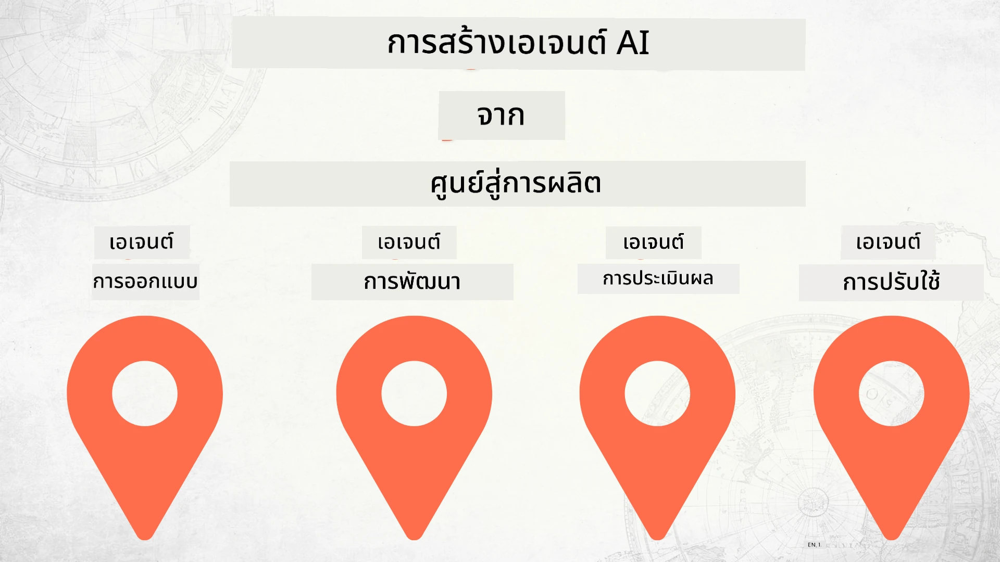

# การสร้าง AI Agents ตั้งแต่เริ่มต้นจนถึงการผลิต



### 🌐 รองรับหลายภาษา

#### สนับสนุนผ่าน GitHub Action (อัตโนมัติ & อัปเดตเสมอ)

<!-- CO-OP TRANSLATOR LANGUAGES TABLE START -->
[อาหรับ](../ar/README.md) | [เบงกาลี](../bn/README.md) | [บัลแกเรียน](../bg/README.md) | [พม่า (เมียนมา)](../my/README.md) | [จีน (ตัวย่อ)](../zh-CN/README.md) | [จีน (ตัวเต็ม, ฮ่องกง)](../zh-HK/README.md) | [จีน (ตัวเต็ม, มาเก๊า)](../zh-MO/README.md) | [จีน (ตัวเต็ม, ไต้หวัน)](../zh-TW/README.md) | [โครเอเชีย](../hr/README.md) | [เช็ก](../cs/README.md) | [เดนมาร์ก](../da/README.md) | [ดัตช์](../nl/README.md) | [เอสโตเนีย](../et/README.md) | [ฟินแลนด์](../fi/README.md) | [ฝรั่งเศส](../fr/README.md) | [เยอรมัน](../de/README.md) | [กรีก](../el/README.md) | [ฮิบรู](../he/README.md) | [ฮินดี](../hi/README.md) | [ฮังการี](../hu/README.md) | [อินโดนีเซีย](../id/README.md) | [อิตาลี](../it/README.md) | [ญี่ปุ่น](../ja/README.md) | [กันนาดา](../kn/README.md) | [เขมร](../km/README.md) | [เกาหลี](../ko/README.md) | [ลิทัวเนีย](../lt/README.md) | [มาเลย์](../ms/README.md) | [มาลายาลัม](../ml/README.md) | [มราฐี](../mr/README.md) | [เนปาล](../ne/README.md) | [ไนจีเรีย พิดจิน](../pcm/README.md) | [นอร์เวย์](../no/README.md) | [เปอร์เซีย (ฟาร์ซี)](../fa/README.md) | [โปแลนด์](../pl/README.md) | [โปรตุเกส (บราซิล)](../pt-BR/README.md) | [โปรตุเกส (โปรตุเกส)](../pt-PT/README.md) | [ปัญจาบี (กูร์มุกธี)](../pa/README.md) | [โรมาเนีย](../ro/README.md) | [รัสเซีย](../ru/README.md) | [เซอร์เบีย (ซีริลลิก)](../sr/README.md) | [สโลวัก](../sk/README.md) | [สโลวีเนีย](../sl/README.md) | [สเปน](../es/README.md) | [สวาฮิลี](../sw/README.md) | [สวีเดน](../sv/README.md) | [ตากาล็อก (ฟิลิปปินส์)](../tl/README.md) | [ทมิฬ](../ta/README.md) | [เทลูกู](../te/README.md) | [ไทย](./README.md) | [ตุรกี](../tr/README.md) | [ยูเครน](../uk/README.md) | [อูรดู](../ur/README.md) | [เวียดนาม](../vi/README.md)

> **ต้องการโคลนแบบโลคอล?**
>
> ที่เก็บนี้มีคำแปลมากกว่า 50 ภาษา ซึ่งทำให้ขนาดการดาวน์โหลดเพิ่มขึ้นอย่างมาก เพื่อโคลนโดยไม่รวมคำแปล ให้ใช้ sparse checkout:
>
> **Bash / macOS / Linux:**
> ```bash
> git clone --filter=blob:none --sparse https://github.com/microsoft/Building-AI-Agents-From-Zero-To-Production.git
> cd Building-AI-Agents-From-Zero-To-Production
> git sparse-checkout set --no-cone '/*' '!translations' '!translated_images'
> ```
>
> **CMD (Windows):**
> ```cmd
> git clone --filter=blob:none --sparse https://github.com/microsoft/Building-AI-Agents-From-Zero-To-Production.git
> cd Building-AI-Agents-From-Zero-To-Production
> git sparse-checkout set --no-cone "/*" "!translations" "!translated_images"
> ```
>
> วิธีนี้จะให้ทุกอย่างที่คุณต้องการเพื่อทำคอร์สให้เสร็จได้ด้วยความเร็วดาวน์โหลดที่รวดเร็วกว่า
<!-- CO-OP TRANSLATOR LANGUAGES TABLE END -->

## คอร์สสอนพื้นฐานของวงจรชีวิตการพัฒนา AI Agent

[](https://github.com/microsoft/Building-AI-Agents-From-Zero-To-Production/blob/master/LICENSE?WT.mc_id=academic-105485-koreyst)
[](https://GitHub.com/microsoft/Building-AI-Agents-From-Zero-To-Production/graphs/contributors/?WT.mc_id=academic-105485-koreyst)
[](https://GitHub.com/microsoft/Building-AI-Agents-From-Zero-To-Production/issues/?WT.mc_id=academic-105485-koreyst)
[](https://GitHub.com/microsoft/Building-AI-Agents-From-Zero-To-Production/pulls/?WT.mc_id=academic-105485-koreyst)
[](http://makeapullrequest.com?WT.mc_id=academic-105485-koreyst)

[](https://discord.gg/Kuaw3ktsu6)

## 🌱 เริ่มต้นใช้งาน

คอร์สนี้มีบทเรียนครอบคลุมพื้นฐานของการสร้างและจัดการ AI Agents

ทุกบทเรียนจะสร้างขึ้นจากบทเรียนก่อนหน้า จึงแนะนำให้เริ่มจากต้นจนจบ

หากต้องการสำรวจหัวข้อเกี่ยวกับ AI Agent เพิ่มเติม คุณสามารถดูได้ที่ [AI Agents For Beginners Course](https://aka.ms/ai-agents-beginners)

### พบปะผู้เรียนคนอื่นๆ และรับคำตอบสำหรับคำถามของคุณ

หากคุณติดขัดหรือมีคำถามเกี่ยวกับการสร้าง AI Agents เข้าร่วมช่อง Discord เฉพาะของเราได้ที่ [Microsoft Foundry Discord](https://discord.gg/Kuaw3ktsu6)

### สิ่งที่คุณต้องมี

แต่ละบทเรียนมีตัวอย่างโค้ดของตัวเองที่คุณสามารถรันได้ในเครื่องท้องถิ่น คุณสามารถ [fork ที่เก็บนี้](https://github.com/microsoft/Building-AI-Agents-From-Zero-To-Production/fork) เพื่อสร้างสำเนาของคุณเองได้

คอร์สนี้ใช้บริการดังต่อไปนี้:

- [Microsoft Agent Framework (MAF)](https://aka.ms/ai-agents-beginners/agent-framework)
- [Microsoft Foundry](https://azure.microsoft.com/products/ai-foundry)
- [Azure OpenAI Service](https://azure.microsoft.com/products/ai-foundry/models/openai)
- [Azure CLI](https://learn.microsoft.com/cli/azure/authenticate-azure-cli?view=azure-cli-latest)

โปรดตรวจสอบว่าคุณมีสิทธิ์เข้าถึงบริการเหล่านี้ก่อนเริ่มต้น

ตัวเลือกเพิ่มเติมเกี่ยวกับการโฮสต์โมเดลและบริการยังจะมาเร็วๆ นี้

## 🗃️ บทเรียน

| **บทเรียน**         | **คำอธิบาย**                                                                                  |
|--------------------|--------------------------------------------------------------------------------------------------|
| [ออกแบบ Agent](./lesson-1-agent-design/README.md)       | บทนำสู่กรณีการใช้งาน Agent "การแนะนำผู้พัฒนา" ของเรา และวิธีออกแบบเอเย่นต์ที่มีประสิทธิภาพ  |
| [พัฒนา Agent](./lesson-2-agent-development/README.md)  | ใช้ Microsoft Agent Framework (MAF) สร้างเอเย่นต์ 3 ตัวเพื่อช่วยผู้พัฒนาใหม่เริ่มต้นใช้งาน       |
| [ประเมิน Agent](./lesson-3-agent-evals/README.md)  | ใช้ Microsoft Foundry เพื่อหาวิธีประเมินประสิทธิภาพของ AI Agents และวิธีปรับปรุง             |
| [ปรับใช้ Agent](./lesson-4-agent-deployment/README.md)   | ใช้ Hosted Agents และ OpenAI Chatkit เพื่อดูวิธีปรับใช้ AI Agent สู่การผลิต                   |


## 🎒 คอร์สอื่นๆ

ทีมของเรายังผลิตคอร์สอื่นๆ! ตรวจสอบได้ที่:

<!-- CO-OP TRANSLATOR OTHER COURSES START -->
### LangChain
[](https://aka.ms/langchain4j-for-beginners)
[](https://aka.ms/langchainjs-for-beginners?WT.mc_id=m365-94501-dwahlin)
[](https://github.com/microsoft/langchain-for-beginners?WT.mc_id=m365-94501-dwahlin)
---

### Azure / Edge / MCP / Agents
[](https://github.com/microsoft/AZD-for-beginners?WT.mc_id=academic-105485-koreyst)
[](https://github.com/microsoft/edgeai-for-beginners?WT.mc_id=academic-105485-koreyst)
[](https://github.com/microsoft/mcp-for-beginners?WT.mc_id=academic-105485-koreyst)
[](https://github.com/microsoft/ai-agents-for-beginners?WT.mc_id=academic-105485-koreyst)

---
 
### ชุด Generative AI
[](https://github.com/microsoft/generative-ai-for-beginners?WT.mc_id=academic-105485-koreyst)
[-9333EA?style=for-the-badge&labelColor=E5E7EB&color=9333EA)](https://github.com/microsoft/Generative-AI-for-beginners-dotnet?WT.mc_id=academic-105485-koreyst)
[-C084FC?style=for-the-badge&labelColor=E5E7EB&color=C084FC)](https://github.com/microsoft/generative-ai-for-beginners-java?WT.mc_id=academic-105485-koreyst)
[-E879F9?style=for-the-badge&labelColor=E5E7EB&color=E879F9)](https://github.com/microsoft/generative-ai-with-javascript?WT.mc_id=academic-105485-koreyst)

---
 
### การเรียนรู้พื้นฐาน
[](https://aka.ms/ml-beginners?WT.mc_id=academic-105485-koreyst)
[](https://aka.ms/datascience-beginners?WT.mc_id=academic-105485-koreyst)
[](https://aka.ms/ai-beginners?WT.mc_id=academic-105485-koreyst)
[](https://github.com/microsoft/Security-101?WT.mc_id=academic-96948-sayoung)
[](https://aka.ms/webdev-beginners?WT.mc_id=academic-105485-koreyst)
[](https://aka.ms/iot-beginners?WT.mc_id=academic-105485-koreyst)
[](https://github.com/microsoft/xr-development-for-beginners?WT.mc_id=academic-105485-koreyst)

---
 
### ซีรีส์ Copilot
[](https://aka.ms/GitHubCopilotAI?WT.mc_id=academic-105485-koreyst)
[](https://github.com/microsoft/mastering-github-copilot-for-dotnet-csharp-developers?WT.mc_id=academic-105485-koreyst)
[](https://github.com/microsoft/CopilotAdventures?WT.mc_id=academic-105485-koreyst)
<!-- CO-OP TRANSLATOR OTHER COURSES END -->

## การมีส่วนร่วม

โครงการนี้ยินดีรับข้อเสนอแนะและการมีส่วนร่วม ส่วนใหญ่การมีส่วนร่วมจะต้องให้คุณยอมรับ
ข้อตกลงสิทธิผู้มีส่วนร่วม (Contributor License Agreement - CLA) ซึ่งรับรองว่าคุณมีสิทธิ์และได้มอบสิทธิ์แก่เรา
ในการใช้ผลงานของคุณ รายละเอียดเพิ่มเติมดูได้ที่ <https://cla.opensource.microsoft.com>.

เมื่อคุณส่งคำขอดึง (pull request) หุ่นยนต์ CLA จะตรวจสอบโดยอัตโนมัติว่าคุณจำเป็นต้องส่ง
CLA หรือไม่ และประดับคำขอดึงอย่างเหมาะสม (เช่น ตรวจสอบสถานะ แสดงความคิดเห็น) เพียงทำตามคำแนะนำที่
หุ่นยนต์ให้มา คุณจะต้องดำเนินการนี้เพียงครั้งเดียวในทุกที่เก็บข้อมูลที่ใช้ CLA ของเรา

โครงการนี้ใช้แนวทาง [จรรยาบรรณโอเพ่นซอร์สของ Microsoft](https://opensource.microsoft.com/codeofconduct/)
ดูข้อมูลเพิ่มเติมได้ที่ [คำถามที่พบบ่อยเกี่ยวกับจรรยาบรรณ](https://opensource.microsoft.com/codeofconduct/faq/)
หรือ ติดต่อ [opencode@microsoft.com](mailto:opencode@microsoft.com) หากมีคำถามหรือข้อคิดเห็นเพิ่มเติม

## เครื่องหมายการค้า

โครงการนี้อาจมีเครื่องหมายการค้าหรือโลโก้สำหรับโครงการ ผลิตภัณฑ์ หรือบริการ การใช้เครื่องหมายการค้าหรือโลโก้ของ Microsoft
ต้องได้รับอนุญาตและต้องปฏิบัติตาม
[แนวทางเครื่องหมายการค้าและแบรนด์ของ Microsoft](https://www.microsoft.com/legal/intellectualproperty/trademarks/usage/general).
การใช้เครื่องหมายการค้าหรือโลโก้ของ Microsoft ในเวอร์ชันที่แก้ไขของโครงการนี้ต้องไม่ทำให้สับสนหรือแสดงความเป็นผู้สนับสนุนของ Microsoft
การใช้เครื่องหมายการค้าหรือโลโก้ของบุคคลที่สามต้องปฏิบัติตามนโยบายของบุคคลที่สามเหล่านั้น

## การขอความช่วยเหลือ

หากคุณติดขัดหรือมีคำถามใดๆ เกี่ยวกับการสร้างแอป AI เข้าร่วมได้ที่:

[](https://discord.gg/Kuaw3ktsu6)

หากคุณมีข้อเสนอแนะหรือพบข้อผิดพลาดระหว่างการสร้าง โปรดเยี่ยมชม:

[](https://aka.ms/foundry/forum)

---

<!-- CO-OP TRANSLATOR DISCLAIMER START -->
**ข้อจำกัดความรับผิดชอบ**:  
เอกสารนี้ได้รับการแปลโดยใช้บริการแปลภาษาแบบ AI [Co-op Translator](https://github.com/Azure/co-op-translator) แม้ว่าเราจะพยายามให้ความถูกต้องสูงสุด แต่โปรดทราบว่าการแปลอัตโนมัติอาจมีข้อผิดพลาดหรือความไม่ถูกต้อง เอกสารต้นฉบับในภาษาต้นทางถือเป็นแหล่งข้อมูลที่เชื่อถือได้ สำหรับข้อมูลสำคัญแนะนำให้ใช้บริการแปลโดยผู้เชี่ยวชาญมืออาชีพ เราจะไม่รับผิดชอบต่อความเข้าใจผิดหรือการตีความผิดใด ๆ ที่เกิดขึ้นจากการใช้การแปลนี้
<!-- CO-OP TRANSLATOR DISCLAIMER END -->