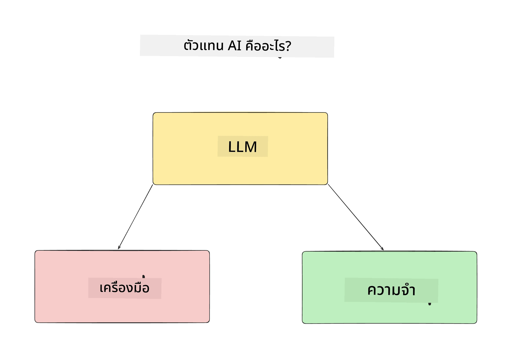
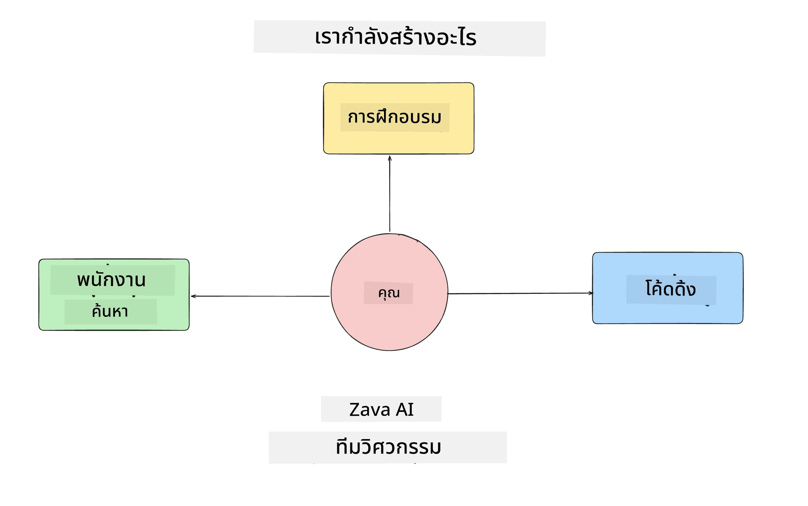
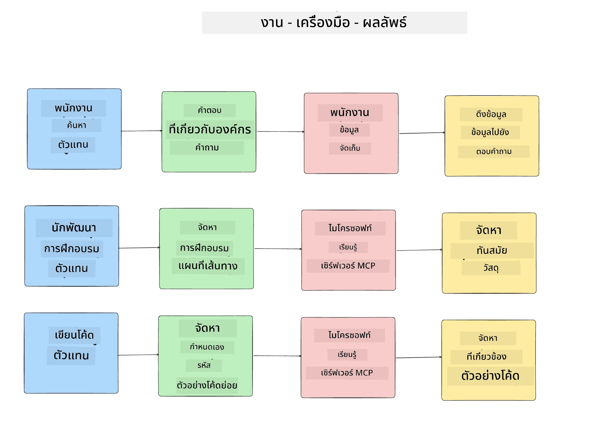
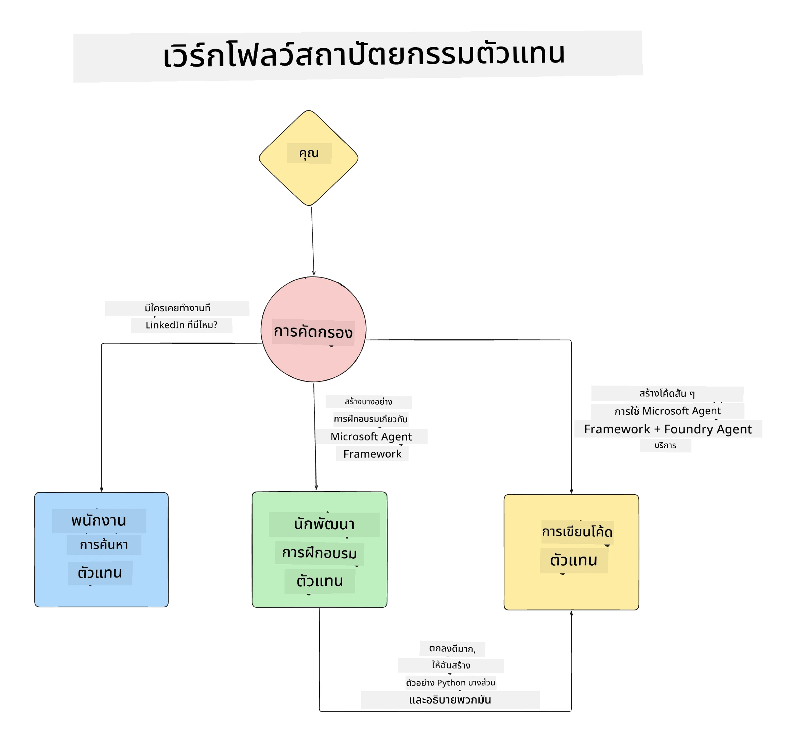

# บทเรียนที่ 1: การออกแบบ AI Agent

ยินดีต้อนรับสู่บทเรียนแรกของ "หลักสูตรการสร้าง AI Agent ตั้งแต่ศูนย์จนถึงการผลิต"!

ในบทเรียนนี้เราจะครอบคลุม:

- การกำหนดว่า AI Agents คืออะไร
  
- พูดคุยเกี่ยวกับแอปพลิเคชัน AI Agent ที่เรากำลังสร้าง  

- ระบุเครื่องมือและบริการที่จำเป็นสำหรับแต่ละ agent
  
- สร้างสถาปัตยกรรมของแอปพลิเคชัน Agent ของเรา
  
ให้เราเริ่มต้นด้วยการกำหนดว่า agent คืออะไรและทำไมเราจึงใช้พวกมันภายในแอปพลิเคชัน

> **ก่อนที่คุณจะเริ่มหลักสูตร.** บทเรียนแรกนี้เป็นเชิงแนวคิด — ไม่มีโค้ดให้รัน
> จาก [บทเรียนที่ 2](../lesson-2-agent-development/README.md) เป็นต้นไป คุณจะต้องมี: **การสมัครใช้งาน Azure**
> ที่เข้าถึง **Microsoft Foundry** ได้, โมเดล **GPT-5 series** ที่ปรับใช้แล้ว (เช่น `gpt-5.1` — หลีกเลี่ยง GPT-4o / GPT-4.1 ที่ถูกเกษียณแล้ว), **Python 3.12+** และ **Azure CLI**
> (`az login`). ดูที่ [สิ่งที่คุณต้องมี](../README.md#what-you-need) ใน README ของหลักสูตรสำหรับรายการและลิงก์ทั้งหมด

## AI Agents คืออะไร?

หากนี่คือครั้งแรกที่คุณสำรวจวิธีสร้าง AI Agent คุณอาจมีคำถามเกี่ยวกับวิธีการกำหนดว่า AI Agent คืออะไรอย่างชัดเจน

วิธีง่ายๆ ในการกำหนด AI Agent คือดูจากส่วนประกอบที่สร้างมันขึ้นมา:

**โมเดลภาษาขนาดใหญ่ (Large Language Model)** - LLM จะเป็นพลังทั้งความสามารถในการประมวลผลภาษาธรรมชาติจากผู้ใช้เพื่อแปลความหมายงานที่ต้องการทำ รวมถึงแปลคำอธิบายของเครื่องมือที่มีเพื่อทำงานเหล่านั้นให้สำเร็จ

**เครื่องมือ (Tools)** - สิ่งเหล่านี้จะเป็นฟังก์ชัน API, ที่เก็บข้อมูล และบริการอื่น ๆ ที่ LLM สามารถเลือกใช้เพื่อทำงานที่ผู้ใช้ขอให้เสร็จ

**หน่วยความจำ (Memory)** - วิธีที่เราจัดเก็บการโต้ตอบระยะสั้นและระยะยาวระหว่าง AI Agent และผู้ใช้ การจัดเก็บและดึงข้อมูลนี้มีความสำคัญต่อการปรับปรุงและบันทึกความชอบของผู้ใช้ในระยะยาว

## กรณีการใช้งาน AI Agent ของเรา

สำหรับหลักสูตรนี้ เราจะสร้างแอปพลิเคชัน AI Agent ที่ช่วยนักพัฒนาหน้าใหม่เข้าร่วมทีมพัฒนา AI Agent ของเรา!

ก่อนที่เราจะเริ่มพัฒนาจริง ขั้นตอนแรกของการสร้างแอปพลิเคชัน AI Agent ที่ประสบความสำเร็จคือการกำหนดสถานการณ์ที่ชัดเจนว่าผู้ใช้ของเราคาดหวังจะทำงานกับ AI Agent อย่างไร

สำหรับแอปพลิเคชันนี้ เราจะทำงานกับสถานการณ์เหล่านี้:

**สถานการณ์ที่ 1**: พนักงานใหม่เข้าร่วมองค์กรและต้องการทราบข้อมูลเพิ่มเติมเกี่ยวกับทีมที่เข้าร่วมและวิธีติดต่อกับทีม

**สถานการณ์ที่ 2:** พนักงานใหม่ต้องการทราบว่างานแรกที่ดีที่สุดสำหรับพวกเขาที่จะเริ่มทำคืออะไร

**สถานการณ์ที่ 3:** พนักงานใหม่ต้องการรวบรวมทรัพยากรการเรียนรู้และตัวอย่างโค้ดเพื่อช่วยให้เริ่มทำงานนี้ได้

## การระบุเครื่องมือและบริการ

ตอนนี้เรามีสถานการณ์เหล่านี้แล้ว ขั้นตอนถัดไปคือการเชื่อมโยงสถานการณ์เหล่านี้กับเครื่องมือและบริการที่ AI Agent ของเราจะต้องใช้เพื่อทำงานให้สำเร็จ

ขั้นตอนนี้อยู่ในหมวดหมู่ของการวิศวกรรมบริบท (Context Engineering) เพราะเราจะเน้นให้แน่ใจว่า AI Agent ของเรามีบริบทที่ถูกต้องในเวลาที่เหมาะสมเพื่อทำงานให้เสร็จ

ให้เราทำทีละสถานการณ์และออกแบบ agent ที่ดีด้วยการระบุงานของ agent แต่ละตัว, เครื่องมือ และผลลัพธ์ที่ต้องการ

### สถานการณ์ที่ 1 - Agent ค้นหาพนักงาน

**งาน** - ตอบคำถามเกี่ยวกับพนักงานในองค์กร เช่น วันเข้าร่วมทีม, ทีมปัจจุบัน, สถานที่ และตำแหน่งล่าสุด

**เครื่องมือ** - ฐานข้อมูลรายชื่อพนักงานปัจจุบันและแผนผังองค์กร

**ผลลัพธ์** - สามารถดึงข้อมูลจากฐานข้อมูลเพื่อตอบคำถามทั่วไปเกี่ยวกับองค์กรและคำถามเฉพาะเกี่ยวกับพนักงานได้

### สถานการณ์ที่ 2 - Agent แนะนำงาน

**งาน** - อิงตามประสบการณ์นักพัฒนาใหม่ เสนอ 1-3 ปัญหาที่พนักงานใหม่สามารถทำงานได้

**เครื่องมือ** - GitHub MCP Server เพื่อรับข้อมูลปัญหาที่เปิดอยู่และสร้างโปรไฟล์นักพัฒนา

**ผลลัพธ์** - สามารถอ่าน 5 commit ล่าสุดของโปรไฟล์ GitHub และปัญหาที่เปิดในโปรเจกต์ GitHub และแนะนำตามความเหมาะสม

### สถานการณ์ที่ 3 - Agent ผู้ช่วยเขียนโค้ด

**งาน** - ตามปัญหาที่เปิดที่ได้รับการแนะนำโดย Agent "Task Recommendation" ให้ค้นคว้าและจัดหาทรัพยากร รวมถึงสร้างโค้ดตัวอย่างเพื่อช่วยพนักงาน

**เครื่องมือ** - Microsoft Learn MCP เพื่อค้นหาทรัพยากร และ Code Interpreter เพื่อสร้างโค้ดตัวอย่างที่กำหนดเอง

**ผลลัพธ์** - หากผู้ใช้ขอความช่วยเหลือเพิ่มเติม งานจะใช้ Learn MCP Server เพื่อจัดหาลิงก์และตัวอย่างไปยังทรัพยากร และจากนั้นส่งต่อให้ Agent Code Interpreter เพื่อสร้างโค้ดตัวอย่างเล็ก ๆ พร้อมคำอธิบาย

## การสร้างสถาปัตยกรรมของแอปพลิเคชัน Agent ของเรา

ตอนนี้ที่เราได้กำหนด agent แต่ละตัวแล้ว ให้เราสร้างแผนภาพสถาปัตยกรรมที่จะช่วยให้เราเข้าใจว่าแต่ละ agent จะทำงานร่วมกันและแยกกันอย่างไรตามงาน:

## ขั้นตอนถัดไป

ตอนนี้ที่เราได้ออกแบบ agent แต่ละตัวและระบบ agentic ของเราแล้ว ให้เราก้าวไปบทเรียนถัดไปที่จะพัฒนา agent เหล่านี้!

---

<!-- CO-OP TRANSLATOR DISCLAIMER START -->
**ปฏิเสธความรับผิดชอบ**:
เอกสารนี้ได้รับการแปลโดยใช้บริการแปลภาษา AI [Co-op Translator](https://github.com/Azure/co-op-translator) ขณะที่เราพยายามให้ความถูกต้อง โปรดทราบว่าการแปลโดยอัตโนมัติอาจมีข้อผิดพลาดหรือความไม่ถูกต้อง เอกสารต้นฉบับในภาษาต้นทางควรถูกพิจารณาเป็นแหล่งข้อมูลที่เชื่อถือได้ สำหรับข้อมูลที่สำคัญ แนะนำให้ใช้การแปลโดยมนุษย์มืออาชีพ เราไม่รับผิดชอบต่อความเข้าใจผิดหรือการตีความที่ผิดพลาดที่เกิดขึ้นจากการใช้การแปลนี้
<!-- CO-OP TRANSLATOR DISCLAIMER END -->