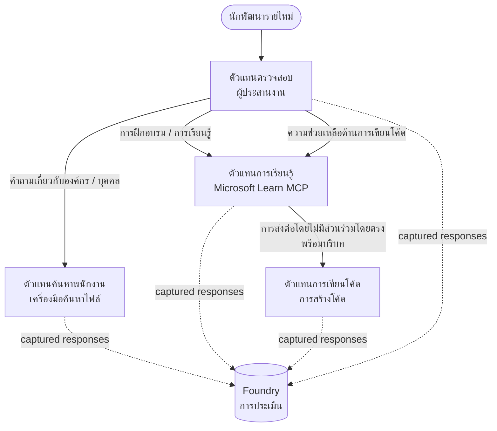

# บทเรียนที่ 3: การประเมินเอเจนต์ด้วย Microsoft Foundry

ยินดีต้อนรับสู่บทเรียนที่สามของหลักสูตร **"การสร้างเอเจนต์ AI จากศูนย์สู่การผลิต"**!

ใน [บทเรียนที่ 2](../lesson-2-agent-development/README.md) คุณได้สร้างเอเจนต์ไปแล้ว ในบทเรียนนี้คุณ
จะได้เรียนรู้วิธีตอบคำถามที่ยากกว่านั้น: **พวกมันดีหรือไม่?** การส่งมอบเอเจนต์ที่
ทำงานได้นั้นง่าย; การรู้ว่ามันเส้นทางถูกต้องหรือไม่, รักษาความถูกต้องในข้อมูลของคุณ, และใช้เครื่องมืออย่าง
ถูกต้องคือสิ่งที่แยกระบบสาธิตออกจากระบบที่พร้อมผลิต

ในบทเรียนนี้เราจะครอบคลุม:

- ทำไมการประเมินเอเจนต์จึงสำคัญและแตกต่างจากการทดสอบแบบดั้งเดิมอย่างไร
- ความแตกต่างระหว่าง **การสังเกตการณ์**, **การทดสอบเบื้องต้น**, และ **การประเมินผล**
- กระบวนการทำงานแบบเอเจนต์หลายตัวที่เราจะวัดผล
- ตัวประเมิน **Microsoft Foundry** ในตัว (ความเกี่ยวข้อง, ความมีเหตุมีผล, ความแม่นยำในการเรียกใช้เครื่องมือ, การใช้ผลลัพธ์ของเครื่องมือ)
- การเดินทางผ่านขั้นตอนของกระบวนการประเมินใน [`agent-evals.py`](../../../lesson-3-agent-evals/agent-evals.py)
- วิธีการรันและอ่านผลลัพธ์

---

## ทำไมต้องประเมินเอเจนต์?

การทดสอบหน่วยแบบดั้งเดิมยืนยันว่า `add(2, 2) == 4` เอเจนต์ไม่ทำงานแบบนั้น — คำสั่งเดียวกัน
อาจสร้างคำพูดที่แตกต่างกันทุกครั้ง, เครื่องมืออาจถูกเรียกใช้ในลำดับต่างกัน, และ
"ถูกต้อง" มักเป็นเรื่องของระดับมากกว่าจะเป็นค่าถูกผิดแบบบูลีน คุณไม่สามารถยืนยันกับสตริงที่แน่นอนได้

แทนที่จะเป็นแบบนั้น คุณประเมินเอเจนต์ตาม **มิติคุณภาพ** โดยใช้ *ตัวประเมิน* ที่อิงแบบจำลอง (เรียกว่า
"LLM-as-a-judge") พร้อมกับการตรวจสอบการใช้เครื่องมืออย่างตายตัว วิธีนี้จะบอกคุณสิ่งต่าง ๆ เช่น:

- คำตอบนั้นจริง ๆ แล้วตอบคำถามหรือไม่? (**ความเกี่ยวข้อง**)
- คำตอบได้รับการสนับสนุนโดยข้อมูลที่นำมาใช้หรือไม่ หรือว่าเอเจนต์สร้างข้อมูลขึ้นเอง? (**ความมีเหตุมีผล**)
- เอเจนต์เรียกเครื่องมือถูกต้องด้วยอาร์กิวเมนต์ที่ถูกต้องหรือไม่? (**ความแม่นยำในการเรียกเครื่องมือ**)
- เอเจนต์จริง ๆ ใช้ผลลัพธ์ที่เครื่องมือส่งกลับมาหรือไม่? (**การใช้ผลลัพธ์ของเครื่องมือ**)

### สามชั้นของคุณภาพที่เสริมกัน

เหล่านี้ไม่ใช่เทคนิคที่แข่งขันกัน — เอเจนต์ที่พร้อมใช้จริงจะใช้ทั้งสามอย่าง:

| ชั้น | คำถามที่ตอบ | ค่าใช้จ่าย | เวลาทำงาน | ครอบคลุมใน |
|-------|--------------------|------|--------------|------------|
| **การสังเกตการณ์ / การติดตาม** | *เอเจนต์ทำอะไรทีละขั้นตอน?* | ฟรี (เปิดตลอด) | ต่อเนื่องในระบบผลิต | บทเรียนนี้ |
| **การทดสอบเบื้องต้น** | *เอเจนต์เข้าถึงได้และทำตามคำสั่งพื้นฐานหรือไม่?* | ถูก, ใช้เวลาไม่กี่วินาที | ทุกครั้งที่ปล่อยใช้งาน | [บทเรียนที่ 4](../lesson-4-agentdeployment/README.md#smoke-testing-the-hosted-agent-ci-gate) |
| **การประเมินผล** | *คำตอบดี **แค่ไหน**?* | ช้ากว่า, ใช้โมเดลวัด | ตามคำขอ / ทุกคืน / ก่อนปล่อย | บทเรียนนี้ |

การทดสอบเบื้องต้นตอบคำถามว่า "ระบบขัดข้องหรือไม่?"; การประเมินตอบว่า "คำตอบดีหรือไม่?" คุณต้องการทั้งสองอย่าง

---

## สิ่งที่ต้องมีมาก่อน

1. ทำ [บทเรียนที่ 2](../lesson-2-agent-development/README.md) สำเร็จแล้ว (เอเจนต์ + ร้านเก็บเวกเตอร์).
2. โปรเจกต์ **Microsoft Foundry**.
3. ตรวจสอบสิทธิ์ **Azure CLI**: `az login`.
4. ติดตั้ง **Python 3.12+** และ dependencies ของหลักสูตร:

   ```bash
   pip install -r ../requirements.txt
   ```

5. ตัวแปรสภาพแวดล้อม (สร้างไฟล์ `.env` ในโฟลเดอร์นี้หรือ export ตัวแปรเหล่านี้):

   | ตัวแปร | จุดประสงค์ |
   |----------|---------|
   | `FOUNDRY_PROJECT_ENDPOINT` | จุดปลายโปรเจกต์ Foundry ของคุณ (`https://<account>.services.ai.azure.com/api/projects/<project>`). ถูกอ่านโดย `FoundryChatClient` ของเอเจนต์ **และ** ตัวช่วยการประเมินผล. |
   | `FOUNDRY_MODEL` | การปรับใช้โมเดลที่ **เอเจนต์** ใช้งาน (เช่น `gpt-5.1`). |
   | `VECTOR_STORE_ID` | ร้านเก็บเวกเตอร์ไดเรกทอรีพนักงานที่สร้างในบทเรียน 2 |
   | `AZURE_AI_MODEL_DEPLOYMENT_NAME` | การปรับใช้โมเดลที่ตัวประเมินใช้ (ตั้งต้นเป็น `FOUNDRY_MODEL`, แล้วจึง `gpt-5.1`) |

> เอเจนต์ใช้ `FoundryChatClient` ซึ่งอ่านค่าคอนฟิกจากตัวแปรที่ขึ้นต้นด้วย `FOUNDRY_`
> (`FOUNDRY_PROJECT_ENDPOINT`, `FOUNDRY_MODEL`). ตัวช่วยประเมินบนคลาวด์
> ใช้ SDK `azure-ai-projects` และจะใช้ค่า `FOUNDRY_PROJECT_ENDPOINT` เป็นค่าเริ่มต้นถ้า
> `AZURE_AI_PROJECT_ENDPOINT` ไม่ได้ถูกตั้งค่า — ดังนั้นตัวแปร `FOUNDRY_` สองตัวนี้เพียงพอ
> สำหรับการรันบทเรียนทั้งหมด
>
> ตัวประเมินเองก็ขับเคลื่อนด้วยโมเดล ดังนั้น `AZURE_AI_MODEL_DEPLOYMENT_NAME`
> ควบคุมว่าโมเดลใดทำหน้าที่ตัดสิน — ไม่จำเป็นต้องเป็นโมเดลเดียวกับที่เอเจนต์ของคุณใช้


---

## กระบวนการทำงานที่เรากำลังประเมิน

เพื่อประเมินบางสิ่ง คุณต้องรันมันก่อน บทเรียนนี้ใช้กระบวนการทำงานแบบเอเจนต์หลายตัว **การเริ่มต้นนักพัฒนา**
: ผู้ประสานงาน **การคัดแยก** ส่งต่อไปยังผู้เชี่ยวชาญสามคน



กระบวนการทำงานถูกสร้างขึ้นด้วยการประสานงานแบบ **handoff** ของ Microsoft Agent Framework ความคิดสำคัญสำหรับการประเมินคือ **ทุกเทิร์นของเอเจนต์จะถูกเก็บถาวรฝั่งเซิร์ฟเวอร์** และระบุด้วย
`response_id` หมายเลขเหล่านี้คือสิ่งที่เราส่งให้บริการประเมินผล


---

## กระบวนการประเมินทีละขั้นตอน

[`agent-evals.py`](../../../lesson-3-agent-evals/agent-evals.py) มีการดำเนินการกระบวนการหกขั้นตอน นี่คือสิ่งที่แต่ละขั้นตอนทำ
และเหตุผลเบื้องหลัง

### ขั้นตอนที่ 1 — รันกระบวนการและติดตาม response ID

กระบวนการทำงานจะถูกใช้งานด้วย `run_stream(...)` และเมื่อเหตุการณ์ถูกส่งกลับ โค้ดจะบันทึก
`response_id` และ `conversation_id` ที่แต่ละเอเจนต์ผลิตขึ้น คำตอบที่บันทึกไว้คือวัตถุดิบดิบ
สำหรับการประเมินผล — คุณกำลังให้เกรดกับคำตอบที่ผลิตในระบบจริง ๆ ไม่ใช่คำตอบที่ถูกสร้างขึ้นใหม่


### ขั้นตอนที่ 2 — สรุปสิ่งที่จับมาได้

สรุปอย่างรวดเร็วจะแสดงจำนวนคำตอบที่แต่ละเอเจนต์ผลิตขึ้น เพื่อยืนยันว่ากระบวนการทำงาน
ใช้งานเอเจนต์ที่คุณตั้งใจจะให้เกรดจริง

### ขั้นตอนที่ 3 — ดึงคำตอบสุดท้าย

สำหรับแต่ละเอเจนต์ `response_id` สุดท้ายจะถูกดึงผ่านไคลเอนต์ที่เข้ากันได้กับ OpenAI
ของโปรเจกต์ (`project_client.get_openai_client().responses.retrieve(...)`) เพื่อให้คุณดูข้อความที่
จะถูกตัดสิน

### ขั้นตอนที่ 4 — สร้างการประเมินผล

การประเมินถูกสร้างขึ้นด้วยสี่ **ตัวประเมิน Foundry ในตัว**:

| ตัวประเมิน | `evaluator_name` | สิ่งที่วัด |
|-----------|------------------|------------------|
| ความเกี่ยวข้อง | `builtin.relevance` | คำตอบนั้นตอบสนองคำขอของผู้ใช้หรือไม่? |

| ความสมเหตุสมผล | `builtin.groundedness` | คำตอบได้รับการสนับสนุนโดยข้อมูลที่ดึงมาหรือเครื่องมือ (ไม่ใช่จินตนาการ) หรือไม่? |
| ความแม่นยำในการเรียกใช้เครื่องมือ | `builtin.tool_call_accuracy` | เรียกใช้เครื่องมือที่ถูกต้องพร้อมอาร์กิวเมนต์ที่ถูกต้องหรือไม่? |
| การใช้ผลลัพธ์จากเครื่องมือ | `builtin.tool_output_utilization` | ตัวแทนใช้ผลลัพธ์ของเครื่องมือจริงในคำตอบหรือไม่? |

ตัวประเมินแต่ละตัวถูกเริ่มต้นด้วยการปรับใช้ที่ชื่อว่า `AZURE_AI_MODEL_DEPLOYMENT_NAME`

> **ทำไมต้องสี่ข้อนี้?** ความเกี่ยวข้องและความสมเหตุสมผลวัด *คุณภาพคำตอบ*; ตัวประเมินเครื่องมือทั้งสองวัด *พฤติกรรมตัวแทน* — ส่วนที่เมตริก NLP แบบดั้งเดิมไม่ครอบคลุมเลย สำหรับระบบหลายตัวแทนที่ใช้เครื่องมือ เมตริกเครื่องมือมักเป็นที่ซ่อนของข้อบกพร่องที่แท้จริง


### ขั้นตอนที่ 5 — รันการประเมินผล

`response_id` ที่ถูกจับถูกส่งผ่านไปยัง `evals.runs.create(...)` เป็นแหล่งข้อมูล บริการจะเล่นซ้ำแต่ละคำตอบที่เก็บไว้ผ่านทุกตัวประเมิน


### ขั้นตอนที่ 6 — ติดตามและอ่านผลลัพธ์

โค้ดจะรอผลลัพธ์จนกว่าจะเป็น `completed` หรือ `failed` จากนั้นพิมพ์ผลลัพธ์จำนวนและ
**`report_url`** — ลิงก์ลึกเข้าไปยังพอร์ทัล Foundry ที่คุณสามารถตรวจสอบคะแนนตามเมตริก
จำนวนผ่าน/ไม่ผ่าน และคำตอบที่ได้รับการตัดสินรายบุคคล

---

## รันมันเลย

```bash
cd lesson-3-agent-evals
python agent-evals.py
```

โดยปกติจะประเมินคำถามตัวอย่างแรก
(`"ฉันเพิ่งมาใหม่! มีใครทำงานที่ Microsoft ที่นี่ไหม?"`) มีคำถามตัวอย่างที่มีหลายเจตนาอีกสองคำถามใน `run_evaluation_workflow()` — เปลี่ยนตัวแปร `query` เพื่อทดลองสถานการณ์เส้นทางที่ใช้ตัวแทนมากขึ้นในรันเดียว


คาดหวังลำดับข้อความในคอนโซล:

```
Step 1: Running Developer Onboarding Workflow
Step 2: Response Data Summary
Step 3: Fetching Agent Responses
Step 4: Creating Evaluation
Step 5: Running Evaluation
Step 6: Monitoring Evaluation
  Status: running ...
  Evaluation completed successfully
  Report URL: https://...   <-- open this in the Foundry portal
```

---

## การสังเกตและการติดตาม

การประเมินบอกคุณว่า *คำตอบดีแค่ไหน*; **การสังเกต** บอกคุณว่า *เกิดอะไรขึ้น*
เพื่อสร้างคำตอบนั้น — ทุกขั้นตอนของตัวแทน การเรียกใช้เครื่องมือ การนับโทเค็น และความหน่วงเวลา ใน Microsoft Foundry
การรันตัวแทนจะส่งออก OpenTelemetry traces ที่คุณสามารถดูในพอร์ทัล และ Agent Framework สามารถ
ส่งออกไปยัง Azure Monitor / Application Insights ด้วยการเรียกครั้งเดียว:

```python
from agent_framework.foundry import FoundryChatClient

client = FoundryChatClient()
client.configure_azure_monitor()   # ส่งออกแทรซและเมตริกไปยัง Application Insights
```

ใช้การติดตามเพื่อ **ดีบัก** คะแนนประเมินที่แย่: เมื่อความสมเหตุสมผลลดลง trace จะแสดงว่ามีการค้นหาไฟล์แล้วไม่ได้ผล หรือได้ผลลัพธ์ที่ตัวแทนเพิกเฉย (ซึ่งเป็นสิ่งที่การใช้ผลลัพธ์เครื่องมือกำลังให้คะแนน)


---

## จาก "runs" ถึง "ดี": วิธีใช้ในทางปฏิบัติ

- **เกตก่อนเปิดตัว.** รันการประเมินกับชุดคำถามตัวแทนที่กำหนดไว้ก่อนที่จะโปรโมตพรอมต์หรือโมเดลใหม่ เปรียบเทียบคะแนนกับเวอร์ชันก่อนหน้า — ถือว่าการลดลงเป็นการถดถอย

- **สัญญาณคุณภาพทุกคืน.** กำหนดเวลาการประเมินเพื่อตรวจจับการเปลี่ยนแปลงจากข้อมูลหรือการเปลี่ยนแปลงความขึ้นกับ

- **จับคู่กับการทดสอบแบบ smoke test.** [Lesson 4 smoke test](../lesson-4-agentdeployment/README.md#smoke-testing-the-hosted-agent-ci-gate)
  คือเกตที่รวดเร็วของคุณสำหรับการเปิดตัวแต่ละครั้ง; การประเมินเป็นเกตที่ลึกและช้ากว่า รันแบบถูกทดสอบบนการผสานทุกครั้งและแบบแพงตามกำหนดหรือก่อนเปิดตัว


---

## หมายเหตุการปรับปรุงสมัยใหม่

ตัวอย่างนี้กำลังถูกย้ายไปยังพื้นผิว API ของ Microsoft Agent Framework Foundry ปัจจุบัน
(`agent_framework.foundry`) หากคุณกำลังอัปเดตโค้ด โปรดดูที่ราก repository

[`MIGRATION-GUIDE.md`](../MIGRATION-GUIDE.md) สำหรับการยืนยันการแมป import และ client ก่อน/หลัง
(เช่น `AzureAIClient` -> `FoundryChatClient` และการสร้าง hosted-tool ผ่าน
`client.get_file_search_tool(...)` / `client.get_mcp_tool(...)`) แนวคิดการประเมินและ
pipeline หกขั้นตอนข้างต้นยังคงเหมือนเดิมหลังการย้ายนั้น

---

## แหล่งข้อมูล

- [ประเมินโมเดลและแอปพลิเคชัน AI สร้างสรรค์ (Microsoft Learn)](https://learn.microsoft.com/en-us/azure/ai-foundry/concepts/evaluation-approach-gen-ai)
- [ตัวประเมินในตัวสำหรับ AI สร้างสรรค์](https://learn.microsoft.com/en-us/azure/ai-foundry/concepts/evaluation-evaluators/agent-evaluators)
- [การสังเกตการณ์ใน Microsoft Foundry](https://learn.microsoft.com/en-us/azure/ai-foundry/concepts/observability)
- [Microsoft Agent Framework](https://github.com/microsoft/agent-framework)
- [การประสานงานการส่งต่อ Agent](https://learn.microsoft.com/en-us/agent-framework/workflows/orchestrations/handoff)

---

<!-- CO-OP TRANSLATOR DISCLAIMER START -->
**ปฏิเสธความรับผิดชอบ**:
เอกสารนี้ได้รับการแปลโดยใช้บริการแปลภาษา AI [Co-op Translator](https://github.com/Azure/co-op-translator) ขณะที่เราพยายามให้ความถูกต้อง โปรดทราบว่าการแปลโดยอัตโนมัติอาจมีข้อผิดพลาดหรือความไม่ถูกต้อง เอกสารต้นฉบับในภาษาต้นทางควรถูกพิจารณาเป็นแหล่งข้อมูลที่เชื่อถือได้ สำหรับข้อมูลที่สำคัญ แนะนำให้ใช้การแปลโดยมนุษย์มืออาชีพ เราไม่รับผิดชอบต่อความเข้าใจผิดหรือการตีความที่ผิดพลาดที่เกิดขึ้นจากการใช้การแปลนี้
<!-- CO-OP TRANSLATOR DISCLAIMER END -->