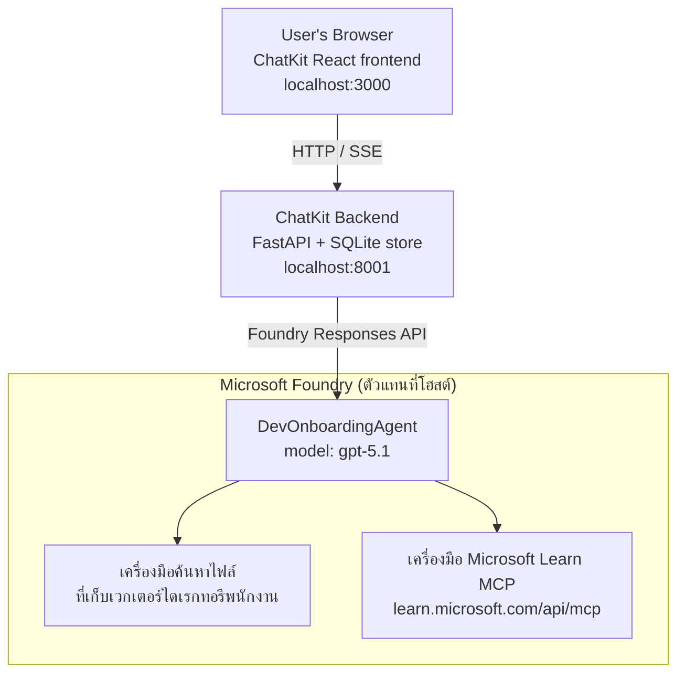

# บทเรียนที่ 4: การปรับใช้ Agent ด้วย Microsoft Foundry Hosted Agents + ChatKit

บทเรียนนี้สาธิตวิธีการปรับใช้ agent ที่ใช้เครื่องมือไปยัง Microsoft Foundry ในฐานะ hosted agent และสร้าง frontend บนพื้นฐานของ ChatKit เพื่อโต้ตอบกับมัน

## สถาปัตยกรรม

Hosted agent คือ **`DevOnboardingAgent` เดียว** (รันบน `gpt-5.1`) ที่ตอบคำถามสำหรับการเริ่มต้นผู้พัฒนาด้วยการใช้สองเครื่องมือที่โฮสต์ไว้: เครื่องมือ **File Search** ผ่าน employee-directory vector store และเครื่องมือ **Microsoft Learn MCP** frontend React ของ ChatKit จะสื่อสารกับ backend FastAPI ซึ่งเรียก agent ผ่าน Foundry **Responses API**



## สิ่งที่ต้องเตรียม

1. **โครงการ Microsoft Foundry** ในภูมิภาค North Central US
2. **Azure CLI** ที่ล็อกอินแล้ว (`az login`)
3. ติดตั้ง **Azure Developer CLI** (`azd`)
4. **Python 3.12+** และ **Node.js 18+**
5. สร้าง **Vector Store** ด้วยข้อมูลพนักงาน

## เริ่มต้นอย่างรวดเร็ว

### 1. กำหนด Environment Variables

```bash
cd lesson-4-agentdeployment
cp .env.example .env
# แก้ไข .env ด้วยรายละเอียดโครงการ Microsoft Foundry ของคุณ
```

### 2. ปรับใช้ Hosted Agent

**ตัวเลือก A: ใช้ Azure Developer CLI (แนะนำ)**

```bash
cd hosted-agent
azd auth login
azd agent deploy
```

**ตัวเลือก B: ใช้ Docker + Azure Container Registry**

```bash
cd hosted-agent

# สร้างคอนเทนเนอร์
docker build -t developer-onboarding-agent:latest .

# แท็กสำหรับ ACR
docker tag developer-onboarding-agent:latest <your-acr>.azurecr.io/developer-onboarding-agent:latest

# ดันไปยัง ACR
az acr login --name <your-acr>
docker push <your-acr>.azurecr.io/developer-onboarding-agent:latest

# ติดตั้งผ่านพอร์ทัล Microsoft Foundry หรือ SDK
```

### 3. เริ่มต้น ChatKit Backend

```bash
cd chatkit-server
python -m venv .venv
source .venv/bin/activate  # บน Windows: .venv\Scripts\activate
pip install -r requirements.txt
python app.py
```

เซิร์ฟเวอร์จะเริ่มที่ `http://localhost:8001`

### 4. เริ่มต้น ChatKit Frontend

```bash
cd chatkit-server/frontend
npm install
npm run dev
```

frontend จะเริ่มที่ `http://localhost:3000`

### 5. ทดสอบแอปพลิเคชัน

เปิด `http://localhost:3000` ในเบราว์เซอร์ของคุณและลองถามคำถามเหล่านี้:

**ค้นหาพนักงาน:**
- "ผมเป็นคนใหม่ที่นี่! มีใครเคยทำงานที่ Microsoft บ้างไหม?"
- "ใครมีประสบการณ์กับ Azure Functions บ้าง?"

**แหล่งเรียนรู้:**
- "สร้างเส้นทางการเรียนรู้สำหรับ Kubernetes"
- "ควรสอบรับรองอะไรบ้างสำหรับสถาปัตยกรรมคลาวด์?"

**ช่วยเขียนโค้ด:**
- "ช่วยเขียนโค้ด Python สำหรับเชื่อมต่อกับ CosmosDB"
- "แสดงวิธีสร้าง Azure Function ให้หน่อย"

**คำถามหลากหลาย agent:**
- "ผมกำลังเริ่มงานเป็นวิศวกรคลาวด์ ควรเชื่อมต่อกับใครและควรเรียนรู้อะไรบ้าง?"

## โครงสร้างโปรเจกต์

```
lesson-4-agentdeployment/
├── .env.example                 # Environment variables template
├── implementation-plan.md       # Detailed implementation guide
├── README.md                    # This file
├── hosted-agent/               # Microsoft Foundry hosted agent
│   ├── main.py                 # Multi-agent workflow implementation
│   ├── requirements.txt        # Python dependencies
│   ├── Dockerfile              # Container definition
│   └── agent.yaml              # Agent deployment configuration
└── chatkit-server/             # ChatKit server application
    ├── app.py                  # FastAPI backend
    ├── store.py                # SQLite persistence layer
    ├── requirements.txt        # Python dependencies
    └── frontend/               # React frontend
        ├── package.json
        ├── vite.config.ts
        ├── tsconfig.json
        ├── index.html
        └── src/
            ├── main.tsx
            ├── App.tsx
            ├── App.css
            └── index.css
```

## Agent และเครื่องมือของมัน

Hosted agent เป็น **agent เดียว** (`DevOnboardingAgent` กำหนดไว้ใน `hosted-agent/main.py`) ที่จัดการกับสามโดเมนของการเริ่มต้นใช้งาน แทนที่จะประสานงาน sub-agents หลายตัว มันจะเผยความสามารถแต่ละอย่างเป็นเครื่องมือ (หรือใช้โมเดลโดยตรง):

| ความสามารถ | วิธีการจัดการ | เครื่องมือ |
|-----------|------------------|------|
| **ค้นหาและเชื่อมต่อพนักงาน** | Foundry hosted File Search ผ่าน employee-directory vector store | `client.get_file_search_tool(vector_store_ids=[...])` |
| **เรียนรู้และฝึกอบรม** | Microsoft Learn MCP server (เครื่องมือ MCP ที่โฮสต์) | `client.get_mcp_tool(url="https://learn.microsoft.com/api/mcp")` |
| **ช่วยเขียนโค้ด** | จัดการโดยโมเดล `gpt-5.1` โดยตรง — ไม่มีเครื่องมือภายนอก | — |

สร้าง agent ด้วย `client.as_agent(name="DevOnboardingAgent", instructions=..., tools=[file_search_tool, learn_mcp_tool])` และให้บริการด้วย `from_agent_framework(agent).run()`

> **หมายเหตุด้านการออกแบบ** ร่างก่อนหน้าของบทเรียนนี้ใช้ workflow multi-agent แบบ `HandoffBuilder` (Triage → specialist) Agent ที่ส่งมอบเป็น agent ใช้เครื่องมือเพียงตัวเดียว ซึ่งง่ายกว่าที่จะปรับใช้และเข้าใจสำหรับ Q&A สไตล์เริ่มต้นดูตัวอย่างการประสานงาน multi-agent และการส่งงานใน บทเรียน 2 และ บทเรียน 3

## การทดสอบเบื้องต้น Hosted Agent (CI Gate)

การปรับใช้ hosted agent "สำเร็จ" เป็นการพิสูจน์เพียงว่าควบคุมแผนการรับการ
กำหนดการ — แต่ **ไม่ได้** พิสูจน์ว่า agent ตอบรับจริง ขาด dependency ใดๆ,
เส้นทางโมเดลผิด หรือการเชื่อมต่อหมดอายุอาจทำให้ agent สีเขียวแต่เงียบ

บทเรียนนี้จัดส่ง **การทดสอบ smoke เบาๆ** ที่ทำหน้าที่เหมือนประตูหลังปรับใช้เร็วและถูก มันใช้ [AI Smoke Test](https://github.com/marketplace/actions/ai-smoke-test)
GitHub Action ในการ POST prompts ไปยังจุดตอบกลับ Foundry
ของ agent (`POST {project_endpoint}/agents/{agent_name}/endpoint/protocols/openai/responses`)
และตรวจสอบข้อความที่ส่งกลับ มันจับการปรับใช้ที่เสียหาย การถอยกลับการรับรองความถูกต้อง
การล่องลอยของ system-prompt และการทำงานที่ผิดพลาดในไม่กี่วินาที


> การทดสอบ smoke **ไม่ใช่** การทดสอบแทนการประเมินผลเต็มรูปแบบของ
> [บทเรียน 3](../lesson-3-agent-evals/README.md) — เป็นการเสริม การทดสอบ smoke
> ตอบ *"agent สามารถเข้าถึง ตอบสนอง และปฏิบัติตามคำสั่งพื้นฐานหรือไม่?"*;
> การประเมินตอบ *"คำตอบดีแค่ไหน?"* ทำ gate ราคาถูกนี้ทุกครั้งหลังปรับใช้

### สิ่งที่ถูกทดสอบ

แคตาล็อกอยู่ที่ [`hosted-agent/tests/smoke-tests.json`](../../../lesson-4-agentdeployment/hosted-agent/tests/smoke-tests.json)
และใช้งานสามโดเมนของ agent พร้อมกับ adherence ของ prompt และการสื่อสารหลายเทิร์น:

| การทดสอบ | สิ่งที่ตรวจสอบ |
|------|------------------|
| `reachability` | Agent ตอบด้วยข้อความที่ไม่ว่างและอยู่ในขอบเขต |
| `employee-search` | โดเมน File-search คืนค่า `200` ที่ถูกต้อง (คำตอบขึ้นกับข้อมูล) |
| `learning-path` | โดเมนการเรียนรู้สะท้อนหัวข้อและสร้างคำตอบเป็นสไตล์เส้นทาง |
| `coding-assistance` | โดเมนการเขียนโค้ดคืนคำตอบ Python ในรูปแบบโค้ด |
| `prompt-adherence-offtopic` | คำขอหัวข้อที่ไม่เกี่ยวข้องถูกเปลี่ยนเส้นทาง ไม่ตอบละเอียด |
| `threading-turn-1/2` | สถานะการสนทนาถูกเก็บไว้ข้ามเทิร์นโดย `previous_response_id` |

### รันใน CI

Workflow ที่ [`.github/workflows/smoke-test-hosted-agent.yml`](../../../.github/workflows/smoke-test-hosted-agent.yml)
มีสองงาน:

- **`static`** — gate อย่างรวดเร็ว ไม่มี Azure รันทุก pull request และ push:
  คอมไพล์ซอร์ส Python ทั้งหมด (`py_compile`) และเช็คลิงก์ Markdown ไม่มีความลับ
  จึงทำงานได้กับ PR จาก fork
- **`smoke`** — การทดสอบ smoke เชื่อมต่อกับ Azure ด้านล่าง รันตามคำสั่ง
  (Actions → **Agent CI (static + smoke)** → Run workflow) และสามารถต่อเนื่องหลังจาก
  workflow ปรับใช้ของคุณ

กำหนดค่า **ตัวแปร** และ **ความลับ** ของ repository นี้สำหรับงาน smoke:

| ชนิด | ชื่อ | ค่า |
|------|------|-------|

| ตัวแปร | `FOUNDRY_PROJECT_ENDPOINT` | `https://<account>.services.ai.azure.com/api/projects/<project>` |
| ตัวแปร | `HOSTED_AGENT_NAME` | ชื่อเอเจนต์ที่ถูกติดตั้งใช้งาน (เช่น `dev-onboarding` — ต้องตรงกับการติดตั้งของคุณ) |
| ความลับ | `AZURE_CLIENT_ID` / `AZURE_TENANT_ID` / `AZURE_SUBSCRIPTION_ID` | รหัสประจำตัวแบบฟีเดอเรต OIDC สำหรับ `azure/login` |

ตัวตนของ runner จำเป็นต้องมีบทบาท **`Azure AI User`** ที่ **ขอบเขตโปรเจกต์ Foundry** เพื่อให้สามารถ
เรียกใช้ endpoints ของ Responses (และ conversations) data-plane ได้ ให้มอบสิทธิ์ดังนี้:

```bash
az role assignment create \
  --assignee <object-id-or-appId-of-runner-identity> \
  --role "Azure AI User" \
  --scope "/subscriptions/<sub>/resourceGroups/<rg>/providers/Microsoft.CognitiveServices/accounts/<account>/projects/<project>"
```

### รันในเครื่องของคุณ

คุณสามารถรันแค็ตตาล็อกเดียวกันนี้ก่อนที่จะส่งขึ้นใช้งาน ขอรับโทเค็น data-plane ที่มีขอบเขต
`https://ai.azure.com/` และชี้ runner ไปยังการติดตั้งของคุณ:

```bash
# ผู้รับต้องเป็น https://ai.azure.com/ (โทเค็น cognitiveservices.azure.com จะถูกปฏิเสธ)
export FOUNDRY_TOKEN=$(az account get-access-token --resource https://ai.azure.com/ --query accessToken -o tsv)

git clone https://github.com/JFolberth/ai-smoketest && cd ai-smoketest
python runner.py \
  --project-endpoint "https://<account>.services.ai.azure.com/api/projects/<project>" \
  --agent-name dev-onboarding \
  --tests-file ../lesson-4-agentdeployment/hosted-agent/tests/smoke-tests.json
```

รหัสออก: `0` ผ่านทั้งหมด, `1` การตรวจสอบล้มเหลว, `2` runner มีข้อผิดพลาด (แค็ตตาล็อก / โทเค็นไม่ถูกต้อง).

## การแก้ไขปัญหา

### เอเจนต์ไม่ตอบสนอง
- ตรวจสอบว่าเอเจนต์ที่โฮสต์ถูกติดตั้งและกำลังทำงานใน Microsoft Foundry
- ตรวจสอบว่า `HOSTED_AGENT_NAME` และ `HOSTED_AGENT_VERSION` ตรงกับการติดตั้งของคุณ

### ข้อผิดพลาดของ Vector store
- ตรวจสอบว่า `VECTOR_STORE_ID` ถูกตั้งค่าอย่างถูกต้อง
- ตรวจสอบว่า vector store มีข้อมูลพนักงาน

### ข้อผิดพลาดการตรวจสอบสิทธิ์
- รันคำสั่ง `az login` เพื่อรีเฟรชข้อมูลรับรอง
- ตรวจสอบว่าคุณมีสิทธิ์เข้าถึงโปรเจกต์ Microsoft Foundry

## แหล่งข้อมูล

- [เอกสาร Microsoft Foundry Hosted Agents](https://learn.microsoft.com/en-us/azure/ai-foundry/agents/concepts/hosted-agents)
- [Microsoft Agent Framework](https://github.com/microsoft/agent-framework)
- [ตัวอย่างการผสานกับ ChatKit](https://github.com/microsoft/agent-framework/tree/main/python/samples/demos/chatkit-integration)
- [Azure Developer CLI](https://learn.microsoft.com/en-us/azure/developer/azure-developer-cli/overview)
- [AI Smoke Test GitHub Action](https://github.com/marketplace/actions/ai-smoke-test)
- [ทดสอบ Smoke Test Microsoft Foundry Agents ด้วย GitHub Actions (บล็อก)](https://techcommunity.microsoft.com/blog/azuredevcommunityblog/smoke-test-microsoft-foundry-agents-with-github-actions/4531912)

---

## ก้าวต่อไป

เอเจนต์ของคุณทำงานบนโครงสร้างพื้นฐานที่ Microsoft จัดการ เพื่อพัฒนาไปสู่การใช้งานในระดับองค์กร —
ควบคุมที่ตั้งของข้อมูล (เอกราชข้อมูล, เครือข่ายส่วนตัว, นำ Azure
Cosmos DB / Storage / AI Search มาใช้เอง) และกำกับดูแลเครื่องมือต่าง ๆ — ดำเนินการต่อที่
**[บทเรียน 5: Production Hosted Agents](../lesson-5-hosted-agents-production/README.md)** ซึ่ง
อธิบายความแตกต่างที่สำคัญระหว่าง **Hosted Agents** และ **Capability Hosts**.

---

<!-- CO-OP TRANSLATOR DISCLAIMER START -->
**ปฏิเสธความรับผิดชอบ**:
เอกสารนี้ได้รับการแปลโดยใช้บริการแปลภาษา AI [Co-op Translator](https://github.com/Azure/co-op-translator) ขณะที่เราพยายามให้ความถูกต้อง โปรดทราบว่าการแปลโดยอัตโนมัติอาจมีข้อผิดพลาดหรือความไม่ถูกต้อง เอกสารต้นฉบับในภาษาต้นทางควรถูกพิจารณาเป็นแหล่งข้อมูลที่เชื่อถือได้ สำหรับข้อมูลที่สำคัญ แนะนำให้ใช้การแปลโดยมนุษย์มืออาชีพ เราไม่รับผิดชอบต่อความเข้าใจผิดหรือการตีความที่ผิดพลาดที่เกิดขึ้นจากการใช้การแปลนี้
<!-- CO-OP TRANSLATOR DISCLAIMER END -->