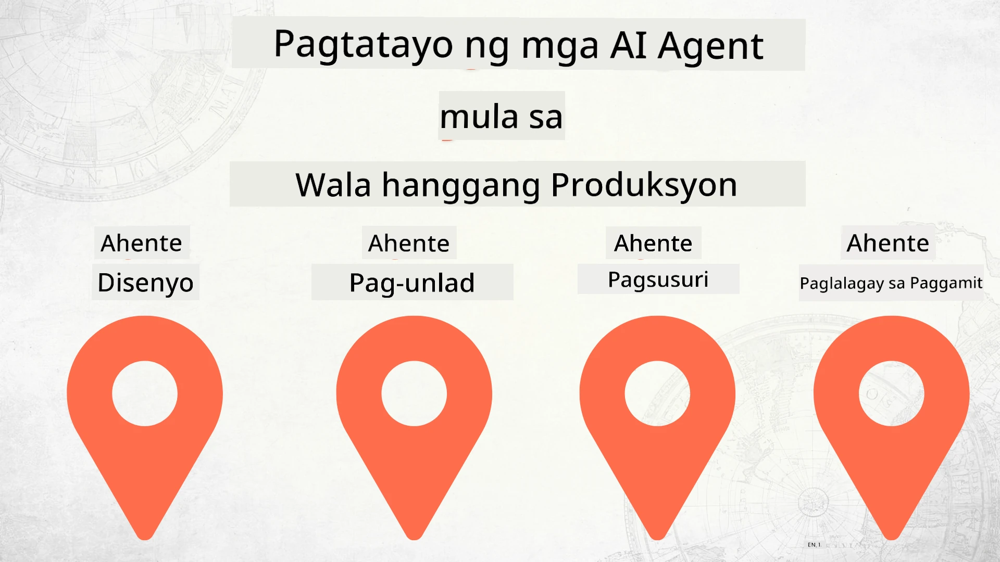

# Pagbuo ng mga AI Agent mula Simula hanggang Produksyon



### 🌐 Suporta sa Maramihang Wika

#### Sinusuportahan sa pamamagitan ng GitHub Action (Awtomatikong at Palaging Napapanahon)

<!-- CO-OP TRANSLATOR LANGUAGES TABLE START -->
[Arabic](../ar/README.md) | [Bengali](../bn/README.md) | [Bulgarian](../bg/README.md) | [Burmese (Myanmar)](../my/README.md) | [Chinese (Simplified)](../zh-CN/README.md) | [Chinese (Traditional, Hong Kong)](../zh-HK/README.md) | [Chinese (Traditional, Macau)](../zh-MO/README.md) | [Chinese (Traditional, Taiwan)](../zh-TW/README.md) | [Croatian](../hr/README.md) | [Czech](../cs/README.md) | [Danish](../da/README.md) | [Dutch](../nl/README.md) | [Estonian](../et/README.md) | [Finnish](../fi/README.md) | [French](../fr/README.md) | [German](../de/README.md) | [Greek](../el/README.md) | [Hebrew](../he/README.md) | [Hindi](../hi/README.md) | [Hungarian](../hu/README.md) | [Indonesian](../id/README.md) | [Italian](../it/README.md) | [Japanese](../ja/README.md) | [Kannada](../kn/README.md) | [Khmer](../km/README.md) | [Korean](../ko/README.md) | [Lithuanian](../lt/README.md) | [Malay](../ms/README.md) | [Malayalam](../ml/README.md) | [Marathi](../mr/README.md) | [Nepali](../ne/README.md) | [Nigerian Pidgin](../pcm/README.md) | [Norwegian](../no/README.md) | [Persian (Farsi)](../fa/README.md) | [Polish](../pl/README.md) | [Portuguese (Brazil)](../pt-BR/README.md) | [Portuguese (Portugal)](../pt-PT/README.md) | [Punjabi (Gurmukhi)](../pa/README.md) | [Romanian](../ro/README.md) | [Russian](../ru/README.md) | [Serbian (Cyrillic)](../sr/README.md) | [Slovak](../sk/README.md) | [Slovenian](../sl/README.md) | [Spanish](../es/README.md) | [Swahili](../sw/README.md) | [Swedish](../sv/README.md) | [Tagalog (Filipino)](./README.md) | [Tamil](../ta/README.md) | [Telugu](../te/README.md) | [Thai](../th/README.md) | [Turkish](../tr/README.md) | [Ukrainian](../uk/README.md) | [Urdu](../ur/README.md) | [Vietnamese](../vi/README.md)

> **Mas gusto mo bang i-clone nang Lokal?**
>
> Kasama sa repository na ito ang 50+ na pagsasalin ng wika na malaki ang dagdag sa laki ng pag-download. Para mag-clone nang walang mga pagsasalin, gamitin ang sparse checkout:
>
> **Bash / macOS / Linux:**
> ```bash
> git clone --filter=blob:none --sparse https://github.com/microsoft/Building-AI-Agents-From-Zero-To-Production.git
> cd Building-AI-Agents-From-Zero-To-Production
> git sparse-checkout set --no-cone '/*' '!translations' '!translated_images'
> ```
>
> **CMD (Windows):**
> ```cmd
> git clone --filter=blob:none --sparse https://github.com/microsoft/Building-AI-Agents-From-Zero-To-Production.git
> cd Building-AI-Agents-From-Zero-To-Production
> git sparse-checkout set --no-cone "/*" "!translations" "!translated_images"
> ```
>
> Magbibigay ito sa iyo ng lahat ng kailangan mo upang matapos ang kurso nang mas mabilis ang pag-download.
<!-- CO-OP TRANSLATOR LANGUAGES TABLE END -->

## Isang kurso na nagtuturo sa iyo ng mga pundasyon ng AI Agent Development Lifecycle

[](https://github.com/microsoft/Building-AI-Agents-From-Zero-To-Production/blob/master/LICENSE?WT.mc_id=academic-105485-koreyst)
[](https://GitHub.com/microsoft/Building-AI-Agents-From-Zero-To-Production/graphs/contributors/?WT.mc_id=academic-105485-koreyst)
[](https://GitHub.com/microsoft/Building-AI-Agents-From-Zero-To-Production/issues/?WT.mc_id=academic-105485-koreyst)
[](https://GitHub.com/microsoft/Building-AI-Agents-From-Zero-To-Production/pulls/?WT.mc_id=academic-105485-koreyst)
[](http://makeapullrequest.com?WT.mc_id=academic-105485-koreyst)

[](https://discord.gg/Kuaw3ktsu6)

## 🌱 Pagsisimula

Ang kursong ito ay may mga aralin na sumasaklaw sa mga pundasyon ng pagbuo at pag-deploy ng AI Agents.

Bawat aralin ay nakabatay sa naunang aralin, kaya inirerekomenda namin na magsimula ka sa simula at sundan hanggang sa katapusan.

Kung gusto mong tuklasin pa ang tungkol sa mga paksa ng AI Agent, maaari mong tingnan ang [AI Agents For Beginners Course](https://aka.ms/ai-agents-beginners).

### Makipagkita sa Iba pang mga Nag-aaral, Sagutin ang Iyong mga Tanong

Kung ikaw ay natigil o may mga tanong tungkol sa pagbuo ng AI Agents, sumali sa aming dedikadong Discord Channel sa [Microsoft Foundry Discord](https://discord.gg/Kuaw3ktsu6).

### Mga Kailangan Mo

Bawat aralin ay may sariling halimbawa ng code na maaari mong patakbuhin nang lokal. Maaari mong [i-fork ang repo na ito](https://github.com/microsoft/Building-AI-Agents-From-Zero-To-Production/fork) para gumawa ng sarili mong kopya.

Gamit ang kursong ito sa kasalukuyan ang mga sumusunod:

- [Microsoft Agent Framework (MAF)](https://aka.ms/ai-agents-beginners/agent-framework)
- [Microsoft Foundry](https://azure.microsoft.com/products/ai-foundry)
- [Azure OpenAI Service](https://azure.microsoft.com/products/ai-foundry/models/openai)
- [Azure CLI](https://learn.microsoft.com/cli/azure/authenticate-azure-cli?view=azure-cli-latest)

Pakitiyak na may access ka sa mga serbisyong ito bago magsimula.

Higit pang mga opsyon tungkol sa pagho-host ng modelo at mga serbisyo ay darating pa.

## 🗃️ Mga Aralin

| **Aralin**            | **Paglalarawan**                                                                                  |
|-----------------------|-------------------------------------------------------------------------------------------------|
| [Disenyo ng Agent](./lesson-1-agent-design/README.md)       | Isang pagpapakilala sa aming "Developer Onboarding" na Use Case ng Agent at kung paano magdisenyo ng epektibong mga agent  |
| [Pagbuo ng Agent](./lesson-2-agent-development/README.md)   | Gamit ang Microsoft Agent Framework (MAF), gumawa ng 3 agent upang tumulong sa bagong mga developer na mag-onboard.       |
| [Pagsusuri ng Agent](./lesson-3-agent-evals/README.md)      | Gamit ang Microsoft Foundry, tuklasin kung gaano kahusay ang pagganap ng aming mga AI Agents at paano sila mapapabuti.      |
| [Pag-deploy ng Agent](./lesson-4-agent-deployment/README.md)| Gamit ang Hosted Agents at OpenAI Chatkit, tingnan kung paano i-deploy ang AI Agent sa produksyon.                          |

## 🎒 Iba pang mga Kurso

Ang aming koponan ay gumagawa rin ng iba pang mga kurso! Tingnan ang:

<!-- CO-OP TRANSLATOR OTHER COURSES START -->
### LangChain
[](https://aka.ms/langchain4j-for-beginners)
[](https://aka.ms/langchainjs-for-beginners?WT.mc_id=m365-94501-dwahlin)
[](https://github.com/microsoft/langchain-for-beginners?WT.mc_id=m365-94501-dwahlin)
---

### Azure / Edge / MCP / Agents
[](https://github.com/microsoft/AZD-for-beginners?WT.mc_id=academic-105485-koreyst)
[](https://github.com/microsoft/edgeai-for-beginners?WT.mc_id=academic-105485-koreyst)
[](https://github.com/microsoft/mcp-for-beginners?WT.mc_id=academic-105485-koreyst)
[](https://github.com/microsoft/ai-agents-for-beginners?WT.mc_id=academic-105485-koreyst)

---
 
### Generative AI Series
[](https://github.com/microsoft/generative-ai-for-beginners?WT.mc_id=academic-105485-koreyst)
[-9333EA?style=for-the-badge&labelColor=E5E7EB&color=9333EA)](https://github.com/microsoft/Generative-AI-for-beginners-dotnet?WT.mc_id=academic-105485-koreyst)
[-C084FC?style=for-the-badge&labelColor=E5E7EB&color=C084FC)](https://github.com/microsoft/generative-ai-for-beginners-java?WT.mc_id=academic-105485-koreyst)
[-E879F9?style=for-the-badge&labelColor=E5E7EB&color=E879F9)](https://github.com/microsoft/generative-ai-with-javascript?WT.mc_id=academic-105485-koreyst)

---
 
### Core Learning
[](https://aka.ms/ml-beginners?WT.mc_id=academic-105485-koreyst)
[](https://aka.ms/datascience-beginners?WT.mc_id=academic-105485-koreyst)
[](https://aka.ms/ai-beginners?WT.mc_id=academic-105485-koreyst)
[](https://github.com/microsoft/Security-101?WT.mc_id=academic-96948-sayoung)
[](https://aka.ms/webdev-beginners?WT.mc_id=academic-105485-koreyst)
[](https://aka.ms/iot-beginners?WT.mc_id=academic-105485-koreyst)
[](https://github.com/microsoft/xr-development-for-beginners?WT.mc_id=academic-105485-koreyst)

---
 
### Copilot Series
[](https://aka.ms/GitHubCopilotAI?WT.mc_id=academic-105485-koreyst)
[](https://github.com/microsoft/mastering-github-copilot-for-dotnet-csharp-developers?WT.mc_id=academic-105485-koreyst)
[](https://github.com/microsoft/CopilotAdventures?WT.mc_id=academic-105485-koreyst)
<!-- CO-OP TRANSLATOR OTHER COURSES END -->

## Pagsusumite ng Ambag

Malugod na tinatanggap ng proyektong ito ang mga ambag at mungkahi. Karamihan sa mga ambag ay nangangailangan na sumang-ayon ka sa isang
Contributor License Agreement (CLA) na nagsasabing mayroon kang karapatan at tunay na binibigay sa amin
ang mga karapatan na gamitin ang iyong ambag. Para sa mga detalye, bisitahin ang <https://cla.opensource.microsoft.com>.

Kapag nagsumite ka ng pull request, awtomatikong tutuklasin ng isang CLA bot kung kailangan mong magbigay
ng CLA at ilalagay ang tamang dekorasyon sa PR (halimbawa, status check, komento). Sundin lamang ang mga tagubiling
ibinigay ng bot. Gagawin mo lamang ito minsan sa lahat ng mga repo na gumagamit ng aming CLA.

Inampon ng proyektong ito ang [Microsoft Open Source Code of Conduct](https://opensource.microsoft.com/codeofconduct/).
Para sa karagdagang impormasyon, tingnan ang [Code of Conduct FAQ](https://opensource.microsoft.com/codeofconduct/faq/) o
kontakin ang [opencode@microsoft.com](mailto:opencode@microsoft.com) para sa anumang karagdagang tanong o komento.

## Tatak-Pangkalakal

Maaaring maglaman ang proyektong ito ng mga tatak-pangkalakal o mga logo para sa mga proyekto, produkto, o serbisyo. Ang awtorisadong paggamit ng Microsoft
mga tatak-pangkalakal o logo ay napapailalim at dapat sumunod sa
[Microsoft's Trademark & Brand Guidelines](https://www.microsoft.com/legal/intellectualproperty/trademarks/usage/general).
Ang paggamit ng mga tatak-pangkalakal o logo ng Microsoft sa mga binagong bersyon ng proyektong ito ay hindi dapat magdulot ng kalituhan o magpahiwatig ng pagsuporta ng Microsoft.
Anumang paggamit ng mga tatak-pangkalakal o logo ng ikatlong partido ay napapailalim sa mga patakaran ng mga nasabing ikatlong partido.

## Pagkuha ng Tulong

Kung ikaw ay natigil o may anumang mga tanong tungkol sa paggawa ng AI apps, sumali sa:

[](https://discord.gg/Kuaw3ktsu6)

Kung mayroon kang mga puna sa produkto o mga errors habang nagtatayo, bisitahin ang:

[](https://aka.ms/foundry/forum)

---

<!-- CO-OP TRANSLATOR DISCLAIMER START -->
**Paunawa**:  
Ang dokumentong ito ay isinalin gamit ang AI translation service na [Co-op Translator](https://github.com/Azure/co-op-translator). Bagamat nagsusumikap kami para sa katumpakan, mangyaring tandaan na ang mga awtomatikong pagsasalin ay maaaring maglaman ng mga error o kamalian. Ang orihinal na dokumento sa kanyang likas na wika ang dapat ituring na pinagtibay na pinagmulan. Para sa mahahalagang impormasyon, inirerekomenda ang propesyonal na pagsasalin ng tao. Hindi kami mananagot sa anumang hindi pagkakaunawaan o maling interpretasyon na nagmula sa paggamit ng pagsasaling ito.
<!-- CO-OP TRANSLATOR DISCLAIMER END -->