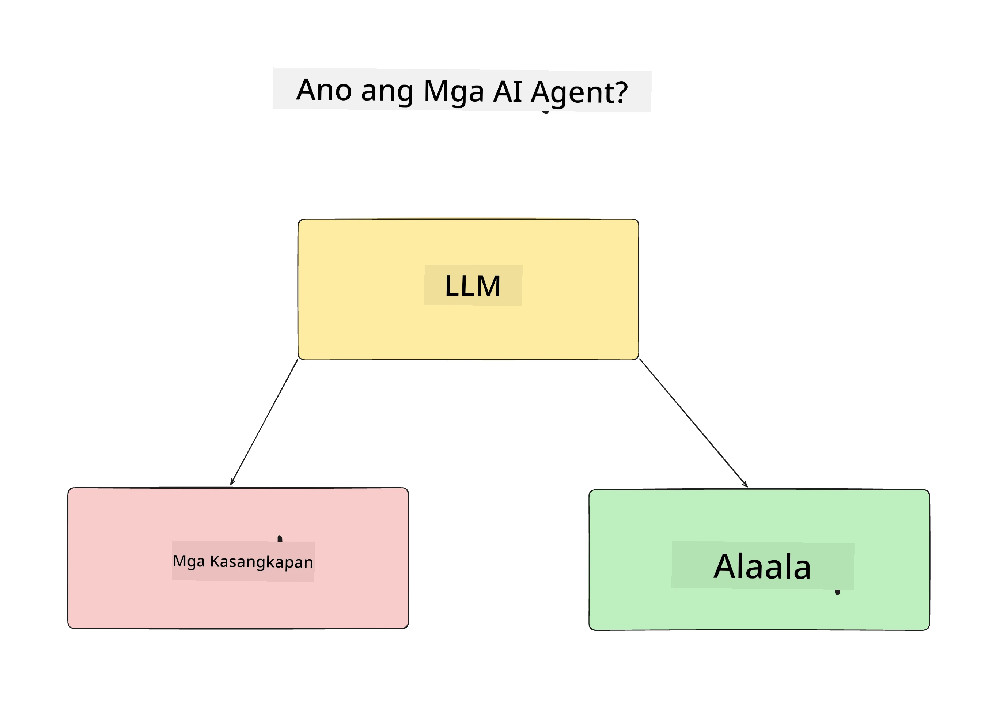
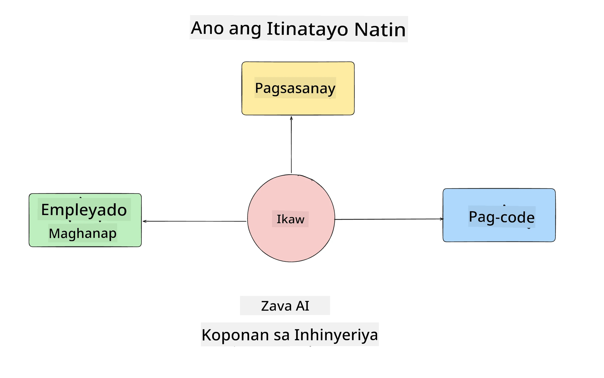
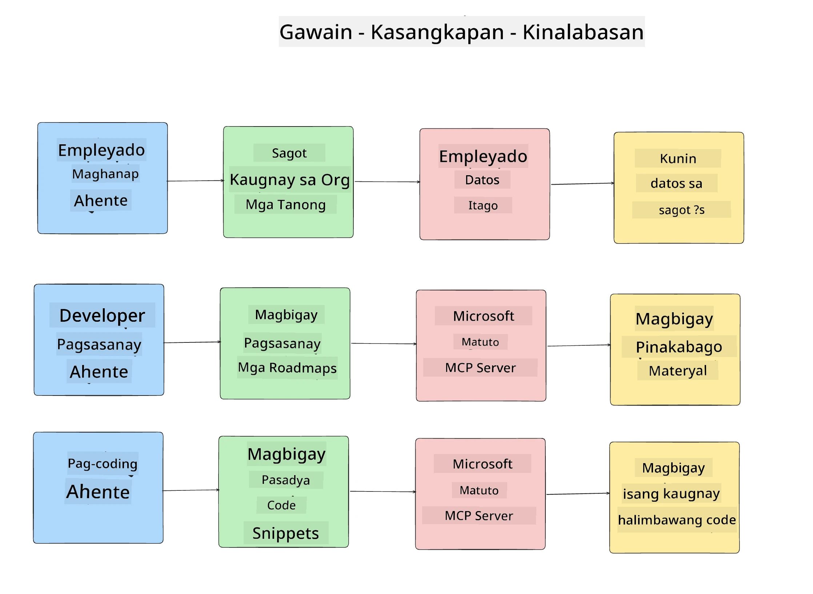
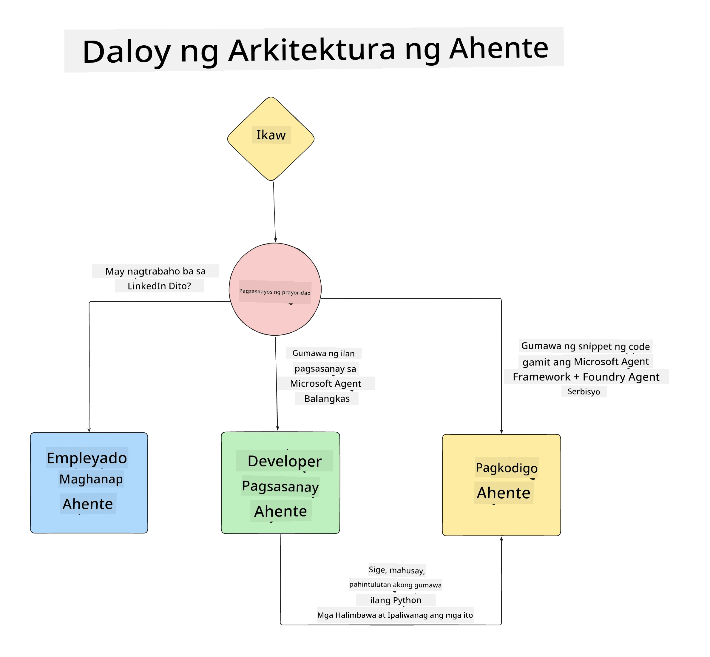

# Aralin 1: Disenyo ng AI Agent

Maligayang pagdating sa unang aralin ng "Pagtatayo ng AI Agent mula sa Simula hanggang Produksyon na Kurso"!

Sa araling ito tatalakayin natin:

- Pagpapaliwanag kung ano ang AI Agents
  
- Talakayin ang AI Agent Application na ating binubuo  

- Tukuyin ang mga kinakailangang tools at serbisyo para sa bawat agent
  
- Idisenyo ang aming Agent Application
  
Magsimula tayo sa pagpapaliwanag kung ano ang agent at bakit natin sila gagamitin sa loob ng isang aplikasyon.

> **Bago ka magsimula sa kurso.** Ang unang araling ito ay konseptwal — walang code na kailangang patakbuhin.
> Mula sa [Aralin 2](../lesson-2-agent-development/README.md) pataas kailangan mo ng: isang **Azure
> subscription** na may access sa **Microsoft Foundry**, isang na-deploy na **GPT-5 series model** (hal.
> `gpt-5.1` — iwasan ang retired na GPT-4o / GPT-4.1), **Python 3.12+**, at ang **Azure CLI**
> (`az login`). Tingnan ang [Ano ang Kailangan Mo](../README.md#what-you-need) sa README ng kurso para sa buong
> listahan at mga link.

## Ano ang AI Agents?

Kung ito ang iyong unang pagkakataon na tuklasin kung paano bumuo ng AI Agent, maaaring may mga tanong ka kung paano eksaktong ipaliwanag kung ano ang AI Agent.

Para sa simpleng paraan ng pagpapaliwanag kung ano ang AI Agent ay sa pamamagitan ng mga sangkap na bumubuo nito:

**Malaking Language Model** - Pinapagana ng LLM ang kakayahang iproseso ang natural na wika mula sa user upang maunawaan ang kanilang nais na gawin pati na ang paglalarawan ng mga tool na maaaring gamitin upang matapos ang mga gawain.

**Mga Tools** - Ito ang mga function, APIs, mga data store at iba pang serbisyo na maaaring piliin gamitin ng LLM upang matapos ang mga gawaing hinihingi ng user.

**Memorya** - Dito natin iniimbak ang mga panandalian at pangmatagalang interaksyon sa pagitan ng AI Agent at ng user. Ang pag-iimbak at pagkuha ng impormasyong ito ay mahalaga upang mapabuti at mapreserba ang mga kagustuhan ng user sa paglipas ng panahon.

## Ang Aming AI Agent Use Case

Para sa kursong ito, gagawa tayo ng AI Agent application na tumutulong sa mga bagong developer na sumali sa aming AI Agent Development Team!

Bago tayo magsimula sa anumang development work, ang unang hakbang para makagawa ng matagumpay na AI Agent application ay ang paglilinaw ng mga sitwasyon kung paano namin inaasahang gagamitin ng aming mga user ang AI Agents.

Para sa application na ito, gagamit tayo ng mga sumusunod na sitwasyon:

**Scenario 1**: Isang bagong empleyado ang sumali sa aming organisasyon at nais malaman pa ang tungkol sa team na kanilang sinalihan at kung paano makipag-ugnayan dito.

**Scenario 2:** Nais malaman ng bagong empleyado kung ano ang pinakamagandang unang gawain na maaari nilang simulan.

**Scenario 3:** Nais ng bagong empleyado na mangalap ng mga learning resources at mga code sample upang matulungan silang makapagsimula sa pagkumpleto ng gawain.

## Pagkilala sa Mga Tools at Serbisyo

Ngayon na mayroon na tayong mga sitwasyong ito, ang susunod na hakbang ay itugma ang mga ito sa mga tools at serbisyo na kakailanganin ng aming mga AI agent upang matapos ang mga gawain.

Ang prosesong ito ay kabilang sa kategorya ng Context Engineering habang nakatuon tayo sa pagtiyak na magkaroon ang aming mga AI Agent ng tamang konteksto sa tamang oras para matapos ang mga gawain.

Gawin natin ito isa-isang scenario at magsagawa ng magandang disenyo ng agent sa pamamagitan ng pagtala ng tungkulin, tools, at inaasahang resulta bawat agent.

### Scenario 1 - Employee Search Agent

**Task** - Sagutin ang mga tanong tungkol sa mga empleyado sa organisasyon tulad ng petsa ng pagsapi, kasalukuyang team, lokasyon, at huling posisyon.

**Tools** - Datastore ng kasalukuyang listahan ng empleyado at org chart

**Outcomes** - Kayang kumuha ng impormasyon mula sa datastore upang sagutin ang mga karaniwang tanong tungkol sa organisasyon at tiyak na mga tanong tungkol sa mga empleyado.

### Scenario 2 - Task Recommendation Agent

**Task** - Batay sa karanasan ng bagong empleyado bilang developer, magbigay ng 1-3 isyu na maaaring trabahuhin ng bagong empleyado.

**Tools** - GitHub MCP Server upang kunin ang mga open issues at buuin ang profile ng developer

**Outcomes** - Kayang basahin ang huling 5 commit mula sa isang GitHub Profile at mga open issue sa isang GitHub project at magbigay ng rekomendasyon batay sa tugma

### Scenario 3 - Code Assistant Agent

**Task** - Batay sa mga Open Issues na nirekomenda ng "Task Recommendation" Agent, magsaliksik at magbigay ng mga resources at bumuo ng mga code snippet upang matulungan ang empleyado.

**Tools** - Microsoft Learn MCP upang makahanap ng resources at Code Interpreter upang bumuo ng mga pasadyang code snippet.

**Outcomes** - Kung hihingi ang user ng karagdagang tulong, dapat gamitin ng workflow ang Learn MCP Server para magbigay ng mga link at snippet ng mga resources at saka i-handoff sa Code Interpreter agent upang gumawa ng maliliit na code snippet na may paliwanag.

## Pagdisenyo ng aming Agent Application

Ngayon na nailahad na natin ang bawat Agent, gumawa tayo ng diagram ng arkitektura na makakatulong sa atin maintindihan kung paano magtutulungan o gagana ang bawat agent nang hiwalay depende sa gawain:

## Mga Susunod na Hakbang

Ngayon na naidisenyo na natin ang bawat agent at ang sistemang agentic, lumipat tayo sa susunod na aralin kung saan bubuuin natin ang bawat isa sa mga agent na ito!

---

<!-- CO-OP TRANSLATOR DISCLAIMER START -->
**Pagtatanggi**:
Ang dokumentong ito ay isinalin gamit ang serbisyo ng AI translation na [Co-op Translator](https://github.com/Azure/co-op-translator). Bagama't nagsusumikap kami para sa katumpakan, pakatandaan na ang awtomatikong pagsasalin ay maaaring maglaman ng mga pagkakamali o hindi pagkakatugma. Ang orihinal na dokumento sa orihinal nitong wika ang dapat ituring na pangunahing sanggunian. Para sa mahahalagang impormasyon, inirerekomenda ang propesyonal na pagsasalin ng tao. Hindi kami mananagot sa anumang maling pagkakaintindi o maling interpretasyon na nagmula sa paggamit ng pagsasaling ito.
<!-- CO-OP TRANSLATOR DISCLAIMER END -->