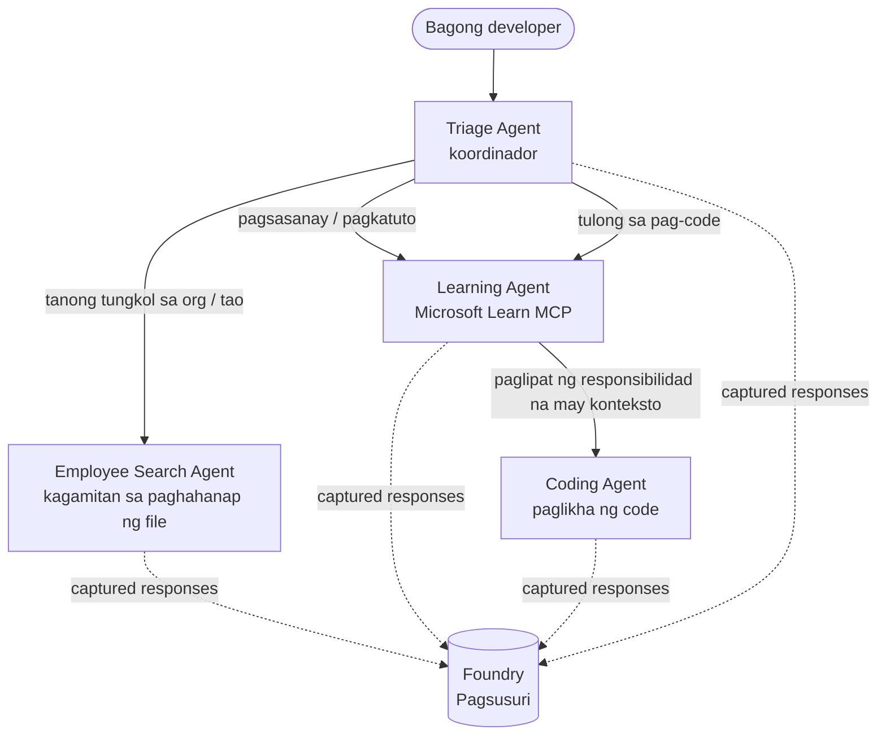

# Leksyon 3: Pagsusuri ng mga Ahente gamit ang Microsoft Foundry

Maligayang pagdating sa ikatlong leksyon ng **"Pagbuo ng AI Agents mula sa Simula hanggang Produksyon"** na kurso!

Sa [Lesson 2](../lesson-2-agent-development/README.md) bumuo ka ng mga ahente. Sa leksyon na ito
matututuhan mo kung paano sagutin ang isang mas mahirap na tanong: **magaling ba sila?** Madaling mag-ship ng isang ahente na
tumatakbo; ang malaman kung tama ang routing nito, nananatili itong naka-ground sa iyong data, at ginagamit ang mga
tools nang maayos ang siyang naghihiwalay ng demo sa isang produksyon na sistema.

Sa leksyon na ito tatalakayin natin:

- Bakit mahalaga ang pagsusuri ng ahente at paano ito naiiba sa tradisyunal na pagsusuri
- Ang pagkakaiba ng **observability**, **smoke tests**, at **evaluations**
- Ang multi-agent workflow na susukatin natin
- Ang built-in na **Microsoft Foundry evaluators** (relevance, groundedness, tool-call accuracy, tool-output utilization)
- Isang step-by-step na walkthrough ng evaluation pipeline sa [`agent-evals.py`](../../../lesson-3-agent-evals/agent-evals.py)
- Paano ito patakbuhin at basahin ang mga resulta

---

## Bakit suriin ang mga ahente?

Ang tradisyunal na unit test ay nagpapahayag na `add(2, 2) == 4`. Hindi ganito gumagana ang mga ahente — ang parehong
prompt ay maaaring magbunga ng iba't ibang wording sa bawat pagtakbo, maaaring tawagin ang mga tools sa iba't ibang
pagkakasunod-sunod, at ang "tama" ay kadalasang isang bagay ng degree kaysa boolean. Hindi ka maaaring


Sa halip, sinusuri mo ang mga ahente base sa mga **quality dimensions** gamit ang model-based *evaluators* (tinatawag din na "LLM-as-a-judge")


- Talagang nasagot ba ng sagot ang tanong? (**relevance**)
- Sinusuportahan ba ng nakuhang data ang sagot, o nanloko ang ahente? (**groundedness**)
- Tama bang tool ang tinawag ng ahente gamit ang tamang mga argumento? (**tool-call accuracy**)


| Layer | Tanong na sinasagot | Gastos | Kailan ito tumatakbo | Sakop sa |
|-------|--------------------|-------|---------------------|----------|
| **Observability / tracing** | *Ano ang ginawa ng ahente, hakbang-hakbang?* | Libre (palaging naka-on) | Patuloy sa produksyon | Itong leksyon |
| **Smoke tests** | *Naabot ba ang ahente at sinusunod ang basic prompt nito?* | Mura, ilang segundo | Tuwing deploy | [Lesson 4](../lesson-4-agentdeployment/README.md#smoke-testing-the-hosted-agent-ci-gate) |


1. Natapos ang [Lesson 2](../lesson-2-agent-development/README.md) (mga ahente + vector store).
2. Isang **Microsoft Foundry** project.
3. Na-authenticate ang **Azure CLI**: `az login`.


   ```bash
   pip install -r ../requirements.txt
   ```


   | Variable | Layunin |
   |----------|---------|
   | `FOUNDRY_PROJECT_ENDPOINT` | Ang endpoint ng iyong Foundry project (`https://<account>.services.ai.azure.com/api/projects/<project>`). Binabasa ito ng `FoundryChatClient` ng mga ahente **at** ng evaluation helper. |
   | `FOUNDRY_MODEL` | Model deployment kung saan tumatakbo ang **mga ahente** (e.g. `gpt-5.1`). |
   | `VECTOR_STORE_ID` | Ang employee-directory vector store na ginawa sa Lesson 2 |


> Ginagamit ng mga ahente ang `FoundryChatClient`, na nagbabasa ng config mula sa mga variable na may prefix na `FOUNDRY_`
> (`FOUNDRY_PROJECT_ENDPOINT`, `FOUNDRY_MODEL`). Ginagamit ng cloud evaluation helper
> ang `azure-ai-projects` SDK at babalik sa `FOUNDRY_PROJECT_ENDPOINT` kung ang
> `AZURE_AI_PROJECT_ENDPOINT` ay hindi naka-set — kaya sapat na ang dalawang `FOUNDRY_` variables
> para patakbuhin ang buong leksyon.
>
> Pinapagana ng isang modelo ang mga evaluator, kaya kinokontrol ng `AZURE_AI_MODEL_DEPLOYMENT_NAME`
> kung aling deployment ang gumagawa ng paghusga — hindi kailangang pareho ang modelong ginagamit ng iyong


Para suriin ang isang bagay, kailangan mo muna itong patakbuhin. Ibig gamitin sa leksyon na ito ang workflow ng **Developer Onboarding**




Ang workflow ay ginawa gamit ang Microsoft Agent Framework na **handoff** orchestration. Ang mahalagang
ideya para sa pagsusuri ay na **lahat ng ahente na turn ay iniimbak sa server-side** at tinutukoy ng


Naka-implement ang [`agent-evals.py`](../../../lesson-3-agent-evals/agent-evals.py) sa anim na hakbang na pipeline. Narito ang ginagawa


Pinapatakbo ang workflow gamit ang `run_stream(...)`, at habang dumarating ang mga event ang code ay nagtatala ng
`response_id` at `conversation_id` na nilikha ng bawat ahente. Ang mga iniimbak na sagot ay ang raw
materyal para sa pagsusuri — sinusuri mo ang *real* na sagot na galing sa produksyon, hindi yung muling ginawa.

### Hakbang 2 — Buodin ang mga naitala

Isang mabilisang buod ang nagpi-print kung ilan ang sagot na ginawa ng bawat ahente, para makumpirma mong
na-exercise talaga ng workflow ang mga ahenteng nais mong suriin.

### Hakbang 3 — Kunin ang mga huling sagot

Para sa bawat ahente, ang huling `response_id` ay kinukuha gamit ang OpenAI-compatible
client ng proyekto (`project_client.get_openai_client().responses.retrieve(...)`) para mapreview mo
ang tekstong huhusgahan.

### Hakbang 4 — Gumawa ng evaluation

Gumagawa ng evaluation gamit ang apat na **built-in Foundry evaluators**:

| Evaluator | `evaluator_name` | Sinusukat |
|-----------|------------------|-----------|
| Relevance | `builtin.relevance` | Nasasagot ba ng sagot ang kahilingan ng user? |
| Groundedness | `builtin.groundedness` | Sinusuportahan ba ng nakuha/yang tool data ang sagot (hindi nag-hallucinate)? |
| Tool-call accuracy | `builtin.tool_call_accuracy` | Tinawag ba ang tamang tool gamit ang tamang mga argumento? |
| Tool-output utilization | `builtin.tool_output_utilization` | Talagang ginamit ba ng ahente ang resulta ng tool sa sagot? |

Ang bawat evaluator ay ini-initialize gamit ang deployment na tinukoy ng `AZURE_AI_MODEL_DEPLOYMENT_NAME`.

> **Bakit apat na ito?** Sinusukat ng relevance at groundedness ang *kalidad ng sagot*; sinusukat ng dalawang tool
> evaluator ang *pag-uugaling ahente* — ang bahagi na tinatanggal ng mga tradisyunal na NLP metric. Para sa
> tool-using, multi-agent sistem, sa tool metrics madalas makikita ang tunay na regression.

### Hakbang 5 — Patakbuhin ang evaluation

Ang mga nakuhang `response_id`s ay ipinapasa sa `evals.runs.create(...)` bilang source ng data. Pinapatakbo ng
serbisyo ang bawat naka-imbak na sagot sa bawat evaluator.

### Hakbang 6 — I-monitor at basahin ang mga resulta

Paulit-ulit na kino-poll ng code ang run hanggang ito ay `completed` o `failed`, saka ipiniprint ang bilang ng resulta at isang
**`report_url`** — isang malalim na link sa Foundry portal kung saan pwede mong tingnan ang bawat metric score,
pass/fail na bilang, at mga individual na hinusgahang sagot.

---

## Patakbuhin ito

```bash
cd lesson-3-agent-evals
python agent-evals.py
```

Sa default sinusuri nito ang unang example query
(`"I'm new here! Has anyone worked at Microsoft here?"`). May dalawang multi-intent na example queries
na kasama sa `run_evaluation_workflow()` — palitan ang variable na `query` para subukan ang mga routing scenario
na nagpapagamit ng mas maraming ahente sa isang takbo.

Inaasahang daloy sa console:

```
Step 1: Running Developer Onboarding Workflow
Step 2: Response Data Summary
Step 3: Fetching Agent Responses
Step 4: Creating Evaluation
Step 5: Running Evaluation
Step 6: Monitoring Evaluation
  Status: running ...
  Evaluation completed successfully
  Report URL: https://...   <-- open this in the Foundry portal
```

---

## Observability at tracing

Sinasabi ng evaluations kung *gaanong ganda* ang mga sagot; sinasabi ng **observability** kung *ano ang nangyari*
para maproduce ang mga ito — bawat lipat ng ahente, tawag sa tool, bilang ng token, at latency. Sa Microsoft Foundry,
ang mga agent run ay naglalabas ng OpenTelemetry traces na pwede mong tingnan sa portal, at pwede ring
i-export ng Agent Framework ito sa Azure Monitor / Application Insights gamit ang isang tawag:

```python
from agent_framework.foundry import FoundryChatClient

client = FoundryChatClient()
client.configure_azure_monitor()   # i-export ang mga traces + metrics sa Application Insights
```

Gamitin ang tracing para **i-debug** ang masamang evaluation score: kapag bumaba ang groundedness, ipinapakita ng trace
kung walang ibinalik ang file-search tool, o may ibinalik na data pero hindi pinansin ng ahente (na siyang sinusukat ng
tool-output utilization).

---

## Mula sa "runs" patungong "mabuti": paano ito gamitin sa praktis

- **Pre-release gate.** Patakbuhin ang mga evaluation laban sa isang fixed na set ng mga representative query bago
  itaguyod ang bagong prompt o modelo. Ihambing ang mga score sa nakaraang bersyon — ituring ang pagbaba bilang
  regression.
- **Nightly quality signal.** Iskedyul ang evaluation para mahuli ang pagbabago mula sa data o dependency
  changes.
- **Ipares sa smoke tests.** Ang [Lesson 4 smoke test](../lesson-4-agentdeployment/README.md#smoke-testing-the-hosted-agent-ci-gate)
  ay mabilis mong gate kada deploy; ang evaluations ay mas mabagal at mas malalim na quality gate. Patakbuhin ang mura
  sa bawat merge at ang mahal sa iskedyul o bago mag-release.

---

## Tala sa modernisasyon

Inililipat ang sample na ito sa kasalukuyang Microsoft Agent Framework Foundry API surface
(`agent_framework.foundry`). Kung ina-update mo ang code, tingnan ang repository-root
[`MIGRATION-GUIDE.md`](../MIGRATION-GUIDE.md) para sa napatunayan na bago/after na import at client
mappings (halimbawa `AzureAIClient` -> `FoundryChatClient`, at hosted-tool construction gamit ang
`client.get_file_search_tool(...)` / `client.get_mcp_tool(...)`). Ang mga konsepto ng evaluation at ang
anim na hakbang ng pipeline sa itaas ay hindi nagbabago dahil sa migrasyon na iyon.

---

## Mga resources

- [Evaluate generative AI models and applications (Microsoft Learn)](https://learn.microsoft.com/en-us/azure/ai-foundry/concepts/evaluation-approach-gen-ai)
- [Built-in evaluators for generative AI](https://learn.microsoft.com/en-us/azure/ai-foundry/concepts/evaluation-evaluators/agent-evaluators)
- [Observability in Microsoft Foundry](https://learn.microsoft.com/en-us/azure/ai-foundry/concepts/observability)
- [Microsoft Agent Framework](https://github.com/microsoft/agent-framework)
- [Agent handoff orchestration](https://learn.microsoft.com/en-us/agent-framework/workflows/orchestrations/handoff)

---

<!-- CO-OP TRANSLATOR DISCLAIMER START -->
**Pagtatanggi**:
Ang dokumentong ito ay isinalin gamit ang serbisyo ng AI translation na [Co-op Translator](https://github.com/Azure/co-op-translator). Bagama't nagsusumikap kami para sa katumpakan, pakatandaan na ang awtomatikong pagsasalin ay maaaring maglaman ng mga pagkakamali o hindi pagkakatugma. Ang orihinal na dokumento sa orihinal nitong wika ang dapat ituring na pangunahing sanggunian. Para sa mahahalagang impormasyon, inirerekomenda ang propesyonal na pagsasalin ng tao. Hindi kami mananagot sa anumang maling pagkakaintindi o maling interpretasyon na nagmula sa paggamit ng pagsasaling ito.
<!-- CO-OP TRANSLATOR DISCLAIMER END -->