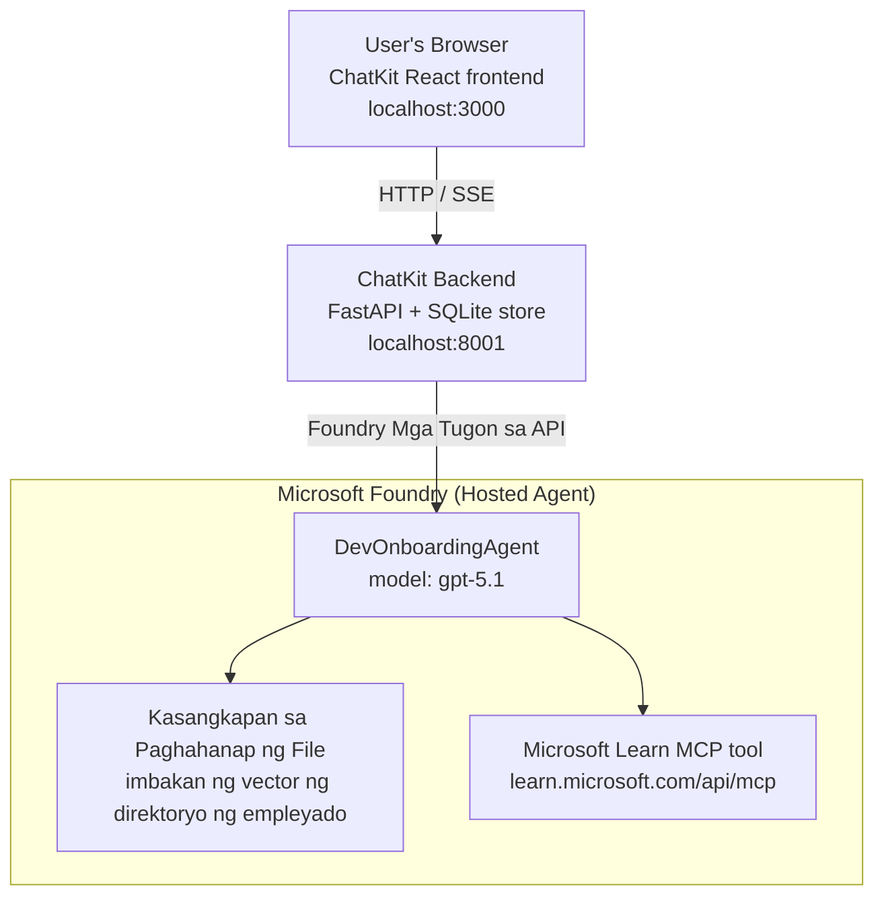

# Aralin 4: Deployment ng Agent gamit ang Microsoft Foundry Hosted Agents + ChatKit

Ipinapakita ng araling ito kung paano mag-deploy ng tool-using agent sa Microsoft Foundry bilang hosted agent at gumawa ng ChatKit-based frontend upang makipag-ugnayan dito.

## Arkitektura

Ang hosted agent ay isang **isang `DevOnboardingAgent`** (na tumatakbo sa `gpt-5.1`) na sumasagot sa mga tanong tungkol sa developer onboarding gamit ang dalawang hosted tools: isang **File Search** tool sa employee-directory vector store, at ang **Microsoft Learn MCP** tool. Ang ChatKit React frontend ay nakikipag-usap sa FastAPI backend, na tumatawag sa agent sa pamamagitan ng Foundry **Responses API**.



## Mga Kinakailangan

1. **Proyekto sa Microsoft Foundry** sa North Central US na rehiyon
2. **Azure CLI** na naka-authenticate (`az login`)
3. **Azure Developer CLI** (`azd`) na naka-install
4. **Python 3.12+** at **Node.js 18+**
5. **Vector Store** na nilikha gamit ang data ng empleyado

## Mabilis na Simula

### 1. I-set Up ang Mga Environment Variables

```bash
cd lesson-4-agentdeployment
cp .env.example .env
# I-edit ang .env gamit ang mga detalye ng iyong Microsoft Foundry project
```

### 2. I-deploy ang Hosted Agent

**Opsyon A: Gamit ang Azure Developer CLI (Inirerekomenda)**

```bash
cd hosted-agent
azd auth login
azd agent deploy
```

**Opsyon B: Gamit ang Docker + Azure Container Registry**

```bash
cd hosted-agent

# Buuhin ang lalagyan
docker build -t developer-onboarding-agent:latest .

# Tag para sa ACR
docker tag developer-onboarding-agent:latest <your-acr>.azurecr.io/developer-onboarding-agent:latest

# I-push sa ACR
az acr login --name <your-acr>
docker push <your-acr>.azurecr.io/developer-onboarding-agent:latest

# I-deploy sa pamamagitan ng Microsoft Foundry portal o SDK
```

### 3. Simulan ang ChatKit Backend

```bash
cd chatkit-server
python -m venv .venv
source .venv/bin/activate  # Sa Windows: .venv\Scripts\activate
pip install -r requirements.txt
python app.py
```

Magsisimula ang server sa `http://localhost:8001`

### 4. Simulan ang ChatKit Frontend

```bash
cd chatkit-server/frontend
npm install
npm run dev
```

Magsisimula ang frontend sa `http://localhost:3000`

### 5. Subukan ang Aplikasyon

Buksan ang `http://localhost:3000` sa iyong browser at subukan ang mga sumusunod na query:

**Paghahanap ng Empleyado:**
- "Baguhan ako dito! Mayroon bang nakatrabaho sa Microsoft?"
- "Sino ang may karanasan sa Azure Functions?"

**Mga Pinagkukunan ng Pag-aaral:**
- "Gumawa ng learning path para sa Kubernetes"
- "Anong mga sertipikasyon ang dapat kong kunin para sa cloud architecture?"

**Tulong sa Pag-coding:**
- "Tulungan mo akong magsulat ng Python code para sa pagkonekta sa CosmosDB"
- "Ipakita mo kung paano gumawa ng Azure Function"

**Mga Multi-Agent na Query:**
- "Nagsisimula ako bilang cloud engineer. Sino ang dapat kong makausap at ano ang dapat kong matutunan?"

## Estruktura ng Proyekto

```
lesson-4-agentdeployment/
├── .env.example                 # Environment variables template
├── implementation-plan.md       # Detailed implementation guide
├── README.md                    # This file
├── hosted-agent/               # Microsoft Foundry hosted agent
│   ├── main.py                 # Multi-agent workflow implementation
│   ├── requirements.txt        # Python dependencies
│   ├── Dockerfile              # Container definition
│   └── agent.yaml              # Agent deployment configuration
└── chatkit-server/             # ChatKit server application
    ├── app.py                  # FastAPI backend
    ├── store.py                # SQLite persistence layer
    ├── requirements.txt        # Python dependencies
    └── frontend/               # React frontend
        ├── package.json
        ├── vite.config.ts
        ├── tsconfig.json
        ├── index.html
        └── src/
            ├── main.tsx
            ├── App.tsx
            ├── App.css
            └── index.css
```

## Ang Agent at ang Kanyang mga Tool

Ang hosted agent ay isang **isang agent** (`DevOnboardingAgent`, na tinukoy sa `hosted-agent/main.py`) na humahawak ng tatlong onboarding na domain. Sa halip na orchestrate ng iba't ibang sub-agents, ipinapakita nito ang bawat kakayahan bilang isang tool (o direktang umaasa sa modelo):

| Kakayahan | Paano ito hinahawakan | Tool |
|-----------|------------------|------|
| **Paghahanap at koneksyon ng empleyado** | Foundry hosted File Search sa employee-directory vector store | `client.get_file_search_tool(vector_store_ids=[...])` |
| **Pagkatuto at pagsasanay** | Microsoft Learn MCP server (hosted MCP tool) | `client.get_mcp_tool(url="https://learn.microsoft.com/api/mcp")` |
| **Tulong sa pag-coding** | Hinahawakan ng `gpt-5.1` model nang direkta — walang external tool | — |

Ang agent ay nilikha gamit ang `client.as_agent(name="DevOnboardingAgent", instructions=..., tools=[file_search_tool, learn_mcp_tool])` at pinagsilbihan gamit ang `from_agent_framework(agent).run()`.

> **Nota sa disenyo.** Ang mga naunang draft ng araling ito ay gumamit ng `HandoffBuilder` multi-agent workflow (Triage → specialists). Ang naipadalang agent ay isang single tool-using agent, na mas simple i-deploy at intindihin para sa mga onboarding na estilo ng Q&A. Para sa isang halimbawa ng multi-agent orchestration at handoffs, tingnan ang Aralin 2 at Aralin 3.

## Pagsusuri ng Hosted Agent (CI Gate)

Ang matagumpay na deployment ng hosted agent ay nagpapatunay lang na tinanggap ng control plane ang
depinisyon — hindi nito pinapatunayan na talaga namang sumasagot ang agent. Ang nawawalang dependency,
maling routing ng modelo, o isang expired na koneksyon ay maaaring mag-iwan ng agent na berde pero tahimik.

Nagbibigay ang araling ito ng magaan na **smoke test** na nagsisilbing mabilis at murang post-deploy
gate. Ginagamit nito ang [AI Smoke Test](https://github.com/marketplace/actions/ai-smoke-test)
GitHub Action upang mag-POST ng mga prompt sa Foundry **Responses** endpoint ng agent
(`POST {project_endpoint}/agents/{agent_name}/endpoint/protocols/openai/responses`)
at sinisigurado ang ibinalik na teksto. Nahuhuli nito ang mga sirang deployment, auth regressions,
pag-iba ng system-prompt, at mga problema sa threading sa loob ng ilang segundo.

> Ang smoke tests ay **hindi** kapalit ng kompletong mga pagsusuri sa
> [Aralin 3](../lesson-3-agent-evals/README.md) — sila ay pantulong lamang. Ang smoke tests
> ay sumasagot ng *"naaabot ba, tumutugon, at sumusunod ba ang agent sa mga pangunahing inaasahan ng prompt?"*;
> ang mga pagsusuri ay sumasagot ng *"gaanong gumaganda ang sagot?"*. Patakbuhin ang murang gate sa bawat deploy.

### Ano ang sinusuri

Ang katalogo ay matatagpuan sa [`hosted-agent/tests/smoke-tests.json`](../../../lesson-4-agentdeployment/hosted-agent/tests/smoke-tests.json)
at sinasanay ang tatlong domain ng agent pati na ang pagsunod sa prompt at multi-turn threading:

| Pagsubok | Ano ang pinatutunayan nito |
|------|------------------|
| `reachability` | Tumugon ang agent ng may nilalaman at naaayon sa saklaw na teksto |
| `employee-search` | Nagbibigay ang file-search domain ng malusog na `200` (ang sagot ay depende sa datos) |
| `learning-path` | Inuulit ng learning domain ang paksa at nagbibigay ng sagot na parang path |
| `coding-assistance` | Nagbibigay ang coding domain ng code-shaped Python na sagot |
| `prompt-adherence-offtopic` | Ang off-topic na request ay nire-redirect, hindi detalyadong sinasagot |
| `threading-turn-1/2` | Napananatili ang estado ng usapan sa pagitan ng mga turn gamit ang `previous_response_id` |

### Patakbuhin ito sa CI

Ang workflow sa [`.github/workflows/smoke-test-hosted-agent.yml`](../../../.github/workflows/smoke-test-hosted-agent.yml)
ay may dalawang trabaho:

- **`static`** — isang mabilis, walang Azure na gate na tumatakbo sa bawat pull request at push:
  kino-compile nito lahat ng Python sources (`py_compile`) at sine-check ang mga Markdown link. Walang kailangang secrets,
  kaya gumagana ito sa fork PRs.
- **`smoke`** — ang Azure-connected smoke test na nasa ibaba. Ito ay tumatakbo kapag hiniling
  (Actions → **Agent CI (static + smoke)** → Run workflow) at maaaring ipatupad pagkatapos ng iyong
  deploy workflow.

I-configure ang mga repository **variables** at **secrets** para sa smoke job:

| Uri | Pangalan | Halaga |
|------|------|-------|

| Variable | `FOUNDRY_PROJECT_ENDPOINT` | `https://<account>.services.ai.azure.com/api/projects/<project>` |
| Variable | `HOSTED_AGENT_NAME` | Pangalan ng naka-deploy na agent (e.g. `dev-onboarding` — kailangang tumugma sa iyong deployment) |
| Secret | `AZURE_CLIENT_ID` / `AZURE_TENANT_ID` / `AZURE_SUBSCRIPTION_ID` | OIDC federated identity para sa `azure/login` |

Kailangan ng runner identity ang **`Azure AI User`** na papel sa **Foundry project scope** upang
makatawag ito sa Responses (at conversations) data-plane endpoints. Ibigay ito sa pamamagitan ng:

```bash
az role assignment create \
  --assignee <object-id-or-appId-of-runner-identity> \
  --role "Azure AI User" \
  --scope "/subscriptions/<sub>/resourceGroups/<rg>/providers/Microsoft.CognitiveServices/accounts/<account>/projects/<project>"
```

### Patakbuhin ito nang lokal

Maaari mong patakbuhin ang parehong catalog bago mag-push. Kumuha ng data-plane token na may saklaw para sa
`https://ai.azure.com/` at ituro ang runner sa iyong deployment:

```bash
# Kailangang ang Audience ay https://ai.azure.com/ (ang mga token mula sa cognitiveservices.azure.com ay tinatanggihan)
export FOUNDRY_TOKEN=$(az account get-access-token --resource https://ai.azure.com/ --query accessToken -o tsv)

git clone https://github.com/JFolberth/ai-smoketest && cd ai-smoketest
python runner.py \
  --project-endpoint "https://<account>.services.ai.azure.com/api/projects/<project>" \
  --agent-name dev-onboarding \
  --tests-file ../lesson-4-agentdeployment/hosted-agent/tests/smoke-tests.json
```

Mga exit code: `0` lahat pumasa, `1` may hindi pumasa na assertion, `2` error sa runner (maling catalog / token).

## Pag-aayos ng Problema

### Hindi sumasagot ang agent
- Tiyaking naka-deploy at tumatakbo ang hosted agent sa Microsoft Foundry
- Suriin na tumutugma ang `HOSTED_AGENT_NAME` at `HOSTED_AGENT_VERSION` sa iyong deployment

### Mga error sa vector store
- Siguraduhing tama ang pagkaka-set ng `VECTOR_STORE_ID`
- Tiyaking may laman ang vector store ng data ng empleyado

### Mga error sa pag-authenticate
- Patakbuhin ang `az login` upang i-refresh ang mga kredensyal
- Siguraduhing may access ka sa Microsoft Foundry project

## Mga Mapagkukunan

- [Microsoft Foundry Hosted Agents Documentation](https://learn.microsoft.com/en-us/azure/ai-foundry/agents/concepts/hosted-agents)
- [Microsoft Agent Framework](https://github.com/microsoft/agent-framework)
- [ChatKit Integration Sample](https://github.com/microsoft/agent-framework/tree/main/python/samples/demos/chatkit-integration)
- [Azure Developer CLI](https://learn.microsoft.com/en-us/azure/developer/azure-developer-cli/overview)
- [AI Smoke Test GitHub Action](https://github.com/marketplace/actions/ai-smoke-test)
- [Smoke Test Microsoft Foundry Agents with GitHub Actions (blog)](https://techcommunity.microsoft.com/blog/azuredevcommunityblog/smoke-test-microsoft-foundry-agents-with-github-actions/4531912)

---

## Susunod na Mga Hakbang

Ang iyong agent ay tumatakbo sa Microsoft-managed na imprastruktura. Upang dalhin ito sa enterprise production —
pagkontrol kung saan naninirahan ang kanyang data (data sovereignty, pribadong networking, magdala ng sarili mong Azure
Cosmos DB / Storage / AI Search) at pamahalaan ang mga kasangkapan nito — ipagpatuloy ang
**[Lesson 5: Production Hosted Agents](../lesson-5-hosted-agents-production/README.md)**, na
nagpapaliwanag ng mahalagang pagkakaiba sa pagitan ng **Hosted Agents** at **Capability Hosts**.

---

<!-- CO-OP TRANSLATOR DISCLAIMER START -->
**Pagtatanggi**:
Ang dokumentong ito ay isinalin gamit ang serbisyo ng AI translation na [Co-op Translator](https://github.com/Azure/co-op-translator). Bagama't nagsusumikap kami para sa katumpakan, pakatandaan na ang awtomatikong pagsasalin ay maaaring maglaman ng mga pagkakamali o hindi pagkakatugma. Ang orihinal na dokumento sa orihinal nitong wika ang dapat ituring na pangunahing sanggunian. Para sa mahahalagang impormasyon, inirerekomenda ang propesyonal na pagsasalin ng tao. Hindi kami mananagot sa anumang maling pagkakaintindi o maling interpretasyon na nagmula sa paggamit ng pagsasaling ito.
<!-- CO-OP TRANSLATOR DISCLAIMER END -->