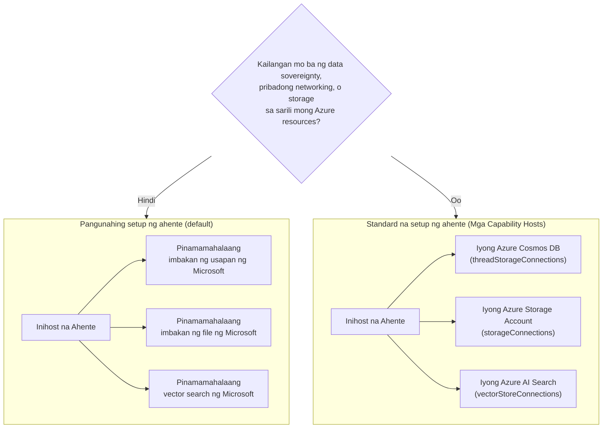

# Aralin 5: Production Hosted Agents — Storage, Memory & Governance

Sa [Aralin 4](../lesson-4-agentdeployment/README.md) inilunsad mo ang Developer Onboarding
Agent bilang isang **Microsoft Foundry Hosted Agent** at nilagyan ng ChatKit frontend. Ang
araling iyon ay sumagot sa *"paano ko ilulunsad ang isang agent?"*. Ang araling ito ay sasagot sa mga susunod na tanong
sa isang enterprise: **Saan nakaimbak ang data ng aking agent? Sino ang kumokontrol dito? Paano ako makakasunod sa compliance,
networking, at mga pangangailangan sa pamamahala?**

Ang pinakamahalagang ideya sa araling ito ay ang pagkakaiba sa pagitan ng isang **Hosted Agent** at isang
**Capability Host** — dalawang konsepto na madaling malito ngunit sumusolusyon sa magkaibang mga
problema.

## Mga Layunin sa Pagkatuto

Sa pagtatapos ng araling ito ay magagawa mong:

- Ipaliwanag kung ano ang ibinibigay ng isang **Hosted Agent** (Microsoft-managed execution) at kung ano ang hindi nito ibinibigay.
- Ipaliwanag kung ano ang isang **Capability Host** at eksaktong kung kailan mo ito kailangan.
- Pumili sa pagitan ng **basic agent setup** (Microsoft-managed storage) at **standard agent setup**
  (dalhin ang sarili mong Azure resources).
- Maunawaan kung paano pinangangalagaan ang **kasaysayan ng pag-uusap, pag-upload ng file, at vector stores**, at kung paano
  ito i-redirekta sa iyong sariling Azure Cosmos DB, Azure Storage, at Azure AI Search.
- Ilapat ang mga kontrol sa pamamahala: data sovereignty, pribadong networking, at **Hosted MCP tool approval**.

---

## Mga Kinakailangan

1. Natapos ang [Aralin 4](../lesson-4-agentdeployment/README.md) — mayroon kang hosted agent na inilunsad.
2. Isang **Microsoft Foundry** na proyekto, at isang Azure account na may pahintulot na gumawa ng mga resources
   (Cosmos DB, Storage, Azure AI Search) at magtalaga ng mga role sa subscription/resource group.
3. Na-authenticate ang **Azure CLI**: `az login` (at `az account set --subscription <id>` kung mayroon kang
   higit sa isang subscription).
4. Na-install ang **Azure Developer CLI** (`azd`) — ginagamit para sa standard-setup provisioning flow.
5. **Python 3.12+** na may naka-install na dependencies sa kurso (`pip install -r ../requirements.txt`).
6. Isang kasalukuyang, hindi retiradong deployment ng model (halimbawa `gpt-5.1`). Iwasan ang retiradong GPT-4o / GPT-4.1.

> Karamihan sa araling ito ay konseptwal at nakatuon sa control-plane. Maaari mo itong basahin end-to-end nang
> hindi nagpo-provision ng kahit ano, at gamitin ang hands-on exercises kapag handa ka nang i-configure ang isang
> standard setup.

---

## 1. Hosted Agents: kung ano ang pinamamahalaan ng Foundry para sa iyo

Ang isang **Hosted Agent** ay isang agent kung saan ang *execution environment* ay lubos na pinamamahalaan ng Microsoft
Foundry Agent Service. Kapag nag-deploy ka ng hosted agent (gaya ng ginawa mo sa Aralin 4), ang Foundry ay nagbibigay ng:

- **Compute** — ang runtime na nagpapatakbo ng iyong agent code at mga tool.
- **Scaling** — nag-scale up at down ang mga replicas ayon sa load (tingnan `agent.yaml` `scale` sa Aralin 4).
- **Identity** — isang managed identity para sa agent, kaya ito ay nag-authenticate sa Azure nang walang mga secret.
- **Observability** — tracing at telemetry (tingnan ang observability section ng Aralin 3).
- **Session management** — mga thread/pag-uusap, kaya't "naaalala" ng multi-turn chats ang mga naunang usapan.

> **Pangunahing punto:** Hindi mo kailangang mag-configure ng Capability Host para **patakbuhin** ang isang Hosted
> Agent. Gumagana nang direkta ang hosted agent sa Microsoft-managed infrastructure.

---

## 2. Hosted Agents kumpara sa Capability Hosts

**Iba ang mga problemang nilulutas ng Hosted Agents at Capability Hosts.**

Ang **Hosted Agents** ay nagbibigay ng Microsoft-managed execution environment, kabilang ang compute, scaling,
identity, observability, at session management. Hindi mo kailangan ang Capability Hosts upang patakbuhin
ang isang Hosted Agent.

Ang **Capability Hosts** ay kinakailangan lamang kapag gusto mong gamitin ng Agent Service ang mga **customer-owned
resources** sa halip na Microsoft-managed storage. Kung kontento ka sa default na
Microsoft-managed storage, vector search at conversation persistence, **hindi kailangan ng Capability Host
configuration.**

Kung ang iyong organisasyon ay nangangailangan ng **data sovereignty, pribadong networking, mga kontrol sa pagsunod o
storage sa iyong sariling Azure Cosmos DB, Azure Storage Account, at Azure AI Search resources**, saka mo
i-configure ang Capability Hosts upang ikonekta ang Agent Service sa mga resources na iyon.

Sa isang pangungusap:

> Ang isang **Hosted Agent** ay tungkol sa *saan tumatakbo ang iyong agent*. Ang isang **Capability Host** ay tungkol sa *saan nakatira ang
> data ng iyong agent*.

| Alalahanin | Hosted Agent | Capability Host |
|---------|--------------|-----------------|
| Compute / scaling / identity | ✅ Ibinibigay | — |
| Observability / tracing | ✅ Ibinibigay | — |
| Pamamahala ng conversation & thread session | ✅ Ibinibigay | Ire-redirect kung saan ito nakaimbak |
| Saan nakaimbak ang kasaysayan ng pag-uusap | Microsoft-managed bilang default | Iyong Azure Cosmos DB |
| Saan nakaimbak ang mga na-upload na file | Microsoft-managed bilang default | Iyong Azure Storage Account |
| Saan nakaimbak ang vector embeddings | Microsoft-managed bilang default | Iyong Azure AI Search |
| Kailangan ba para patakbuhin ang isang agent? | ✅ Oo (ito ang agent host) | ❌ Hindi — opsyonal |
| Kailangan para sa data sovereignty / BYO storage? | ❌ Hindi sapat nang mag-isa | ✅ Oo |

---

## 3. Basic vs Standard agent setup

Inilalarawan ng Foundry ang dalawang data configuration bilang **basic** at **standard** agent setup.



### Kailan manatili sa basic setup (walang Capability Host)

- Pag-unlad, prototyping, at pagsubok.
- Mga internal tools kung saan sapat ang Microsoft-managed storage para sa iyong data-handling policy.
- Gusto mo ang pinakamabilis na paraan para magkaroon ng gumaganang agent gamit ang pinakamababang infrastructure.

### Kailan kailangan ng standard setup (Capability Hosts)

- **Data sovereignty** — lahat ng data ng agent ay dapat manatili sa iyong Azure subscription/region.
- **Control sa seguridad** — dapat gamitin mo ang sarili mong storage accounts, databases, at search services.
- **Pagsunod sa patakaran** — may mga regulasyon o requirements ang iyong organisasyon tungkol sa lugar ng data.
- **Pribadong networking** — ang trapiko ay dapat manatili sa loob ng iyong virtual network (dalhin ang sarili mong virtual network).

> **Rekomendasyon mula sa Microsoft:** gumamit ng *hiwalay* na Foundry accounts/projects para sa standard at
> basic setup. Iwasan ang paghahalo ng mga setup type sa iisang Foundry account.

---

## 4. Paano gumagana ang Capability Hosts

Ang isang **Capability Host** ay isang sub-resource na kino-configure mo sa **dalawang antas**: ang Foundry **account**
at ang Foundry **project**. Sinasabi nito sa Agent Service kung saan iimbak at ipoproseso ang data ng agent:
kasaysayan ng pag-uusap, pag-upload ng mga file, at vector stores.

Dalawang panuntunan ang pinakamahalaga:

1. **Account bago project.** Hindi ka maaaring gumawa ng project capability host maliban kung may
   account-level capability host na umiiral.

2. **Walang pagmamana ng konfigurasyon.** Ang **project** capability host ang binabasa ng Agent Service
   upang magdesisyon kung aling storage/conversation/vector resources ang gagamitin. Ang mga koneksyon sa antas ng account
   ay *hindi* awtomatikong ginagamit ng isang proyekto — dapat itong tukuyin nang tahasan ng project capability host.


### Mga koneksyon na kailangan sa isang standard na setup

Tinutukoy ng mga capability host ang **koneksyon** (na nilikha sa iyong Foundry account/project) na tumutukoy sa
iyong mga Azure resources:

| Ari-arian ng capability host | Nag-iimbak ng | Iyong Azure resource |
|-----------------------------|--------------|--------------------|
| `threadStorageConnections` | Mga definisyon ng ahente + kasaysayan ng usapan | Azure Cosmos DB |
| `storageConnections` | Mga na-upload na file / blob storage | Azure Storage Account |
| `vectorStoreConnections` | Mga vector embeddings para sa retrieval/search | Azure AI Search |
| `aiServicesConnections` *(opsyonal)* | Iyong sariling mga deployment ng modelo | Azure OpenAI |

Ang bawat koneksyon ay dapat may `authType`, `category`, `target` (ang serbisyo **endpoint URL**, hindi ang
resource ID), at `metadata.ResourceId` (ang buong Azure resource ID) na napunan, kung hindi hindi maipapasiya ng Agent Service
ang resource sa oras ng pagpapatupad.

### Pagse-set up ng capability hosts (control plane)

Ang mga capability host ay kasalukuyang pinamamahalaan sa pamamagitan ng **Azure Resource Manager REST API** (walang
SDK para sa pamamahala ng capability host sa ngayon). Una, likhain ang **account** capability host:

```http
PUT https://management.azure.com/subscriptions/{subscriptionId}/resourceGroups/{rg}/providers/Microsoft.CognitiveServices/accounts/{account}/capabilityHosts/{name}?api-version=2025-06-01

{
  "properties": { "capabilityHostKind": "Agents" }
}
```

Pagkatapos likhain ang **project** capability host na tumutukoy sa iyong mga koneksyon:

```http
PUT https://management.azure.com/subscriptions/{subscriptionId}/resourceGroups/{rg}/providers/Microsoft.CognitiveServices/accounts/{account}/projects/{project}/capabilityHosts/{name}?api-version=2025-06-01

{
  "properties": {
    "capabilityHostKind": "Agents",
    "threadStorageConnections": ["my-cosmosdb-connection"],
    "vectorStoreConnections":  ["my-ai-search-connection"],
    "storageConnections":      ["my-storage-connection"]
  }
}
```

> **Mga limitasyong dapat tandaan:**
> - **Isang capability host bawat saklaw.** Ang pangalawa sa parehong saklaw ay magbabalik ng `409 Conflict`.
> - **Walang mga update.** Upang baguhin ang konfigurasyon, kailangan mong **burahin at likhain muli** ang capability host.
> - **Nakasisira ang pagbura.** Ang pagbura ng capability host ay nag-aalis ng access ng mga ahente sa mga file,
>   usapan, at mga vector store na tinutukoy nito.

### Patunayan kung gumagana

Pagkatapos ng konfigurasyon, magsagawa ng test na pag-uusap at kumpirmahin na:

- Lumalabas ang mga pag-uusap sa **iyong Azure Cosmos DB**.
- Lumalabas ang mga na-upload na file sa **iyong Azure Storage account**.
- Lumalabas ang vector data sa **iyong Azure AI Search index**.

---

## 5. Pamamahala ng memorya at konteksto

Pinagsasama ng "Session management" (isang tampok ng Hosted Agent) at "kung saan iniimbak ang mga thread" (isang alalahanin sa Capability Host)
upang mabigyan ang iyong ahente ng **memorya**:

- Ang isang **thread** (pag-uusap) ay naglalaman ng sunud-sunod na mga turn ng chat. Pinagsasama-sama ng Responses API ang mga tawag sa thread
  gamit ang `previous_response_id` (nakita mo ito sa Lesson 4 smoke tests).
- Sa **basic setup**, nasa Microsoft-managed storage ang estado ng thread/pag-uusap.
- Sa **standard setup**, ang parehong estado ay pinapanatili sa **iyong Azure Cosmos DB** sa pamamagitan ng
  `threadStorageConnections` — nagbibigay sa iyo ng matibay, masusuring, at soberanong kasaysayan ng pag-uusap.

Ito ang pagkakaiba sa pagitan ng isang ahente na "nakakaramdam sa loob ng isang session" at isang enterprise
system na kung saan ang bawat pag-uusap ay napanatili sa iyong sariling limitasyong sumusunod sa regulasyon.

---

## 6. Checklist para sa pamamahala at seguridad

Gamitin ang checklist na ito kapag nagtataas ng hosted agent mula prototype papuntang production:

- [ ] **Pumili ng basic o standard setup** gamit ang mga tanong sa §3 — idokumento ang desisyon.
- [ ] **Data sovereignty:** kung kinakailangan, i-configure ang Capability Hosts upang manatilihin ang kasaysayan ng pag-uusap
      (Cosmos DB), mga file (Storage), at mga vector (AI Search) sa iyong subscription/rehiyon.
- [ ] **Private networking:** para sa standard setup, limitahan ang trapiko gamit ang Bring Your Own Virtual
      Network upang hindi makaalis ng iyong network ang data (tumutulong maiwasan ang data exfiltration).
- [ ] **RBAC:** magbigay ng pinakamababang pribilehiyo. Ang paggawa ng capability hosts ay nangangailangan ng **Contributor** sa
      Foundry account; ang pagbibigay-access sa iyong mga Azure resource ay nangangailangan ng **User Access Administrator**
      o **Owner**.
- [ ] **Pamamahala sa hosted MCP tool:** suriin ang bawat MCP server na maaaring tawagan ng iyong ahente at itakda ang isang
      **approval mode** (tingnan ang §7). Huwag kailanman ilantad ang isang hindi nasuri na panlabas na tool sa isang production agent.
- [ ] **Observability:** kumpirmahing naka-on ang tracing/telemetry (Lesson 3) upang maaari mong i-audit ang mga tawag sa tool.
- [ ] **Gastos:** Ang BYO resources (Cosmos DB, AI Search, Storage) ay sisingilin sa *iyong* subscription —
      sukatin at subaybayan ang mga ito. Sa basic setup, kasama na ang storage sa managed service.

---

## 7. Mga hosted MCP tools at approval workflows

Ang Developer Onboarding Agent sa Lesson 4 ay gumagamit na ng isang **Hosted MCP tool** — ang
[Microsoft Learn MCP server](https://learn.microsoft.com/api/mcp) — na idinagdag gamit ang:

```python
client.get_mcp_tool(
    name="Microsoft Learn MCP",
    url="https://learn.microsoft.com/api/mcp",
    approval_mode="never_require",
)
```

Ang **Model Context Protocol (MCP)** ay isang bukas na pamantayan na nagpapahintulot sa isang ahente na matuklasan at tawagan
ang mga panlabas na tool sa isang pare-parehong interface. Pinapayagan ng **Hosted MCP tools** ang Foundry na tawagan ang MCP server sa
ng ahente. May dalawang levers sa pamamahala na mahalaga sa production:

- **`approval_mode`** — kinokontrol kung kailangan ng tao/caller na aprubahan ang bawat pagtawag sa tool.
  - Ang `never_require` ay maginhawa para sa isang pinagkakatiwalaang read-only server tulad ng Microsoft Learn.
  - Para sa mga server na maaaring **sumulat** o maabot ang mga sensitibong sistema, kailangang aprubahan upang masuri ang pagtawag bago ito isagawa. Ito ang iyong **approval workflow**.
- **Server allow-listing** — kumonekta lamang sa mga MCP server na iyong nasuri at pinagkakatiwalaan. Ituring ang isang MCP
  URL tulad ng anumang iba pang dependency sa production.


> **Subukan ito:** baguhin ang `approval_mode` ng ahente sa Lesson 4 upang kailanganin ang apruba, muling i-deploy, at
> obserbahan kung paano ang mga tawag sa tool ay hihinto para sa kumpirmasyon bago tumakbo.

---

## Mga hands-on na ehersisyo

1. **Uriin ang isang senaryo.** Para sa bawat isa, piliin kung *basic* o *standard* setup at bigyang-katwiran:
   (a) isang hackathon demo, (b) isang healthcare onboarding assistant na humahawak ng PII, (c) isang internal
   FAQ bot, (d) isang ahente sa bangko na kailangang panatilihin lahat ng data sa rehiyon.
2. **I-map ang storage.** Para sa ahente sa Lesson 4, ilista kung aling ari-arian ng capability host ang mag-iimbak ng
   kanyang (a) kasaysayan ng chat, (b) mga na-upload na file ng empleyado, (c) vector embeddings.
3. **Disenyo ng approval workflow.** Magdagdag ng isang hypothetical na MCP tool na "gumawa ng Jira ticket" sa ahente.
   Anong `approval_mode` ang gagamitin mo at bakit?
4. **Kalakip ng gastos.** Sumulat ng dalawa o tatlong pangungusap tungkol sa mga epekto sa gastos ng paglipat mula basic
   papuntang standard setup para sa isang ahenteng may mataas na trapiko.

---

## Mga Sanggunian

- [Capability hosts — Microsoft Foundry](https://learn.microsoft.com/azure/foundry/agents/concepts/capability-hosts)
- [Standard agent setup (built-in enterprise readiness)](https://learn.microsoft.com/azure/foundry/agents/concepts/standard-agent-setup)

- [Gamitin ang sarili mong mga mapagkukunan](https://learn.microsoft.com/azure/foundry/agents/how-to/use-your-own-resources)

- [I-setup ang iyong kapaligiran ng ahente (basic vs standard)](https://learn.microsoft.com/azure/foundry/agents/environment-setup)
- [I-setup ang pribadong networking para sa Foundry Agent Service](https://learn.microsoft.com/azure/foundry/agents/how-to/virtual-networks)
- [Magdagdag ng koneksyon sa iyong proyekto](https://learn.microsoft.com/azure/foundry/how-to/connections-add)
- [Microsoft Learn MCP server](https://learn.microsoft.com/training/support/mcp)
- [Model Context Protocol](https://modelcontextprotocol.io/)

---

**Nakaraan:** [Lesson 4 — Pag-deploy ng Ahente](../lesson-4-agentdeployment/README.md) &nbsp;·&nbsp; **Susunod:** [Lesson 6 — Microsoft Toolbox](../lesson-6-toolbox/README.md)

---

<!-- CO-OP TRANSLATOR DISCLAIMER START -->
**Pagtatanggi**:
Ang dokumentong ito ay isinalin gamit ang serbisyo ng AI translation na [Co-op Translator](https://github.com/Azure/co-op-translator). Bagama't nagsusumikap kami para sa katumpakan, pakatandaan na ang awtomatikong pagsasalin ay maaaring maglaman ng mga pagkakamali o hindi pagkakatugma. Ang orihinal na dokumento sa orihinal nitong wika ang dapat ituring na pangunahing sanggunian. Para sa mahahalagang impormasyon, inirerekomenda ang propesyonal na pagsasalin ng tao. Hindi kami mananagot sa anumang maling pagkakaintindi o maling interpretasyon na nagmula sa paggamit ng pagsasaling ito.
<!-- CO-OP TRANSLATOR DISCLAIMER END -->