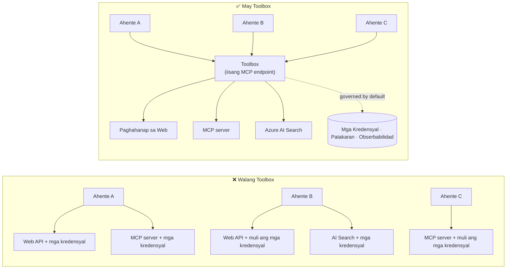

# Aralin 6: Microsoft Toolbox — Pinamamahalaang Mga Kasangkapan para sa mga Ahente

Sa pamamagitan ng [Lesson 5](../lesson-5-hosted-agents-production/README.md) ang iyong hosted agent ay tumatakbo sa
produksyon gamit ang storage at pamamahala na kinakailangan ng iyong organisasyon. Ngunit balikan ang
Lesson 4 agent: bawat kasangkapan ay **hardcoded** sa `main.py` — ang Microsoft Learn MCP URL, ang
file-search vector store, atbp. Gumagana iyon para sa isang ahente. Hindi ito **nasusukat** sa isang
organisasyon na may dosenang mga ahente at koponan.

Ipinapakilala ng araling ito ang **Microsoft Toolbox**: ang paraan ng Foundry upang hayaang magtakda ka ng isang piniling set ng
mga kasangkapan **isang beses lamang**, pamahalaan ang mga ito **sentralisado**, at ipakita ang mga ito sa anumang ahente sa pamamagitan ng isang **nagkakaisang,
pinamamahalaang endpoint**.

## Mga Layunin ng Pagkatuto

Sa pagtatapos ng araling ito, magagawa mong:

- Ipaliwanag ang problemang tool-sprawl na nilulutas ng Toolbox.
- Ilahad ang mga haligi ng **Build** at **Consume** at ang mga uri ng kasangkapan na maaaring lamanin ng toolbox.
- **Bumuo** ng bersyon ng toolbox gamit ang Foundry SDK.
- **Gamitin** ang toolbox mula sa isang Microsoft Agent Framework hosted agent sa pamamagitan ng isang MCP endpoint.
- Gamitin ang **versioning** upang maipadala ang mga pagbabago sa kasangkapan nang walang pagbabago sa code ng ahente o redeploys.
- Ipatupad ang **pamahalaan**: RBAC, credential injection, at guardrail (RAI) na mga patakaran.

---

## Mga Kinakailangan

1. Nakumpleto ang [Lesson 4](../lesson-4-agentdeployment/README.md) at ideal na
   [Lesson 5](../lesson-5-hosted-agents-production/README.md).
2. Isang **Microsoft Foundry** na proyekto na may pahintulot na lumikha at pamahalaan ang mga toolbox na resources.
3. **Azure CLI** na naka-authenticate: `az login`. Nangangailangan ang Foundry toolbox APIs ng
   `https://ai.azure.com/.default` na token scope (makikita sa code sa ibaba).
4. **Python 3.12+** na may naka-install na mga dependencies ng kurso (`pip install -r ../requirements.txt`).
5. Kasalukuyan, di-retired na deployment ng modelo (halimbawa `gpt-5.1`). Iwasan ang retired na GPT-4o / GPT-4.1.

---

## 1. Ang problema: tool sprawl

Isang ahente lang ay maaaring umasa sa maraming mga kasangkapan — REST APIs, MCP servers, connectors, at mga flow — bawat isa
ay may sarili nitong authentication model at may-ari na koponan. Habang lumalawak ka sa isang organisasyon:

- Muling ginagawa ng mga koponan ang **parehong mga kasangkapan** nang independiente.
- **Na-duplicate ang mga kredensyal** sa mga ahente at repos.
- Nagiging **hindi magkakatugma ang pamamahala** — bawat ahente ay nagpapatupad (o nakakalimot) ng patakaran nang sarili.
- Mayroong **kaunting visibility** sa kung anong mga kasangkapan ang umiiral o sino ang gumagamit sa mga ito.

Natitigil ang mga developer — hindi dahil hindi kaya ng mga modelo, kundi dahil ang **integrasyon ng kasangkapan ang nagiging hadlang**.




May infrastruktura na ang mga kumpanya — gateways, credential vaults, mga patakaran, observability.
Ang kulang ay isang karanasan para sa developer na binabalot ito sa isang bagay na **maaaring gamitin muli,
madiskubre, at awtomatikong pinamamahalaan**. Iyan ang Toolbox.

---

## 2. Ano ang Toolbox

Ang **Toolbox** ay isang **pinamamahalaang Foundry resource**. Itinakda mo ang isang piniling set ng mga kasangkapan isang beses lamang, pinamamahalaan
ito nang sentralisado sa Foundry, at ipinapakita ito sa pamamagitan ng **isang MCP-compatible na endpoint** na maaaring gamitin ng anumang
ahente. Sa panahon ng pagpapatakbo, ang platform ay humahawak ng **credential injection, token refresh, at
pagpapatupad ng patakaran ng kumpanya**.

Dahil ang toolbox ay isang pinamamahalaang resource, maaari kang magdagdag, mag-alis, o mag-reconfigure ng mga kasangkapan **nang walang
pagbabago sa code sa iyong ahente** — laging kumokonekta ang ahente sa parehong endpoint.

Saklaw ng Toolbox ang lifecycle ng kasangkapan sa pamamagitan ng apat na haligi; **Build** at **Consume** ay magagamit
ngayon:

| Haligi | Status | Ano ang pinapayagan |
|--------|--------|-----------------|
| **Build** | Magagamit ngayon | Piliin ang mga kasangkapan, i-configure ang authentication nang sentralisado, ilathala ang reusable na toolbox na maaaring gamitin ng anumang koponan. |
| **Consume** | Magagamit ngayon | Kumonekta sa anumang ahente sa isang MCP-compatible endpoint para dynamic na madiskubre at gamitin ang lahat ng kasangkapan sa toolbox. |

Bukas ang consumption surface: anumang MCP-compatible runtime o client ay maaaring gumamit ng toolbox —
Microsoft Agent Framework, LangGraph, GitHub Copilot, Claude Code, Microsoft Copilot Studio, o
sariling code.

### Mga uri ng kasangkapan na maaaring lamanin ng toolbox

Web Search · MCP · Azure AI Search · Code Interpreter · File Search · OpenAPI · **Agent-to-Agent
(A2A)** · Fabric IQ · Tool Search · Work IQ · Browser Automation · Mga skill reference, pati na rin ang isang
**Guardrail (RAI) policy** na inilalapat sa layer ng toolbox.

> **Tip:** Magdagdag ng `description` sa **bawat** kasangkapan upang makapili ang modelo ng tama. Pinapayagan ng toolbox
> ng maximum na **isang hindi pinangalanang kasangkapan bawat uri** — bigyan ng natatanging `name` ang bawat karagdagang instance ng parehong uri,
> kung hindi ay makatatanggap ka ng error na `invalid_payload`.

---

## 3. Bumuo ng toolbox

Ang mga toolbox ay pinamamahalaan gamit ang Foundry SDKs (Python/.NET/JavaScript), REST API, `azd`, at
**Microsoft Foundry Toolkit para sa VS Code**. Narito ang Python (`azure-ai-projects`) na pattern:

```python
from azure.identity import DefaultAzureCredential
from azure.ai.projects import AIProjectClient
from azure.ai.projects.models import MCPTool, ToolboxSearchPreviewTool, WebSearchTool

endpoint = "https://<your-foundry-account>.services.ai.azure.com/api/projects/<your-project>"
project = AIProjectClient(endpoint=endpoint, credential=DefaultAzureCredential())

toolbox_version = project.toolboxes.create_toolbox_version(
    name="agent-tools",
    description="Web search + an MCP server + tool search",
    tools=[
        WebSearchTool(),
        MCPTool(
            server_label="myserver",
            server_url="https://your-mcp-server.example.com",
            require_approval="never",
            project_connection_id="my-key-auth-connection",  # Ang mga kredensyal ay nasa Foundry
        ),
        ToolboxSearchPreviewTool(),
    ],
)
print(f"Created toolbox: {toolbox_version.name}, version: {toolbox_version.version}")
```

Pansinin kung ano ang **hindi** mo ginagawa: walang mga sekreto sa ahente. Hawak ng isang Foundry
**connection** (`project_connection_id`) ang mga kredensyal at ini-inject ng platform sa oras ng tawag.

> **Tala sa preview.** Ang **pamamahala** ng Toolbox (paglikha/pag-update ng mga bersyon) ay isang preview na kakayahan.
> Ang mga `project.toolboxes.*` na operasyon na ipinakita sa itaas ay kasama sa preview na builds ng SDK, REST API, `azd`,
> at ang **Foundry Toolkit para sa VS Code** — hindi ito kasama sa pinned na `azure-ai-projects` na ginagamit
> sa ibang bahagi ng kursong ito. Isaalang-alang ang snippet sa itaas bilang hugis ng hakbang ng Build; para sa
> path na click-through, lumikha ng toolbox sa **Foundry portal** o **Foundry Toolkit**. Ang
> hakbang na **Consume** sa ibaba ay gumagana sa pinned SDK ng kurso ngayon.

---

## 4. Gamitin ang toolbox mula sa iyong ahente

Nagpapakita ang toolbox ng **MCP endpoint**. May dalawang pattern:

| Papel | Endpoint | Kailan gagamitin |
|------|----------|-------------|
| **Tagagamit ng Toolbox** | `{project_endpoint}/toolboxes/{name}/mcp?api-version=v1` | Kumonekta ng mga ahente. Palaging nagsisilbi ng **default na bersyon**. |
| **Developer ng Toolbox** | `{project_endpoint}/toolboxes/{name}/versions/{version}/mcp?api-version=v1` | Subukan ang isang partikular na bersyon bago i-promote ito. |

> **Ikonekta ang mga ahente sa *consumer* endpoint.** Dahil palaging nagsisilbi ito ng default na bersyon, ikaw

> maaaring mag-promote ng mga bagong bersyon **nang hindi binabago ang agent code o nire-redeploy**.

### Pagsasama sa isang Microsoft Agent Framework hosted agent

Alalahanin na ang Lesson 4 agent ay nagdagdag ng isang hardcoded MCP tool gamit ang `client.get_mcp_tool(...)`. Sa
Toolbox, nakatuon ka sa **isang** `MCPStreamableHTTPTool` sa toolbox endpoint — at ang agent ay
nakakakuha ng **lahat** ng tool sa toolbox, pinamamahalaan nang sentralisado:

```python
import httpx
from azure.identity import DefaultAzureCredential, get_bearer_token_provider
from agent_framework import MCPStreamableHTTPTool

# Auth: Nangangailangan ang Foundry toolbox ng https://ai.azure.com/.default na saklaw
credential = DefaultAzureCredential()
token_provider = get_bearer_token_provider(credential, "https://ai.azure.com/.default")
http_client = httpx.AsyncClient(auth=_ToolboxAuth(token_provider), timeout=120.0)

TOOLBOX_ENDPOINT = os.environ["TOOLBOX_ENDPOINT"]  # platform-injected sa oras ng pagpapatakbo

mcp_tool = MCPStreamableHTTPTool(
    name="toolbox",
    url=TOOLBOX_ENDPOINT,
    http_client=http_client,
    load_prompts=False,
)

agent = chat_client.as_agent(
    name="my-toolbox-agent",
    instructions="You are a helpful assistant with access to Foundry toolbox tools.",
    tools=[mcp_tool],
)
```

Katugmang `.env` (pansinin: gamitin ang isang **kasalukuyang** modelo tulad ng `gpt-5.1`, **hindi** ang napalabas na
`gpt-4o`):

```env
FOUNDRY_PROJECT_ENDPOINT=https://<account>.services.ai.azure.com/api/projects/<project>
TOOLBOX_ENDPOINT=https://<account>.services.ai.azure.com/api/projects/<project>/toolboxes/agent-tools/mcp?api-version=v1
AZURE_AI_MODEL_DEPLOYMENT_NAME=gpt-5.1
```

> **Suriin muna.** Bago isaksak ang buong agent, ikonekta ang isang MCP client SDK (`pip install mcp`) sa
> **bersyon-partikular** na endpoint at ilista ang mga tool upang kumpirmahing naglo-load sila ayon sa inaasahan.

### Patakbuhin ang sample ng pag-consume

Ang araling ito ay may kasamang isang maaaring patakbuhin na sample sa panig ng consumer, [`toolbox_agent.py`](../../../lesson-6-toolbox/toolbox_agent.py). Ginagamit nito
ang parehong `FoundryChatClient.get_mcp_tool(...)` pattern na natutunan mo sa Lesson 2, ngunit itinuturo ang isang
MCP tool sa iyong **toolbox** endpoint — kaya ang agent ay nakakakuha ng bawat pinamamahalaang tool sa toolbox:

```bash
# Sa iyong .env, itakda ang TOOLBOX_ENDPOINT sa iyong toolbox consumer endpoint, pagkatapos:
python lesson-6-toolbox/toolbox_agent.py
```

Buksan ang naka-print na `http://localhost:8096` URL at magtanong ng isang tanong na gumagamit ng isa sa mga
tool ng iyong toolbox. Magdagdag o mag-upgrade ng isang tool sa toolbox at magtanong muli — **nang hindi binabago ang
code na ito** — upang makita ang sentralisadong pamamahala at pag-version sa aksyon.

---

## 5. Pag-version: ligtas na pagpapadala ng mga pagbabago sa tool

Ang pag-version ng Toolbox ay nagbibigay-daan sa iyo ng tahasang kontrol kung kailan magkakabisa ang mga pagbabago:

1. **Lumikha** ng bagong bersyon ng toolbox na may na-update na set ng tool.
2. **Subukan** ito laban sa bersyon-partikular (developer) endpoint.
3. **I-promote** ito bilang `default_version` kapag handa ka na.

Ang bawat agent na nakatuon sa **consumer** endpoint ay awtomatikong kumukuha ng na-promote na bersyon — **walang
pagbabago sa code, walang redeployment**. (Ang unang bersyon na iyong nilikha ay awtomatikong naipromote bilang default.)

Ito ang katumbas ng tool-governance ng blue/green deployment: sinusuri mo ang pagbabago nang hiwalay,
tapos pinapalitan mo ang default para sa lahat ng consumer nang sabay-sabay.

---

## 6. Pamamahala: paano pinapabuti ng Toolbox ang kontrol

Ang Toolbox ay **pinamamahalaan bilang default**. Narito ang mga levers ng pamamahala na dapat mong malaman:

- **RBAC.** Ibigay ang **Foundry User** role sa project sa bawat identidad: ang **developer** na
  namamahala sa toolbox versions, ang **managed identity ng agent** (para sa mga hosted agents na tumatawag ng mga tool sa runtime),
  at, para sa OAuth flows, ang **end user** na ang identidad ay pinu-proxy.
- **Sentralisadong kredensyal.** Ang mga kredensyal ng tool ay nakalagay sa Foundry **connections**, hindi sa code ng agent
  o `.env` files. Ang platform ang nag-iinjekta at nagre-refresh ng mga token sa runtime.
- **Guardrails (RAI policy).** Ikabit ang isang pinangalanang responsible-AI policy sa isang bersyon ng toolbox sa pamamagitan ng
  `policies.rai_config.rai_policy_name`. Ito ay tumatakbo sa **toolbox layer**, nakahiwalay mula sa anumang
  model-level content filter, sinusuri ang mga input at output ng tool.
- **Pag-apruba ng MCP.** Ang bawat tool ay may `require_approval` na kontrol kung kailangan ng MCP tool call ang apruba —
  ang parehong konsepto ng approval-workflow na nakita mo sa [Lesson 5 §7](../lesson-5-hosted-agents-production/README.md#7-hosted-mcp-tools--approval-workflows).
- **Pribadong networking.** Sinusuportahan ng Toolbox ang mga virtual-network configuration para sa mga enterprise na
  nagpapanatili ng trapiko sa loob ng kanilang network.
- **Visibility.** Dahil sentralisado ang katalogo ng mga tool, makakakuha ka ng imbentaryo ng kung ano ang
  umiiral at sino ang gumagamit nito.

---

## Mga praktikal na pagsasanay

1. **I-refactor ang Lesson 4.** Ang Lesson 4 agent ay hardcoded ang Microsoft Learn MCP tool. I-sketsa kung paano mo
   ililipat ang tool na iyon sa isang `agent-tools` toolbox at ituturo ang `main.py` sa toolbox consumer
   endpoint. Ano ang mga pagbabago sa `main.py`? Ano ang hindi na kailangang isama doon?
2. **Disenyo ng pagtaas ng bersyon.** Kailangan mong magdagdag ng isang Web Search tool sa isang live na toolbox na ginagamit ng limang
   agent. Ilarawan ang create → test → promote na sunud-sunod at ipaliwanag kung bakit hindi kailangang i-redeploy ang anumang isa sa limang agent.
3. **Piliin ang mga identidad ng auth.** Para sa isang hosted agent na tumatawag ng isang OAuth-based MCP tool sa pamamagitan ng
   toolbox, ilista kung aling mga identidad ang kailangan ng **Foundry User** role at bakit.
4. **Paglalagay ng guardrail.** Ipaliwanag ang pagkakaiba sa pagitan ng model-level content filter at isang
   toolbox guardrail, at magbigay ng isang senaryo kung saan partikular mong kailangan ang toolbox guardrail.


---

## Mga Sanggunian

- [Lumikha, subukan, at i-deploy ang isang toolbox sa Foundry](https://learn.microsoft.com/azure/foundry/agents/how-to/tools/toolbox)
- [Katalogo ng tool — Foundry Agent Service](https://learn.microsoft.com/azure/foundry/agents/concepts/tool-catalog)
- [Microsoft Agent Framework — Microsoft Foundry provider (tools)](https://learn.microsoft.com/agent-framework/agents/providers/microsoft-foundry)
- [Pangkalahatang-ideya ng Guardrails](https://learn.microsoft.com/azure/foundry/guardrails/guardrails-overview)
- [Magsimula sa Foundry sa VS Code (Foundry Toolkit)](https://learn.microsoft.com/azure/ai-foundry/how-to/develop/get-started-projects-vs-code)
- [Model Context Protocol](https://modelcontextprotocol.io/)

---

**Nuna:** [Lesson 5 — Production Hosted Agents](../lesson-5-hosted-agents-production/README.md)
&nbsp;·&nbsp; **Susunod:** [Lesson 7 — Multi-Agent & A2A](../lesson-7-multi-agent-a2a/README.md)

---

<!-- CO-OP TRANSLATOR DISCLAIMER START -->
**Pagtatanggi**:
Ang dokumentong ito ay isinalin gamit ang serbisyo ng AI translation na [Co-op Translator](https://github.com/Azure/co-op-translator). Bagama't nagsusumikap kami para sa katumpakan, pakatandaan na ang awtomatikong pagsasalin ay maaaring maglaman ng mga pagkakamali o hindi pagkakatugma. Ang orihinal na dokumento sa orihinal nitong wika ang dapat ituring na pangunahing sanggunian. Para sa mahahalagang impormasyon, inirerekomenda ang propesyonal na pagsasalin ng tao. Hindi kami mananagot sa anumang maling pagkakaintindi o maling interpretasyon na nagmula sa paggamit ng pagsasaling ito.
<!-- CO-OP TRANSLATOR DISCLAIMER END -->