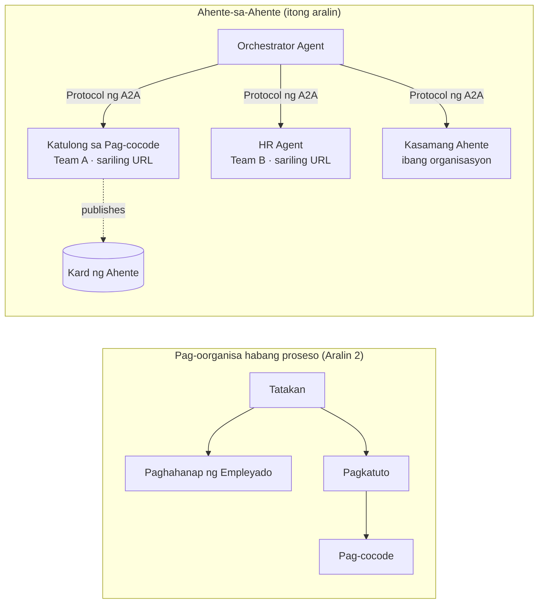

# Aralin 7: Multi-Agent Orchestration & Agent-to-Agent (A2A)

Sa [Aralin 6](../lesson-6-toolbox/README.md) nakagawa ka ng mga pinamamahalaang tools at mga host na ahente.
Ngunit bihira gamitin ang **isang** agent sa mga totoong sistema. Habang palalawakin mo ito, bubuuin mo ang **maraming** ahente — ilan ay iyo,
ilan ay pag-aari ng ibang mga koponan, at ang ilan ay nag-ooperate sa ibang mga organisasyon nang buo. Ang araling ito ay tungkol sa
kung paano nagtutulungan ang mga ahente.

Nakilala mo na ang isang uri ng multi-agent design sa
[Lesson 2's `agent-orchestration.py`](../lesson-2-agent-development/README.md): ang **handoff**
pattern, kung saan ang triage agent ay nagruruta sa mga espesyalista **sa loob ng isang proseso lang**. Ang araling ito ay
isang antas pa pataas — sa **Agent-to-Agent (A2A)**, ang bukas na protocol para sa mga ahenteng tumatakbo bilang mga independenteng
**networked services** at tumatawag sa isa't isa sa kabila ng mga hangganan ng proseso, koponan, at organisasyon.

## Mga Layunin sa Pagkatuto

Sa katapusan ng araling ito ay kaya mong:

- Ipaliwanag ang pagkakaiba ng **in-process orchestration** (handoff/workflows) at
  **Agent-to-Agent (A2A)** na komunikasyon, at piliin ang tamang paraan.
- Ilarawan ang mga A2A na pundasyon: **Agent Card**, **mga kasanayan**, **mga gawain**, at **pagkakatuklas**.
- **I-expose** ang isang Microsoft Agent Framework agent bilang isang A2A service gamit ang `A2AExecutor`.
- **Gamitin** ang isang remote na ahente bilang isang networked peer gamit ang `A2AAgent`.
- Ilapat ang mga pangangailangan ng enterprise sa A2A: **seguridad, pagkakakilanlan, pamamahala, observability, at gastos**.

---

## Mga Kinakailangan

1. Natapos ang [Lesson 2](../lesson-2-agent-development/README.md) (pagbuo at orchestration ng ahente).
2. Isang **Microsoft Foundry** project na may kasalukuyang deployment ng modelo (halimbawa `gpt-5.1`, at
   `gpt-5-codex` para sa coding sample). Iwasan ang retired GPT-4o / GPT-4.1.
3. **Azure CLI** na na-authenticate: `az login`.
4. **Python 3.12+** na may naka-install na mga dependencies ng kurso (`pip install -r ../requirements.txt`).
   Ang Aralin 7 ay nagdagdag ng preview na `agent-framework-a2a`, `a2a-sdk`, at `uvicorn` packages.
5. `FOUNDRY_PROJECT_ENDPOINT` at `FOUNDRY_MODEL` na naka-set sa iyong `.env` (tingnan ang README ng kurso).

---

## 1. Dalawang paraan kung paano nagtutulungan ang mga ahente

Walang iisang "multi-agent" pattern. Piliin ang naaangkop sa iyong **hangganan**:

| Pattern | Saan tumatakbo ang mga ahente | Paano sila kumokonekta | Gamitin kung kailan |
|---------|------------------------------|---------------------|--------------------|
| **Handoff / Workflow** (Lesson 2) | Isang proseso, isang codebase | In-memory graph (`HandoffBuilder`, `WorkflowBuilder`) | Ikaw ang may-ari ng lahat ng ahente at sabay-sabay mo silang ide-deploy. |
| **Agent-to-Agent (A2A)** (itong aralin) | Hiwa-hiwalay na services, hiwalay na lifecycle | Bukas na **A2A protocol** sa HTTP, natutuklasan sa pamamagitan ng **Agent Cards** | Ang mga ahente ay pag-aari ng iba't ibang koponan/organisasyon, independiyenteng nag-scale, o ginagamit ang iba't ibang frameworks. |

Ang Handoff ay tungkol sa **routing sa loob ng isang aplikasyon**. Ang A2A naman ay tungkol sa **pagsasama ng mga ahente bilang
mga independenteng serbisyo** — ang katumbas ng ahente ng paglipat mula sa function calls papunta sa microservices.



> **Sila ay nagsasama-sama.** Ang isang orchestrator na binuo mo gamit ang `HandoffBuilder` ay puwedeng magkaroon ng **remote A2A agents**
> bilang mga kalahok — in-process na routing papunta sa mga serbisyong tumatakbo kahit saan.

---

## 2. Ang mga pundasyon ng A2A

Ang A2A ay isang **bukas na protocol** (hindi lamang para sa Microsoft), kaya ang isang A2A agent ay maaaring gamitin ng Microsoft
Agent Framework, LangGraph, custom code, o teknolohiya mula sa ibang kumpanya. Apat na konsepto ang mahalaga:

- **Agent Card** — isang maliit na JSON na dokumento, na inilalathala sa
  `/.well-known/agent-card.json`, na nag-aanunsiyo ng **pangalan, paglalarawan, URL, bersyon,
  mga kasanayan, at kakayahan** ng ahente. Dito natutuklasan ng kliyente kung ano ang kaya ng remote na ahente.
- **Mga Kasanayan** — ang mga nilalahad na bagay na kaya ng ahente (`id`, `name`, `description`, `tags`,
  `examples`). Ginagamit ito ng mga kliyente (at modelo) upang magpasya kung tatawagin ito.
- **Mga Gawain** — ang tawag sa isang A2A agent ay isang **gawain** na may lifecycle (submitted → working →
  completed/failed). Minomonitor ng server ang mga gawain sa isang **task store**; sinusuportahan ang pa-stream na updates.
- **Pagkakatuklas** — ang isang kliyente na may URL lang ay kunin ang Agent Card at alam kung paano tatawagin ang ahente.

---

## 3. I-expose ang isang ahente bilang A2A service — `a2a_server.py`

Ang **Build/serve** side ay bumabalot sa anumang Microsoft Agent Framework agent gamit ang `A2AExecutor` at ini-mount ito
sa isang A2A HTTP application. Tingnan ang [`a2a_server.py`](../../../lesson-7-multi-agent-a2a/a2a_server.py). Ang pangunahing wiring:

```python
from agent_framework.a2a import A2AExecutor
from a2a.server.apps import A2AStarletteApplication
from a2a.server.request_handlers import DefaultRequestHandler
from a2a.server.tasks import InMemoryTaskStore
from a2a.types import AgentCapabilities, AgentCard, AgentSkill

agent = client.as_agent(name="coding-assistant", instructions="...")

agent_card = AgentCard(
    name="Coding Assistant",
    description="Generates runnable code samples...",
    url="http://localhost:9000/",
    version="1.0.0",
    capabilities=AgentCapabilities(streaming=True),
    default_input_modes=["text"],
    default_output_modes=["text"],
    skills=[AgentSkill(id="generate-code", name="Generate code",
                       description="Write a runnable code snippet.", tags=["code"])],
)

request_handler = DefaultRequestHandler(
    agent_executor=A2AExecutor(agent),
    task_store=InMemoryTaskStore(),
)
app = A2AStarletteApplication(agent_card=agent_card, http_handler=request_handler).build()
# inihain gamit ang uvicorn sa port 9000
```

Pansinin na ang code ng ahente ay **hindi nagbabago** — inaangkop ng `A2AExecutor` ang kasalukuyan mong ahente sa protocol.
Ang Agent Card ang siyang nagpapadiskubre nito sa anumang A2A kliyente.

---

## 4. Gamitin ang isang remote agent — `a2a_client.py`

Ang **Consume** side ay kumokonekta sa remote agent **sa pamamagitan ng URL**, kinukuha ang Agent Card nito, at tinatawagan ito
na parang lokal na ahente lang. Tingnan ang [`a2a_client.py`](../../../lesson-7-multi-agent-a2a/a2a_client.py):

```python
from agent_framework.a2a import A2AAgent

remote_agent = A2AAgent(name="remote-coding-assistant", url="http://localhost:9000")
result = await remote_agent.run("Write a Python function that reverses a string.")
print(result.text)
```

Iyan ang buong punto ng A2A: mula sa panig ng tumatawag, ang remote agent ay kumikilos na parang anumang ibang
`agent_framework` agent, kaya puwede mo itong isabit sa workflow o i-handoff sa kanya — kahit na ito ay tumatakbo
sa ibang proseso, sa ibang makina, at pag-aari ng ibang koponan.

### Patakbuhin ito mula simula hanggang dulo

```bash
# Terminal 1 — simulan ang serbisyo ng A2A
python a2a_server.py

# Terminal 2 — tawagin ito
python a2a_client.py "Write a Python function that reverses a string."
```

Makikita mo ang tugon ng coding assistant na dumating sa pamamagitan ng A2A protocol. Buksan ang
`http://localhost:9000/.well-known/agent-card.json` sa browser upang makita ang inilathalang Agent Card.

---

## 5. Mga pangangailangan sa enterprise

Ang paggawa ng mga ahente bilang mga networked services ay nagdadala ng parehong mga isyu tulad ng anumang distributed system —
dagdag pa ang ilang partikular sa AI:

- **Pagkakakilanlan at pagpapatunay.** Huwag kailanman i-expose ang A2A agent nang walang authentication. Nagdadala ang Agent Card ng
  `security` / `security_schemes`, at tinatanggap ng `A2AAgent` ang `auth_interceptor` para mapalaganap ng mga tumatawag
  ang credentials (OAuth bearer tokens, API keys). Gamitin ang Entra ID / managed identities para sa
  service-to-service auth sa produksiyon; ilagay ang serbisyo sa likod ng isang gateway.
- **Pamamahala.** Pagsamahin ang A2A sa [Lesson 6's Toolbox](../lesson-6-toolbox/README.md): ang isang remote
  ahente ay maaaring i-publish bilang isang **A2A na tool** sa loob ng isang pinamamahalaang toolbox kaya umiiral ang RBAC, credential injection,
  at guardrail policies nang sentralisado.
- **Observability.** Ang request ay dumadaan na sa mga hangganan ng proseso, kaya ipasa ang tracing sa tawag.
  Paganahin ang [Foundry Observability / OpenTelemetry](../lesson-3-agent-evals/README.md) sa **parehong**
  orchestrator at bawat remote agent upang magkaroon ka ng isang end-to-end na trace.
- **Pagbbersyon.** May `version` ang Agent Card. Tratuhin ito tulad ng API: ligtas ang mga additive na pagbabago;
  ang pagbasag sa kontrata ng isang kasanayan ay nangangailangan ng bagong bersyon at panahon ng migration para sa mga gumagamit.
- **Pagkakatiwalaan.** Ang mga remote agents ay pwedeng mabigo ng paisa-isa. Mag-set ng timeouts (`A2AAgent(timeout=...)`), pangasiwaan ang
  parte ng pagkabigo, at huwag hayaang ang isang mabagal na peer ang pumigil sa buong orchestration.
- **Gastos.** Bawat tawag sa remote agent ay kanya-kanyang model invocation. Ang fan-out ay nagpaparami sa token spend —
  maglaan ng budget para dito, at mas piliin ang pag-ruruta sa **isang** pinakamahusay na agent kaysa mag-broadcast sa marami.

---

## Mga praktikal na pagsasanay

1. **Magdagdag ng pangalawang serbisyo.** Kopyahin ang `a2a_server.py` para i-expose ang ahente na **employee-search** sa port
   9001 na may sarili nitong Agent Card at mga kasanayan. Patakbuhin ang dalawa, at hayaang tawagan ng kliyente ang bawat isa.
2. **I-orchestrate ang mga remote na kalahok.** Bumuo ng maliit na `HandoffBuilder` (o simpleng router) na ang mga kalahok
   ay kabilang ang dalawang `A2AAgent` na nakaturo sa iyong dalawang serbisyo. I-route ang query sa tamang ahente.
3. **I-secure ito.** Magdagdag ng `auth_interceptor` sa kliyente at i-require ang bearer token sa server.
   Ano ang masisira kung walang token? Saan mo itatago ang token sa produksiyon?
4. **Handoff vs A2A.** Sumulat ng dalawang maikling talata: kailan mo itatago ang handoff na in-process ng Lesson 2,
   at kailan pangangailangan ang dagdag na komplikasyon ng A2A? Magbigay ng kongkretong halimbawa ng bawat isa.

---

## Mga Sanggunian

- [Agent-to-Agent (A2A) — Microsoft Agent Framework](https://learn.microsoft.com/agent-framework/user-guide/agent-orchestration/a2a)
- [Multi-agent orchestration — Microsoft Agent Framework](https://learn.microsoft.com/agent-framework/user-guide/agent-orchestration/)
- [A2A protocol specification](https://a2a-protocol.org/)
- [A2A Python SDK (`a2a-sdk`)](https://github.com/a2aproject/a2a-python)
- [Foundry Agent Service — multi-agent patterns](https://learn.microsoft.com/azure/ai-foundry/agents/concepts/connected-agents)

---

**Nakaraan:** [Lesson 6 — Microsoft Toolbox](../lesson-6-toolbox/README.md)

---

<!-- CO-OP TRANSLATOR DISCLAIMER START -->
**Pagtatanggi**:
Ang dokumentong ito ay isinalin gamit ang serbisyo ng AI translation na [Co-op Translator](https://github.com/Azure/co-op-translator). Bagama't nagsusumikap kami para sa katumpakan, pakatandaan na ang awtomatikong pagsasalin ay maaaring maglaman ng mga pagkakamali o hindi pagkakatugma. Ang orihinal na dokumento sa orihinal nitong wika ang dapat ituring na pangunahing sanggunian. Para sa mahahalagang impormasyon, inirerekomenda ang propesyonal na pagsasalin ng tao. Hindi kami mananagot sa anumang maling pagkakaintindi o maling interpretasyon na nagmula sa paggamit ng pagsasaling ito.
<!-- CO-OP TRANSLATOR DISCLAIMER END -->