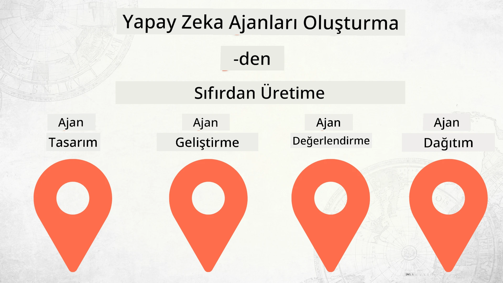

# Yapay Zeka Ajanlarını Baştan Üretime Kadar İnşa Etmek



### 🌐 Çok Dilli Destek

#### GitHub Action ile Desteklenmektedir (Otomatik & Her Zaman Güncel)

<!-- CO-OP TRANSLATOR LANGUAGES TABLE START -->
[Arapça](../ar/README.md) | [Bengalce](../bn/README.md) | [Bulgarca](../bg/README.md) | [Burma (Myanmar)](../my/README.md) | [Çince (Basitleştirilmiş)](../zh-CN/README.md) | [Çince (Geleneksel, Hong Kong)](../zh-HK/README.md) | [Çince (Geleneksel, Makao)](../zh-MO/README.md) | [Çince (Geleneksel, Tayvan)](../zh-TW/README.md) | [Hırvatça](../hr/README.md) | [Çekçe](../cs/README.md) | [Danca](../da/README.md) | [Flemenkçe](../nl/README.md) | [Estonca](../et/README.md) | [Fince](../fi/README.md) | [Fransızca](../fr/README.md) | [Almanca](../de/README.md) | [Yunanca](../el/README.md) | [İbranice](../he/README.md) | [Hintçe](../hi/README.md) | [Macarca](../hu/README.md) | [Endonezce](../id/README.md) | [İtalyanca](../it/README.md) | [Japonca](../ja/README.md) | [Kannada](../kn/README.md) | [Korece](../ko/README.md) | [Litvanca](../lt/README.md) | [Malayca](../ms/README.md) | [Malayalamca](../ml/README.md) | [Marathice](../mr/README.md) | [Nepalce](../ne/README.md) | [Nijerya Pidgin](../pcm/README.md) | [Norveççe](../no/README.md) | [Farsça (Persian)](../fa/README.md) | [Lehçe](../pl/README.md) | [Portekizce (Brezilya)](../pt-BR/README.md) | [Portekizce (Portekiz)](../pt-PT/README.md) | [Pencapça (Gurmukhi)](../pa/README.md) | [Romence](../ro/README.md) | [Rusça](../ru/README.md) | [Sırpça (Kirilik)](../sr/README.md) | [Slovakça](../sk/README.md) | [Slovence](../sl/README.md) | [İspanyolca](../es/README.md) | [Svahili](../sw/README.md) | [İsveççe](../sv/README.md) | [Tagalog (Filipince)](../tl/README.md) | [Tamilce](../ta/README.md) | [Telugu](../te/README.md) | [Tayca](../th/README.md) | [Türkçe](./README.md) | [Ukraynaca](../uk/README.md) | [Urduca](../ur/README.md) | [Vietnamca](../vi/README.md)

> **Yerel Olarak Klonlamayı Tercih Ediyor Musunuz?**

> Bu depo 50+ dil çevirisi içerir ve bu da indirme boyutunu önemli ölçüde artırır. Çeviriler olmadan klonlamak için, spars checkout kullanın:
> ```bash
> git clone --filter=blob:none --sparse https://github.com/microsoft/Building-AI-Agents-From-Zero-To-Production.git
> cd Building-AI-Agents-From-Zero-To-Production
> git sparse-checkout set --no-cone '/*' '!translations' '!translated_images'
> ```
> Bu, kursu tamamlamak için ihtiyacınız olan her şeyi çok daha hızlı bir indirme ile sağlar.
<!-- CO-OP TRANSLATOR LANGUAGES TABLE END -->

## AI Ajan Geliştirme Yaşam Döngüsünün Temellerini Öğreten Bir Kurs

[](https://github.com/microsoft/Building-AI-Agents-From-Zero-To-Production/blob/master/LICENSE?WT.mc_id=academic-105485-koreyst)
[](https://GitHub.com/microsoft/Building-AI-Agents-From-Zero-To-Production/graphs/contributors/?WT.mc_id=academic-105485-koreyst)
[](https://GitHub.com/microsoft/Building-AI-Agents-From-Zero-To-Production/issues/?WT.mc_id=academic-105485-koreyst)
[](https://GitHub.com/microsoft/Building-AI-Agents-From-Zero-To-Production/pulls/?WT.mc_id=academic-105485-koreyst)
[](http://makeapullrequest.com?WT.mc_id=academic-105485-koreyst)

[](https://discord.gg/Kuaw3ktsu6)

## 🌱 Başlarken

Bu kurs, Yapay Zeka Ajanları oluşturmanın ve dağıtmanın temellerini kapsayan derslere sahiptir.

Her ders bir öncekine dayanır, bu yüzden başlangıçtan başlayıp sona kadar devam etmenizi öneririz.

AI Ajan konuları hakkında daha fazla keşfetmek isterseniz, [Başlangıç Seviyesi AI Ajanları Kursu](https://aka.ms/ai-agents-beginners)'na göz atabilirsiniz.

### Diğer Öğrenenlerle Tanışın, Sorularınıza Yanıt Alın

Yapay Zeka Ajanları oluşturma konusunda takılırsanız ya da sorularınız olursa, özel Discord Kanalımıza katılabilirsiniz: [Microsoft Foundry Discord](https://discord.gg/Kuaw3ktsu6).

### İhtiyacınız Olanlar

Her dersin, yerel olarak çalıştırabileceğiniz kendi kod örneği vardır. Kendi kopyanızı oluşturmak için [bu depoyu fork edebilirsiniz](https://github.com/microsoft/Building-AI-Agents-From-Zero-To-Production/fork).

Bu kurs şu anda şunları kullanmaktadır:

- [Microsoft Agent Framework (MAF)](https://aka.ms/ai-agents-beginners/agent-framework)
- [Microsoft Foundry](https://azure.microsoft.com/products/ai-foundry)
- [Azure OpenAI Hizmeti](https://azure.microsoft.com/products/ai-foundry/models/openai)
- [Azure CLI](https://learn.microsoft.com/cli/azure/authenticate-azure-cli?view=azure-cli-latest)

Başlamadan önce bu hizmetlere erişiminiz olduğundan emin olun.

Model barındırma ve hizmetlerle ilgili daha fazla seçenek yakında geliyor.

## 🗃️ Dersler

| **Ders**             | **Açıklama**                                                                                   |
|----------------------|------------------------------------------------------------------------------------------------|
| [Ajan Tasarımı](./lesson-1-agent-design/README.md)           | "Geliştirici Onboarding" Ajan Kullanım Durumuna giriş ve etkili ajanlar tasarlama                |
| [Ajan Geliştirme](./lesson-2-agent-development/README.md)     | Microsoft Agent Framework (MAF) kullanarak, yeni geliştiricilerin onboard olmasına yardımcı olacak 3 ajan oluşturma  |
| [Ajan Değerlendirmeleri](./lesson-3-agent-evals/README.md)    | Microsoft Foundry kullanarak AI Ajanlarımızın performansını değerlendirme ve geliştirme yollarını bulma  |
| [Ajan Dağıtımı](./lesson-4-agent-deployment/README.md)        | Barındırılan Ajanlar ve OpenAI Chatkit kullanarak AI Ajanını üretime nasıl dağıtacağınızı öğrenme  |


## 🎒 Diğer Kurslar

Ekibimiz başka kurslar da üretiyor! Göz atın:

<!-- CO-OP TRANSLATOR OTHER COURSES START -->
### LangChain
[](https://aka.ms/langchain4j-for-beginners)
[](https://aka.ms/langchainjs-for-beginners?WT.mc_id=m365-94501-dwahlin)
[](https://github.com/microsoft/langchain-for-beginners?WT.mc_id=m365-94501-dwahlin)
---

### Azure / Edge / MCP / Ajanlar
[](https://github.com/microsoft/AZD-for-beginners?WT.mc_id=academic-105485-koreyst)
[](https://github.com/microsoft/edgeai-for-beginners?WT.mc_id=academic-105485-koreyst)
[](https://github.com/microsoft/mcp-for-beginners?WT.mc_id=academic-105485-koreyst)
[](https://github.com/microsoft/ai-agents-for-beginners?WT.mc_id=academic-105485-koreyst)

---
 
### Üretken AI Serisi
[](https://github.com/microsoft/generative-ai-for-beginners?WT.mc_id=academic-105485-koreyst)
[-9333EA?style=for-the-badge&labelColor=E5E7EB&color=9333EA)](https://github.com/microsoft/Generative-AI-for-beginners-dotnet?WT.mc_id=academic-105485-koreyst)
[-C084FC?style=for-the-badge&labelColor=E5E7EB&color=C084FC)](https://github.com/microsoft/generative-ai-for-beginners-java?WT.mc_id=academic-105485-koreyst)
[-E879F9?style=for-the-badge&labelColor=E5E7EB&color=E879F9)](https://github.com/microsoft/generative-ai-with-javascript?WT.mc_id=academic-105485-koreyst)

---
 
### Temel Öğrenme
[](https://aka.ms/ml-beginners?WT.mc_id=academic-105485-koreyst)
[](https://aka.ms/datascience-beginners?WT.mc_id=academic-105485-koreyst)
[](https://aka.ms/ai-beginners?WT.mc_id=academic-105485-koreyst)
[](https://github.com/microsoft/Security-101?WT.mc_id=academic-96948-sayoung)
[](https://aka.ms/webdev-beginners?WT.mc_id=academic-105485-koreyst)
[](https://aka.ms/iot-beginners?WT.mc_id=academic-105485-koreyst)
[](https://github.com/microsoft/xr-development-for-beginners?WT.mc_id=academic-105485-koreyst)

---
 
### Copilot Serisi
[](https://aka.ms/GitHubCopilotAI?WT.mc_id=academic-105485-koreyst)
[](https://github.com/microsoft/mastering-github-copilot-for-dotnet-csharp-developers?WT.mc_id=academic-105485-koreyst)
[](https://github.com/microsoft/CopilotAdventures?WT.mc_id=academic-105485-koreyst)
<!-- CO-OP TRANSLATOR OTHER COURSES END -->

## Katkıda Bulunma

Bu proje katkılara ve önerilere açıktır. Çoğu katkı için, katkılarınızı kullanma haklarına sahip olduğunuzu ve bunları gerçekten bize verdiğinizi beyan eden bir Katkıda Bulunma Lisans Sözleşmesi'ni (CLA) kabul etmeniz gerekir. Ayrıntılar için <https://cla.opensource.microsoft.com> adresini ziyaret edin.

Bir çekme isteği gönderdiğinizde, bir CLA botu otomatik olarak bir CLA sağlamanız gerekip gerekmediğini belirleyecek ve PR'yi uygun şekilde (örneğin, durum kontrolü, yorum) süsleyecektir. Botun verdiği talimatları izleyin. Tüm depolar için bu işlemi yalnızca bir kez yapmanız yeterlidir.

Bu proje, [Microsoft Açık Kaynak Davranış Kuralları](https://opensource.microsoft.com/codeofconduct/)nu benimsemiştir.
Daha fazla bilgi için [Davranış Kuralları SSS](https://opensource.microsoft.com/codeofconduct/faq/) bölümüne bakabilir veya ek sorularınız veya yorumlarınız için [opencode@microsoft.com](mailto:opencode@microsoft.com) adresiyle iletişime geçebilirsiniz.

## Ticari Markalar

Bu proje, projeler, ürünler veya hizmetler için ticari markalar veya logolar içerebilir. Microsoft ticari markalarının veya logolarının yetkili kullanımı,
[Microsoft'un Ticari Marka ve Marka Kılavuzları](https://www.microsoft.com/legal/intellectualproperty/trademarks/usage/general) kapsamında olmalı ve bunlara uymalıdır.
Microsoft ticari markalarının veya logolarının bu projenin değiştirilmiş sürümlerinde kullanımı, kafa karışıklığına neden olmamalı veya Microsoft sponsorluk izlenimi vermemelidir.
Üçüncü taraf ticari markalarının veya logolarının kullanımı, ilgili üçüncü tarafların politikalarına tabidir.

## Yardım Alma

Takılırsanız veya AI uygulamaları geliştirmekle ilgili herhangi bir sorunuz olursa, katılın:

[](https://discord.gg/Kuaw3ktsu6)

Ürün geri bildiriminiz veya yapım sırasında hatalarınız varsa ziyaret edin:

[](https://aka.ms/foundry/forum)

---

<!-- CO-OP TRANSLATOR DISCLAIMER START -->
**Feragatname**:
Bu belge, AI çeviri hizmeti [Co-op Translator](https://github.com/Azure/co-op-translator) kullanılarak çevrilmiştir. Doğruluk için çaba gösterilse de, otomatik çevirilerin hata veya yanlışlıklar içerebileceğini lütfen unutmayınız. Orijinal belge, kendi diliyle yetkili kaynak olarak kabul edilmelidir. Kritik bilgiler için profesyonel insan çevirisi önerilmektedir. Bu çevirinin kullanımı sonucunda oluşabilecek yanlış anlamalar veya yanlış yorumlamalardan sorumlu tutulamayız.
<!-- CO-OP TRANSLATOR DISCLAIMER END -->