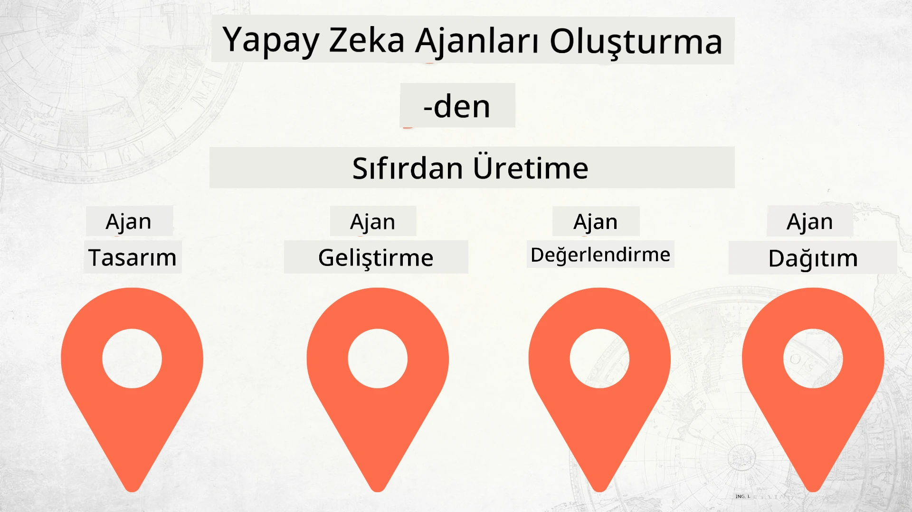

# Sıfırdan Üretime Yapay Zeka Ajanları İnşa Etme



### 🌐 Çok Dilli Destek

#### GitHub Action ile Desteklenmektedir (Otomatik ve Her Zaman Güncel)

<!-- CO-OP TRANSLATOR LANGUAGES TABLE START -->
[Arapça](../ar/README.md) | [Bengalce](../bn/README.md) | [Bulgarca](../bg/README.md) | [Burma (Myanmar)](../my/README.md) | [Çince (Basitleştirilmiş)](../zh-CN/README.md) | [Çince (Geleneksel, Hong Kong)](../zh-HK/README.md) | [Çince (Geleneksel, Macau)](../zh-MO/README.md) | [Çince (Geleneksel, Tayvan)](../zh-TW/README.md) | [Hırvatça](../hr/README.md) | [Çekçe](../cs/README.md) | [Danca](../da/README.md) | [Flemenkçe](../nl/README.md) | [Estonca](../et/README.md) | [Fince](../fi/README.md) | [Fransızca](../fr/README.md) | [Almanca](../de/README.md) | [Yunanca](../el/README.md) | [İbranice](../he/README.md) | [Hintçe](../hi/README.md) | [Macarca](../hu/README.md) | [Endonezce](../id/README.md) | [İtalyanca](../it/README.md) | [Japonca](../ja/README.md) | [Kannada](../kn/README.md) | [Kmerce](../km/README.md) | [Korece](../ko/README.md) | [Litvanca](../lt/README.md) | [Malayca](../ms/README.md) | [Malayalamca](../ml/README.md) | [Marathi](../mr/README.md) | [Nepalce](../ne/README.md) | [Nijerya Pidgin](../pcm/README.md) | [Norveççe](../no/README.md) | [Farsça (Persçe)](../fa/README.md) | [Lehçe](../pl/README.md) | [Portekizce (Brezilya)](../pt-BR/README.md) | [Portekizce (Portekiz)](../pt-PT/README.md) | [Pencapça (Gurmukhi)](../pa/README.md) | [Rumence](../ro/README.md) | [Rusça](../ru/README.md) | [Sırpça (Kiril)](../sr/README.md) | [Slovakça](../sk/README.md) | [Slovence](../sl/README.md) | [İspanyolca](../es/README.md) | [Svahili](../sw/README.md) | [İsveççe](../sv/README.md) | [Tagalog (Filipince)](../tl/README.md) | [Tamilce](../ta/README.md) | [Telugu](../te/README.md) | [Tayca](../th/README.md) | [Türkçe](./README.md) | [Ukraynaca](../uk/README.md) | [Urduca](../ur/README.md) | [Vietnamca](../vi/README.md)

> **Yerinde Klonlamayı mı Tercih Ediyorsunuz?**
>
> Bu depo 50’den fazla dil çevirisi içerir ve bu da indirme boyutunu önemli ölçüde artırır. Çeviriler olmadan klonlamak için, azalmış çekme kullanabilirsiniz:
>
> **Bash / macOS / Linux:**
> ```bash
> git clone --filter=blob:none --sparse https://github.com/microsoft/Building-AI-Agents-From-Zero-To-Production.git
> cd Building-AI-Agents-From-Zero-To-Production
> git sparse-checkout set --no-cone '/*' '!translations' '!translated_images'
> ```
>
> **CMD (Windows):**
> ```cmd
> git clone --filter=blob:none --sparse https://github.com/microsoft/Building-AI-Agents-From-Zero-To-Production.git
> cd Building-AI-Agents-From-Zero-To-Production
> git sparse-checkout set --no-cone "/*" "!translations" "!translated_images"
> ```
>
> Bu, kursu tamamlamak için gereken her şeyi çok daha hızlı indirme ile sağlar.
<!-- CO-OP TRANSLATOR LANGUAGES TABLE END -->

## Yapay Zeka Ajanı Geliştirme Yaşam Döngüsünün Temellerini Öğreten Bir Kurs

[](https://github.com/microsoft/Building-AI-Agents-From-Zero-To-Production/blob/master/LICENSE?WT.mc_id=academic-105485-koreyst)
[](https://GitHub.com/microsoft/Building-AI-Agents-From-Zero-To-Production/graphs/contributors/?WT.mc_id=academic-105485-koreyst)
[](https://GitHub.com/microsoft/Building-AI-Agents-From-Zero-To-Production/issues/?WT.mc_id=academic-105485-koreyst)
[](https://GitHub.com/microsoft/Building-AI-Agents-From-Zero-To-Production/pulls/?WT.mc_id=academic-105485-koreyst)
[](http://makeapullrequest.com?WT.mc_id=academic-105485-koreyst)

[](https://discord.gg/Kuaw3ktsu6)

## 🌱 Başlangıç

Bu kurs, Yapay Zeka Ajanları'nı oluşturmanın ve konuşlandırmanın temellerini içeren dersler içerir.

Her ders bir öncekine dayandığından, başlangıçtan başlayıp sona kadar ilerlemenizi öneriyoruz.

Yapay Zeka Ajanı konularını daha fazla keşfetmek isterseniz, [Yeni Başlayanlar için Yapay Zeka Ajanları Kursu](https://aka.ms/ai-agents-beginners) inceleyebilirsiniz.

### Diğer Öğrencilerle Tanışın, Sorularınıza Cevap Alın

Takıldığınızda veya Yapay Zeka Ajanları oluşturmayla ilgili herhangi bir sorunuz olduğunda, [Microsoft Foundry Discord](https://discord.gg/Kuaw3ktsu6) içindeki özel Discord Kanalımıza katılın.

### İhtiyacınız Olanlar


Her Ders'in yerel olarak çalıştırabileceğiniz kendi kod örneği vardır. Kendi kopyanızı oluşturmak için [bu depoyu çatallayabilirsiniz](https://github.com/microsoft/Building-AI-Agents-From-Zero-To-Production/fork).

Bu kurs şu anda şunları kullanmaktadır:

- [Microsoft Agent Framework (MAF)](https://aka.ms/ai-agents-beginners/agent-framework)
- [Microsoft Foundry](https://azure.microsoft.com/products/ai-foundry) — dağıtılmış **GPT-5 serisi** modeli içeren bir proje (örneğin `gpt-5.1`). Emekli olan GPT-4o / GPT-4.1 modellerini **kullanmamalısınız**.
- [Azure OpenAI Service](https://azure.microsoft.com/products/ai-foundry/models/openai)
- [Azure CLI](https://learn.microsoft.com/cli/azure/authenticate-azure-cli?view=azure-cli-latest) — herhangi bir örnek çalıştırmadan önce `az login` ile giriş yapın
- **Python 3.12 veya üzeri**

Başlamadan önce bu hizmetlere erişiminizin olduğundan emin olun.

> **💰 Maliyet ve temizlik.** Uygulamalı dersler gerçek Azure kaynakları oluşturur — bir Microsoft Foundry
> projesi, bir model dağıtımı, bir vektör deposu ve (Dersler 4–6'da) barındırılan ajanlar ve araç kutuları.
> Bunlar var oldukları sürece maliyet oluşturabilir. Bir dersi — veya kursu — bitirdiğinizde artık ihtiyaç duymadığınız
> kaynakları silin. En basit yaklaşım her şeyi özel bir kaynak grubuna koymak ve işiniz bittiğinde tüm grubu silmektir:
>
>
> ```bash
> az group delete --name <your-resource-group> --yes --no-wait
> ```
>
> Ayrıca Foundry portalından bireysel ajanları, vektör depolarını ve araç kutularını da silebilirsiniz.

> **Model hakkında not.** Bu kurs tüm modelleri **Microsoft Foundry** üzerinden sunar. *GitHub Modelleri* kullanılmaz,
> çünkü bu modeller **30 Temmuz 2026**'da emekli olacak — Microsoft Foundry resmi geçiş yoludur. Önceki kodlarınız
> GitHub Modellerini çağırıyorsa, bunları Foundry model dağıtımına yönlendirin.


## 🗃️ Dersler

| **Ders**         | **Açıklama**                                                                                  |
|--------------------|--------------------------------------------------------------------------------------------------|
| [Ajan Tasarımı](./lesson-1-agent-design/README.md)       | "Geliştirici Onboarding" Ajan Kullanım Durumu ve etkili ajan tasarımına giriş  |
| [Ajan Geliştirme](./lesson-2-agent-development/README.md)  | Microsoft Agent Framework (MAF) kullanarak yeni geliştiricilerin onboarding'ine yardımcı özel ajanlar oluşturma.       |
| [Ajan Değerlendirmeleri](./lesson-3-agent-evals/README.md)  | Microsoft Foundry kullanarak AI Ajanlarımızın performansını değerlendirme ve iyileştirme yöntemlerini öğrenme. |
| [Ajan Dağıtımı](./lesson-4-agentdeployment/README.md)   | Microsoft Foundry barındırılan ajanlar ve OpenAI ChatKit kullanarak bir AI Ajanını üretime dağıtma.       |
| [Prodüksiyon Barındırılan Ajanlar](./lesson-5-hosted-agents-production/README.md)   | Barındırılan bir ajanı kurumsal üretime taşıma: Barındırılan Ajanlar vs Kapasite Hostları, kendi depolamanızı, hafızanızı ve yönetiminizi getirin.       |
| [Microsoft Araç Kutusu](./lesson-6-toolbox/README.md)   | Araçları bir kez tanımlayın ve merkezi olarak yönetin: bir araç kutusu oluşturun, bir MCP uç noktası üzerinden ajandan tüketin ve araçları güvenli şekilde sürümleyin.       |
| [Çoklu Ajan & A2A](./lesson-7-multi-agent-a2a/README.md)   | Ajanları ağ hizmetleri olarak bileşenleştirin: bir ajanı açık Agent-to-Agent (A2A) protokolüyle sunun ve uzak bir ajanı eş olarak tüketin.       |


## 🎒 Diğer Kurslar

Ekibimiz başka kurslar da üretiyor! Göz atın:

<!-- CO-OP TRANSLATOR OTHER COURSES START -->
### LangChain
[](https://aka.ms/langchain4j-for-beginners)
[](https://aka.ms/langchainjs-for-beginners?WT.mc_id=m365-94501-dwahlin)
[](https://github.com/microsoft/langchain-for-beginners?WT.mc_id=m365-94501-dwahlin)
---

### Azure / Edge / MCP / Ajanlar
[](https://github.com/microsoft/AZD-for-beginners?WT.mc_id=academic-105485-koreyst)
[](https://github.com/microsoft/edgeai-for-beginners?WT.mc_id=academic-105485-koreyst)
[](https://github.com/microsoft/mcp-for-beginners?WT.mc_id=academic-105485-koreyst)
[](https://github.com/microsoft/ai-agents-for-beginners?WT.mc_id=academic-105485-koreyst)

---
 
### Üretken AI Serisi

[](https://github.com/microsoft/generative-ai-for-beginners?WT.mc_id=academic-105485-koreyst)
[-9333EA?style=for-the-badge&labelColor=E5E7EB&color=9333EA)](https://github.com/microsoft/Generative-AI-for-beginners-dotnet?WT.mc_id=academic-105485-koreyst)
[-C084FC?style=for-the-badge&labelColor=E5E7EB&color=C084FC)](https://github.com/microsoft/generative-ai-for-beginners-java?WT.mc_id=academic-105485-koreyst)
[-E879F9?style=for-the-badge&labelColor=E5E7EB&color=E879F9)](https://github.com/microsoft/generative-ai-with-javascript?WT.mc_id=academic-105485-koreyst)

---
 
### Temel Öğrenme
[](https://aka.ms/ml-beginners?WT.mc_id=academic-105485-koreyst)
[](https://aka.ms/datascience-beginners?WT.mc_id=academic-105485-koreyst)
[](https://aka.ms/ai-beginners?WT.mc_id=academic-105485-koreyst)
[](https://github.com/microsoft/Security-101?WT.mc_id=academic-96948-sayoung)
[](https://aka.ms/webdev-beginners?WT.mc_id=academic-105485-koreyst)
[](https://aka.ms/iot-beginners?WT.mc_id=academic-105485-koreyst)
[](https://github.com/microsoft/xr-development-for-beginners?WT.mc_id=academic-105485-koreyst)

---
 
### Copilot Serisi
[](https://aka.ms/GitHubCopilotAI?WT.mc_id=academic-105485-koreyst)
[](https://github.com/microsoft/mastering-github-copilot-for-dotnet-csharp-developers?WT.mc_id=academic-105485-koreyst)
[](https://github.com/microsoft/CopilotAdventures?WT.mc_id=academic-105485-koreyst)
<!-- CO-OP TRANSLATOR OTHER COURSES END -->

## Katkıda Bulunma

Bu proje katkılara ve önerilere açıktır. Çoğu katkı için, katkınızı kullanma hakkını bize verdiğinizi
ve gerçekten verdiğinizi belirten bir Katkı Sağlayıcı Lisans Sözleşmesi'ni (CLA) kabul etmeniz gerekmektedir.
Detaylar için <https://cla.opensource.microsoft.com> adresini ziyaret edin.

Bir pull request gönderdiğinizde, bir CLA botu otomatik olarak CLA sağlamanız gerekip gerekmediğini belirler
ve PR'yi uygun şekilde düzenler (örneğin, durum kontrolü, yorum). Botun sağladığı talimatları izleyin.
Tüm repolar için CLA'yı yalnızca bir kez sağlamak yeterlidir.

Bu proje, [Microsoft Açık Kaynak Davranış Kuralları](https://opensource.microsoft.com/codeofconduct/)nu benimsemiştir.
Daha fazla bilgi için [Davranış Kuralları SSS](https://opensource.microsoft.com/codeofconduct/faq/) sayfasını ziyaret edin veya
ek soru ve yorumlarınız için [opencode@microsoft.com](mailto:opencode@microsoft.com) ile iletişime geçin.

## Ticari Markalar

Bu proje, projeler, ürünler veya hizmetler için ticari markalar veya logolar içerebilir. Microsoft
ticari markalarının veya logolarının yetkili kullanımı,
[Microsoft Ticari Marka ve Marka Rehberleri](https://www.microsoft.com/legal/intellectualproperty/trademarks/usage/general) kurallarına tabidir ve bu kurallara uyulmalıdır.
Bu projenin değiştirilmiş sürümlerinde Microsoft ticari markalarının veya logolarının kullanımı,
karışıklığa sebep olmamalı veya Microsoft sponsorluğunu ima etmemelidir. Üçüncü taraf ticari marka veya logolarının kullanımı,

## Yardım Alma

AI uygulamaları geliştirme sırasında takılırsanız veya sorularınız varsa, şu kanala katılın:

[](https://discord.gg/Kuaw3ktsu6)

Ürün geri bildirimi veya geliştirme sırasında hatalar için:

[](https://aka.ms/foundry/forum)

---

<!-- CO-OP TRANSLATOR DISCLAIMER START -->
**Feragatname**:
Bu belge, AI çeviri hizmeti [Co-op Translator](https://github.com/Azure/co-op-translator) kullanılarak çevrilmiştir. Doğruluk için çaba sarf etsek de, otomatik çevirilerin hata veya yanlışlık içerebileceğini lütfen unutmayınız. Orijinal belge, kendi dilinde yetkili kaynak olarak kabul edilmelidir. Kritik bilgiler için profesyonel insan çevirisi önerilir. Bu çevirinin kullanımı sonucu ortaya çıkabilecek yanlış anlamalardan veya yanlış yorumlamalardan sorumlu değiliz.
<!-- CO-OP TRANSLATOR DISCLAIMER END -->