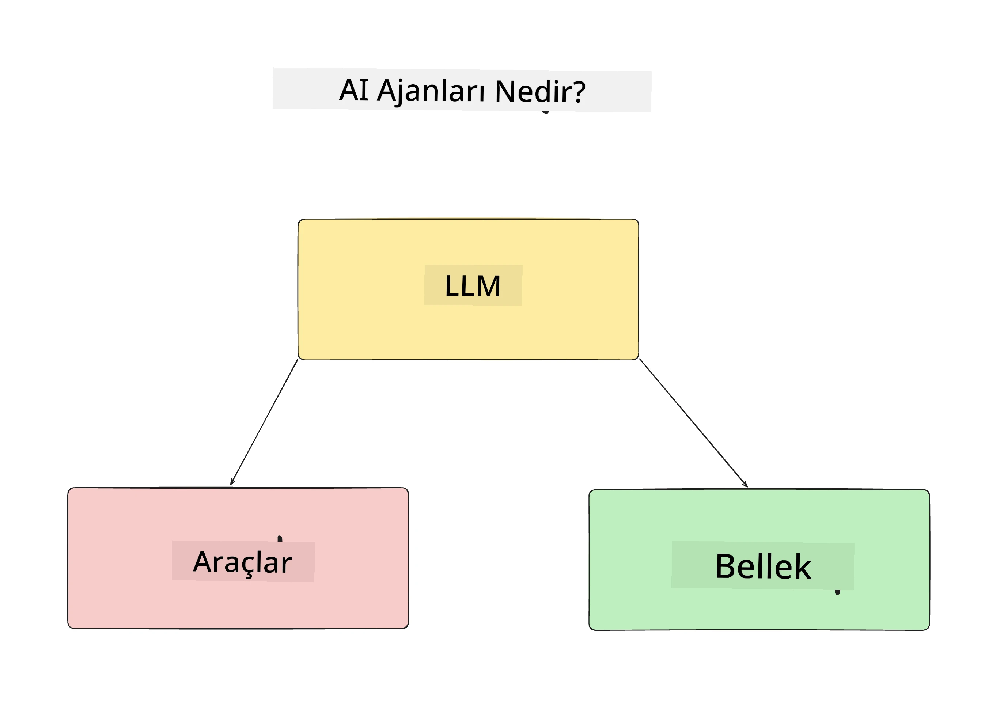
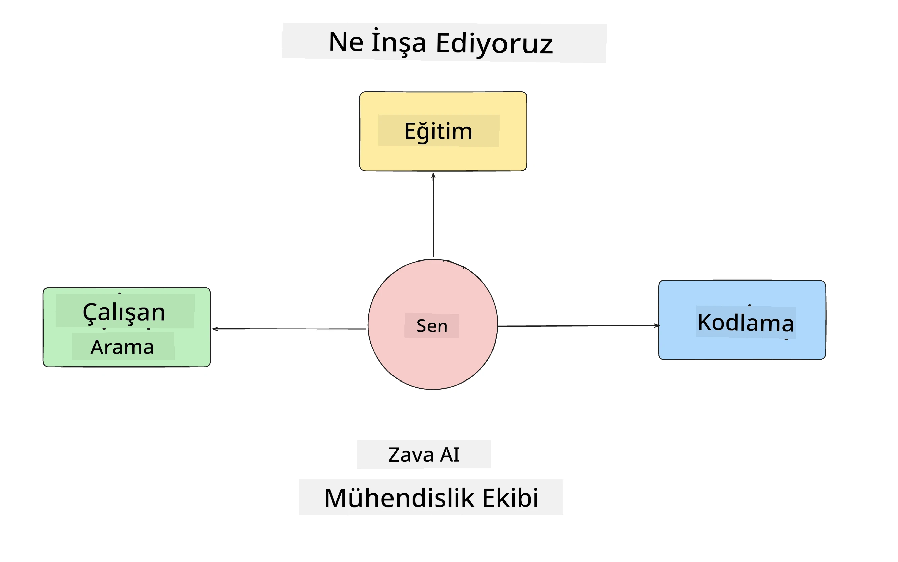
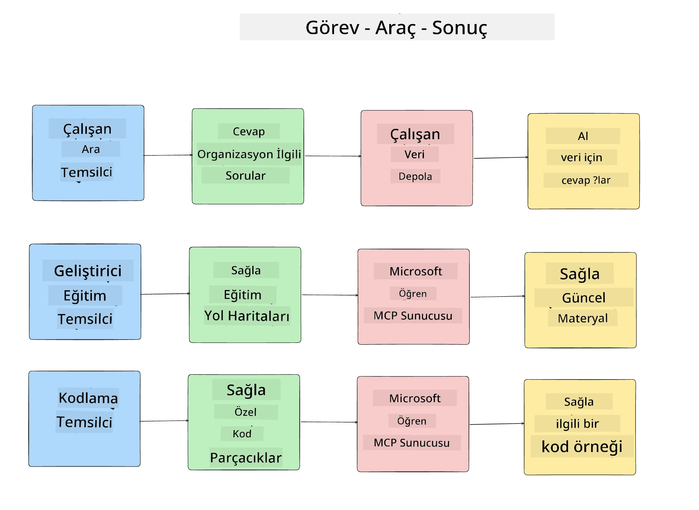
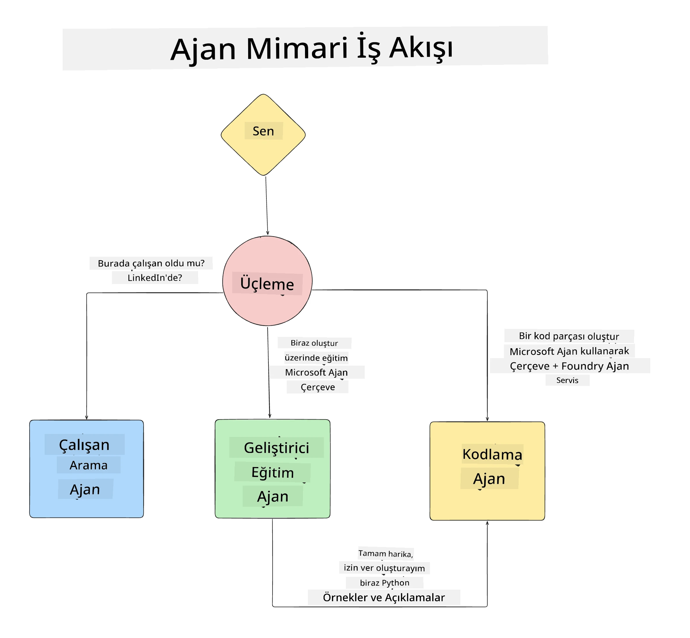

# Ders 1: Yapay Zeka Ajanı Tasarımı

"0'dan Üretime AI Ajanı İnşa Etme Kursu"nun ilk dersine hoş geldiniz!

Bu derste şunları ele alacağız:

- AI Ajanlarının Ne Olduğunu Tanımlamak
  
- İnşa ettiğimiz AI Ajan Uygulamasını Tartışmak  

- Her ajan için gerekli araç ve servisleri belirlemek
  
- Ajan Uygulamamızı Tasarlamak
  
Bir uygulama içinde ajanların ne olduğunu ve neden kullanacağımızı tanımlayarak başlayalım.

> **Kursa başlamadan önce.** Bu ilk ders kavramsaldır — çalıştırılacak herhangi bir kod yoktur.
> [Ders 2](../lesson-2-agent-development/README.md) itibarıyla şunlara ihtiyacınız olacak: **Microsoft Foundry** erişimi olan bir **Azure aboneliği**, dağıtılmış bir **GPT-5 serisi modeli** (örneğin `gpt-5.1` — emekli olmuş GPT-4o / GPT-4.1'den kaçının), **Python 3.12+** ve **Azure CLI**
> (`az login`). Tüm liste ve bağlantılar için kurs README'sindeki [Neye İhtiyacınız Var](../README.md#what-you-need) bölümüne bakınız.

## AI Ajanları Nedir?

AI Ajanı oluşturmayı ilk kez keşfediyorsanız, AI Ajanının tam olarak ne olduğunu tanımlamakla ilgili sorularınız olabilir.

AI Ajanını onu oluşturan bileşenlerle tanımlamanın basit bir yolu şudur:

**Büyük Dil Modeli** - LLM, kullanıcının yapmak istediği görevi yorumlamak için doğal dili işleme yeteneğini ve bu görevleri tamamlamak için kullanılabilecek araçların tanımlarını yorumlama gücünü sağlar.

**Araçlar** - Bunlar, LLM'nin kullanmayı seçebileceği fonksiyonlar, API'ler, veri depoları ve diğer servislerdir.

**Bellek** - Bu, AI Ajanı ile kullanıcı arasındaki kısa ve uzun süreli etkileşimlerin nasıl saklandığıdır. Bu bilgiyi depolamak ve geri almak, zaman içinde iyileştirmeler yapmak ve kullanıcı tercihlerini kaydetmek için önemlidir.

## AI Ajanı Kullanım Durumumuz

Bu kurs için, yeni geliştiricilerin AI Ajanı Geliştirme Ekibimize katılmasını sağlayacak bir AI Ajanı uygulaması geliştireceğiz!

Herhangi bir geliştirme çalışması yapmadan önce, başarılı bir AI Ajanı uygulaması yaratmanın ilk adımı, kullanıcılarımızın AI Ajanlarımızla nasıl çalışmasını beklediğimize dair net senaryolar tanımlamaktır.

Bu uygulama için şu senaryolar üzerinde çalışacağız:

**Senaryo 1**: Yeni bir çalışan organizasyonumuza katılır ve katıldığı ekip hakkında daha fazla bilgi almak ve onlarla nasıl iletişim kuracağını öğrenmek ister.

**Senaryo 2:** Yeni çalışan, başlaması için en iyi ilk görevin ne olduğunu öğrenmek ister.

**Senaryo 3:** Yeni çalışan, bu görevi tamamlamaya başlamak için öğrenme kaynakları ve kod örnekleri toplamak ister.

## Araçları ve Servisleri Belirlemek

Bu senaryolar oluşturulduğuna göre, bir sonraki adım AI ajanlarımızın bu görevleri tamamlamak için ihtiyaç duyacağı araç ve servisleri eşlemektir.

Bu süreç, AI Ajanlarımızın görevleri tamamlamak için doğru bağlama doğru zamanda sahip olmalarını sağlamaya odaklandığımız için Bağlam Mühendisliği kategorisine girer.

Şimdi bunu senaryo senaryo yapalım ve her ajanın görevlerini, araçlarını ve arzu edilen sonuçlarını listeleyerek iyi bir ajan tasarımı gerçekleştirelim.

### Senaryo 1 - Çalışan Arama Ajanı

**Görev** - Organizasyondaki çalışanlar hakkında katılım tarihi, mevcut ekip, konum ve son pozisyon gibi soruları yanıtlamak.

**Araçlar** - Mevcut çalışan listesi ve organizasyon şemasının veri deposu

**Sonuçlar** - Genel organizasyon soruları ve çalışanlarla ilgili spesifik soruları yanıtlamak için veri deposundan bilgi alabilmeli.

### Senaryo 2 - Görev Öneri Ajanı

**Görev** - Yeni çalışanın geliştirici deneyimine dayanarak, çalışabileceği 1-3 sorun belirlemek.

**Araçlar** - Açık sorunları almak için GitHub MCP Sunucusu ve geliştirici profili oluşturmak

**Sonuçlar** - Bir GitHub profilinin son 5 commit'ini ve bir GitHub projesindeki açık sorunları okuyup eşleşmeye göre önerilerde bulunabilmeli.

### Senaryo 3 - Kod Asistan Ajanı

**Görev** - "Görev Önerisi" Ajanı tarafından önerilen Açık Sorunlara dayanarak, kullanıcıya yardımcı olacak kaynakları araştırmak ve kod parçacıkları oluşturmak.

**Araçlar** - Kaynak bulmak için Microsoft Learn MCP ve özel kod parçacıkları oluşturmak için Kod Yorumlayıcı.

**Sonuçlar** - Kullanıcı ek yardım isterse, iş akışı Learn MCP Sunucusunu kullanarak kaynak bağlantıları ve parçacıklar sağlamalı, sonra kod parçacıklarını açıklamalarıyla oluşturmak için Kod Yorumlayıcı ajana devretmeli.

## Ajan Uygulamamızı Mimarisi

Artık her ajanımızı tanımladığımıza göre, her ajanın göreve bağlı olarak birlikte ve ayrı ayrı nasıl çalışacağını anlamamıza yardımcı olacak bir mimari diyagram oluşturalım:

## Sonraki Adımlar

Artık her ajanımızı ve ajan sistemimizi tasarladığımıza göre, bu ajanların her birini geliştireceğimiz sonraki derse geçelim!

---

<!-- CO-OP TRANSLATOR DISCLAIMER START -->
**Feragatname**:
Bu belge, AI çeviri hizmeti [Co-op Translator](https://github.com/Azure/co-op-translator) kullanılarak çevrilmiştir. Doğruluk için çaba sarf etsek de, otomatik çevirilerin hata veya yanlışlık içerebileceğini lütfen unutmayınız. Orijinal belge, kendi dilinde yetkili kaynak olarak kabul edilmelidir. Kritik bilgiler için profesyonel insan çevirisi önerilir. Bu çevirinin kullanımı sonucu ortaya çıkabilecek yanlış anlamalardan veya yanlış yorumlamalardan sorumlu değiliz.
<!-- CO-OP TRANSLATOR DISCLAIMER END -->