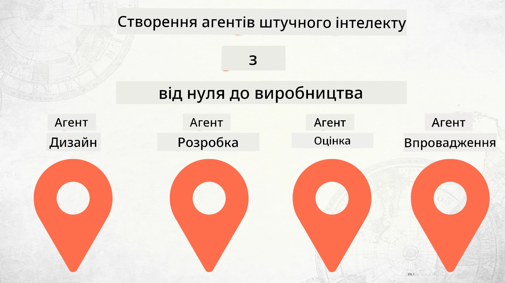

# Побудова AI-Агентів від Нуля до Впровадження



### 🌐 Підтримка багатьох мов

#### Підтримується через GitHub Action (Автоматично та Завжди Актуально)

<!-- CO-OP TRANSLATOR LANGUAGES TABLE START -->
[Arabic](../ar/README.md) | [Bengali](../bn/README.md) | [Bulgarian](../bg/README.md) | [Burmese (Myanmar)](../my/README.md) | [Chinese (Simplified)](../zh-CN/README.md) | [Chinese (Traditional, Hong Kong)](../zh-HK/README.md) | [Chinese (Traditional, Macau)](../zh-MO/README.md) | [Chinese (Traditional, Taiwan)](../zh-TW/README.md) | [Croatian](../hr/README.md) | [Czech](../cs/README.md) | [Danish](../da/README.md) | [Dutch](../nl/README.md) | [Estonian](../et/README.md) | [Finnish](../fi/README.md) | [French](../fr/README.md) | [German](../de/README.md) | [Greek](../el/README.md) | [Hebrew](../he/README.md) | [Hindi](../hi/README.md) | [Hungarian](../hu/README.md) | [Indonesian](../id/README.md) | [Italian](../it/README.md) | [Japanese](../ja/README.md) | [Kannada](../kn/README.md) | [Korean](../ko/README.md) | [Lithuanian](../lt/README.md) | [Malay](../ms/README.md) | [Malayalam](../ml/README.md) | [Marathi](../mr/README.md) | [Nepali](../ne/README.md) | [Nigerian Pidgin](../pcm/README.md) | [Norwegian](../no/README.md) | [Persian (Farsi)](../fa/README.md) | [Polish](../pl/README.md) | [Portuguese (Brazil)](../pt-BR/README.md) | [Portuguese (Portugal)](../pt-PT/README.md) | [Punjabi (Gurmukhi)](../pa/README.md) | [Romanian](../ro/README.md) | [Russian](../ru/README.md) | [Serbian (Cyrillic)](../sr/README.md) | [Slovak](../sk/README.md) | [Slovenian](../sl/README.md) | [Spanish](../es/README.md) | [Swahili](../sw/README.md) | [Swedish](../sv/README.md) | [Tagalog (Filipino)](../tl/README.md) | [Tamil](../ta/README.md) | [Telugu](../te/README.md) | [Thai](../th/README.md) | [Turkish](../tr/README.md) | [Ukrainian](./README.md) | [Urdu](../ur/README.md) | [Vietnamese](../vi/README.md)

> **Бажаєте Клонувати Локально?**
>
> Цей репозиторій містить понад 50 мовних перекладів, що значно збільшує розмір завантаження. Щоб клонувати без перекладів, скористайтесь sparse checkout:
>
> **Bash / macOS / Linux:**
> ```bash
> git clone --filter=blob:none --sparse https://github.com/microsoft/Building-AI-Agents-From-Zero-To-Production.git
> cd Building-AI-Agents-From-Zero-To-Production
> git sparse-checkout set --no-cone '/*' '!translations' '!translated_images'
> ```
>
> **CMD (Windows):**
> ```cmd
> git clone --filter=blob:none --sparse https://github.com/microsoft/Building-AI-Agents-From-Zero-To-Production.git
> cd Building-AI-Agents-From-Zero-To-Production
> git sparse-checkout set --no-cone "/*" "!translations" "!translated_images"
> ```
>
> Це дасть вам усе необхідне для проходження курсу із значно швидшим завантаженням.
<!-- CO-OP TRANSLATOR LANGUAGES TABLE END -->

## Курс, що навчає вас основам життєвого циклу розробки AI-Агентів

[](https://github.com/microsoft/Building-AI-Agents-From-Zero-To-Production/blob/master/LICENSE?WT.mc_id=academic-105485-koreyst)
[](https://GitHub.com/microsoft/Building-AI-Agents-From-Zero-To-Production/graphs/contributors/?WT.mc_id=academic-105485-koreyst)
[](https://GitHub.com/microsoft/Building-AI-Agents-From-Zero-To-Production/issues/?WT.mc_id=academic-105485-koreyst)
[](https://GitHub.com/microsoft/Building-AI-Agents-From-Zero-To-Production/pulls/?WT.mc_id=academic-105485-koreyst)
[](http://makeapullrequest.com?WT.mc_id=academic-105485-koreyst)

[](https://discord.gg/Kuaw3ktsu6)

## 🌱 Початок роботи

Цей курс містить уроки, що охоплюють основи створення та впровадження AI-Агентів.

Кожен урок базується на попередньому, тому рекомендуємо починати з початку й рухатися послідовно до кінця.

Якщо хочете більше дізнатися про теми AI-Агентів, можете ознайомитись із курсом [AI Agents For Beginners](https://aka.ms/ai-agents-beginners).

### Зустрічайте інших учнів, отримуйте відповіді на свої питання

Якщо ви застрягли або маєте питання про створення AI-Агентів, приєднуйтесь до нашого спеціального Discord-каналу в [Microsoft Foundry Discord](https://discord.gg/Kuaw3ktsu6).

### Що вам потрібно

Кожен урок має власний приклад коду, який ви можете запускати локально. Ви можете [форкнути цей репозиторій](https://github.com/microsoft/Building-AI-Agents-From-Zero-To-Production/fork), щоб створити власну копію.

Нинішній курс використовує наступне:

- [Microsoft Agent Framework (MAF)](https://aka.ms/ai-agents-beginners/agent-framework)
- [Microsoft Foundry](https://azure.microsoft.com/products/ai-foundry)
- [Azure OpenAI Service](https://azure.microsoft.com/products/ai-foundry/models/openai)
- [Azure CLI](https://learn.microsoft.com/cli/azure/authenticate-azure-cli?view=azure-cli-latest)

Переконайтесь, що у вас є доступ до цих сервісів перед початком.

Незабаром будуть доступні додаткові опції для хостингу моделей і сервісів.

## 🗃️ Уроки

| **Урок**           | **Опис**                                                                                         |
|--------------------|--------------------------------------------------------------------------------------------------|
| [Agent Design](./lesson-1-agent-design/README.md)       | Вступ до кейсу використання "Developer Onboarding" та як створювати ефективних агентів          |
| [Agent Development](./lesson-2-agent-development/README.md)  | Використання Microsoft Agent Framework (MAF), створення 3 агентів для допомоги новим розробникам.|
| [Agent Evaluations](./lesson-3-agent-evals/README.md)  | За допомогою Microsoft Foundry дізнайтесь, як добре працюють наші AI-Агенти та як їх покращити.  |
| [Agent Deployment](./lesson-4-agent-deployment/README.md)   | Використання Hosted Agents і OpenAI Chatkit для впровадження AI-Агента у виробництво.            |


## 🎒 Інші курси

Наша команда створює й інші курси! Ознайомтесь із ними:

<!-- CO-OP TRANSLATOR OTHER COURSES START -->
### LangChain
[](https://aka.ms/langchain4j-for-beginners)
[](https://aka.ms/langchainjs-for-beginners?WT.mc_id=m365-94501-dwahlin)
[](https://github.com/microsoft/langchain-for-beginners?WT.mc_id=m365-94501-dwahlin)
---

### Azure / Edge / MCP / Агенти
[](https://github.com/microsoft/AZD-for-beginners?WT.mc_id=academic-105485-koreyst)
[](https://github.com/microsoft/edgeai-for-beginners?WT.mc_id=academic-105485-koreyst)
[](https://github.com/microsoft/mcp-for-beginners?WT.mc_id=academic-105485-koreyst)
[](https://github.com/microsoft/ai-agents-for-beginners?WT.mc_id=academic-105485-koreyst)

---
 
### Серія Generative AI
[](https://github.com/microsoft/generative-ai-for-beginners?WT.mc_id=academic-105485-koreyst)
[-9333EA?style=for-the-badge&labelColor=E5E7EB&color=9333EA)](https://github.com/microsoft/Generative-AI-for-beginners-dotnet?WT.mc_id=academic-105485-koreyst)
[-C084FC?style=for-the-badge&labelColor=E5E7EB&color=C084FC)](https://github.com/microsoft/generative-ai-for-beginners-java?WT.mc_id=academic-105485-koreyst)
[-E879F9?style=for-the-badge&labelColor=E5E7EB&color=E879F9)](https://github.com/microsoft/generative-ai-with-javascript?WT.mc_id=academic-105485-koreyst)

---
 
### Основи навчання
[](https://aka.ms/ml-beginners?WT.mc_id=academic-105485-koreyst)
[](https://aka.ms/datascience-beginners?WT.mc_id=academic-105485-koreyst)
[](https://aka.ms/ai-beginners?WT.mc_id=academic-105485-koreyst)
[](https://github.com/microsoft/Security-101?WT.mc_id=academic-96948-sayoung)
[](https://aka.ms/webdev-beginners?WT.mc_id=academic-105485-koreyst)
[](https://aka.ms/iot-beginners?WT.mc_id=academic-105485-koreyst)
[](https://github.com/microsoft/xr-development-for-beginners?WT.mc_id=academic-105485-koreyst)

---
 
### Серія Copilot
[](https://aka.ms/GitHubCopilotAI?WT.mc_id=academic-105485-koreyst)
[](https://github.com/microsoft/mastering-github-copilot-for-dotnet-csharp-developers?WT.mc_id=academic-105485-koreyst)
[](https://github.com/microsoft/CopilotAdventures?WT.mc_id=academic-105485-koreyst)
<!-- CO-OP TRANSLATOR OTHER COURSES END -->

## Участь у проєкті

Цей проєкт вітає внески та пропозиції. Більшість внесків вимагає вашої згоди на
Угоду ліцензіара контриб’ютора (CLA), у якій підтверджується, що ви маєте право та фактично
надаєте нам права на використання вашого внеску. Детальніше дивіться на <https://cla.opensource.microsoft.com>.

Коли ви надсилаєте pull request, бот CLA автоматично визначить, чи потрібно надавати
CLA і відповідним чином позначить PR (наприклад, перевірка статусу, коментар). Просто виконуйте інструкції,
які надає бот. Вам потрібно буде зробити це лише один раз для всіх репозиторіїв, що використовують нашу CLA.

Цей проєкт прийняв [Microsoft Open Source Code of Conduct](https://opensource.microsoft.com/codeofconduct/).
Для додаткової інформації дивіться [поширені питання щодо Кодексу поведінки](https://opensource.microsoft.com/codeofconduct/faq/) або
зв’язуйтеся з [opencode@microsoft.com](mailto:opencode@microsoft.com) з будь-якими додатковими питаннями чи коментарями.

## Торгові марки

У цьому проєкті можуть міститися торгові марки чи логотипи проєктів, продуктів або послуг. Авторизоване використання торгових марок або логотипів Microsoft
підлягає дотриманню та повинно відповідати
[Керівництву Microsoft щодо торгових марок і брендів](https://www.microsoft.com/legal/intellectualproperty/trademarks/usage/general).
Використання торгових марок або логотипів Microsoft у змінених версіях цього проєкту не повинно вводити в оману або припускати спонсорство Microsoft.
Будь-яке використання торгових марок або логотипів третіх сторін підпорядковується політикам цих третіх сторін.

## Отримання допомоги

Якщо ви застрягли або маєте питання щодо створення AI-додатків, приєднуйтеся:

[](https://discord.gg/Kuaw3ktsu6)

Якщо у вас є відгуки про продукт або помилки під час розробки, відвідайте:

[](https://aka.ms/foundry/forum)

---

<!-- CO-OP TRANSLATOR DISCLAIMER START -->
**Відмова від відповідальності**:  
Цей документ був перекладений за допомогою сервісу автоматичного перекладу [Co-op Translator](https://github.com/Azure/co-op-translator). Хоча ми прагнемо до точності, зверніть увагу, що автоматичні переклади можуть містити помилки або неточності. Оригінальний документ рідною мовою слід вважати авторитетним джерелом. Для критично важливої інформації рекомендується користуватися професійним перекладом, виконаним людиною. Ми не несемо відповідальності за будь-які непорозуміння чи неправильні тлумачення, що виникли внаслідок використання цього перекладу.
<!-- CO-OP TRANSLATOR DISCLAIMER END -->