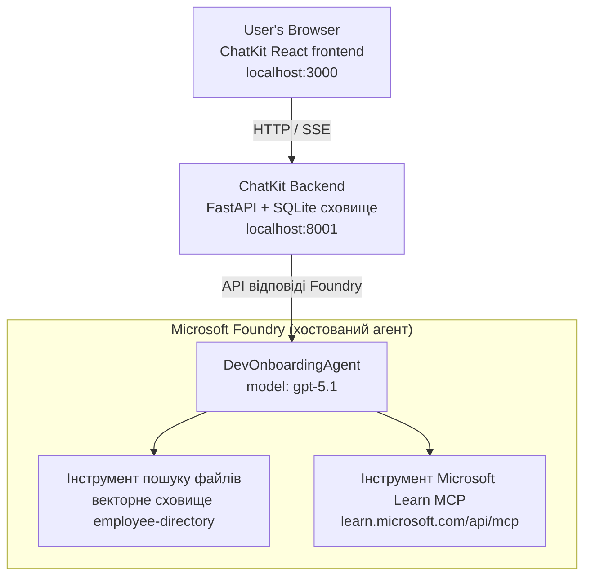

# Урок 4: Розгортання агента за допомогою Microsoft Foundry Hosted Agents + ChatKit

Цей урок демонструє, як розгорнути агента, що використовує інструменти, у Microsoft Foundry як хостингованого агента та створити фронтенд на базі ChatKit для взаємодії з ним.

## Архітектура

Хостингований агент — це **один `DevOnboardingAgent`** (запускається на `gpt-5.1`), який відповідає на питання з онбордінгу розробників, використовуючи два хостингові інструменти: інструмент **Пошуку Файлів** над векторним сховищем employee-directory та інструмент **Microsoft Learn MCP**. React-фронтенд ChatKit спілкується з бекендом FastAPI, який викликає агента через Foundry **Responses API**.



## Передумови

1. **Проєкт Microsoft Foundry** у регіоні North Central US
2. **Azure CLI** з автентифікацією (`az login`)
3. Встановлений **Azure Developer CLI** (`azd`)
4. **Python 3.12+** і **Node.js 18+**
5. Створене **векторне сховище** з даними співробітників

## Швидкий старт

### 1. Налаштування змінних середовища

```bash
cd lesson-4-agentdeployment
cp .env.example .env
# Відредагуйте .env з деталями вашого проекту Microsoft Foundry
```

### 2. Розгортання хостингованого агента

**Варіант A: Використання Azure Developer CLI (Рекомендується)**

```bash
cd hosted-agent
azd auth login
azd agent deploy
```

**Варіант B: Використання Docker + Azure Container Registry**

```bash
cd hosted-agent

# Побудувати контейнер
docker build -t developer-onboarding-agent:latest .

# Тег для ACR
docker tag developer-onboarding-agent:latest <your-acr>.azurecr.io/developer-onboarding-agent:latest

# Відправити до ACR
az acr login --name <your-acr>
docker push <your-acr>.azurecr.io/developer-onboarding-agent:latest

# Розгорнути через портал Microsoft Foundry або SDK
```

### 3. Запуск бекенда ChatKit

```bash
cd chatkit-server
python -m venv .venv
source .venv/bin/activate  # У Windows: .venv\Scripts\activate
pip install -r requirements.txt
python app.py
```

Сервер запуститься на `http://localhost:8001`

### 4. Запуск фронтенда ChatKit

```bash
cd chatkit-server/frontend
npm install
npm run dev
```

Фронтенд запуститься на `http://localhost:3000`

### 5. Тестування додатку

Відкрийте `http://localhost:3000` у браузері та спробуйте запити:

**Пошук співробітників:**
- "Я тут новий! Хтось працював у Microsoft?"
- "Хто має досвід роботи з Azure Functions?"

**Навчальні ресурси:**
- "Створи навчальний маршрут для Kubernetes"
- "Які сертифікати мені варто отримати для хмарної архітектури?"

**Допомога з кодуванням:**
- "Допоможи написати Python код для підключення до CosmosDB"
- "Покажи, як створити Azure Function"

**Запити мультиагентам:**
- "Я починаю як хмарний інженер. З ким мені слід зв’язатися та що навчитися?"

## Структура проєкту

```
lesson-4-agentdeployment/
├── .env.example                 # Environment variables template
├── implementation-plan.md       # Detailed implementation guide
├── README.md                    # This file
├── hosted-agent/               # Microsoft Foundry hosted agent
│   ├── main.py                 # Multi-agent workflow implementation
│   ├── requirements.txt        # Python dependencies
│   ├── Dockerfile              # Container definition
│   └── agent.yaml              # Agent deployment configuration
└── chatkit-server/             # ChatKit server application
    ├── app.py                  # FastAPI backend
    ├── store.py                # SQLite persistence layer
    ├── requirements.txt        # Python dependencies
    └── frontend/               # React frontend
        ├── package.json
        ├── vite.config.ts
        ├── tsconfig.json
        ├── index.html
        └── src/
            ├── main.tsx
            ├── App.tsx
            ├── App.css
            └── index.css
```

## Агент та його інструменти

Хостингований агент — це **один агент** (`DevOnboardingAgent`, визначений у `hosted-agent/main.py`), який обробляє три домени онбордінгу. Замість оркестрації окремих субагентів він надає кожну можливість як інструмент (або напряму використовує модель):

| Можливість | Як обробляється | Інструмент |
|-----------|-----------------|------------|
| **Пошук співробітників та зв’язки** | Foundry хостингований інструмент File Search над векторним сховищем employee-directory | `client.get_file_search_tool(vector_store_ids=[...])` |
| **Навчання та підготовка** | Сервер Microsoft Learn MCP (хостингований MCP інструмент) | `client.get_mcp_tool(url="https://learn.microsoft.com/api/mcp")` |
| **Допомога з програмуванням** | Обробляється безпосередньо моделлю `gpt-5.1` — без зовнішніх інструментів | — |

Агент створюється за допомогою `client.as_agent(name="DevOnboardingAgent", instructions=..., tools=[file_search_tool, learn_mcp_tool])` і запускається через `from_agent_framework(agent).run()`.

> **Примітка до дизайну.** Попередні версії цього уроку використовували багатагентний робочий процес `HandoffBuilder` (Triage → спеціалісти). Готовий агент — це один агент із використанням інструментів, що простіше для розгортання та розуміння для Q&A у стилі онбордінгу. Для прикладу оркестрації багатагентної роботи та передачі дивіться Урок 2 і Урок 3.

## Димове тестування хостингованого агента (CI gate)

Успішне розгортання хостингованого агента лише свідчить, що керуюча площина прийняла
визначення — це **не** гарантує, що агент фактично відповідає. Відсутність залежностей,
помилки маршрутизації моделі чи прострочене з’єднання можуть залишити зеленого, але мовчазного агента.

Урок постачає легкий **димовий тест**, який працює як швидкий і дешевий перевірочний етап після розгортання.
Він використовує GitHub Action [AI Smoke Test](https://github.com/marketplace/actions/ai-smoke-test)
для відправки POST запитів на ендпоінт Foundry **Responses** агента
(`POST {project_endpoint}/agents/{agent_name}/endpoint/protocols/openai/responses`)
і перевіряє повернений текст. Показує зламані розгортання, регресії автентифікації,
дрейф системних підказок та проблеми з потоками за секунди.

> Димові тести **не** замінюють повні оцінки з
> [Уроку 3](../lesson-3-agent-evals/README.md) — вони доповнюють їх. Димові тести
> відповідають на запитання *"чи агент досяжний, відповідає та дотримується базових вимог до підказок?"*;
> оцінки ж відповідають на *"наскільки якісна відповідь?"*. Запускайте цей дешевий етап при кожному розгортанні.

### Що перевіряється

Каталог знаходиться у [`hosted-agent/tests/smoke-tests.json`](../../../lesson-4-agentdeployment/hosted-agent/tests/smoke-tests.json)
і тестує три домени агента, а також дотримання підказок та мульти-турове ведення діалогу:

| Тест | Що перевіряє |
|------|-------------|
| `reachability` | Агент відповідає непорожнім, релевантним текстом |
| `employee-search` | Домен пошуку файлів повертає здоровий `200` (відповідь залежить від даних) |
| `learning-path` | Навчальний домен відображає тему і надає відповідь у форматі маршруту |
| `coding-assistance` | Домен кодування повертає відповідь у вигляді Python коду |
| `prompt-adherence-offtopic` | Запит поза темою перенаправляється, детальної відповіді немає |
| `threading-turn-1/2` | Стан розмови зберігається між турами через `previous_response_id` |

### Запуск у CI

Робочий процес у [`.github/workflows/smoke-test-hosted-agent.yml`](../../../.github/workflows/smoke-test-hosted-agent.yml)
має два завдання:

- **`static`** — швидкий етап без Azure, що запускається на кожен pull request і push:
  компілює всі Python джерела (`py_compile`) і перевіряє Markdown-посилання. Не вимагає секретів,
  тому працює на pull request з форків.
- **`smoke`** — підключений до Azure димовий тест нижче. Запускається за вимогою
  (Actions → **Agent CI (static + smoke)** → Run workflow) і може запускатися після вашого
  робочого процесу розгортання.

Налаштуйте у репозиторії ці **змінні** і **секрети** для smoke job:

| Тип | Ім’я | Значення |
|-----|-------|----------|
| Змінна | `FOUNDRY_PROJECT_ENDPOINT` | `https://<account>.services.ai.azure.com/api/projects/<project>` |
| Змінна | `HOSTED_AGENT_NAME` | Ім’я розгорнутого агента (наприклад, `dev-onboarding` — має співпадати з розгортанням) |
| Секрет | `AZURE_CLIENT_ID` / `AZURE_TENANT_ID` / `AZURE_SUBSCRIPTION_ID` | OIDC федеративна ідентичність для `azure/login` |

Ідентичність раннера повинна мати роль **`Azure AI User`** у межах **Foundry project scope**, щоб викликати
кінцеві точки Responses (та conversations). Надати можна за допомогою:

```bash
az role assignment create \
  --assignee <object-id-or-appId-of-runner-identity> \
  --role "Azure AI User" \
  --scope "/subscriptions/<sub>/resourceGroups/<rg>/providers/Microsoft.CognitiveServices/accounts/<account>/projects/<project>"
```

### Запуск локально

Ви можете запускати той самий каталог перед пушем. Отримайте токен до data-plane, scoped
на `https://ai.azure.com/` і спрямовуйте раннер до вашого розгортання:

```bash
# Аудиторія МАЄ бути https://ai.azure.com/ (токени cognitiveservices.azure.com відхиляються)
export FOUNDRY_TOKEN=$(az account get-access-token --resource https://ai.azure.com/ --query accessToken -o tsv)

git clone https://github.com/JFolberth/ai-smoketest && cd ai-smoketest
python runner.py \
  --project-endpoint "https://<account>.services.ai.azure.com/api/projects/<project>" \
  --agent-name dev-onboarding \
  --tests-file ../lesson-4-agentdeployment/hosted-agent/tests/smoke-tests.json
```

Коди виходу: `0` — всі пройшли, `1` — провалена перевірка, `2` — помилка раннера (поганий каталог / токен).

## Вирішення проблем

### Агент не відповідає
- Перевірте, що хостингований агент розгорнутий і працює в Microsoft Foundry
- Переконайтеся, що `HOSTED_AGENT_NAME` і `HOSTED_AGENT_VERSION` співпадають із вашим розгортанням

### Помилки векторного сховища
- Переконайтесь, що `VECTOR_STORE_ID` встановлено правильно
- Перевірте, що векторне сховище містить дані співробітників

### Помилки автентифікації
- Виконайте `az login` для оновлення облікових даних
- Переконайтесь, що маєте доступ до проєкту Microsoft Foundry

## Ресурси

- [Документація Microsoft Foundry Hosted Agents](https://learn.microsoft.com/en-us/azure/ai-foundry/agents/concepts/hosted-agents)
- [Microsoft Agent Framework](https://github.com/microsoft/agent-framework)
- [Приклад інтеграції ChatKit](https://github.com/microsoft/agent-framework/tree/main/python/samples/demos/chatkit-integration)
- [Azure Developer CLI](https://learn.microsoft.com/en-us/azure/developer/azure-developer-cli/overview)
- [AI Smoke Test GitHub Action](https://github.com/marketplace/actions/ai-smoke-test)
- [Димове тестування Microsoft Foundry Agents за допомогою GitHub Actions (блог)](https://techcommunity.microsoft.com/blog/azuredevcommunityblog/smoke-test-microsoft-foundry-agents-with-github-actions/4531912)

---

## Наступні кроки

Ваш агент працює на інфраструктурі, якою керує Microsoft. Щоб вивести його у корпоративне виробництво —
контролювати, де зберігаються його дані (суверенітет даних, приватні мережі, bring-your-own Azure
Cosmos DB / Storage / AI Search) та управляти його інструментами — продовжуйте з
**[Урок 5: Продуктивні хостинговані агенти](../lesson-5-hosted-agents-production/README.md)**, де
пояснюється ключова різниця між **Hosted Agents** та **Capability Hosts**.

---

<!-- CO-OP TRANSLATOR DISCLAIMER START -->
**Відмова від відповідальності**:
Цей документ було перекладено за допомогою сервісу штучного інтелекту для перекладу [Co-op Translator](https://github.com/Azure/co-op-translator). Хоча ми прагнемо до точності, будь ласка, майте на увазі, що автоматичні переклади можуть містити помилки або неточності. Оригінальний документ рідною мовою слід вважати авторитетним джерелом. Для критично важливої інформації рекомендується професійний людський переклад. Ми не несемо відповідальності за будь-які непорозуміння або неправильні тлумачення, що виникли внаслідок використання цього перекладу.
<!-- CO-OP TRANSLATOR DISCLAIMER END -->