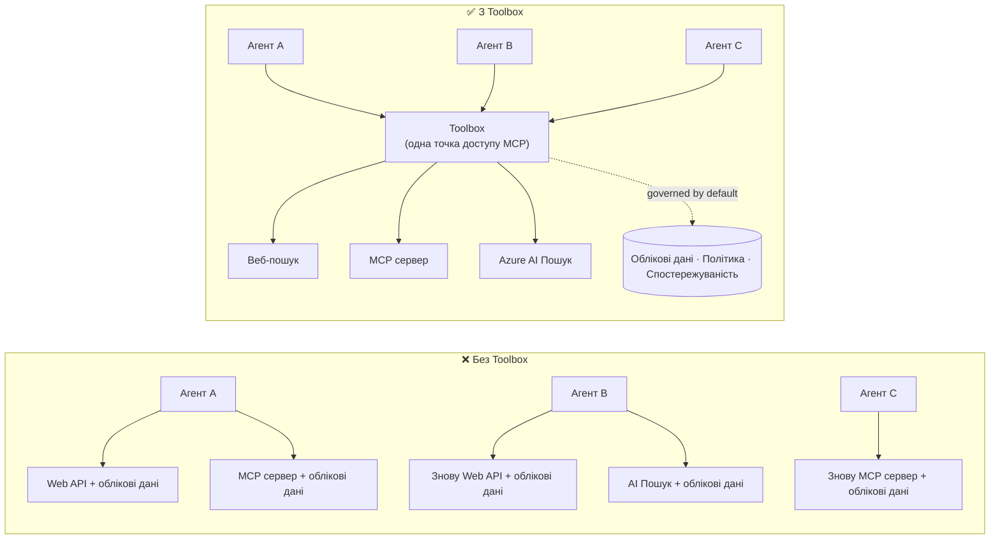

# Урок 6: Microsoft Toolbox — Керовані інструменти для агентів

За [Уроком 5](../lesson-5-hosted-agents-production/README.md) ваш розміщений агент працює в
продуктивному середовищі з необхідним для вашої організації зберіганням та політиками керування. Але згадайте
агента з Уроку 4: кожен інструмент був **жорстко запрограмований** у `main.py` — URL Microsoft Learn MCP,
векторне сховище для пошуку файлів і так далі. Це працює для одного агента. Це **не** масштабовано на
організацію з десятками агентів і команд.

Цей урок представляє **Microsoft Toolbox**: спосіб, як Foundry дозволяє вам визначити кураторський набір
інструментів **одноразово**, керувати ними **централізовано** і надавати їх будь-якому агенту через **єдину,
керовану кінцеву точку**.

## Мета навчання

До кінця цього уроку ви зможете:

- Пояснити проблему розповсюдженості інструментів, яку вирішує Toolbox.
- Описати стовпи **Build** і **Consume** та типи інструментів, які може містити toolbox.
- **Побудувати** версію toolbox за допомогою Foundry SDK.
- **Використати** toolbox з розміщеного агента Microsoft Agent Framework через єдину кінцеву точку MCP.
- Використовувати **версіювання**, щоб випускати зміни інструментів без змін коду агента або повторного розгортання.
- Застосовувати **управління**: RBAC, впровадження облікових даних, політики guardrail (RAI).

---

## Передумови

1. Завершені [Урок 4](../lesson-4-agentdeployment/README.md) та бажано
   [Урок 5](../lesson-5-hosted-agents-production/README.md).
2. Проєкт **Microsoft Foundry** з дозволом створювати і керувати ресурсами toolbox.
3. Аутентифікований **Azure CLI**: `az login`. API toolbox Foundry вимагають
   області токена `https://ai.azure.com/.default` (показано в коді нижче).
4. **Python 3.12+** з встановленими залежностями курсу (`pip install -r ../requirements.txt`).
5. Поточне, не застаріле розгортання моделі (наприклад, `gpt-5.1`). Уникайте застарілих GPT-4o / GPT-4.1.

---

## 1. Проблема: розповсюдженість інструментів

Один агент може залежати від багатьох інструментів — REST API, MCP серверів, конекторів і потоків — кожен
з власною моделлю аутентифікації та командою-власником. При масштабуванні по організації:

- Команди **незалежно реалізують одні й ті ж інструменти** повторно.
- Облікові дані **дублюються** серед агентів та репозиторіїв.
- **Управління стає непослідовним** — кожен агент застосовує (або забуває) політику самостійно.
- Є **мало прозорості** щодо наявності інструментів або того, хто їх використовує.

Розробники гальмують — не тому, що моделі не здатні, а тому що **інтеграція інструментів стає вузьким місцем**.




Підприємства вже мають інфраструктуру — шлюзи, сховища облікових даних, політики, моніторинг.
Те, чого бракувало, — це досвід розробника, який упаковує це в щось **повторно використовуване,
відкриване і кероване за замовчуванням**. Ось що таке Toolbox.

---

## 2. Що таке Toolbox

**Toolbox** — це **керований ресурс Foundry**. Ви однажды визначаєте кураторський набір інструментів,
керуєте ними централізовано у Foundry і надаєте через **одну сумісну з MCP кінцеву точку**, яку може використовувати
будь-який агент. Під час виконання платформа забезпечує **впровадження облікових даних, оновлення токена і
застосування корпоративних політик**.

Оскільки toolbox — керований ресурс, ви можете додавати, видаляти або переналаштовувати інструменти **без
зміни коду агента** — агент завжди підключається до тієї ж кінцевої точки.

Toolbox охоплює життєвий цикл інструментів через чотири стовпи; **Build** і **Consume** доступні
сьогодні:

| Стовп | Статус | Що забезпечує |
|--------|--------|-----------------|
| **Build** | Доступний сьогодні | Оберіть інструменти, налаштуйте аутентифікацію централізовано, опублікуйте повторно використовуваний toolbox, який зможе використовувати будь-яка команда. |
| **Consume** | Доступний сьогодні | Підключайте будь-який агент до однієї MCP-сумісної кінцевої точки щоб динамічно виявляти і викликати всі інструменти в toolbox. |

Інтерфейс споживання є **відкритим**: будь-яке середовище виконання або клієнт, сумісний з MCP, може використовувати toolbox —
Microsoft Agent Framework, LangGraph, GitHub Copilot, Claude Code, Microsoft Copilot Studio або
власний код.

### Типи інструментів, які може містити toolbox

Веб-пошук · MCP · Azure AI Search · Code Interpreter · Пошук файлів · OpenAPI · **Agent-to-Agent
(A2A)** · Fabric IQ · Tool Search · Work IQ · Автоматизація браузера · Посилання на навички, а також
**політика guardrail (RAI)**, застосована на рівні toolbox.

> **Підказка:** Додайте `description` до **кожного** інструмента, щоб модель могла обрати правильний. Toolbox
> дозволяє максимум **один інструмент без імені на тип** — надайте кожному додатковому екземпляру того самого типу
> унікальне `name`, інакше отримаєте помилку `invalid_payload`.

---

## 3. Побудуйте toolbox

Toolbox управляються за допомогою Foundry SDK (Python/.NET/JavaScript), REST API, `azd` та
**Microsoft Foundry Toolkit для VS Code**. Ось патерн для Python (`azure-ai-projects`):

```python
from azure.identity import DefaultAzureCredential
from azure.ai.projects import AIProjectClient
from azure.ai.projects.models import MCPTool, ToolboxSearchPreviewTool, WebSearchTool

endpoint = "https://<your-foundry-account>.services.ai.azure.com/api/projects/<your-project>"
project = AIProjectClient(endpoint=endpoint, credential=DefaultAzureCredential())

toolbox_version = project.toolboxes.create_toolbox_version(
    name="agent-tools",
    description="Web search + an MCP server + tool search",
    tools=[
        WebSearchTool(),
        MCPTool(
            server_label="myserver",
            server_url="https://your-mcp-server.example.com",
            require_approval="never",
            project_connection_id="my-key-auth-connection",  # облікові дані зберігаються у Foundry
        ),
        ToolboxSearchPreviewTool(),
    ],
)
print(f"Created toolbox: {toolbox_version.name}, version: {toolbox_version.version}")
```

Зверніть увагу, чого ви **не** робите: секретів у агенті немає. Облікові дані зберігаються у з’єднанні Foundry
(`project_connection_id`) і платформа впроваджує їх під час виклику.

> **Примітка попереднього перегляду.** Управління toolbox (створення/оновлення версій) є функцією прев’ю.
> Операції `project.toolboxes.*`, показані вище, знаходяться в прев’ю-збірках SDK, REST API, `azd`,
> та **Foundry Toolkit для VS Code** — вони **не** входять у зафіксований `azure-ai-projects`, який використовується
> в інших частинах курсу. Розглядайте наведений вище фрагмент як опис кроку Build; для
> спрощеного шляху створіть toolbox через **портал Foundry** або **Foundry Toolkit**. Крок
> **Consume** нижче працює з зафіксованим SDK курсу.

---

## 4. Використання toolbox з вашого агента

Toolbox надає **кінцеву точку MCP**. Існують два варіанти:

| Роль | Кінцева точка | Коли використовувати |
|------|--------------|--------------------|
| **Споживач toolbox** | `{project_endpoint}/toolboxes/{name}/mcp?api-version=v1` | Підключайте агентів. Завжди обслуговує **версію за замовчуванням**. |
| **Розробник toolbox** | `{project_endpoint}/toolboxes/{name}/versions/{version}/mcp?api-version=v1` | Тестуйте конкретну версію перед її запуском. |

> **Підключайте агентів до кінцевої точки *споживача*.** Оскільки вона завжди обслуговує версію за замовчуванням, ви

> може просувати нові версії **без зміни коду агента або повторного розгортання**.

### Інтеграція з агентом Microsoft Agent Framework, що розміщується хостингом

Нагадаємо, що агент із Уроку 4 додав один жорстко закодований інструмент MCP за допомогою `client.get_mcp_tool(...)`. За допомогою
Toolbox ви замість цього вказуєте **один** `MCPStreamableHTTPTool` на кінцеву точку toolbox — і агент
отримує **усі** інструменти в toolbox, керовані централізовано:

```python
import httpx
from azure.identity import DefaultAzureCredential, get_bearer_token_provider
from agent_framework import MCPStreamableHTTPTool

# Auth: Foundry toolbox вимагає область https://ai.azure.com/.default
credential = DefaultAzureCredential()
token_provider = get_bearer_token_provider(credential, "https://ai.azure.com/.default")
http_client = httpx.AsyncClient(auth=_ToolboxAuth(token_provider), timeout=120.0)

TOOLBOX_ENDPOINT = os.environ["TOOLBOX_ENDPOINT"]  # platform-injected під час виконання

mcp_tool = MCPStreamableHTTPTool(
    name="toolbox",
    url=TOOLBOX_ENDPOINT,
    http_client=http_client,
    load_prompts=False,
)

agent = chat_client.as_agent(
    name="my-toolbox-agent",
    instructions="You are a helpful assistant with access to Foundry toolbox tools.",
    tools=[mcp_tool],
)
```

Відповідний `.env` (примітка: використовуйте **актуальну** модель, наприклад `gpt-5.1`, **не** застарілу
`gpt-4o`):

```env
FOUNDRY_PROJECT_ENDPOINT=https://<account>.services.ai.azure.com/api/projects/<project>
TOOLBOX_ENDPOINT=https://<account>.services.ai.azure.com/api/projects/<project>/toolboxes/agent-tools/mcp?api-version=v1
AZURE_AI_MODEL_DEPLOYMENT_NAME=gpt-5.1
```

> **Спочатку перевірте.** Перед повним підключенням агента підключіть SDK клієнта MCP (`pip install mcp`) до
> **специфічної для версії** кінцевої точки та виведіть перелік інструментів, щоб переконатися, що вони завантажуються належним чином.

### Запуск прикладу споживання

Цей урок містить запускаємий приклад зі сторони споживача, [`toolbox_agent.py`](../../../lesson-6-toolbox/toolbox_agent.py). Він використовує
той самий шаблон `FoundryChatClient.get_mcp_tool(...)`, що ви вивчили в Уроці 2, але спрямовує один
інструмент MCP на вашу кінцеву точку **toolbox** — таким чином агент отримує всі керовані інструменти в toolbox:

```bash
# У вашому файлі .env встановіть TOOLBOX_ENDPOINT на кінцеву точку споживача вашого інструментарію, потім:
python lesson-6-toolbox/toolbox_agent.py
```

Відкрийте надруковану URL-адресу `http://localhost:8096` і задайте запитання, яке використовує один із
інструментів вашого toolbox. Додайте або оновіть інструмент у toolbox і запитайте знову — **без зміни цього
коду** — щоб побачити роботу централізованого керування та версіонування.

---

## 5. Версіонування: безпечне випускання змін інструментів

Версіонування Toolbox дає вам явний контроль над тим, коли зміни набирають чинності:

1. **Створіть** нову версію toolbox з оновленим набором інструментів.
2. **Протестуйте** її на кінцевій точці, специфічній для версії (для розробника).
3. **Просуньте** її до `default_version`, коли будете готові.

Кожен агент, спрямований на **споживацьку** кінцеву точку, автоматично отримує просунуту версію — **жодних
змін коду, жодного повторного розгортання**. (Перша створена вами версія автоматично просувається до значення за замовчуванням.)

Це еквівалент управління інструментами, схожий на синьо-зелене розгортання: ви перевіряєте зміну ізольовано,
а потім одночасно переключаєте значення за замовчуванням для всіх споживачів.

---

## 6. Управління: як Toolbox покращує контроль

Toolbox керується **за замовчуванням**. Основні важелі керування, які вам слід знати:

- **RBAC.** Надані роль **Foundry User** у проекті кожній особі: **розробнику**, який
  керує версіями toolbox, **керованій ідентичності агента** (для хостингованих агентів, які викликають інструменти під час
  виконання), а також, для потоків OAuth, **кінцевому користувачу**, чиї дані особи проксіюються.
- **Централізовані облікові дані.** Облікові дані інструментів зберігаються у Foundry **connections**, а не у коді агента
  або файлах `.env`. Платформа їх впроваджує та оновлює токени під час виконання.
- **Обмежувачі (політика RAI).** Прикріпіть іменовану політику відповідального ШІ до версії toolbox через
  `policies.rai_config.rai_policy_name`. Вона виконується на **рівні toolbox**, незалежно від будь-якого
  фільтра змісту на рівні моделі, перевіряючи вхідні та вихідні дані інструментів.

- **Затвердження MCP.** Параметр `require_approval` для кожного інструменту MCP контролює, чи потрібне затвердження виклику інструменту —
  той самий концепт робочого процесу затвердження, який ви бачили в [Уроці 5 §7](../lesson-5-hosted-agents-production/README.md#7-hosted-mcp-tools--approval-workflows).
- **Приватна мережа.** Toolbox підтримує конфігурації віртуальної мережі для підприємств, які
  зберігають трафік всередині своєї мережі.
- **Видимість.** Оскільки інструменти каталогізовані централізовано, ви нарешті отримуєте інвентар того, що
  існує і хто це використовує.

---

## Практичні вправи

1. **Рефакторинг Уроку 4.** Аґент з Уроку 4 жорстко кодує інструмент Microsoft Learn MCP. Накресліть, як ви
   перемістите цей інструмент у `agent-tools` toolbox і переадресуєте `main.py` на споживача toolbox.
   Які зміни відбудуться в `main.py`? Що більше там не буде розміщуватися?
2. **Проєктування оновлення версії.** Потрібно додати інструмент Web Search до живого toolbox, яким користуються п’ять
   аґентів. Опишіть послідовність create → test → promote і поясніть, чому жоден із п’яти аґентів не потрібен
   повторно розгортати.
3. **Вибір ідентичностей для автентифікації.** Для хостованого аґента, який викликає інструмент MCP на основі OAuth через
   toolbox, перелічіть, які ідентичності потребують ролі **Foundry User** і чому.
4. **Розміщення захисних обмежень (guardrail).** Поясніть різницю між фільтром вмісту на рівні моделі та
   захисним обмеженням toolbox, а також наведіть один сценарій, коли потрібен саме захисний обмежувач toolbox.

---

## Ресурси

- [Створення, тестування та розгортання toolbox у Foundry](https://learn.microsoft.com/azure/foundry/agents/how-to/tools/toolbox)
- [Каталог інструментів — Foundry Agent Service](https://learn.microsoft.com/azure/foundry/agents/concepts/tool-catalog)
- [Microsoft Agent Framework — Microsoft Foundry provider (інструменти)](https://learn.microsoft.com/agent-framework/agents/providers/microsoft-foundry)
- [Огляд guardrails](https://learn.microsoft.com/azure/foundry/guardrails/guardrails-overview)
- [Початок роботи з Foundry у VS Code (Foundry Toolkit)](https://learn.microsoft.com/azure/ai-foundry/how-to/develop/get-started-projects-vs-code)
- [Model Context Protocol](https://modelcontextprotocol.io/)

---

**Попередній:** [Урок 5 — Виробничі хостовані аґенти](../lesson-5-hosted-agents-production/README.md)
&nbsp;·&nbsp; **Наступний:** [Урок 7 — Багато аґентів та A2A](../lesson-7-multi-agent-a2a/README.md)

---

<!-- CO-OP TRANSLATOR DISCLAIMER START -->
**Відмова від відповідальності**:
Цей документ було перекладено за допомогою сервісу штучного інтелекту для перекладу [Co-op Translator](https://github.com/Azure/co-op-translator). Хоча ми прагнемо до точності, будь ласка, майте на увазі, що автоматичні переклади можуть містити помилки або неточності. Оригінальний документ рідною мовою слід вважати авторитетним джерелом. Для критично важливої інформації рекомендується професійний людський переклад. Ми не несемо відповідальності за будь-які непорозуміння або неправильні тлумачення, що виникли внаслідок використання цього перекладу.
<!-- CO-OP TRANSLATOR DISCLAIMER END -->