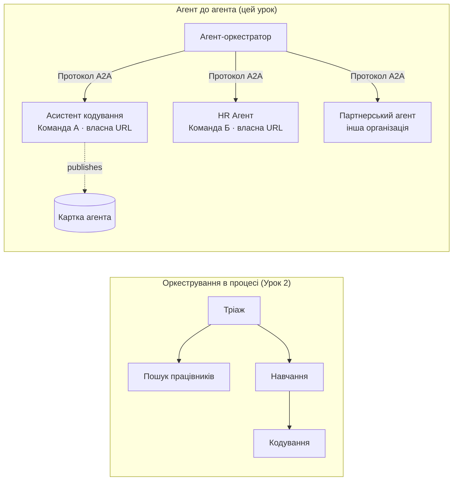

# Урок 7: Оркестрація багатьох агентів і взаємодія агентів (A2A)

У [Уроці 6](../lesson-6-toolbox/README.md) ви навчились створювати контрольовані інструменти та розміщених агентів.
Але реальні системи рідко використовують **одного** агента. При масштабуванні ви компонуватимете **багато** агентів — деякі ваші,
деякі належать іншим командам, деякі працюють у зовсім інших організаціях. Цей урок про те,
як агенти працюють **разом**.

Ви вже зустрічали одну форму дизайну з багатьма агентами у
[„agent-orchestration.py“ Уроку 2](../lesson-2-agent-development/README.md): патерн **передачі керування**
, де агент триажу спрямовує до спеціалістів **всередині одного процесу**. Цей урок виходить
на рівень вище — до **Agent-to-Agent (A2A)**, відкритого протоколу для агентів, які працюють як незалежні
**мережеві сервіси** і викликають одне одного через кордони процесів, команд і організацій.

## Цілі навчання

До кінця цього уроку ви зможете:

- Пояснити різницю між **оркестрацією в процесі** (передача/робочі процеси) та
  **Agent-to-Agent (A2A)** комунікацією і вибрати відповідний варіант.
- Описати базові блоки A2A: **Agent Card**, **навички**, **задачі** та **виявлення**.
- **Опублікувати** агента Microsoft Agent Framework як A2A сервіс за допомогою `A2AExecutor`.
- **Використовувати** віддаленого агента як мережевого учасника з `A2AAgent`.
- Застосувати корпоративні вимоги до A2A: **безпека, ідентичність, управління, моніторинг та вартість**.

---

## Попередні вимоги

1. Завершений [Урок 2](../lesson-2-agent-development/README.md) (розробка та оркестрація агентів).
2. Проект **Microsoft Foundry** з актуальним розгортанням моделі (наприклад, `gpt-5.1` і
   `gpt-5-codex` для прикладу коду). Уникайте застарілих GPT-4o / GPT-4.1.
3. Аутентифікація в **Azure CLI**: `az login`.
4. **Python 3.12+** з встановленими залежностями курсу (`pip install -r ../requirements.txt`).
   Урок 7 додає пакети попереднього перегляду `agent-framework-a2a`, `a2a-sdk`, та `uvicorn`.
5. `FOUNDRY_PROJECT_ENDPOINT` і `FOUNDRY_MODEL` встановлені у вашому `.env` (див. README курсу).

---

## 1. Два способи, як агенти працюють разом

Не існує єдиного «багатоагентного» патерну. Обирайте той, що відповідає вашій **межі**:

| Патерн | Де працюють агенти | Як вони з'єднуються | Коли використовувати |
|---------|------------------|------------------|----------|
| **Передача/Робочий процес** (Урок 2) | Один процес, одна кодова база | Вбудований граф (`HandoffBuilder`, `WorkflowBuilder`) | Ви володієте всіма агентами і розгортаєте їх разом. |
| **Agent-to-Agent (A2A)** (цей урок) | Окремі сервіси, окремі життєві цикли | Відкритий **протокол A2A** через HTTP, виявляється через **Agent Cards** | Агенти належать різним командам/організаціям, масштабуються незалежно або написані на різних фреймворках. |

Передача керування — це про **маршрутизацію всередині додатку**. A2A — це про **композицію агентів як
незалежних сервісів** — еквівалент переходу від викликів функцій до мікросервісів.



> **Вони компонуються.** Оркестратор, який ви створюєте за допомогою `HandoffBuilder`, може мати **віддалених A2A агентів**
> як учасників — маршрутизація всередині процесу до сервісів, що працюють будь-де.

---

## 2. Базові компоненти A2A

A2A — це **відкритий протокол** (не прив’язаний до Microsoft), тому агент A2A може використовуватися Microsoft
Agent Framework, LangGraph, власним кодом або стеком іншої компанії. Важливі чотири поняття:

- **Agent Card** — невеликий JSON-документ, опублікований за адресою
  `/.well-known/agent-card.json`, який рекламує **назву агента, опис, URL, версію,
  навички та можливості**. Саме так клієнт **виявляє**, що вміє віддалений агент.
- **Навички (Skills)** — декларація того, що агент вміє робити (`id`, `name`, `description`, `tags`,
  `examples`). Клієнти (і моделі) використовують їх, щоб вирішити, чи викликати агента.
- **Задачі (Tasks)** — виклик агента A2A є **задачею** з життєвим циклом (надіслано → працює →
  виконано/помилка). Сервер відстежує задачі в **сховищі задач**; підтримується потокове оновлення.
- **Виявлення (Discovery)** — клієнт, маючи лише URL, отримує Agent Card і знає, як викликати агента.

---

## 3. Опублікувати агента як A2A сервіс — `a2a_server.py`

Сторона **Build/serve** обгортає будь-якого агента Microsoft Agent Framework за допомогою `A2AExecutor` і монтує його
у HTTP застосунок A2A. Дивіться [`a2a_server.py`](../../../lesson-7-multi-agent-a2a/a2a_server.py). Основне підключення:

```python
from agent_framework.a2a import A2AExecutor
from a2a.server.apps import A2AStarletteApplication
from a2a.server.request_handlers import DefaultRequestHandler
from a2a.server.tasks import InMemoryTaskStore
from a2a.types import AgentCapabilities, AgentCard, AgentSkill

agent = client.as_agent(name="coding-assistant", instructions="...")

agent_card = AgentCard(
    name="Coding Assistant",
    description="Generates runnable code samples...",
    url="http://localhost:9000/",
    version="1.0.0",
    capabilities=AgentCapabilities(streaming=True),
    default_input_modes=["text"],
    default_output_modes=["text"],
    skills=[AgentSkill(id="generate-code", name="Generate code",
                       description="Write a runnable code snippet.", tags=["code"])],
)

request_handler = DefaultRequestHandler(
    agent_executor=A2AExecutor(agent),
    task_store=InMemoryTaskStore(),
)
app = A2AStarletteApplication(agent_card=agent_card, http_handler=request_handler).build()
# обслуговується uvicorn на порті 9000
```

Помітте, що код агента **залишається незмінним** — `A2AExecutor` адаптує ваш існуючий агент до протоколу.
Agent Card робить його **виявлюваним** для будь-якого клієнта A2A.

---

## 4. Використати віддаленого агента — `a2a_client.py`

Сторона **споживання** підключається до віддаленого агента **по URL**, отримує його Agent Card і викликає його
так само, як локального агента. Дивіться [`a2a_client.py`](../../../lesson-7-multi-agent-a2a/a2a_client.py):

```python
from agent_framework.a2a import A2AAgent

remote_agent = A2AAgent(name="remote-coding-assistant", url="http://localhost:9000")
result = await remote_agent.run("Write a Python function that reverses a string.")
print(result.text)
```

Ось у чому сенс A2A: з боку викликача віддалений агент поводиться як будь-який інший
агент `agent_framework`, тож його можна вбудувати у робочий процес або передати управління — навіть якщо він працює
в іншому процесі, на іншій машині, у власності іншої команди.

### Запуск від початку до кінця

```bash
# Термінал 1 — запуск сервісу A2A
python a2a_server.py

# Термінал 2 — викликати його
python a2a_client.py "Write a Python function that reverses a string."
```

Ви побачите відповідь помічника з кодування, що приходить через протокол A2A. Відкрийте
`http://localhost:9000/.well-known/agent-card.json` у браузері, щоб побачити опубліковану Agent Card.

---

## 5. Корпоративні вимоги

Перетворення агентів на мережеві сервіси вводить ті ж виклики, що й у будь-якій розподіленій системі —
плюс кілька специфічних для штучного інтелекту:

- **Ідентичність і автентифікація.** Ніколи не відкривайте A2A агента без автентифікації. Agent Card містить
  `security` / `security_schemes`, а `A2AAgent` приймає `auth_interceptor`, тож викликачі можуть додавати
  креденціали (OAuth токени доступу, ключі API). Використовуйте Entra ID / керовані ідентичності
  для аутентифікації сервісів у виробництві; помістіть сервіс за шлюзом.
- **Управління (Governance).** Поєднуйте A2A з [Уроком 6 — Toolbox](../lesson-6-toolbox/README.md): віддалений
  агент можна публікувати як **A2A інструмент** у контрольованому інструментарії, щоб застосовувати RBAC, інжекцію креденціалів,
  та політики обмежень централізовано.
- **Моніторинг (Observability).** Запит тепер проходить межі процесів, тому поширюйте трасування через виклик.
  Увімкніть [Foundry Observability / OpenTelemetry](../lesson-3-agent-evals/README.md) **і для**
  оркестратора, і для кожного віддаленого агента для отримання кінцевої наскрізної трасування.
- **Версіонування.** Agent Card має `version`. Ставтеся до нього як до API: добавляння функціоналу безпечне;
  порушення контракту навички вимагає нову версію та вікно міграції для споживачів.
- **Надійність.** Віддалені агенти виходять з ладу окремо. Встановлюйте таймаути (`A2AAgent(timeout=...)`), обробляйте
  часткові збої і не дозволяйте одному повільному агенту блокувати всю оркестрацію.
- **Вартість.** Кожен виклик віддаленого агента — це окремий виклик моделі. Масове розсилання збільшує витрати на токени —
  враховуйте це у бюджеті і віддавайте перевагу маршрутизації до **одного** найкращого агента замість трансляції багатьом.

---

## Практичні завдання

1. **Додайте другий сервіс.** Скопіюйте `a2a_server.py`, щоб опублікувати агента **employee-search** на порту
   9001 із власною Agent Card і навичками. Запустіть обидва і зробіть клієнтські виклики до кожного.
2. **Оркеструйте віддалених учасників.** Побудуйте невеликий `HandoffBuilder` (або простий маршрутизатор), учасниками якого є
   два `A2AAgent`, що вказують на ваші два сервіси. Маршрутизуйте запит до правильного.
3. **Захистіть сервіс.** Додайте `auth_interceptor` до клієнта і вимагайте токен доступу на сервері.
   Що порушується, якщо токен відсутній? Де ви би зберігали токен у виробництві?
4. **Передача vs A2A.** Напишіть два короткі абзаци: коли слід залишити передачу під час Уроку 2 в одному процесі,
   а коли виправдана додаткова складність A2A? Наведіть конкретні приклади кожного випадку.

---

## Ресурси

- [Agent-to-Agent (A2A) — Microsoft Agent Framework](https://learn.microsoft.com/agent-framework/user-guide/agent-orchestration/a2a)
- [Оркестрація багатьох агентів — Microsoft Agent Framework](https://learn.microsoft.com/agent-framework/user-guide/agent-orchestration/)
- [Специфікація протоколу A2A](https://a2a-protocol.org/)
- [Python SDK для A2A (`a2a-sdk`)](https://github.com/a2aproject/a2a-python)
- [Foundry Agent Service — патерни багатьох агентів](https://learn.microsoft.com/azure/ai-foundry/agents/concepts/connected-agents)

---

**Попередній:** [Урок 6 — Microsoft Toolbox](../lesson-6-toolbox/README.md)

---

<!-- CO-OP TRANSLATOR DISCLAIMER START -->
**Відмова від відповідальності**:
Цей документ було перекладено за допомогою сервісу штучного інтелекту для перекладу [Co-op Translator](https://github.com/Azure/co-op-translator). Хоча ми прагнемо до точності, будь ласка, майте на увазі, що автоматичні переклади можуть містити помилки або неточності. Оригінальний документ рідною мовою слід вважати авторитетним джерелом. Для критично важливої інформації рекомендується професійний людський переклад. Ми не несемо відповідальності за будь-які непорозуміння або неправильні тлумачення, що виникли внаслідок використання цього перекладу.
<!-- CO-OP TRANSLATOR DISCLAIMER END -->