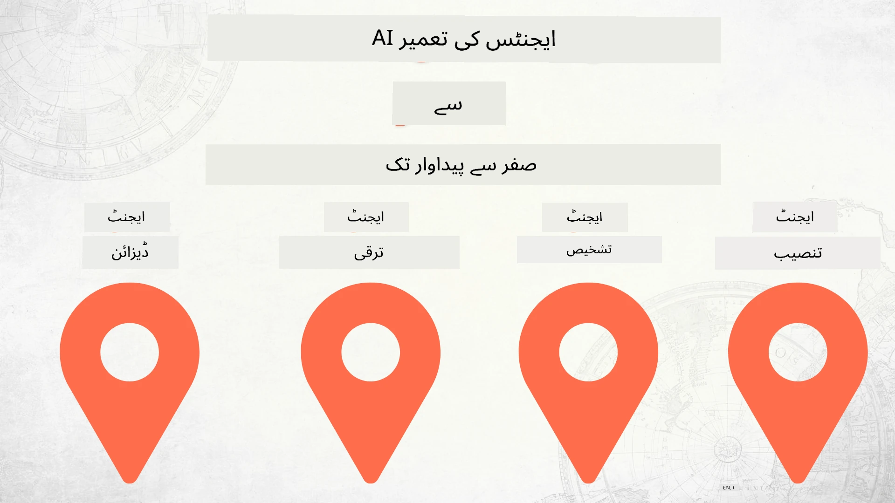

# زیرو سے پروڈکشن تک AI ایجنٹس کی تعمیر



### 🌐 ملٹی-لینگویج سپورٹ

#### گیٹ ہب ایکشن کے ذریعے سپورٹ (خودکار اور ہمیشہ تازہ ترین)

<!-- CO-OP TRANSLATOR LANGUAGES TABLE START -->
[عربی](../ar/README.md) | [بنگالی](../bn/README.md) | [بلغاریائی](../bg/README.md) | [برمی (میانمار)](../my/README.md) | [چینی (سادہ)](../zh-CN/README.md) | [چینی (روایتی، ہانگ کانگ)](../zh-HK/README.md) | [چینی (روایتی، میکاؤ)](../zh-MO/README.md) | [چینی (روایتی، تائیوان)](../zh-TW/README.md) | [کروشیائی](../hr/README.md) | [چیک](../cs/README.md) | [ڈینیش](../da/README.md) | [ڈچ](../nl/README.md) | [ایسٹونین](../et/README.md) | [فنش](../fi/README.md) | [فرانسیسی](../fr/README.md) | [جرمن](../de/README.md) | [یونانی](../el/README.md) | [عبرانی](../he/README.md) | [ہندی](../hi/README.md) | [ہنگیرین](../hu/README.md) | [انڈونیشیائی](../id/README.md) | [اطالوی](../it/README.md) | [جاپانی](../ja/README.md) | [کنڑ](../kn/README.md) | [کوریائی](../ko/README.md) | [لتھوانین](../lt/README.md) | [ملائی](../ms/README.md) | [مالیالم](../ml/README.md) | [مراٹھی](../mr/README.md) | [نیپالی](../ne/README.md) | [نائجیریائی پیجین](../pcm/README.md) | [ناروے کی](../no/README.md) | [فارسی](../fa/README.md) | [پولش](../pl/README.md) | [پرتگالی (برازیل)](../pt-BR/README.md) | [پرتگالی (پورچگال)](../pt-PT/README.md) | [پنجابی (گرمکھی)](../pa/README.md) | [رومانیائی](../ro/README.md) | [روسی](../ru/README.md) | [سربیائی (سریلیک)](../sr/README.md) | [سلوواک](../sk/README.md) | [سلووینین](../sl/README.md) | [ہسپانوی](../es/README.md) | [سواحلی](../sw/README.md) | [سویڈش](../sv/README.md) | [ٹاگالوگ (فلپائنی)](../tl/README.md) | [تمل](../ta/README.md) | [تیلگو](../te/README.md) | [تھائی](../th/README.md) | [ترکی](../tr/README.md) | [یوکرینیائی](../uk/README.md) | [اردو](./README.md) | [ویتنامی](../vi/README.md)

> **مقامی طور پر کلون کرنا پسند کریں؟**

> اس ریپوزیٹری میں 50+ زبانوں کے تراجم شامل ہیں جو ڈاؤن لوڈ کا حجم بہت بڑھاتے ہیں۔ بغیر تراجم کے کلون کرنے کے لیے sparse checkout استعمال کریں:
> ```bash
> git clone --filter=blob:none --sparse https://github.com/microsoft/Building-AI-Agents-From-Zero-To-Production.git
> cd Building-AI-Agents-From-Zero-To-Production
> git sparse-checkout set --no-cone '/*' '!translations' '!translated_images'
> ```
> اس سے آپ کو کورس مکمل کرنے کے لیے ہر چیز مل جاتی ہے اور ڈاؤن لوڈ بہت تیز ہوتا ہے۔
<!-- CO-OP TRANSLATOR LANGUAGES TABLE END -->

## AI ایجنٹ ڈیولپمنٹ لائف سائیکل کے بنیادی اصول سکھانے والا کورس

[](https://github.com/microsoft/Building-AI-Agents-From-Zero-To-Production/blob/master/LICENSE?WT.mc_id=academic-105485-koreyst)
[](https://GitHub.com/microsoft/Building-AI-Agents-From-Zero-To-Production/graphs/contributors/?WT.mc_id=academic-105485-koreyst)
[](https://GitHub.com/microsoft/Building-AI-Agents-From-Zero-To-Production/issues/?WT.mc_id=academic-105485-koreyst)
[](https://GitHub.com/microsoft/Building-AI-Agents-From-Zero-To-Production/pulls/?WT.mc_id=academic-105485-koreyst)
[](http://makeapullrequest.com?WT.mc_id=academic-105485-koreyst)

[](https://discord.gg/Kuaw3ktsu6)

## 🌱 شروع کریں

یہ کورس AI ایجنٹس بنانے اور تعینات کرنے کے بنیادی اصولوں پر دروس فراہم کرتا ہے۔

ہر سبق پچھلے سبق پر مبنی ہے، اس لیے ہم تجویز کرتے ہیں کہ ابتدا سے شروع کریں اور آخر تک کام کریں۔

اگر آپ AI ایجنٹس کے بارے میں مزید جاننا چاہتے ہیں، تو آپ [AI Agents For Beginners کورس](https://aka.ms/ai-agents-beginners) دیکھ سکتے ہیں۔

### دیگر سیکھنے والوں سے ملیں، اپنے سوالات کے جواب حاصل کریں

اگر آپ پھنس جائیں یا AI ایجنٹس بنانے کے بارے میں کوئی سوال ہو، تو ہمارے Microsoft Foundry Discord میں مخصوص Discord چینل میں شامل ہوں: [Microsoft Foundry Discord](https://discord.gg/Kuaw3ktsu6).

### آپ کو کیا چاہیے

ہر سبق کے لیے اپنا کوڈ سیمپل ہوتا ہے جسے آپ مقامی طور پر چلا سکتے ہیں۔ آپ [اس ریپو کو فورک](https://github.com/microsoft/Building-AI-Agents-From-Zero-To-Production/fork) کر کے اپنی کاپی بنا سکتے ہیں۔

یہ کورس فی الحال یہ استعمال کرتا ہے:

- [Microsoft Agent Framework (MAF)](https://aka.ms/ai-agents-beginners/agent-framework)
- [Microsoft Foundry](https://azure.microsoft.com/products/ai-foundry)
- [Azure OpenAI Service](https://azure.microsoft.com/products/ai-foundry/models/openai)
- [Azure CLI](https://learn.microsoft.com/cli/azure/authenticate-azure-cli?view=azure-cli-latest)

براہ کرم شروع کرنے سے پہلے یقینی بنائیں کہ آپ کے پاس یہ خدمات دستیاب ہیں۔

ماڈل ہوسٹنگ اور خدمات کے مزید اختیارات جلد آ رہے ہیں۔

## 🗃️ دروس

| **سبق**               | **تفصیل**                                                                                     |
|-----------------------|----------------------------------------------------------------------------------------------|
| [ایجنٹ ڈیزائن](./lesson-1-agent-design/README.md)            | ہمارے "ڈیولپر آن بورڈنگ" ایجنٹ استعمال کی صورت کا تعارف اور مؤثر ایجنٹس کے ڈیزائن کا طریقہ          |
| [ایجنٹ ڈیولپمنٹ](./lesson-2-agent-development/README.md)     | Microsoft Agent Framework (MAF) کا استعمال کرتے ہوئے، نئے ڈیولپرز کی مدد کے لیے 3 ایجنٹس بنائیں۔    |
| [ایجنٹ جائزے](./lesson-3-agent-evals/README.md)              | Microsoft Foundry کا استعمال کرتے ہوئے، ہمارے AI ایجنٹس کی کارکردگی جانچیں اور انہیں بہتر بنانے کا طریقہ۔ |
| [ایجنٹ تعیناتی](./lesson-4-agent-deployment/README.md)       | Hosted Agents اور OpenAI Chatkit کا استعمال کرتے ہوئے AI ایجنٹ کو پروڈکشن میں تعینات کرنے کا طریقہ دیکھیں۔ |

## 🎒 دیگر کورسز

ہماری ٹیم دوسرے کورسز بھی تیار کرتی ہے! دیکھیں:

<!-- CO-OP TRANSLATOR OTHER COURSES START -->
### LangChain
[](https://aka.ms/langchain4j-for-beginners)
[](https://aka.ms/langchainjs-for-beginners?WT.mc_id=m365-94501-dwahlin)
[](https://github.com/microsoft/langchain-for-beginners?WT.mc_id=m365-94501-dwahlin)
---

### Azure / Edge / MCP / Agents
[](https://github.com/microsoft/AZD-for-beginners?WT.mc_id=academic-105485-koreyst)
[](https://github.com/microsoft/edgeai-for-beginners?WT.mc_id=academic-105485-koreyst)
[](https://github.com/microsoft/mcp-for-beginners?WT.mc_id=academic-105485-koreyst)
[](https://github.com/microsoft/ai-agents-for-beginners?WT.mc_id=academic-105485-koreyst)

---
 
### جنریٹو AI سیریز
[](https://github.com/microsoft/generative-ai-for-beginners?WT.mc_id=academic-105485-koreyst)
[-9333EA?style=for-the-badge&labelColor=E5E7EB&color=9333EA)](https://github.com/microsoft/Generative-AI-for-beginners-dotnet?WT.mc_id=academic-105485-koreyst)
[-C084FC?style=for-the-badge&labelColor=E5E7EB&color=C084FC)](https://github.com/microsoft/generative-ai-for-beginners-java?WT.mc_id=academic-105485-koreyst)
[-E879F9?style=for-the-badge&labelColor=E5E7EB&color=E879F9)](https://github.com/microsoft/generative-ai-with-javascript?WT.mc_id=academic-105485-koreyst)

---
 
### بنیادی تعلیم
[](https://aka.ms/ml-beginners?WT.mc_id=academic-105485-koreyst)
[](https://aka.ms/datascience-beginners?WT.mc_id=academic-105485-koreyst)
[](https://aka.ms/ai-beginners?WT.mc_id=academic-105485-koreyst)
[](https://github.com/microsoft/Security-101?WT.mc_id=academic-96948-sayoung)
[](https://aka.ms/webdev-beginners?WT.mc_id=academic-105485-koreyst)
[](https://aka.ms/iot-beginners?WT.mc_id=academic-105485-koreyst)
[](https://github.com/microsoft/xr-development-for-beginners?WT.mc_id=academic-105485-koreyst)

---
 
### کوپائلٹ سیریز
[](https://aka.ms/GitHubCopilotAI?WT.mc_id=academic-105485-koreyst)
[](https://github.com/microsoft/mastering-github-copilot-for-dotnet-csharp-developers?WT.mc_id=academic-105485-koreyst)
[](https://github.com/microsoft/CopilotAdventures?WT.mc_id=academic-105485-koreyst)
<!-- CO-OP TRANSLATOR OTHER COURSES END -->

## تعاون کرنا

یہ پروجیکٹ تعاون اور تجاویز کا خیرمقدم کرتا ہے۔ زیادہ تر تعاون کے لیے آپ کو ایک
کنٹریبیوٹر لائسنس ایگریمنٹ (CLA) سے متفق ہونا ہوگا جو یہ ظاہر کرے کہ آپ کے پاس
آپ کے تعاون کو استعمال کرنے کے حقوق ہیں اور آپ حقیقی طور پر وہ حقوق تسلیم کرتے ہیں۔ تفصیلات کے لیے ملاحظہ کریں <https://cla.opensource.microsoft.com>۔

جب آپ پُل ریکویسٹ جمع کرواتے ہیں، تو CLA بوٹ خودکار طور پر یہ تعین کرے گا کہ آیا آپ کو CLA فراہم کرنا ضروری ہے 
اور PR کو مناسب طریقے سے سجا دے گا (جیسے، اسٹیٹس چیک، تبصرہ)۔ صرف بوٹ کی دی گئی ہدایات پر عمل کریں۔ آپ کو یہ عمل ہمارے تمام ریپوز پر صرف ایک بار کرنا ہوگا۔

یہ پروجیکٹ [Microsoft Open Source Code of Conduct](https://opensource.microsoft.com/codeofconduct/) کو اپنایا ہے۔
مزید معلومات کے لیے دیکھیں [Code of Conduct FAQ](https://opensource.microsoft.com/codeofconduct/faq/) یا
کسی اضافی سوال یا تبصرے کے لیے [opencode@microsoft.com](mailto:opencode@microsoft.com) سے رابطہ کریں۔

## تجارتی نشان

یہ پروجیکٹ مختلف پروجیکٹس، مصنوعات، یا خدمات کے تجارتی نشان یا لوگوز پر مشتمل ہو سکتا ہے۔ مائیکروسافٹ کے 
تجارتی نشانات یا لوگوز کے مجاز استعمال کے لیے ضروری ہے کہ آپ [Microsoft's Trademark & Brand Guidelines](https://www.microsoft.com/legal/intellectualproperty/trademarks/usage/general) کی پابندی کریں۔
اس پروجیکٹ کے تبدیل شدہ ورژن میں مائیکروسافٹ کے تجارتی نشان یا لوگوز کے استعمال سے کسی قسم کا الجھن یا مائیکروسافٹ کی سرپرستی کا مطلب نہیں نکلنا چاہیے۔
تیسرے فریق کے تجارتی نشان یا لوگوز کا استعمال ان متعلقہ فریقوں کی پالیسیوں کے تابع ہے۔

## مدد حاصل کرنا

اگر آپ پھنس جائیں یا AI ایپ بنانے کے حوالے سے کوئی سوال ہو تو شامل ہوں:

[](https://discord.gg/Kuaw3ktsu6)

اگر آپ کو مصنوعات کے بارے میں رائے دینی ہو یا کوئی غلطی ہو تو ملاحظہ کریں:

[](https://aka.ms/foundry/forum)

---

<!-- CO-OP TRANSLATOR DISCLAIMER START -->
**دستخط**:
یہ دستاویز AI ترجمہ سروس [Co-op Translator](https://github.com/Azure/co-op-translator) کے ذریعے ترجمہ کی گئی ہے۔ اگرچہ ہم درستگی کے لیے کوشاں ہیں، براہ کرم آگاہ رہیں کہ خودکار تراجم میں غلطیاں یا کمیاں ہو سکتی ہیں۔ اصل دستاویز اپنی مادری زبان میں مستند ذریعہ سمجھی جانی چاہیے۔ اہم معلومات کے لیے پیشہ ورانہ انسانی ترجمہ کی سفارش کی جاتی ہے۔ اس ترجمہ کے استعمال سے پیدا ہونے والی کسی بھی غلط فہمی یا غلط تشریح کی ذمہ داری ہم پر نہیں ہوگی۔
<!-- CO-OP TRANSLATOR DISCLAIMER END -->