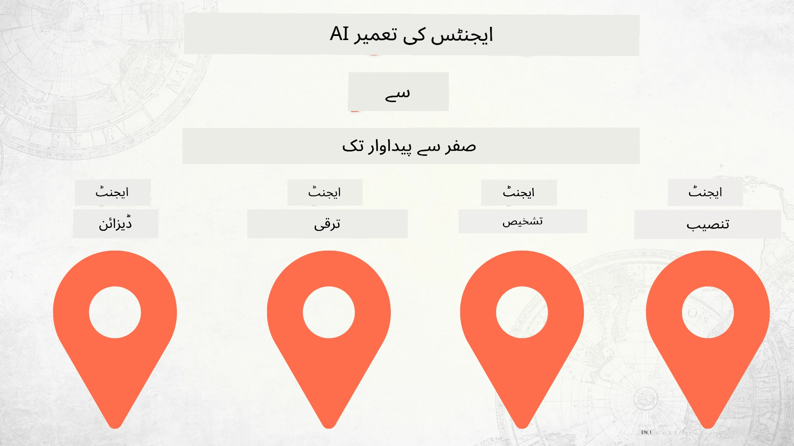

# زیرو سے پروڈکشن تک AI ایجنٹس کی تعمیر



### 🌐 کثیر لسانی معاونت

#### GitHub ایکشن کے ذریعے معاونت (خودکار اور ہمیشہ تازہ ترین)

<!-- CO-OP TRANSLATOR LANGUAGES TABLE START -->
[Arabic](../ar/README.md) | [Bengali](../bn/README.md) | [Bulgarian](../bg/README.md) | [Burmese (Myanmar)](../my/README.md) | [Chinese (Simplified)](../zh-CN/README.md) | [Chinese (Traditional, Hong Kong)](../zh-HK/README.md) | [Chinese (Traditional, Macau)](../zh-MO/README.md) | [Chinese (Traditional, Taiwan)](../zh-TW/README.md) | [Croatian](../hr/README.md) | [Czech](../cs/README.md) | [Danish](../da/README.md) | [Dutch](../nl/README.md) | [Estonian](../et/README.md) | [Finnish](../fi/README.md) | [French](../fr/README.md) | [German](../de/README.md) | [Greek](../el/README.md) | [Hebrew](../he/README.md) | [Hindi](../hi/README.md) | [Hungarian](../hu/README.md) | [Indonesian](../id/README.md) | [Italian](../it/README.md) | [Japanese](../ja/README.md) | [Kannada](../kn/README.md) | [Khmer](../km/README.md) | [Korean](../ko/README.md) | [Lithuanian](../lt/README.md) | [Malay](../ms/README.md) | [Malayalam](../ml/README.md) | [Marathi](../mr/README.md) | [Nepali](../ne/README.md) | [Nigerian Pidgin](../pcm/README.md) | [Norwegian](../no/README.md) | [Persian (Farsi)](../fa/README.md) | [Polish](../pl/README.md) | [Portuguese (Brazil)](../pt-BR/README.md) | [Portuguese (Portugal)](../pt-PT/README.md) | [Punjabi (Gurmukhi)](../pa/README.md) | [Romanian](../ro/README.md) | [Russian](../ru/README.md) | [Serbian (Cyrillic)](../sr/README.md) | [Slovak](../sk/README.md) | [Slovenian](../sl/README.md) | [Spanish](../es/README.md) | [Swahili](../sw/README.md) | [Swedish](../sv/README.md) | [Tagalog (Filipino)](../tl/README.md) | [Tamil](../ta/README.md) | [Telugu](../te/README.md) | [Thai](../th/README.md) | [Turkish](../tr/README.md) | [Ukrainian](../uk/README.md) | [Urdu](./README.md) | [Vietnamese](../vi/README.md)

> **مقامی طور پر کلون کرنا پسند کریں؟**
>
> اس مخزن میں 50+ زبانوں کے تراجم شامل ہیں جو ڈاؤن لوڈ کے سائز کو نمایاں طور پر بڑھاتے ہیں۔ تراجم کے بغیر کلون کرنے کے لیے، sparse checkout استعمال کریں:
>
> **Bash / macOS / Linux:**
> ```bash
> git clone --filter=blob:none --sparse https://github.com/microsoft/Building-AI-Agents-From-Zero-To-Production.git
> cd Building-AI-Agents-From-Zero-To-Production
> git sparse-checkout set --no-cone '/*' '!translations' '!translated_images'
> ```
>
> **CMD (Windows):**
> ```cmd
> git clone --filter=blob:none --sparse https://github.com/microsoft/Building-AI-Agents-From-Zero-To-Production.git
> cd Building-AI-Agents-From-Zero-To-Production
> git sparse-checkout set --no-cone "/*" "!translations" "!translated_images"
> ```
>
> اس سے آپ کو کورس مکمل کرنے کے لیے سب کچھ مل جاتا ہے، لیکن ڈاؤن لوڈ بہت تیز ہوتا ہے۔
<!-- CO-OP TRANSLATOR LANGUAGES TABLE END -->

## AI ایجنٹ ترقیاتی لائف سائیکل کے بنیادی اصول سکھانے والا ایک کورس

[](https://github.com/microsoft/Building-AI-Agents-From-Zero-To-Production/blob/master/LICENSE?WT.mc_id=academic-105485-koreyst)
[](https://GitHub.com/microsoft/Building-AI-Agents-From-Zero-To-Production/graphs/contributors/?WT.mc_id=academic-105485-koreyst)
[](https://GitHub.com/microsoft/Building-AI-Agents-From-Zero-To-Production/issues/?WT.mc_id=academic-105485-koreyst)
[](https://GitHub.com/microsoft/Building-AI-Agents-From-Zero-To-Production/pulls/?WT.mc_id=academic-105485-koreyst)
[](http://makeapullrequest.com?WT.mc_id=academic-105485-koreyst)

[](https://discord.gg/Kuaw3ktsu6)

## 🌱 آغاز کریں

یہ کورس AI ایجنٹس کی تعمیر اور تعیناتی کے بنیادی اصولوں کو کور کرتا ہے۔

ہر سبق پچھلے سبق پر مبنی ہوتا ہے، لہٰذا ہم تجویز کرتے ہیں کہ شروع سے شروع کریں اور آخر تک کام کریں۔

اگر آپ AI ایجنٹ کے موضوعات میں مزید تفصیل میں جانا چاہتے ہیں، تو آپ [AI Agents For Beginners کورس](https://aka.ms/ai-agents-beginners) دیکھ سکتے ہیں۔

### دوسرے سیکھنے والوں سے ملاقات کریں، اپنے سوالات کے جوابات حاصل کریں

اگر آپ پھنس جائیں یا AI ایجنٹس کی تعمیر کے بارے میں کوئی سوال ہو تو ہمارے مخصوص Discord چینل میں شامل ہوں [Microsoft Foundry Discord](https://discord.gg/Kuaw3ktsu6)۔

### آپ کو کیا چاہیے


ہر سبق کا اپنا ایک کوڈ سیمپل ہوتا ہے جسے آپ مقامی طور پر چلا سکتے ہیں۔ آپ [اس ریپو کو فورک کر سکتے ہیں](https://github.com/microsoft/Building-AI-Agents-From-Zero-To-Production/fork) تاکہ اپنی کاپی بنا سکیں۔

یہ کورس فی الحال درج ذیل استعمال کرتا ہے:

- [Microsoft Agent Framework (MAF)](https://aka.ms/ai-agents-beginners/agent-framework)
- [Microsoft Foundry](https://azure.microsoft.com/products/ai-foundry) — ایک پروجیکٹ جس میں ایک تعینات **GPT-5 سیریز** ماڈل ہے (مثال کے طور پر `gpt-5.1`)۔ پرانے GPT-4o / GPT-4.1 ماڈلز کا استعمال **نہیں** کریں۔
- [Azure OpenAI Service](https://azure.microsoft.com/products/ai-foundry/models/openai)
- [Azure CLI](https://learn.microsoft.com/cli/azure/authenticate-azure-cli?view=azure-cli-latest) — کوئی بھی سیمپل چلانے سے پہلے `az login` کے ساتھ سائن ان کریں
- **Python 3.12 یا اس کے بعد کا ورژن**

براہ کرم شروع کرنے سے پہلے یقینی بنائیں کہ آپ کو ان خدمات تک رسائی حاصل ہے۔

> **💰 لاگت اور صفائی۔** عملی اسباق حقیقی Azure وسائل بناتے ہیں — ایک Microsoft Foundry
> پروجیکٹ، ایک ماڈل کی تعیناتی، ایک ویکٹر اسٹور، اور (سبق 4–6 میں) میزبانی شدہ ایجنٹس اور ٹول بکس۔
> یہ وسائل موجود رہنے کے دوران لاگت لگا سکتے ہیں۔ جب آپ سبق مکمل کر لیں — یا پورا کورس — تو
> ایسے وسائل کو حذف کر دیں جن کی آپ کو ضرورت نہیں ہے۔ آسان طریقہ یہ ہے کہ سب کچھ ایک مخصوص وسائل
> گروپ میں رکھیں اور جب کام ختم ہو جائے تو پورے گروپ کو حذف کر دیں:
>
> ```bash
> az group delete --name <your-resource-group> --yes --no-wait
> ```
>
> آپ Foundry پورٹل سے انفرادی ایجنٹس، ویکٹر اسٹورز، اور ٹول بکس بھی حذف کر سکتے ہیں۔

> **ماڈلز پر نوٹ۔** یہ کورس تمام ماڈلز کو **Microsoft Foundry** کے ذریعے فراہم کرتا ہے۔ یہ **GitHub Models** استعمال نہیں کرتا،
> جو کہ **30 جولائی، 2026** کو بند ہو رہے ہیں — Microsoft Foundry باضابطہ منتقلی کا راستہ ہے۔ اگر آپ کے پاس پرانا کوڈ ہے
> جو GitHub Models کو کال کرتا ہے، تو اسے Foundry ماڈل کی تعیناتی کی طرف موڑ دیں۔


## 🗃️ اسباق

| **سبق**         | **تفصیل**                                                                                  |
|--------------------|--------------------------------------------------------------------------------------------------|
| [ایجنٹ ڈیزائن](./lesson-1-agent-design/README.md)       | ہمارے "ڈیولپر آن بورڈنگ" ایجنٹ کے استعمال کا تعارف اور مؤثر ایجنٹس کی ڈیزائننگ کا طریقہ  |
| [ایجنٹ ڈیولپمنٹ](./lesson-2-agent-development/README.md)  | Microsoft Agent Framework (MAF) استعمال کرتے ہوئے نئے ڈیولپرز کی مدد کے لیے خصوصی ایجنٹس تیار کریں۔       |
| [ایجنٹ کا تجزیہ](./lesson-3-agent-evals/README.md)  | Microsoft Foundry کے استعمال سے معلوم کریں کہ ہمارے AI ایجنٹس کی کارکردگی کیسی ہے اور انہیں کیسے بہتر بنایا جا سکتا ہے۔ |
| [ایجنٹ کی تعیناتی](./lesson-4-agentdeployment/README.md)   | Microsoft Foundry میزبانی شدہ ایجنٹس اور OpenAI ChatKit کا استعمال کرتے ہوئے AI ایجنٹ کو پروڈکشن میں تعینات کرنے کا طریقہ دیکھیں۔       |
| [پروڈکشن میں میزبان ایجنٹس](./lesson-5-hosted-agents-production/README.md)   | ایک میزبان ایجنٹ کو انٹرپرائز پروڈکشن میں لے جائیں: میزبان ایجنٹس بمقابلہ کیپیبلٹی ہوسٹس، اپنا اسٹوریج، میموری، اور گورننس لائیں۔       |
| [Microsoft ٹول باکس](./lesson-6-toolbox/README.md)   | ایک بار ٹولز کی تعریف کریں اور انہیں مرکزی طور پر گورن کریں: ایک ٹول باکس بنائیں، ایک ایجنٹ سے ایک MCP اینڈپوائنٹ کے ذریعے استعمال کریں، اور ٹولز کو محفوظ طریقے سے ورژن کریں۔       |
| [کثیر ایجنٹ اور A2A](./lesson-7-multi-agent-a2a/README.md)   | ایجنٹس کو ایک نیٹ ورکڈ سروس کی طرح ترتیب دیں: اوپن ایجنٹ-ٹو-ایجنٹ (A2A) پروٹوکول کے ذریعے ایک ایجنٹ کو ظاہر کریں اور ایک ریموٹ ایجنٹ کو بطور پیئر استعمال کریں۔       |


## 🎒 دیگر کورسز

ہماری ٹیم دیگر کورسز بھی تیار کرتی ہے! دیکھیں:

<!-- CO-OP TRANSLATOR OTHER COURSES START -->
### LangChain
[](https://aka.ms/langchain4j-for-beginners)
[](https://aka.ms/langchainjs-for-beginners?WT.mc_id=m365-94501-dwahlin)
[](https://github.com/microsoft/langchain-for-beginners?WT.mc_id=m365-94501-dwahlin)
---

### Azure / Edge / MCP / Agents
[](https://github.com/microsoft/AZD-for-beginners?WT.mc_id=academic-105485-koreyst)
[](https://github.com/microsoft/edgeai-for-beginners?WT.mc_id=academic-105485-koreyst)
[](https://github.com/microsoft/mcp-for-beginners?WT.mc_id=academic-105485-koreyst)
[](https://github.com/microsoft/ai-agents-for-beginners?WT.mc_id=academic-105485-koreyst)

---
 
### Generative AI Series

[](https://github.com/microsoft/generative-ai-for-beginners?WT.mc_id=academic-105485-koreyst)
[-9333EA?style=for-the-badge&labelColor=E5E7EB&color=9333EA)](https://github.com/microsoft/Generative-AI-for-beginners-dotnet?WT.mc_id=academic-105485-koreyst)
[-C084FC?style=for-the-badge&labelColor=E5E7EB&color=C084FC)](https://github.com/microsoft/generative-ai-for-beginners-java?WT.mc_id=academic-105485-koreyst)
[-E879F9?style=for-the-badge&labelColor=E5E7EB&color=E879F9)](https://github.com/microsoft/generative-ai-with-javascript?WT.mc_id=academic-105485-koreyst)

---
 
### بنیادی تعلیم
[](https://aka.ms/ml-beginners?WT.mc_id=academic-105485-koreyst)
[](https://aka.ms/datascience-beginners?WT.mc_id=academic-105485-koreyst)
[](https://aka.ms/ai-beginners?WT.mc_id=academic-105485-koreyst)
[](https://github.com/microsoft/Security-101?WT.mc_id=academic-96948-sayoung)
[](https://aka.ms/webdev-beginners?WT.mc_id=academic-105485-koreyst)
[](https://aka.ms/iot-beginners?WT.mc_id=academic-105485-koreyst)
[](https://github.com/microsoft/xr-development-for-beginners?WT.mc_id=academic-105485-koreyst)

---
 
### کوپائلٹ سیریز
[](https://aka.ms/GitHubCopilotAI?WT.mc_id=academic-105485-koreyst)
[](https://github.com/microsoft/mastering-github-copilot-for-dotnet-csharp-developers?WT.mc_id=academic-105485-koreyst)
[](https://github.com/microsoft/CopilotAdventures?WT.mc_id=academic-105485-koreyst)
<!-- CO-OP TRANSLATOR OTHER COURSES END -->

## تعاون کریں

یہ پروجیکٹ تعاون اور تجاویز کا خیرمقدم کرتا ہے۔ زیادہ تر تعاون کے لیے آپ سے ایک
کنٹریبیوٹر لائسنس ایگریمنٹ (CLA) پر اتفاق کرنا ضروری ہوتا ہے جس میں آپ یہ اعلان کرتے ہیں کہ آپ کے پاس حق ہے، اور واقعی آپ ہمیں آپ کا تعاون استعمال کرنے کے حقوق دیتے ہیں۔
تفصیلات کے لیے ملاحظہ کریں <https://cla.opensource.microsoft.com>.

جب آپ کوئی پول ریکویسٹ جمع کرواتے ہیں، تو CLA بوٹ خود بخود یہ طے کرے گا کہ آیا آپ کو CLA فراہم کرنا ہے
اور PR کو مناسب طریقے سے نشان زد کرے گا (مثلاً، اسٹیٹس چیک، تبصرہ)۔ بس بوٹ کی دی ہوئی ہدایات پر عمل کریں۔
آپ کو اپنی تمام ریپوز میں ہماری CLA استعمال کرنے کے لیے یہ کام صرف ایک بار کرنا ہوگا۔

اس پروجیکٹ نے [Microsoft Open Source Code of Conduct](https://opensource.microsoft.com/codeofconduct/) اپنا لیا ہے۔
مزید معلومات کے لیے [Code of Conduct FAQ](https://opensource.microsoft.com/codeofconduct/faq/) دیکھیں یا
کسی بھی اضافی سوالات یا تبصروں کے لیے [opencode@microsoft.com](mailto:opencode@microsoft.com) سے رابطہ کریں۔

## ٹریڈ مارکس

اس پروجیکٹ میں ممکنہ طور پر پروجیکٹس، مصنوعات، یا خدمات کے ٹریڈ مارکس یا لوگوز شامل ہو سکتے ہیں۔ مائیکروسافٹ
ٹریڈ مارکس یا لوگوز کے مجاز استعمال کے لیے
[Microsoft's Trademark & Brand Guidelines](https://www.microsoft.com/legal/intellectualproperty/trademarks/usage/general) کی پیروی اور پابندی ضروری ہے۔
اس پروجیکٹ کے ترمیم شدہ ورژنز میں مائیکروسافٹ کے ٹریڈ مارکس یا لوگوز کا استعمال الجھن پیدا نہیں کرنا چاہیے اور نہ ہی مائیکروسافٹ کی معاونت کا تاثر دینا چاہیے۔
تیسرے فریق کے ٹریڈ مارکس یا لوگوز کے کسی بھی استعمال کے لیے ان تیسرے فریق کی پالیسیاں لاگو ہوتی ہیں۔

## مدد حاصل کریں

اگر آپ پھنس جائیں یا AI ایپس بنانے کے حوالے سے کوئی سوال ہو، تو شامل ہوں:

[](https://discord.gg/Kuaw3ktsu6)

اگر آپ کے پاس مصنوعات کا فیڈ بیک ہو یا آپ کو تعمیر کے دوران کوئی غلطی پیش آئے، تو ملاحظہ کریں:

[](https://aka.ms/foundry/forum)

---

<!-- CO-OP TRANSLATOR DISCLAIMER START -->
**ڈس کلیمر**:
یہ دستاویز AI ترجمہ سروس [Co-op Translator](https://github.com/Azure/co-op-translator) کے ذریعے ترجمہ کی گئی ہے۔ جبکہ ہم درستگی کے لیے کوشاں ہیں، براہ کرم اس بات سے آگاہ رہیں کہ خودکار ترجمے میں غلطیاں یا عدم درستیاں ہو سکتی ہیں۔ اصل دستاویز اپنے مادری زبان میں مستند ماخذ سمجھی جائے گی۔ حساس معلومات کے لیے پیشہ ور انسانی ترجمہ کی سفارش کی جاتی ہے۔ اس ترجمے کے استعمال سے پیدا ہونے والی کسی بھی غلط فہمی یا غلط تشریح کی ذمہ داری ہم قبول نہیں کرتے۔
<!-- CO-OP TRANSLATOR DISCLAIMER END -->