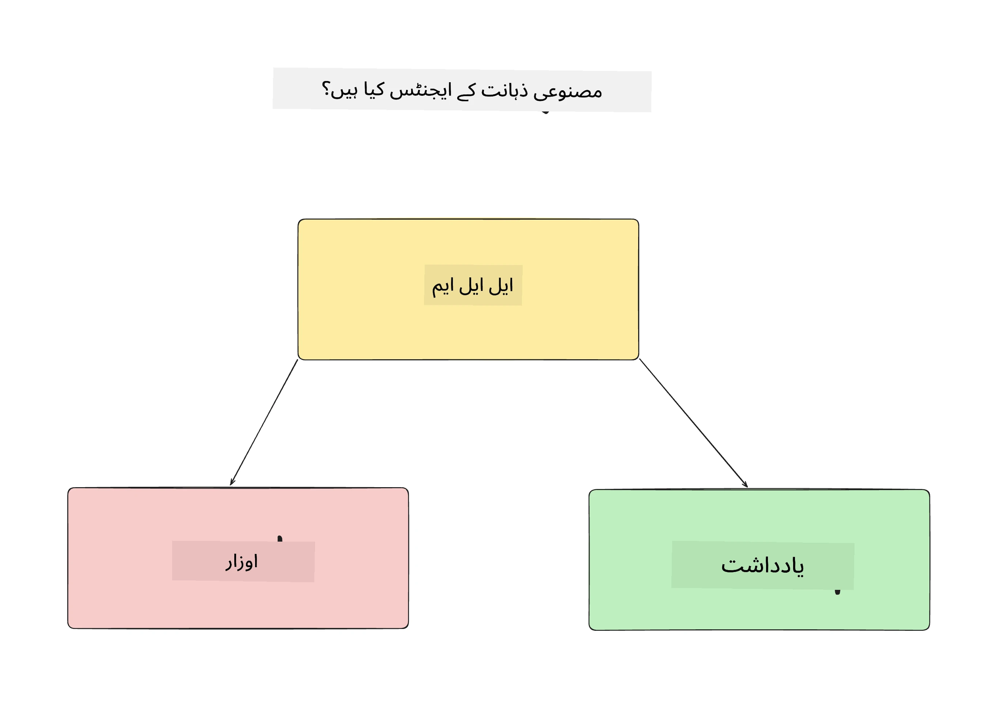
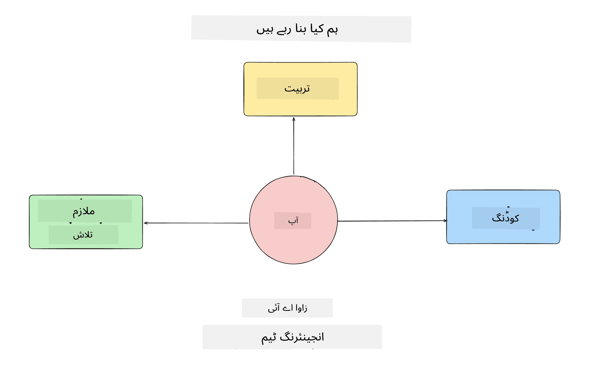
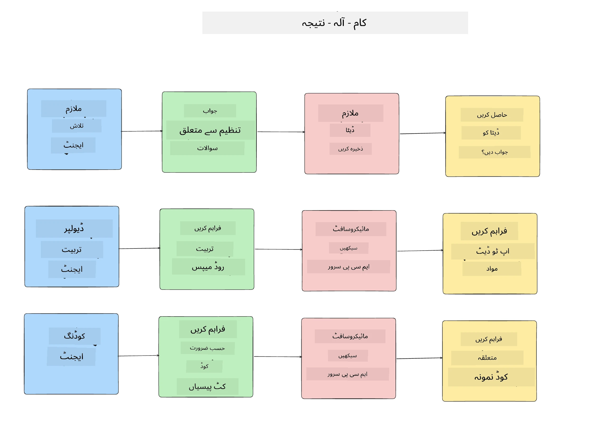
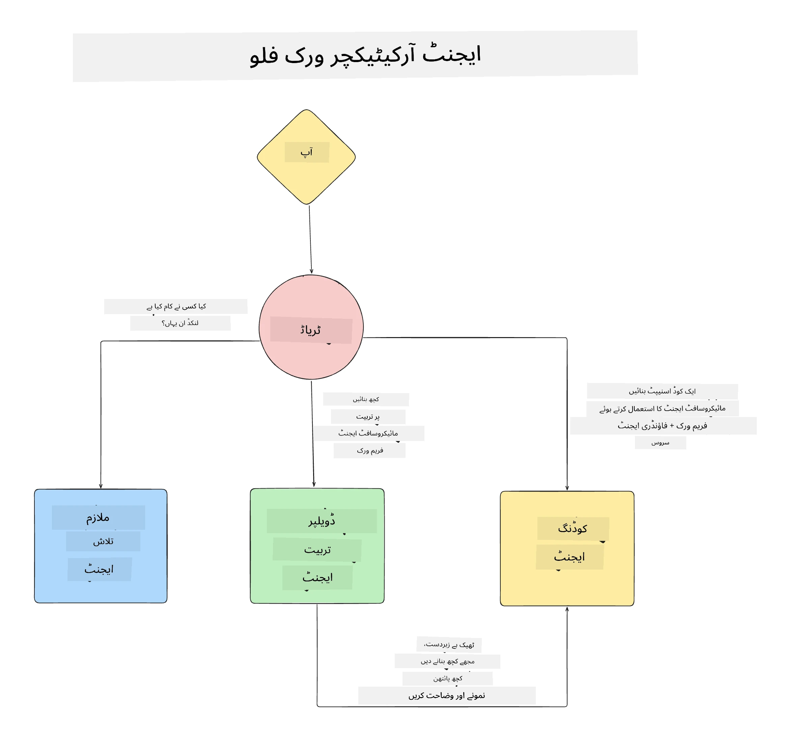

# سبق 1: AI ایجنٹ ڈیزائن  

"زیرو سے پروڈکشن تک AI ایجنٹ بنانے کے کورس" کے پہلے سبق میں خوش آمدید!  

اس سبق میں ہم شامل کریں گے:  

- AI ایجنٹس کیا ہوتے ہیں کی تعریف کرنا  
  
- ہم جو AI ایجنٹ ایپلیکیشن بنا رہے ہیں اس پر بات چیت  

- ہر ایجنٹ کے لیے درکار ٹولز اور سروسز کی شناخت  
  
- اپنے ایجنٹ ایپلیکیشن کا آرکیٹیکچر بنانا  
  
آئیے شروع کرتے ہیں یہ تعریف کرکے کہ ایجنٹ کیا ہوتے ہیں اور ہم انہیں ایپلیکیشن کے اندر کیوں استعمال کریں گے۔  

> **کورس شروع کرنے سے پہلے۔** یہ پہلا سبق نظریاتی ہے — کوئی کوڈ چلانا نہیں ہے۔  
> [سبق 2](../lesson-2-agent-development/README.md) سے آگے آپ کو چاہیے ہوگا: ایک **Azure  
> سبسکرپشن** جس میں **Microsoft Foundry** تک رسائی ہو، ایک تعینات شدہ **GPT-5 سیریز ماڈل** (مثال کے طور پر  
> `gpt-5.1` — ریٹائرڈ GPT-4o / GPT-4.1 سے گریز کریں)، **Python 3.12+**، اور **Azure CLI**  
> (`az login`)۔ تفصیلی فہرست اور لنکس کے لیے کورس README میں [What You Need](../README.md#what-you-need) دیکھیں۔  
 

## AI ایجنٹس کیا ہیں؟  

  

اگر یہ آپ کا پہلا تجربہ ہے کہ آپ AI ایجنٹ کیسے بناتے ہیں، تو آپ کے ذہن میں سوال ہو سکتے ہیں کہ AI ایجنٹ کو بالکل کیسے تعریف کریں۔  

ایک آسان طریقہ یہ ہے کہ AI ایجنٹ کو بننے والے اجزاء کی بنیاد پر تعریف کریں:  

**بڑا زبان ماڈل** - LLM صارف کی طرف سے قدرتی زبان کو سمجھنے کی صلاحیت کو طاقت بخشے گا تاکہ وہ جس کام کو پورا کرنا چاہتا ہے اسے سمجھ سکے اور دستیاب ٹولز کی تفصیلات کو بھی سمجھ سکے تاکہ وہ کام پورا کیا جا سکے۔  

**ٹولز** - یہ فنکشنز، APIs، ڈیٹا اسٹورز اور دیگر سروسز ہوں گے جنہیں LLM استعمال کر کے صارف کی درخواست کردہ کام کو پورا کر سکتا ہے۔  

**میموری** - یہ وہ جگہ ہے جہاں ہم AI ایجنٹ اور صارف کے درمیان مختصر اور طویل مدتی تعاملات کو محفوظ کرتے ہیں۔ اس معلومات کو محفوظ کرنا اور بازیافت کرنا بہت ضروری ہے تاکہ وقت کے ساتھ بہتری لائی جا سکے اور صارف کی ترجیحات کو محفوظ رکھا جا سکے۔  

## ہمارا AI ایجنٹ استعمال کیس  

  

اس کورس کے لیے ہم ایک AI ایجنٹ ایپلیکیشن بنائیں گے جو نئے ڈویلپرز کو ہمارے AI ایجنٹ ڈویلپمنٹ ٹیم میں شامل ہونے میں مدد دے گا!  

ترقیاتی کام شروع کرنے سے پہلے، کامیاب AI ایجنٹ ایپلیکیشن بنانے کا پہلا قدم واضح منظرنامے بنانا ہے کہ ہم اپنے صارفین سے AI ایجنٹس کے ساتھ کیسا کام کرنے کی توقع رکھتے ہیں۔  

اس ایپلیکیشن کے لیے، ہم یہ منظرنامے استعمال کریں گے:  

**منظرنامہ 1:** ایک نیا ملازم ہماری تنظیم میں شامل ہوتا ہے اور وہ جاننا چاہتا ہے کہ وہ کس ٹیم میں شامل ہوا ہے اور کس سے کیسے رابطہ کرے۔  

**منظرنامہ 2:** ایک نیا ملازم جاننا چاہتا ہے کہ اس کے لیے بہترین پہلا کام کیا ہوگا جس پر وہ کام شروع کر سکتا ہے۔  

**منظرنامہ 3:** ایک نیا ملازم سیکھنے کے وسائل اور کوڈ نمونوں کو اکٹھا کرنا چاہتا ہے تاکہ وہ اس کام کو مکمل کرنے میں مدد حاصل کر سکے۔  

## ٹولز اور سروسز کی شناخت  

اب چونکہ ہم نے یہ منظرنامے بنالیے ہیں، اگلا قدم یہ ہے کہ انہیں ان ٹولز اور سروسز کے ساتھ میپ کریں جن کی ہماری AI ایجنٹس کو ان کاموں کو مکمل کرنے کے لیے ضرورت ہوگی۔  

یہ عمل Context Engineering کے زمرے میں آتا ہے کیونکہ ہم اس بات پر توجہ دیں گے کہ ہمارے AI ایجنٹس کے پاس درست وقت پر درست سیاق و سباق ہو تاکہ وہ کام مکمل کر سکیں۔  

آئیے اس عمل کو منظرنامہ بہ منظرنامہ انجام دیں اور ہر ایجنٹ کے کام، ٹولز اور مطلوبہ نتائج کی فہرست بنا کر اچھا agentic ڈیزائن کریں۔  

  

### منظرنامہ 1 - ملازم تلاش ایجنٹ  

**کام** - تنظیم میں ملازمین کے بارے میں سوالات کے جواب دینا جیسے شامل ہونے کی تاریخ، موجودہ ٹیم، مقام اور آخری عہدہ۔  

**ٹولز** - موجودہ ملازمین کی فہرست اور تنظیمی خاکہ کا ڈیٹا سٹور  

**نتائج** - ڈیٹا سٹور سے معلومات بازیافت کرنے کے قابل تاکہ عمومی تنظیمی سوالات اور ملازمین کے متعلق مخصوص سوالات کے جواب دیے جا سکیں۔  

### منظرنامہ 2 - کام کی سفارش ایجنٹ  

**کام** - نئے ملازم کے ڈویلپر تجربے کی بنیاد پر، 1-3 مسائل تجویز کرنا جن پر وہ کام کر سکتا ہے۔  

**ٹولز** - GitHub MCP سرور سے کھلے مسائل حاصل کرنا اور ڈویلپر پروفائل بنانا  

**نتائج** - GitHub پروفائل کے آخری 5 کمٹس اور GitHub پروجیکٹ کے کھلے مسائل کو پڑھ کر اور میچ کی بنیاد پر سفارشات کرنا۔  

### منظرنامہ 3 - کوڈ معاون ایجنٹ  

**کام** - "کام کی سفارش" ایجنٹ کے تجویز کردہ کھلے مسائل کی بنیاد پر، تحقیق کرنا، وسائل فراہم کرنا اور ملازم کی مدد کے لیے کوڈ کے نمونے تیار کرنا۔  

**ٹولز** - Microsoft Learn MCP وسائل تلاش کرنے کے لیے اور کوڈ انٹرپریٹر کسٹم کوڈ نمونے تیار کرنے کے لیے۔  

**نتائج** - اگر صارف مزید مدد طلب کرے تو ورک فلو Learn MCP سرور استعمال کرکے وسائل کے لنکس اور کوڈ نمونے فراہم کرے اور پھر کوڈ انٹرپریٹر ایجنٹ کو تفصیلات کے ساتھ چھوٹے کوڈ نمونے تیار کرنے کے لیے ہینڈ آف کرے۔  

## اپنے ایجنٹ ایپلیکیشن کا آرکیٹیکچر بنانا  

اب جب کہ ہم نے ہر ایجنٹ کی تعریف کر دی ہے، آئیے ایک آرکیٹیکچر ڈایاگرام بنائیں جو ہمیں سمجھائے کہ ہر ایجنٹ کس طرح مل کر اور الگ الگ کام کریں گے، کام کی نوعیت کے مطابق:  

  

## اگلے اقدامات  

اب جب کہ ہم نے ہر ایجنٹ اور اپنے agentic سسٹم کا ڈیزائن کر لیا ہے، آئیے اگلے سبق کی طرف بڑھیں جہاں ہم ان ایجنٹس کو تیار کریں گے!  

---

<!-- CO-OP TRANSLATOR DISCLAIMER START -->
**ڈس کلیمر**:
یہ دستاویز AI ترجمہ سروس [Co-op Translator](https://github.com/Azure/co-op-translator) کے ذریعے ترجمہ کی گئی ہے۔ جبکہ ہم درستگی کے لیے کوشاں ہیں، براہ کرم اس بات سے آگاہ رہیں کہ خودکار ترجمے میں غلطیاں یا عدم درستیاں ہو سکتی ہیں۔ اصل دستاویز اپنے مادری زبان میں مستند ماخذ سمجھی جائے گی۔ حساس معلومات کے لیے پیشہ ور انسانی ترجمہ کی سفارش کی جاتی ہے۔ اس ترجمے کے استعمال سے پیدا ہونے والی کسی بھی غلط فہمی یا غلط تشریح کی ذمہ داری ہم قبول نہیں کرتے۔
<!-- CO-OP TRANSLATOR DISCLAIMER END -->