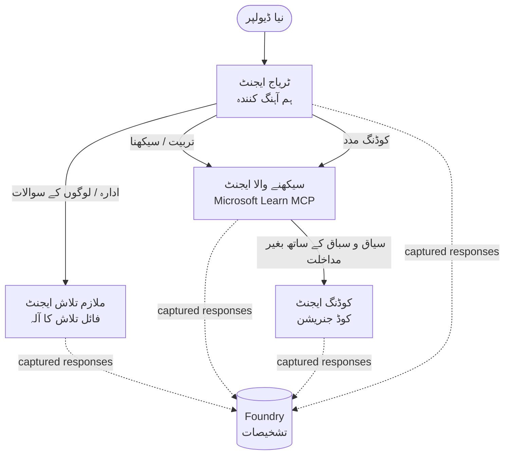

# سبق 3: مائیکروسافٹ فاؤنڈری کے ساتھ ایجنٹ کی تشخیص

**"صفر سے پیداوار تک AI ایجنٹس کی تعمیر"** کورس کے تیسرے سبق میں خوش آمدید!

[سبق 2](../lesson-2-agent-development/README.md) میں آپ نے ایجنٹس بنائے تھے۔ اس سبق میں آپ سیکھیں گے کہ ایک بہت مشکل سوال کا جواب کیسے دیا جائے: **کیا وہ اچھے ہیں؟** ایک ایسا ایجنٹ بھیجنا جو چلتا ہے آسان ہے؛ جاننا کہ آیا وہ صحیح راستہ اختیار کرتا ہے، آپ کے ڈیٹا میں مستحکم رہتا ہے، اور اپنے آلات کو صحیح طریقے سے استعمال کرتا ہے، یہ ایک ڈیمو کو پروڈکشن سسٹم سے الگ کرتا ہے۔


اس سبق میں ہم یہ کور کریں گے:

- ایجنٹ کی تشخیص کی اہمیت اور یہ روایتی ٹیسٹنگ سے کیسے مختلف ہے
- **مشاہدہ پذیری**، **سموک ٹیسٹ**، اور **تشخیصات** کے درمیان فرق
- وہ ملٹی ایجنٹ ورک فلو جس کی ہم پیمائش کرنے جا رہے ہیں
- بلٹ ان **مائیکروسافٹ فاؤنڈری ایویلیویٹرز** (مطلوبہ پن، زمینی حقیقت، ٹول کال درستگی، ٹول آؤٹ پٹ کا استعمال)
- [`agent-evals.py`](../../../lesson-3-agent-evals/agent-evals.py) میں تشخیص پائپ لائن کا مرحلہ وار جائزہ
- اسے کیسے چلائیں اور نتائج پڑھیں

---

## ایجنٹس کی تشخیص کیوں ضروری ہے؟

روایتی یونٹ ٹیسٹ میں یہ ثابت کیا جاتا ہے کہ `add(2, 2) == 4`۔ ایجنٹس اس طرح کام نہیں کرتے — ایک ہی پرامپٹ ہر بار مختلف الفاظ پیدا کر سکتا ہے، آلات مختلف ترتیب میں کال ہو سکتے ہیں، اور "درست" اکثر ایک حد کا معاملہ ہوتا ہے نہ کہ بلیئن۔ آپ عین متنی عبارت پر دعویٰ نہیں کر سکتے۔


اس کے بجائے، آپ ایجنٹس کی تشخیص **معیار کے پہلوؤں** کے ساتھ کرتے ہیں، ماڈل کی بنیاد پر *ایویلیویٹرز* (جنہیں "LLM جیسے جج" بھی کہا جاتا ہے) اور ٹول کے استعمال پر قطعی جانچ کے ذریعہ۔ یہ آپ کو درج ذیل باتیں بتاتا ہے:


- کیا جواب نے واقعی سوال کا جواب دیا؟ (**مطلوبہ پن**)
- کیا جواب حاصل کردہ ڈیٹا سے تعاون یافتہ ہے، یا ایجنٹ نے خیالی باتیں کیں؟ (**زمینی حقیقت**)
- کیا ایجنٹ نے صحیح ٹول کو صحیح دلائل کے ساتھ کال کیا؟ (**ٹول کال درستگی**)
- کیا ایجنٹ نے واقعی وہ استعمال کیا جو ٹول نے واپس کیا؟ (**ٹول آؤٹ پٹ کا استعمال**)

### معیار کی تین تکمیلی پرتیں

یہ مقابلہ کرنے والی تکنیکیں نہیں ہیں — ایک پروڈکشن ایجنٹ تینوں استعمال کرتا ہے:

| پرت | وہ سوال جس کا جواب دیتا ہے | قیمت | کب چلتا ہے | شامل ہے |
|-------|-----------------------------|------|--------------|----------|
| **مشاہدہ پذیری / ٹریسنگ** | *ایجنٹ نے قدم بہ قدم کیا کیا؟* | مفت (ہمیشہ آن) | مسلسل پروڈ میں | یہ سبق |
| **سموک ٹیسٹ** | *کیا ایجنٹ قابل رسائی ہے اور اس کے بنیادی پرامپٹ پر عمل پیرا ہے؟* | سستا، سیکنڈز میں | ہر تعیناتی پر | [سبق 4](../lesson-4-agentdeployment/README.md#smoke-testing-the-hosted-agent-ci-gate) |
| **تشخیصات** | *جوابات کتنے اچھے ہیں؟* | سست، ماڈل کے حساب سے | ضرورت پر / راتانہ / ریلیز سے پہلے | یہ سبق |

سموک ٹیسٹس جواب دیتے ہیں "کیا یہ ٹوٹ گیا؟"؛ تشخیصات جواب دیتی ہیں "کیا یہ اچھا ہے؟"۔ آپ دونوں چاہتے ہیں۔

---

## شرائط لازم

1. مکمل کیا ہوا [سبق 2](../lesson-2-agent-development/README.md) (ایجنٹس + ویکٹر اسٹور)۔
2. ایک **مائیکروسافٹ فاؤنڈری** پروجیکٹ۔
3. **Azure CLI** میں تصدیق شدہ: `az login`۔
4. **Python 3.12+** اور کورس کی ضروریات انسٹال کی گئی ہوں:

   ```bash
   pip install -r ../requirements.txt
   ```


5. ماحول کے متغیرات (اس فولڈر میں `.env` فائل بنائیں یا انہیں برآمد کریں):

   | متغیر | مقصد |
   |----------|---------|
   | `FOUNDRY_PROJECT_ENDPOINT` | آپ کا Foundry پروجیکٹ اینڈپوائنٹ (`https://<account>.services.ai.azure.com/api/projects/<project>`)۔ ایجنٹس کے `FoundryChatClient` **اور** تشخیصی مددگار کے ذریعے پڑھا جاتا ہے۔ |
   | `FOUNDRY_MODEL` | ماڈل تعیناتی جس پر **ایجنٹس** چلتے ہیں (مثلاً `gpt-5.1`)۔ |
   | `VECTOR_STORE_ID` | ملازم-ڈائرکٹری ویکٹر اسٹور جو سبق 2 میں بنایا گیا تھا |
   | `AZURE_AI_MODEL_DEPLOYMENT_NAME` | ماڈل تعیناتی جو **جانچنے والوں** کے ذریعے استعمال ہوتی ہے (ڈیفالٹ `FOUNDRY_MODEL` ہے، پھر `gpt-5.1`) |

> ایجنٹس `FoundryChatClient` استعمال کرتے ہیں، جو ترتیب کو `FOUNDRY_`-سے شروع ہونے والے متغیرات  
> (`FOUNDRY_PROJECT_ENDPOINT`, `FOUNDRY_MODEL`) سے پڑھتا ہے۔ کلاؤڈ تشخیصی مددگار  
> `azure-ai-projects` SDK استعمال کرتا ہے اور اگر `AZURE_AI_PROJECT_ENDPOINT` نہیں سیٹ ہے تو  
> `FOUNDRY_PROJECT_ENDPOINT` پر واپس چلا جاتا ہے — لہٰذا یہ دونوں `FOUNDRY_` متغیرات پورے سبق کو  
> چلانے کے لیے کافی ہیں۔  
>
> جانچنے والے خود بھی ایک ماڈل سے چلائے جاتے ہیں، اس لیے `AZURE_AI_MODEL_DEPLOYMENT_NAME`  
> کنٹرول کرتا ہے کہ کونسی تعیناتی فیصلہ کرتی ہے — یہ ضروری نہیں کہ وہی ماڈل ہو جسے آپ کے  
> ایجنٹس استعمال کرتے ہوں۔  

---

## وہ ورک فلو جسے ہم جانچ رہے ہیں

کچھ جانچنے کے لیے، آپ کو پہلے اسے چلانا ہوتا ہے۔ یہ سبق **ڈویلپر آن بورڈنگ**  
ملٹی-ایجنٹ ورک فلو کو دوبارہ استعمال کرتا ہے: ایک **ٹriage** کوآرڈینیٹر تین ماہرین کو حوالے کرتا ہے۔  



ورک فلو مائیکروسافٹ ایجنٹ فریم ورک کی **handoff** آرکسٹریکشن سے بنایا گیا ہے۔ جانچ کے لیے کلیدی  
خیال یہ ہے کہ **ہر ایجنٹ کا موڑ سرور پر محفوظ کیا جاتا ہے** اور اسے ایک `response_id` کے ذریعے شناخت کیا جاتا ہے۔  
یہ IDs وہی ہیں جو ہم جانچ کی خدمت کو دیتے ہیں۔  

---

## جانچ کا عمل، قدم بہ قدم

[`agent-evals.py`](../../../lesson-3-agent-evals/agent-evals.py) ایک چھ قدمی عمل نافذ کرتا ہے۔ یہاں ہر قدم کیا کرتا ہے  
اور کیوں، بیان کیا گیا ہے۔  

### قدم 1 — ورک فلو چلانا اور response IDs کو ٹریک کرنا

ورک فلو کو `run_stream(...)` کے ساتھ چلایا جاتا ہے، اور جیسے جیسے واقعات واپس آتے ہیں، کوڈ ہر ایجنٹ کے  
پیدا کردہ `response_id` اور `conversation_id` کو ریکارڈ کرتا ہے۔ محفوظ شدہ جوابات تشخیص کے لیے کچا  
مواد ہوتے ہیں — آپ *حقیقی* پیداوار نما جوابات کی درجہ بندی کر رہے ہیں، دوبارہ بنائے گئے نہیں۔  


### قدم 2 — کیا قید کیا گیا اس کا خلاصہ کریں

ایک فوری خلاصہ ہر ایجنٹ کے بنائے گئے جوابات کی تعداد پر چھاپتا ہے، تاکہ آپ تصدیق کر سکیں کہ ورک فلو  
واقعی وہ ایجنٹس استعمال کر رہا ہے جن کی آپ درجہ بندی کرنا چاہتے ہیں۔  

### قدم 3 — آخری جوابات حاصل کریں

ہر ایجنٹ کے لیے، آخری `response_id` پروجیکٹ کے OpenAI-مطابق کلائنٹ سے حاصل کیا جاتا ہے  
(`project_client.get_openai_client().responses.retrieve(...)`) تاکہ آپ اس متن کا پیش نظارہ کر سکیں  
جسے جانچا جائے گا۔  

### قدم 4 — جانچ بنائیں

چار **بلٹ-ان Foundry جانچ کرنے والوں** کے ساتھ ایک جانچ بنائی جاتی ہے:  

| جانچ کرنے والا | `evaluator_name` | یہ کیا ناپتا ہے |
|-----------|------------------|------------------|

| مطابقت | `builtin.relevance` | کیا جواب صارف کی درخواست کو پورا کرتا ہے؟ |

| گراؤنڈڈنیس | `builtin.groundedness` | کیا جواب بازیافت شدہ/ٹول ڈیٹا کی مدد سے دیا گیا ہے (بےبنیاد تخیل نہیں)؟ |
| ٹول کال کی درستگی | `builtin.tool_call_accuracy` | کیا صحیح ٹولز صحیح دلائل کے ساتھ کال کیے گئے؟ |
| ٹول آؤٹ پٹ کا استعمال | `builtin.tool_output_utilization` | کیا ایجنٹ نے اپنے جواب میں واقعی ٹول کے نتائج استعمال کیے؟ |

ہر ایولیویٹر کو `AZURE_AI_MODEL_DEPLOYMENT_NAME` کے ذریعے نامزد کردہ تعیناتی کے ساتھ ابتداء کیا جاتا ہے۔

> **یہ چار کیوں؟** ارتباط اور گراؤنڈڈنیس جواب کے معیار کی پیمائش کرتے ہیں؛ دو ٹول ایولیویٹرز ایجنٹک رویے کی پیمائش کرتے ہیں — جو روایتی NLP میٹرکس پوری طرح سے کھو دیتے ہیں۔ ایک ٹول استعمال کرنے والے، کثیر ایجنٹ سسٹم میں، ٹول میٹرکس اکثر وہ جگہ ہیں جہاں اصل پسپائی چھپی ہوتی ہے۔


### مرحلہ ۵ — جائزہ چلائیں

حراست شدہ `response_id`s کو `evals.runs.create(...)` میں ڈیٹا سورس کے طور پر دیا جاتا ہے۔ سروس ہر محفوظ شدہ جواب کو ہر ایولیویٹر کے ذریعے دوبارہ چلتا ہے۔


### مرحلہ ۶ — نگرانی کریں اور نتائج پڑھیں

کوڈ رن کو پول کرتا ہے جب تک کہ وہ `completed` یا `failed` نہ ہو جائے، پھر نتیجہ کی گنتی اور ایک **`report_url`** — فاؤنڈری پورٹل کا ایک گہرا لنک جو آپ کو فی میٹرک اسکور، پاس/فیل گنتی، اور فردی جج کیے گئے جوابات دیکھنے کی اجازت دیتا ہے — کو پرنٹ کرتا ہے۔


---

## اسے چلائیں

```bash
cd lesson-3-agent-evals
python agent-evals.py
```

ڈیفالٹ کے طور پر یہ پہلا مثال سوال (`"میں یہاں نیا ہوں! کیا یہاں کسی نے مائیکروسافٹ میں کام کیا ہے؟"`) کا جائزہ لیتا ہے۔ مزید دو کثیر مقصدی مثال سوالات `run_evaluation_workflow()` میں شامل ہیں — `query` متغیر کو بدل کر ایسے راستہ سازی کے سیناریوز آزمائیں جو ایک ہی رن میں مزید ایجنٹس کو استعمال کرتے ہیں۔


```
Step 1: Running Developer Onboarding Workflow
Step 2: Response Data Summary
Step 3: Fetching Agent Responses
Step 4: Creating Evaluation
Step 5: Running Evaluation
Step 6: Monitoring Evaluation
  Status: running ...
  Evaluation completed successfully
  Report URL: https://...   <-- open this in the Foundry portal
```

---

## مشاہداتی صلاحیت اور ٹریسنگ

ایولیویشن آپ کو بتاتی ہے کہ جوابات *کتنے اچھے* تھے؛ مشاہداتی صلاحیت آپ کو بتاتی ہے کہ *کیا ہوا* تاکہ انہیں پیدا کیا جا سکے — ہر ایجنٹ کی چھلانگ، ٹول کال، ٹوکن کی گنتی، اور تاخیر۔ مائیکروسافٹ فاؤنڈری میں، ایجنٹ رنز اوپن ٹیلیمیٹری ٹریس جاری کرتے ہیں جنہیں آپ پورٹل میں دیکھ سکتے ہیں، اور ایجنٹ فریم ورک انہیں آسانی سے Azure Monitor / Application Insights کو ایک کال کے ذریعے برآمد کر سکتا ہے:


```python
from agent_framework.foundry import FoundryChatClient

client = FoundryChatClient()
client.configure_azure_monitor()   # ٹریسز اور میٹرکس کو ایپلیکیشن انسائٹس پر برآمد کریں
```

خراب ایولیویشن اسکور کی **ڈیبگنگ** کے لیے ٹریسنگ استعمال کریں: جب گراؤنڈڈنیس کم ہو، ٹریس آپ کو دکھاتا ہے کہ کیا فائل سرچ ٹول نے کچھ نہیں لوٹایا، یا وہ ڈیٹا لوٹایا جو ایجنٹ نے پھر نظر انداز کر دیا (جو بالکل وہی ہے جسے ٹول آؤٹ پٹ کے استعمال کا اسکور دیا جاتا ہے)۔


---

## "رنز" سے "اچھا" تک: عملی استعمال کا طریقہ

- **پری-ریلیز گیٹ۔** نئی پرامپٹ یا ماڈل کو فروغ دینے سے پہلے ایک مقررہ نمونہ سوالات کے خلاف ایولیویشنز چلائیں۔ اسکورز کا موازنہ پچھلے ورژن سے کریں — ڈراپ کو پسپائی سمجھیں۔
- **راتانہ معیار کا اشارہ۔** ڈیٹا یا انحصار میں تبدیلیوں کو پکڑنے کے لیے ایولیویشن کو شیڈول کریں۔
- **اسموک ٹیسٹس کے ساتھ جوڑیں۔** [سبق ۴ کا اسموک ٹیسٹ](../lesson-4-agentdeployment/README.md#smoke-testing-the-hosted-agent-ci-gate) آپ کا تیز رفتار فی تعیناتی گیٹ ہے؛ ایولیویشنز سست مگر گہرا معیار گیٹ ہیں۔ ہر مرج پر سستا ٹیسٹ چلائیں اور شیڈول پر یا ریلیز سے پہلے مہنگا ٹیسٹ چلائیں۔


---

## جدید کاری کا نوٹ

یہ نمونہ موجودہ مائیکروسافٹ ایجنٹ فریم ورک فاؤنڈری API سطح (`agent_framework.foundry`) کی طرف مائیگریٹ کیا جا رہا ہے۔ اگر آپ کوڈ اپ ڈیٹ کر رہے ہیں تو ریپوزٹری روٹ [`MIGRATION-GUIDE.md`](../MIGRATION-GUIDE.md) دیکھیں جس میں تصدیق شدہ قبل/بعد درآمدات اور کلائنٹ میپنگز شامل ہیں (مثلاً `AzureAIClient` -> `FoundryChatClient`، اور ہوسٹ شدہ ٹول کی تعمیر `client.get_file_search_tool(...)` / `client.get_mcp_tool(...)` کے ذریعے)۔ اوپر دی گئی ایوالیویشن تصورات اور چھ مرحلوں کا پائپ لائن مائیگریشن سے متاثر نہیں ہوتی۔


---

## وسائل

- [جنریٹیو AI ماڈلز اور ایپلیکیشنز کا جائزہ لیں (Microsoft Learn)](https://learn.microsoft.com/en-us/azure/ai-foundry/concepts/evaluation-approach-gen-ai)
- [جنریٹیو AI کے لیے بلٹ ان ایولیویٹرز](https://learn.microsoft.com/en-us/azure/ai-foundry/concepts/evaluation-evaluators/agent-evaluators)
- [مائیکروسافٹ فاؤنڈری میں نظر پذیری](https://learn.microsoft.com/en-us/azure/ai-foundry/concepts/observability)
- [مائیکروسافٹ ایجنٹ فریم ورک](https://github.com/microsoft/agent-framework)
- [ایجنٹ ہینڈ آف آرکسٹریشن](https://learn.microsoft.com/en-us/agent-framework/workflows/orchestrations/handoff)

---

<!-- CO-OP TRANSLATOR DISCLAIMER START -->
**ڈس کلیمر**:
یہ دستاویز AI ترجمہ سروس [Co-op Translator](https://github.com/Azure/co-op-translator) کے ذریعے ترجمہ کی گئی ہے۔ جبکہ ہم درستگی کے لیے کوشاں ہیں، براہ کرم اس بات سے آگاہ رہیں کہ خودکار ترجمے میں غلطیاں یا عدم درستیاں ہو سکتی ہیں۔ اصل دستاویز اپنے مادری زبان میں مستند ماخذ سمجھی جائے گی۔ حساس معلومات کے لیے پیشہ ور انسانی ترجمہ کی سفارش کی جاتی ہے۔ اس ترجمے کے استعمال سے پیدا ہونے والی کسی بھی غلط فہمی یا غلط تشریح کی ذمہ داری ہم قبول نہیں کرتے۔
<!-- CO-OP TRANSLATOR DISCLAIMER END -->