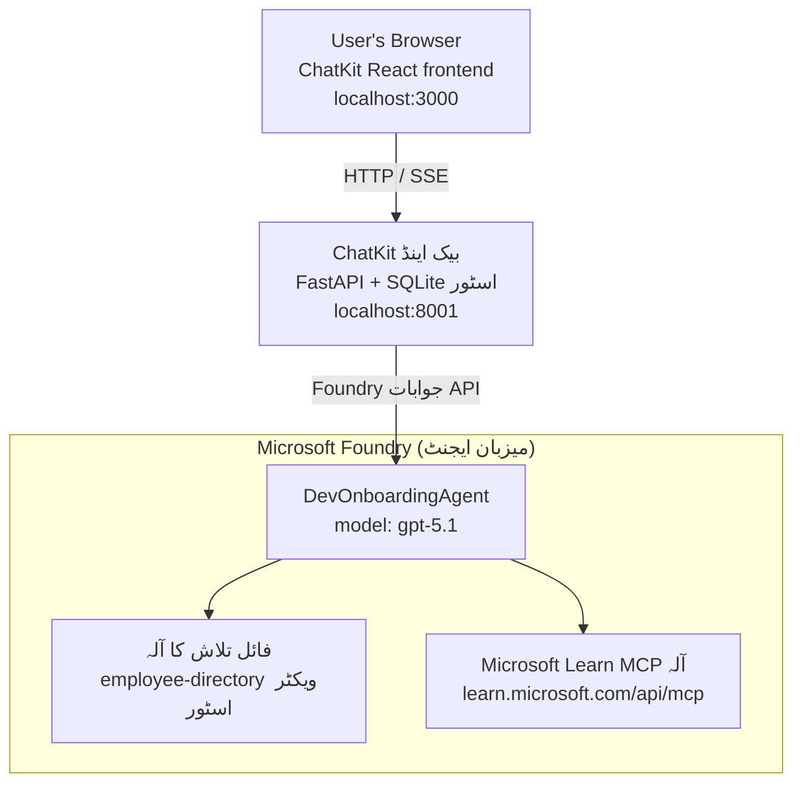

# سبق 4: Microsoft Foundry میزبان ایجنٹس + ChatKit کے ساتھ ایجنٹ کی تعیناتی

یہ سبق ظاہر کرتا ہے کہ کس طرح ایک ٹول استعمال کرنے والے ایجنٹ کو Microsoft Foundry پر میزبان ایجنٹ کے طور پر تعینات کیا جائے اور اس کے ساتھ بات چیت کرنے کے لیے ChatKit پر مبنی فرنٹ اینڈ بنایا جائے۔

## آرکیٹیکچر

میزبان ایجنٹ ایک **واحد `DevOnboardingAgent`** ہے (جو `gpt-5.1` پر چل رہا ہے) جو دو میزبان ٹولز استعمال کرکے ڈیولپر آن بورڈنگ سوالات کے جواب دیتا ہے: ایک **فائل سرچ** ٹول جو employee-directory ویکٹر اسٹور پر کام کرتا ہے، اور **Microsoft Learn MCP** ٹول۔ ایک ChatKit React فرنٹ اینڈ ایک FastAPI بیک اینڈ سے بات کرتا ہے، جو ایجنٹ کو Foundry **Responses API** کے ذریعے کال کرتا ہے۔



## ضروریات

1. شمال وسطی امریکہ کے خطے میں **Microsoft Foundry پروجیکٹ**
2. **Azure CLI** کی توثیق شدہ (`az login`)
3. **Azure Developer CLI** (`azd`) انسٹال شدہ
4. **Python 3.12+** اور **Node.js 18+**
5. ملازمین کے ڈیٹا کے ساتھ **ویکٹر اسٹور** بنایا ہوا

## فوری آغاز

### 1. ماحول کے متغیرات سیٹ کریں

```bash
cd lesson-4-agentdeployment
cp .env.example .env
# .env کو اپنے Microsoft Foundry پروجیکٹ کی تفصیلات کے ساتھ ترمیم کریں
```

### 2. میزبان ایجنٹ کو تعینات کریں

**اختیار A: Azure Developer CLI کا استعمال (تجویز کردہ)**

```bash
cd hosted-agent
azd auth login
azd agent deploy
```

**اختیار B: Docker + Azure Container Registry کا استعمال**

```bash
cd hosted-agent

# کنٹینر بنائیں
docker build -t developer-onboarding-agent:latest .

# ACR کیلئے ٹیگ
docker tag developer-onboarding-agent:latest <your-acr>.azurecr.io/developer-onboarding-agent:latest

# ACR پر پش کریں
az acr login --name <your-acr>
docker push <your-acr>.azurecr.io/developer-onboarding-agent:latest

# Microsoft Foundry پورٹل یا SDK کے ذریعے تعینات کریں
```

### 3. ChatKit بیک اینڈ شروع کریں

```bash
cd chatkit-server
python -m venv .venv
source .venv/bin/activate  # ونڈوز پر: .venv\Scripts\activate
pip install -r requirements.txt
python app.py
```

سرور `http://localhost:8001` پر شروع ہوگا

### 4. ChatKit فرنٹ اینڈ شروع کریں

```bash
cd chatkit-server/frontend
npm install
npm run dev
```

فرنٹ اینڈ `http://localhost:3000` پر شروع ہوگا

### 5. ایپلیکیشن کا تجربہ کریں

اپنے براؤزر میں `http://localhost:3000` کھولیں اور یہ سوالات آزمائیں:

**ملازم تلاش:**
- "میں یہاں نیا ہوں! کیا کسی نے Microsoft میں کام کیا ہے؟"
- "کون Azure Functions کے ساتھ تجربہ رکھتا ہے؟"

**تعلیمی وسائل:**
- "Kubernetes کے لیے ایک تعلیمی راستہ بنائیں"
- "کلاؤڈ آرکیٹیکچر کے لیے مجھے کون سی سرٹیفیکیشنز حاصل کرنی چاہئیں؟"

**کوڈنگ مدد:**
- "CosmosDB سے کنیکٹ کرنے کے لیے Python کوڈ لکھنے میں مدد کریں"
- "مجھے دکھائیں کہ Azure Function کیسے بنائی جاتی ہے"

**کئی ایجنٹ کے سوالات:**
- "میں ایک کلاؤڈ انجینئر کی حیثیت سے شروع کر رہا ہوں۔ مجھے کس سے رابطہ کرنا چاہیے اور کیا سیکھنا چاہیے؟"

## پروجیکٹ کی ساخت

```
lesson-4-agentdeployment/
├── .env.example                 # Environment variables template
├── implementation-plan.md       # Detailed implementation guide
├── README.md                    # This file
├── hosted-agent/               # Microsoft Foundry hosted agent
│   ├── main.py                 # Multi-agent workflow implementation
│   ├── requirements.txt        # Python dependencies
│   ├── Dockerfile              # Container definition
│   └── agent.yaml              # Agent deployment configuration
└── chatkit-server/             # ChatKit server application
    ├── app.py                  # FastAPI backend
    ├── store.py                # SQLite persistence layer
    ├── requirements.txt        # Python dependencies
    └── frontend/               # React frontend
        ├── package.json
        ├── vite.config.ts
        ├── tsconfig.json
        ├── index.html
        └── src/
            ├── main.tsx
            ├── App.tsx
            ├── App.css
            └── index.css
```

## ایجنٹ اور اس کے ٹولز

میزبان ایجنٹ ایک **واحد ایجنٹ** ہے (`DevOnboardingAgent`, جو `hosted-agent/main.py` میں تعریف شدہ ہے) جو تین آن بورڈنگ ڈومینز کو سنبھالتا ہے۔ الگ الگ ذیلی ایجنٹس کو منظم کرنے کے بجائے، یہ ہر صلاحیت کو ایک ٹول کے طور پر مہیا کرتا ہے (یا ماڈل پر براہ راست انحصار کرتا ہے):

| صلاحیت | اسے کس طرح سنبھالا جاتا ہے | ٹول |
|-----------|------------------|------|
| **ملازم تلاش اور کنیکشنز** | Foundry میزبان File Search جو employee-directory ویکٹر اسٹور پر کام کرتا ہے | `client.get_file_search_tool(vector_store_ids=[...])` |
| **تعلیمی اور تربیتی مواد** | Microsoft Learn MCP سرور (میزبان MCP ٹول) | `client.get_mcp_tool(url="https://learn.microsoft.com/api/mcp")` |
| **کوڈنگ مدد** | `gpt-5.1` ماڈل کی جانب سے براہ راست ہینڈل کی جاتی ہے — کوئی بیرونی ٹول نہیں | — |

ایجنٹ کو `client.as_agent(name="DevOnboardingAgent", instructions=..., tools=[file_search_tool, learn_mcp_tool])` کے ساتھ بنایا جاتا ہے اور `from_agent_framework(agent).run()` سے چلایا جاتا ہے۔

> **ڈیزائن نوٹ۔** اس سبق کے ابتدائی مسودات میں `HandoffBuilder` ملٹی ایجنٹ ورک فلو (Triager → ماہرین) استعمال کیا گیا تھا۔ بھیجا گیا ایجنٹ ایک واحد ٹول استعمال کرنے والا ایجنٹ ہے، جو آن بورڈنگ طرز کے سوال و جواب کے لیے تعیناتی اور سمجھنے میں آسان ہے۔ ملٹی ایجنٹ آرکیسٹریشن اور ہینڈ آف کی مثال کے لیے سبق 2 اور سبق 3 دیکھیں۔

## میزبان ایجنٹ کا سمُوک ٹیسٹ (CI گیٹ)

میزبان ایجنٹ کی "کامیابی سے" تعیناتی صرف یہ ثابت کرتی ہے کہ کنٹرول پلین نے تعریف کو قبول کیا ہے —
یہ **ثابت نہیں** کرتی کہ ایجنٹ واقعی جواب دیتا ہے۔ کوئی گم شدہ انحصار،
ماڈل کی غلط راستہ سازی، یا منقطع کنکشن ایک ہرا لیکن خاموش ایجنٹ چھوڑ سکتے ہیں۔

یہ سبق ایک ہلکا پھلکا **سموک ٹیسٹ** فراہم کرتا ہے جو تعیناتی کے بعد ایک تیز اور سستا گیٹ کا کام دیتا ہے۔
یہ [AI Smoke Test](https://github.com/marketplace/actions/ai-smoke-test)
GitHub Action استعمال کرتا ہے تاکہ ایجنٹ کے Foundry **Responses** اینڈ پوائنٹ پر بلاوا بھیجے
(`POST {project_endpoint}/agents/{agent_name}/endpoint/protocols/openai/responses`)
اور واپس آنے والے متن کی تصدیق کرے۔ یہ چند سیکنڈز میں خراب تعیناتیاں، توثیقی رکاوٹیں،
نظام کے پرامپٹ میں انحراف، اور تھریڈنگ کی خرابی کو پکڑ لیتا ہے۔

> سموک ٹیسٹ مکمل جائزوں کی جگہ **نہیں** ہیں جو
> [سبق 3](../lesson-3-agent-evals/README.md) میں کیے جاتے ہیں — یہ اس کی تائید کرتے ہیں۔ سموک ٹیسٹ
> جواب دیتے ہیں *"کیا ایجنٹ پہنچا جا سکتا ہے، جواب دے رہا ہے، اور بنیادی پرامپٹ توقعات پر عمل کر رہا ہے؟"*
>؛ جائزے جواب دیتے ہیں *"جواب کیسا ہے؟"۔* ہر تعیناتی پر یہ سستا گیٹ چلائیں۔

### کیا ٹیسٹ ہوتا ہے

کیٹلاگ [`hosted-agent/tests/smoke-tests.json`](../../../lesson-4-agentdeployment/hosted-agent/tests/smoke-tests.json) میں ہے
اور ایجنٹ کے تین ڈومینز کے ساتھ ساتھ پرامپٹ کی پابندی اور ملٹی ٹرن تھریڈنگ کا جائزہ لیتا ہے:

| ٹیسٹ | یہ کیا تصدیق کرتا ہے |
|------|------------------|
| `reachability` | ایجنٹ غیر خالی، دائرہ کار میں متن سے جواب دیتا ہے |
| `employee-search` | فائل سرچ ڈومین صحت مند `200` واپس کرتا ہے (جواب ڈیٹا پر منحصر ہے) |
| `learning-path` | تعلیمی ڈومین موضوع کی تکرار کرتا ہے اور راستہ نما جواب فراہم کرتا ہے |
| `coding-assistance` | کوڈنگ ڈومین Python میں کوڈ نما جواب دیتا ہے |
| `prompt-adherence-offtopic` | موضوع سے ہٹ کر سوال کی سمت بدل دی جاتی ہے، تفصیل میں جواب نہیں دیا جاتا |
| `threading-turn-1/2` | گفتگو کی حالت `previous_response_id` کے ذریعے ٹرنز کے درمیان برقرار رہتی ہے |

### اسے CI میں چلائیں

ورک فلو [`.github/workflows/smoke-test-hosted-agent.yml`](../../../.github/workflows/smoke-test-hosted-agent.yml)
میں دو کام ہیں:

- **`static`** — ایک تیز، بغیر Azure کے گیٹ جو ہر پل ریکوئسٹ اور پش پر چلتا ہے:
  یہ تمام Python سورسز کو مرتب کرتا ہے (`py_compile`) اور Markdown لنکس چیک کرتا ہے۔ کوئی راز درکار نہیں،
  لہٰذا یہ فورک PRs پر بھی کام کرتا ہے۔
- **`smoke`** — نیچے دیا گیا Azure سے منسلک سموک ٹیسٹ۔ یہ ضرورت پڑنے پر چلتا ہے
  (Actions → **Agent CI (static + smoke)** → ورک فلو چلائیں) اور آپ کی
  تعیناتی ورک فلو کے بعد بھی چلایا جا سکتا ہے۔

اس سموک جاب کے لیے یہ ریپوزیٹری **متغیرات** اور **راز** ترتیب دیں:

| قسم | نام | قیمت |
|------|------|-------|

| ویریبل | `FOUNDRY_PROJECT_ENDPOINT` | `https://<account>.services.ai.azure.com/api/projects/<project>` |
| ویریبل | `HOSTED_AGENT_NAME` | تعینات شدہ ایجنٹ کا نام (مثلاً `dev-onboarding` — آپ کی تعینات سے میل کھانا چاہیے) |
| سیکرٹ | `AZURE_CLIENT_ID` / `AZURE_TENANT_ID` / `AZURE_SUBSCRIPTION_ID` | `azure/login` کے لئے OIDC وفاقی شناخت |

رنر شناخت کو **`Azure AI User`** کا کردار **Foundry پروجیکٹ دائرہ کار** پر چاہیے تاکہ یہ
Responses (اور گفتگو) ڈیٹا-پلین اینڈ پوائنٹس کو کال کر سکے۔ اسے مندرجہ ذیل کے ساتھ دیں:

```bash
az role assignment create \
  --assignee <object-id-or-appId-of-runner-identity> \
  --role "Azure AI User" \
  --scope "/subscriptions/<sub>/resourceGroups/<rg>/providers/Microsoft.CognitiveServices/accounts/<account>/projects/<project>"
```

### اسے مقامی طور پر چلائیں

آپ اسی کیٹلاگ کو پش کرنے سے پہلے چلا سکتے ہیں۔ `https://ai.azure.com/` کے دائرہ کار میں
ایک ڈیٹا-پلین ٹوکن حاصل کریں اور رنر کو اپنی تعینات کی طرف اشارہ کریں:

```bash
# سامعین لازمی ہے کہ https://ai.azure.com/ ہو (cognitiveservices.azure.com کے ٹوکن مسترد کر دیے جاتے ہیں)
export FOUNDRY_TOKEN=$(az account get-access-token --resource https://ai.azure.com/ --query accessToken -o tsv)

git clone https://github.com/JFolberth/ai-smoketest && cd ai-smoketest
python runner.py \
  --project-endpoint "https://<account>.services.ai.azure.com/api/projects/<project>" \
  --agent-name dev-onboarding \
  --tests-file ../lesson-4-agentdeployment/hosted-agent/tests/smoke-tests.json
```

ایگزٹ کوڈز: `0` سب کامیاب، `1` ایک مفروضہ ناکام، `2` رنر کی خرابی (خراب کیٹلاگ / ٹوکن)۔

## مسائل کا حل

### ایجنٹ جواب نہیں دے رہا
- تصدیق کریں کہ ہوسٹڈ ایجنٹ مائیکروسافٹ فائونڈری میں تعینات اور چل رہا ہے
- `HOSTED_AGENT_NAME` اور `HOSTED_AGENT_VERSION` آپ کی تعینات سے میل کھاتے ہیں اس کی جانچ کریں

### ویکٹر اسٹور کی غلطیاں
- اس بات کو یقینی بنائیں کہ `VECTOR_STORE_ID` صحیح طریقے سے سیٹ ہے
- تصدیق کریں کہ ویکٹر اسٹور میں ملازمین کا ڈیٹا موجود ہے

### توثیق کی غلطیاں
- اعتبارات کو تازہ کرنے کے لیے `az login` چلائیں
- اس بات کو یقینی بنائیں کہ آپ کو مائیکروسافٹ فائونڈری پروجیکٹ تک رسائی حاصل ہے

## وسائل

- [مائیکروسافٹ فائونڈری ہوسٹڈ ایجنٹس دستاویزات](https://learn.microsoft.com/en-us/azure/ai-foundry/agents/concepts/hosted-agents)
- [مائیکروسافٹ ایجنٹ فریم ورک](https://github.com/microsoft/agent-framework)
- [چیٹ کٹ انٹیگریشن سیمپل](https://github.com/microsoft/agent-framework/tree/main/python/samples/demos/chatkit-integration)
- [ایزور ڈیولپر CLI](https://learn.microsoft.com/en-us/azure/developer/azure-developer-cli/overview)
- [AI سموک ٹیسٹ GitHub ایکشن](https://github.com/marketplace/actions/ai-smoke-test)
- [GitHub Actions کے ساتھ مائیکروسافٹ فائونڈری ایجنٹس کا سموک ٹیسٹ (بلاگ)](https://techcommunity.microsoft.com/blog/azuredevcommunityblog/smoke-test-microsoft-foundry-agents-with-github-actions/4531912)

---

## اگلے اقدامات

آپ کا ایجنٹ مائیکروسافٹ کے زیر انتظام انفراسٹرکچر پر چلتا ہے۔ اسے انٹرپرائز پروڈکشن میں لے جانے کے لیے —
جہاں اس کا ڈیٹا موجود ہے اس پر کنٹرول (ڈیٹا خود مختاری، نجی نیٹ ورکنگ، اپنی Azure Cosmos DB / Storage / AI Search لانا)
اور اس کے آلات کی نگرانی — جاری رکھیں
**[سبق 5: پروڈکشن ہوسٹڈ ایجنٹس](../lesson-5-hosted-agents-production/README.md)**، جو کہ
**ہوسٹڈ ایجنٹس** اور **صلاحیت میزبانوں** کے درمیان اہم فرق کی وضاحت کرتا ہے۔

---

<!-- CO-OP TRANSLATOR DISCLAIMER START -->
**ڈس کلیمر**:
یہ دستاویز AI ترجمہ سروس [Co-op Translator](https://github.com/Azure/co-op-translator) کے ذریعے ترجمہ کی گئی ہے۔ جبکہ ہم درستگی کے لیے کوشاں ہیں، براہ کرم اس بات سے آگاہ رہیں کہ خودکار ترجمے میں غلطیاں یا عدم درستیاں ہو سکتی ہیں۔ اصل دستاویز اپنے مادری زبان میں مستند ماخذ سمجھی جائے گی۔ حساس معلومات کے لیے پیشہ ور انسانی ترجمہ کی سفارش کی جاتی ہے۔ اس ترجمے کے استعمال سے پیدا ہونے والی کسی بھی غلط فہمی یا غلط تشریح کی ذمہ داری ہم قبول نہیں کرتے۔
<!-- CO-OP TRANSLATOR DISCLAIMER END -->