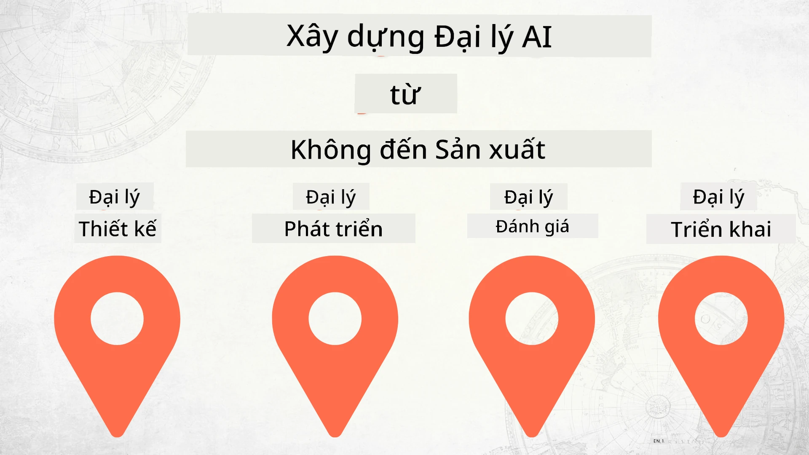

# Xây dựng Đại lý AI từ con số 0 đến Sản xuất



### 🌐 Hỗ trợ Đa Ngôn Ngữ

#### Hỗ trợ thông qua GitHub Action (Tự động & Luôn Cập nhật)

<!-- CO-OP TRANSLATOR LANGUAGES TABLE START -->
[Arabic](../ar/README.md) | [Bengali](../bn/README.md) | [Bulgarian](../bg/README.md) | [Burmese (Myanmar)](../my/README.md) | [Chinese (Simplified)](../zh-CN/README.md) | [Chinese (Traditional, Hong Kong)](../zh-HK/README.md) | [Chinese (Traditional, Macau)](../zh-MO/README.md) | [Chinese (Traditional, Taiwan)](../zh-TW/README.md) | [Croatian](../hr/README.md) | [Czech](../cs/README.md) | [Danish](../da/README.md) | [Dutch](../nl/README.md) | [Estonian](../et/README.md) | [Finnish](../fi/README.md) | [French](../fr/README.md) | [German](../de/README.md) | [Greek](../el/README.md) | [Hebrew](../he/README.md) | [Hindi](../hi/README.md) | [Hungarian](../hu/README.md) | [Indonesian](../id/README.md) | [Italian](../it/README.md) | [Japanese](../ja/README.md) | [Kannada](../kn/README.md) | [Khmer](../km/README.md) | [Korean](../ko/README.md) | [Lithuanian](../lt/README.md) | [Malay](../ms/README.md) | [Malayalam](../ml/README.md) | [Marathi](../mr/README.md) | [Nepali](../ne/README.md) | [Nigerian Pidgin](../pcm/README.md) | [Norwegian](../no/README.md) | [Persian (Farsi)](../fa/README.md) | [Polish](../pl/README.md) | [Portuguese (Brazil)](../pt-BR/README.md) | [Portuguese (Portugal)](../pt-PT/README.md) | [Punjabi (Gurmukhi)](../pa/README.md) | [Romanian](../ro/README.md) | [Russian](../ru/README.md) | [Serbian (Cyrillic)](../sr/README.md) | [Slovak](../sk/README.md) | [Slovenian](../sl/README.md) | [Spanish](../es/README.md) | [Swahili](../sw/README.md) | [Swedish](../sv/README.md) | [Tagalog (Filipino)](../tl/README.md) | [Tamil](../ta/README.md) | [Telugu](../te/README.md) | [Thai](../th/README.md) | [Turkish](../tr/README.md) | [Ukrainian](../uk/README.md) | [Urdu](../ur/README.md) | [Vietnamese](./README.md)

> **Ưu tiên Clone cục bộ?**
>
> Kho lưu trữ này bao gồm hơn 50 bản dịch ngôn ngữ, điều này làm tăng đáng kể kích thước tải về. Để clone mà không tải bản dịch, hãy sử dụng sparse checkout:
>
> **Bash / macOS / Linux:**
> ```bash
> git clone --filter=blob:none --sparse https://github.com/microsoft/Building-AI-Agents-From-Zero-To-Production.git
> cd Building-AI-Agents-From-Zero-To-Production
> git sparse-checkout set --no-cone '/*' '!translations' '!translated_images'
> ```
>
> **CMD (Windows):**
> ```cmd
> git clone --filter=blob:none --sparse https://github.com/microsoft/Building-AI-Agents-From-Zero-To-Production.git
> cd Building-AI-Agents-From-Zero-To-Production
> git sparse-checkout set --no-cone "/*" "!translations" "!translated_images"
> ```
>
> Điều này cung cấp cho bạn mọi thứ cần thiết để hoàn thành khóa học với tốc độ tải về nhanh hơn nhiều.
<!-- CO-OP TRANSLATOR LANGUAGES TABLE END -->

## Một khóa học dạy bạn các kiến thức cơ bản về Vòng đời Phát triển Đại lý AI

[](https://github.com/microsoft/Building-AI-Agents-From-Zero-To-Production/blob/master/LICENSE?WT.mc_id=academic-105485-koreyst)
[](https://GitHub.com/microsoft/Building-AI-Agents-From-Zero-To-Production/graphs/contributors/?WT.mc_id=academic-105485-koreyst)
[](https://GitHub.com/microsoft/Building-AI-Agents-From-Zero-To-Production/issues/?WT.mc_id=academic-105485-koreyst)
[](https://GitHub.com/microsoft/Building-AI-Agents-From-Zero-To-Production/pulls/?WT.mc_id=academic-105485-koreyst)
[](http://makeapullrequest.com?WT.mc_id=academic-105485-koreyst)

[](https://discord.gg/Kuaw3ktsu6)

## 🌱 Bắt Đầu

Khóa học này có các bài học bao quát các kiến thức cơ bản về xây dựng và triển khai Đại lý AI.

Mỗi bài học xây dựng dựa trên bài trước đó, nên chúng tôi khuyến nghị bạn bắt đầu từ đầu và làm theo từng bước đến cuối cùng.

Nếu bạn muốn khám phá thêm về các chủ đề Đại lý AI, bạn có thể xem khóa học [Đại lý AI cho Người Mới Bắt Đầu](https://aka.ms/ai-agents-beginners).

### Gặp Gỡ Người Học Khác, Nhận Trả Lời Cho Câu Hỏi

Nếu bạn gặp trở ngại hoặc có câu hỏi về xây dựng Đại lý AI, hãy tham gia Kênh Discord chuyên dụng của chúng tôi trong [Microsoft Foundry Discord](https://discord.gg/Kuaw3ktsu6).

### Những gì bạn cần

Mỗi bài học có kèm theo mẫu mã nguồn riêng mà bạn có thể chạy cục bộ. Bạn có thể [fork repo này](https://github.com/microsoft/Building-AI-Agents-From-Zero-To-Production/fork) để tạo bản sao của riêng mình.

Khóa học hiện tại sử dụng các công cụ sau:

- [Microsoft Agent Framework (MAF)](https://aka.ms/ai-agents-beginners/agent-framework)
- [Microsoft Foundry](https://azure.microsoft.com/products/ai-foundry)
- [Dịch vụ Azure OpenAI](https://azure.microsoft.com/products/ai-foundry/models/openai)
- [Azure CLI](https://learn.microsoft.com/cli/azure/authenticate-azure-cli?view=azure-cli-latest)

Vui lòng đảm bảo bạn có quyền truy cập vào các dịch vụ trên trước khi bắt đầu.

Sẽ có thêm các lựa chọn về lưu trữ mô hình và dịch vụ khác sắp tới.

## 🗃️ Các Bài Học

| **Bài học**         | **Mô tả**                                                                                  |
|--------------------|--------------------------------------------------------------------------------------------------|
| [Thiết kế Đại lý](./lesson-1-agent-design/README.md)       | Giới thiệu về trường hợp sử dụng Đại lý "Hướng dẫn Nhà phát triển" và cách thiết kế đại lý hiệu quả  |
| [Phát triển Đại lý](./lesson-2-agent-development/README.md)  | Sử dụng Microsoft Agent Framework (MAF), tạo 3 đại lý giúp nhà phát triển mới onboard.       |
| [Đánh giá Đại lý](./lesson-3-agent-evals/README.md)  | Sử dụng Microsoft Foundry, tìm hiểu hiệu suất hoạt động của Đại lý AI và cách cải thiện chúng. |
| [Triển khai Đại lý](./lesson-4-agent-deployment/README.md)   | Sử dụng Đại lý Hosted và OpenAI Chatkit, xem cách triển khai Đại lý AI vào sản xuất.       |


## 🎒 Các Khóa Học Khác

Đội ngũ của chúng tôi còn sản xuất những khóa học khác! Hãy xem:

<!-- CO-OP TRANSLATOR OTHER COURSES START -->
### LangChain
[](https://aka.ms/langchain4j-for-beginners)
[](https://aka.ms/langchainjs-for-beginners?WT.mc_id=m365-94501-dwahlin)
[](https://github.com/microsoft/langchain-for-beginners?WT.mc_id=m365-94501-dwahlin)
---

### Azure / Edge / MCP / Đại lý
[](https://github.com/microsoft/AZD-for-beginners?WT.mc_id=academic-105485-koreyst)
[](https://github.com/microsoft/edgeai-for-beginners?WT.mc_id=academic-105485-koreyst)
[](https://github.com/microsoft/mcp-for-beginners?WT.mc_id=academic-105485-koreyst)
[](https://github.com/microsoft/ai-agents-for-beginners?WT.mc_id=academic-105485-koreyst)

---
 
### Series AI Sinh Tạo
[](https://github.com/microsoft/generative-ai-for-beginners?WT.mc_id=academic-105485-koreyst)
[-9333EA?style=for-the-badge&labelColor=E5E7EB&color=9333EA)](https://github.com/microsoft/Generative-AI-for-beginners-dotnet?WT.mc_id=academic-105485-koreyst)
[-C084FC?style=for-the-badge&labelColor=E5E7EB&color=C084FC)](https://github.com/microsoft/generative-ai-for-beginners-java?WT.mc_id=academic-105485-koreyst)
[-E879F9?style=for-the-badge&labelColor=E5E7EB&color=E879F9)](https://github.com/microsoft/generative-ai-with-javascript?WT.mc_id=academic-105485-koreyst)

---
 
### Học Tập Cốt Lõi
[](https://aka.ms/ml-beginners?WT.mc_id=academic-105485-koreyst)
[](https://aka.ms/datascience-beginners?WT.mc_id=academic-105485-koreyst)
[](https://aka.ms/ai-beginners?WT.mc_id=academic-105485-koreyst)
[](https://github.com/microsoft/Security-101?WT.mc_id=academic-96948-sayoung)
[](https://aka.ms/webdev-beginners?WT.mc_id=academic-105485-koreyst)
[](https://aka.ms/iot-beginners?WT.mc_id=academic-105485-koreyst)
[](https://github.com/microsoft/xr-development-for-beginners?WT.mc_id=academic-105485-koreyst)

---
 
### Loạt bài Copilot
[](https://aka.ms/GitHubCopilotAI?WT.mc_id=academic-105485-koreyst)
[](https://github.com/microsoft/mastering-github-copilot-for-dotnet-csharp-developers?WT.mc_id=academic-105485-koreyst)
[](https://github.com/microsoft/CopilotAdventures?WT.mc_id=academic-105485-koreyst)
<!-- CO-OP TRANSLATOR OTHER COURSES END -->

## Đóng góp

Dự án này hoan nghênh các đóng góp và đề xuất. Phần lớn các đóng góp yêu cầu bạn đồng ý với một
Thỏa thuận Cấp phép Đóng góp (CLA) tuyên bố rằng bạn có quyền, và thực sự đã, cấp cho chúng tôi
quyền sử dụng đóng góp của bạn. Để biết chi tiết, vui lòng truy cập <https://cla.opensource.microsoft.com>.

Khi bạn gửi yêu cầu kéo, một bot CLA sẽ tự động xác định xem bạn có cần cung cấp
CLA và trang trí PR cho phù hợp (ví dụ: kiểm tra trạng thái, bình luận). Chỉ cần làm theo hướng dẫn
do bot cung cấp. Bạn chỉ cần thực hiện việc này một lần cho tất cả các kho sử dụng CLA của chúng tôi.

Dự án này đã áp dụng [Bộ Quy tắc Ứng xử Mã nguồn Mở của Microsoft](https://opensource.microsoft.com/codeofconduct/).
Để biết thêm thông tin, xem [Câu hỏi thường gặp về Quy tắc Ứng xử](https://opensource.microsoft.com/codeofconduct/faq/) hoặc
liên hệ [opencode@microsoft.com](mailto:opencode@microsoft.com) nếu có bất kỳ câu hỏi hay góp ý nào.

## Nhãn hiệu

Dự án này có thể chứa nhãn hiệu hoặc biểu tượng cho các dự án, sản phẩm hoặc dịch vụ. Việc sử dụng được phép các nhãn hiệu hoặc biểu tượng Microsoft
phải tuân theo và không được trái với
[Hướng dẫn Nhãn hiệu và Thương hiệu của Microsoft](https://www.microsoft.com/legal/intellectualproperty/trademarks/usage/general).
Việc sử dụng nhãn hiệu hoặc biểu tượng Microsoft trong các phiên bản đã chỉnh sửa của dự án này không được gây nhầm lẫn hoặc ngụ ý có tài trợ của Microsoft.
Mọi việc sử dụng nhãn hiệu hoặc biểu tượng của bên thứ ba đều phải tuân theo chính sách của các bên đó.

## Nhận trợ giúp

Nếu bạn gặp khó khăn hoặc có bất kỳ câu hỏi nào về xây dựng ứng dụng AI, hãy tham gia:

[](https://discord.gg/Kuaw3ktsu6)

Nếu bạn có phản hồi sản phẩm hoặc phát hiện lỗi khi xây dựng, hãy truy cập:

[](https://aka.ms/foundry/forum)

---

<!-- CO-OP TRANSLATOR DISCLAIMER START -->
**Tuyên bố miễn trách nhiệm**:  
Tài liệu này đã được dịch bằng dịch vụ dịch thuật AI [Co-op Translator](https://github.com/Azure/co-op-translator). Mặc dù chúng tôi cố gắng đảm bảo độ chính xác, xin lưu ý rằng các bản dịch tự động có thể chứa lỗi hoặc không chính xác. Tài liệu gốc bằng ngôn ngữ gốc của nó nên được xem là nguồn chính thức. Đối với thông tin quan trọng, nên sử dụng dịch thuật chuyên nghiệp bởi con người. Chúng tôi không chịu trách nhiệm đối với bất kỳ sự hiểu nhầm hoặc giải thích sai nào phát sinh từ việc sử dụng bản dịch này.
<!-- CO-OP TRANSLATOR DISCLAIMER END -->