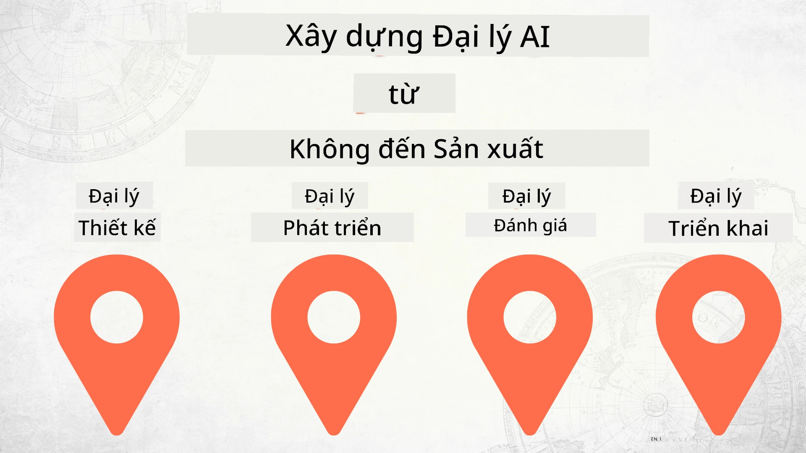

# Xây dựng các Đại lý AI từ Đầu đến Sản xuất



### 🌐 Hỗ trợ Đa Ngôn Ngữ

#### Hỗ trợ qua GitHub Action (Tự động & Luôn Cập nhật)

<!-- CO-OP TRANSLATOR LANGUAGES TABLE START -->
[Arabic](../ar/README.md) | [Bengali](../bn/README.md) | [Bulgarian](../bg/README.md) | [Burmese (Myanmar)](../my/README.md) | [Chinese (Simplified)](../zh-CN/README.md) | [Chinese (Traditional, Hong Kong)](../zh-HK/README.md) | [Chinese (Traditional, Macau)](../zh-MO/README.md) | [Chinese (Traditional, Taiwan)](../zh-TW/README.md) | [Croatian](../hr/README.md) | [Czech](../cs/README.md) | [Danish](../da/README.md) | [Dutch](../nl/README.md) | [Estonian](../et/README.md) | [Finnish](../fi/README.md) | [French](../fr/README.md) | [German](../de/README.md) | [Greek](../el/README.md) | [Hebrew](../he/README.md) | [Hindi](../hi/README.md) | [Hungarian](../hu/README.md) | [Indonesian](../id/README.md) | [Italian](../it/README.md) | [Japanese](../ja/README.md) | [Kannada](../kn/README.md) | [Khmer](../km/README.md) | [Korean](../ko/README.md) | [Lithuanian](../lt/README.md) | [Malay](../ms/README.md) | [Malayalam](../ml/README.md) | [Marathi](../mr/README.md) | [Nepali](../ne/README.md) | [Nigerian Pidgin](../pcm/README.md) | [Norwegian](../no/README.md) | [Persian (Farsi)](../fa/README.md) | [Polish](../pl/README.md) | [Portuguese (Brazil)](../pt-BR/README.md) | [Portuguese (Portugal)](../pt-PT/README.md) | [Punjabi (Gurmukhi)](../pa/README.md) | [Romanian](../ro/README.md) | [Russian](../ru/README.md) | [Serbian (Cyrillic)](../sr/README.md) | [Slovak](../sk/README.md) | [Slovenian](../sl/README.md) | [Spanish](../es/README.md) | [Swahili](../sw/README.md) | [Swedish](../sv/README.md) | [Tagalog (Filipino)](../tl/README.md) | [Tamil](../ta/README.md) | [Telugu](../te/README.md) | [Thai](../th/README.md) | [Turkish](../tr/README.md) | [Ukrainian](../uk/README.md) | [Urdu](../ur/README.md) | [Vietnamese](./README.md)

> **Ưu tiên Sao chép về máy?**
>
> Kho lưu trữ này bao gồm hơn 50 bản dịch ngôn ngữ, làm tăng đáng kể kích thước tải về. Để sao chép mà không có bản dịch, hãy sử dụng sparse checkout:
>
> **Bash / macOS / Linux:**
> ```bash
> git clone --filter=blob:none --sparse https://github.com/microsoft/Building-AI-Agents-From-Zero-To-Production.git
> cd Building-AI-Agents-From-Zero-To-Production
> git sparse-checkout set --no-cone '/*' '!translations' '!translated_images'
> ```
>
> **CMD (Windows):**
> ```cmd
> git clone --filter=blob:none --sparse https://github.com/microsoft/Building-AI-Agents-From-Zero-To-Production.git
> cd Building-AI-Agents-From-Zero-To-Production
> git sparse-checkout set --no-cone "/*" "!translations" "!translated_images"
> ```
>
> Điều này cung cấp cho bạn mọi thứ cần thiết để hoàn thành khóa học với tốc độ tải xuống nhanh hơn nhiều.
<!-- CO-OP TRANSLATOR LANGUAGES TABLE END -->

## Một khóa học dạy bạn các kiến thức cơ bản về Vòng đời Phát triển Đại lý AI

[](https://github.com/microsoft/Building-AI-Agents-From-Zero-To-Production/blob/master/LICENSE?WT.mc_id=academic-105485-koreyst)
[](https://GitHub.com/microsoft/Building-AI-Agents-From-Zero-To-Production/graphs/contributors/?WT.mc_id=academic-105485-koreyst)
[](https://GitHub.com/microsoft/Building-AI-Agents-From-Zero-To-Production/issues/?WT.mc_id=academic-105485-koreyst)
[](https://GitHub.com/microsoft/Building-AI-Agents-From-Zero-To-Production/pulls/?WT.mc_id=academic-105485-koreyst)
[](http://makeapullrequest.com?WT.mc_id=academic-105485-koreyst)

[](https://discord.gg/Kuaw3ktsu6)

## 🌱 Bắt đầu

Khóa học này có các bài học bao gồm các kiến thức cơ bản về xây dựng và triển khai các Đại lý AI.

Mỗi bài học xây dựng trên bài trước, nên chúng tôi khuyên bạn bắt đầu từ đầu và làm tuần tự đến hết.

Nếu bạn muốn khám phá thêm các chủ đề về Đại lý AI, bạn có thể xem [Khóa học Đại lý AI cho Người mới bắt đầu](https://aka.ms/ai-agents-beginners).

### Gặp gỡ Những Người Học Khác, Nhận Trả lời Câu hỏi của bạn

Nếu bạn gặp khó khăn hoặc có bất kỳ câu hỏi nào về xây dựng Đại lý AI, hãy tham gia Kênh Discord chuyên biệt của chúng tôi trong [Microsoft Foundry Discord](https://discord.gg/Kuaw3ktsu6).

### Những gì bạn cần


Mỗi bài học đều có ví dụ mã riêng mà bạn có thể chạy cục bộ. Bạn có thể [fork kho lưu trữ này](https://github.com/microsoft/Building-AI-Agents-From-Zero-To-Production/fork) để tạo bản sao của riêng bạn.

Khóa học hiện tại sử dụng những thứ sau:

- [Microsoft Agent Framework (MAF)](https://aka.ms/ai-agents-beginners/agent-framework)
- [Microsoft Foundry](https://azure.microsoft.com/products/ai-foundry) — một dự án với mô hình **GPT-5 series** đã triển khai (ví dụ `gpt-5.1`). Không sử dụng các mô hình GPT-4o / GPT-4.1 đã nghỉ hưu.
- [Azure OpenAI Service](https://azure.microsoft.com/products/ai-foundry/models/openai)
- [Azure CLI](https://learn.microsoft.com/cli/azure/authenticate-azure-cli?view=azure-cli-latest) — đăng nhập với `az login` trước khi chạy bất kỳ ví dụ nào
- **Python 3.12 trở lên**

Vui lòng đảm bảo bạn có quyền truy cập vào các dịch vụ này trước khi bắt đầu.

> **💰 Chi phí & dọn dẹp.** Các bài học thực hành tạo các tài nguyên Azure thật — một dự án Microsoft Foundry,
> một triển khai mô hình, kho vector, và (trong Bài học 4–6) các tác nhân và hộp công cụ được lưu trữ.
> Chúng có thể phát sinh chi phí trong khi tồn tại. Khi bạn hoàn thành một bài học — hoặc khóa học — hãy xóa
> các tài nguyên bạn không còn cần nữa. Cách đơn giản nhất là đặt mọi thứ vào một nhóm tài nguyên riêng
> và xóa cả nhóm khi bạn xong:
>
> ```bash
> az group delete --name <your-resource-group> --yes --no-wait
> ```
>
> Bạn cũng có thể xóa từng tác nhân, kho vector và hộp công cụ từ cổng Foundry.

> **Lưu ý về các mô hình.** Khóa học này phục vụ tất cả mô hình thông qua **Microsoft Foundry**. Nó **không**
> sử dụng *GitHub Models*, vốn sẽ nghỉ hưu vào **ngày 30 tháng 7 năm 2026** — Microsoft Foundry là
> con đường chuyển đổi chính thức. Nếu bạn có mã cũ gọi GitHub Models, hãy chuyển nó sang triển khai
> mô hình Foundry thay thế.

Sắp có thêm nhiều tùy chọn về lưu trữ mô hình và dịch vụ.

## 🗃️ Các bài học

| **Bài học**         | **Mô tả**                                                                                  |
|--------------------|--------------------------------------------------------------------------------------------|
| [Thiết kế Tác nhân](./lesson-1-agent-design/README.md)       | Giới thiệu về Use Case “Đón tiếp nhà phát triển” của Tác nhân và cách thiết kế tác nhân hiệu quả  |
| [Phát triển Tác nhân](./lesson-2-agent-development/README.md)  | Sử dụng Microsoft Agent Framework (MAF), xây dựng một bộ tác nhân chuyên biệt giúp nhà phát triển mới làm quen.       |
| [Đánh giá Tác nhân](./lesson-3-agent-evals/README.md)  | Sử dụng Microsoft Foundry, tìm hiểu hiệu quả hoạt động của các Tác nhân AI và cách cải thiện. |
| [Triển khai Tác nhân](./lesson-4-agentdeployment/README.md)   | Sử dụng các tác nhân được lưu trữ trên Microsoft Foundry và OpenAI ChatKit, xem cách triển khai một Tác nhân AI vào sản xuất.       |
| [Tác nhân được lưu trữ trong sản xuất](./lesson-5-hosted-agents-production/README.md)   | Đưa một tác nhân được lưu trữ vào sản xuất doanh nghiệp: Tác nhân được lưu trữ so với khả năng lưu trữ, mang bộ nhớ và quản trị riêng.       |

| [Microsoft Toolbox](./lesson-6-toolbox/README.md)   | Định nghĩa công cụ một lần và quản lý chúng một cách tập trung: xây dựng một hộp công cụ, sử dụng nó từ một đại lý qua một điểm cuối MCP, và phiên bản công cụ một cách an toàn.       |
| [Multi-Agent & A2A](./lesson-7-multi-agent-a2a/README.md)   | Tổ hợp các đại lý như các dịch vụ mạng: phơi bày một đại lý qua giao thức Mở Agent-to-Agent (A2A) và sử dụng một đại lý từ xa như một đồng nghiệp.       |


## 🎒 Các Khóa Học Khác

Nhóm của chúng tôi sản xuất các khóa học khác! Hãy xem:

<!-- CO-OP TRANSLATOR OTHER COURSES START -->
### LangChain
[](https://aka.ms/langchain4j-for-beginners)
[](https://aka.ms/langchainjs-for-beginners?WT.mc_id=m365-94501-dwahlin)
[](https://github.com/microsoft/langchain-for-beginners?WT.mc_id=m365-94501-dwahlin)
---

### Azure / Edge / MCP / Đại Lý
[](https://github.com/microsoft/AZD-for-beginners?WT.mc_id=academic-105485-koreyst)
[](https://github.com/microsoft/edgeai-for-beginners?WT.mc_id=academic-105485-koreyst)
[](https://github.com/microsoft/mcp-for-beginners?WT.mc_id=academic-105485-koreyst)
[](https://github.com/microsoft/ai-agents-for-beginners?WT.mc_id=academic-105485-koreyst)

---
 
### Chuỗi AI Sinh Tạo

[](https://github.com/microsoft/generative-ai-for-beginners?WT.mc_id=academic-105485-koreyst)
[-9333EA?style=for-the-badge&labelColor=E5E7EB&color=9333EA)](https://github.com/microsoft/Generative-AI-for-beginners-dotnet?WT.mc_id=academic-105485-koreyst)
[-C084FC?style=for-the-badge&labelColor=E5E7EB&color=C084FC)](https://github.com/microsoft/generative-ai-for-beginners-java?WT.mc_id=academic-105485-koreyst)
[-E879F9?style=for-the-badge&labelColor=E5E7EB&color=E879F9)](https://github.com/microsoft/generative-ai-with-javascript?WT.mc_id=academic-105485-koreyst)

---
 
### Học Tập Cốt Lõi
[](https://aka.ms/ml-beginners?WT.mc_id=academic-105485-koreyst)
[](https://aka.ms/datascience-beginners?WT.mc_id=academic-105485-koreyst)
[](https://aka.ms/ai-beginners?WT.mc_id=academic-105485-koreyst)
[](https://github.com/microsoft/Security-101?WT.mc_id=academic-96948-sayoung)
[](https://aka.ms/webdev-beginners?WT.mc_id=academic-105485-koreyst)
[](https://aka.ms/iot-beginners?WT.mc_id=academic-105485-koreyst)
[](https://github.com/microsoft/xr-development-for-beginners?WT.mc_id=academic-105485-koreyst)

---
 
### Chuỗi Copilot
[](https://aka.ms/GitHubCopilotAI?WT.mc_id=academic-105485-koreyst)
[](https://github.com/microsoft/mastering-github-copilot-for-dotnet-csharp-developers?WT.mc_id=academic-105485-koreyst)
[](https://github.com/microsoft/CopilotAdventures?WT.mc_id=academic-105485-koreyst)
<!-- CO-OP TRANSLATOR OTHER COURSES END -->

## Đóng góp

Dự án này hoan nghênh các đóng góp và đề xuất. Phần lớn các đóng góp yêu cầu bạn đồng ý với một
Thỏa thuận Cấp phép Đóng góp (CLA) tuyên bố rằng bạn có quyền, và thực sự cấp cho chúng tôi
quyền sử dụng đóng góp của bạn. Chi tiết xem tại <https://cla.opensource.microsoft.com>.

Khi bạn gửi một pull request, bot CLA sẽ tự động xác định liệu bạn có cần cung cấp
CLA và trang trí PR một cách phù hợp (ví dụ: kiểm tra trạng thái, bình luận). Bạn chỉ cần làm theo hướng dẫn
do bot cung cấp. Bạn chỉ phải làm việc này một lần trên tất cả các kho sử dụng CLA của chúng tôi.

Dự án này đã áp dụng [Bộ Quy tắc Ứng xử Mã nguồn mở Microsoft](https://opensource.microsoft.com/codeofconduct/).
Để biết thêm thông tin xem [Hỏi đáp Quy tắc Ứng xử](https://opensource.microsoft.com/codeofconduct/faq/) hoặc
liên hệ [opencode@microsoft.com](mailto:opencode@microsoft.com) nếu có thêm câu hỏi hoặc bình luận.

## Nhãn hiệu

Dự án này có thể chứa nhãn hiệu hoặc biểu tượng cho các dự án, sản phẩm hoặc dịch vụ. Việc sử dụng nhãn hiệu hoặc biểu tượng Microsoft
được ủy quyền phải tuân theo và phù hợp với
[Hướng dẫn Nhãn hiệu và Thương hiệu của Microsoft](https://www.microsoft.com/legal/intellectualproperty/trademarks/usage/general).
Việc sử dụng nhãn hiệu hoặc biểu tượng Microsoft trong các phiên bản đã chỉnh sửa của dự án này không được gây nhầm lẫn hoặc ngụ ý sự tài trợ của Microsoft.
Việc sử dụng bất kỳ nhãn hiệu hoặc biểu tượng của bên thứ ba nào phải tuân theo chính sách của các bên thứ ba đó.

## Nhận Hỗ Trợ

Nếu bạn gặp khó khăn hoặc có bất kỳ câu hỏi nào về việc xây dựng ứng dụng AI, hãy tham gia:

[](https://discord.gg/Kuaw3ktsu6)

Nếu bạn có phản hồi về sản phẩm hoặc lỗi trong quá trình xây dựng, hãy truy cập:

[](https://aka.ms/foundry/forum)

---

<!-- CO-OP TRANSLATOR DISCLAIMER START -->
**Tuyên bố miễn trừ trách nhiệm**:
Tài liệu này đã được dịch bằng dịch vụ dịch thuật AI [Co-op Translator](https://github.com/Azure/co-op-translator). Mặc dù chúng tôi cố gắng đảm bảo độ chính xác, xin lưu ý rằng bản dịch tự động có thể chứa lỗi hoặc sai sót. Tài liệu gốc bằng ngôn ngữ gốc nên được coi là nguồn tin chính thức. Đối với thông tin quan trọng, nên sử dụng dịch vụ dịch thuật chuyên nghiệp bởi con người. Chúng tôi không chịu trách nhiệm về bất kỳ hiểu lầm hoặc giải thích sai nào phát sinh từ việc sử dụng bản dịch này.
<!-- CO-OP TRANSLATOR DISCLAIMER END -->