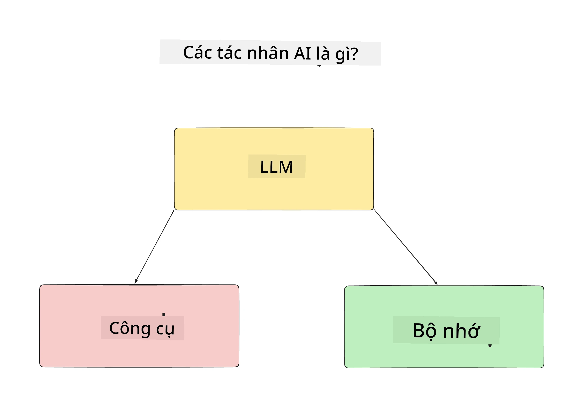
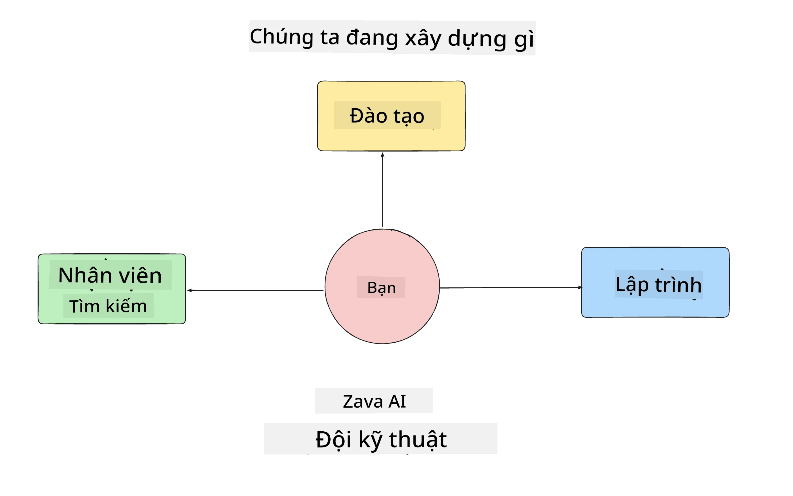
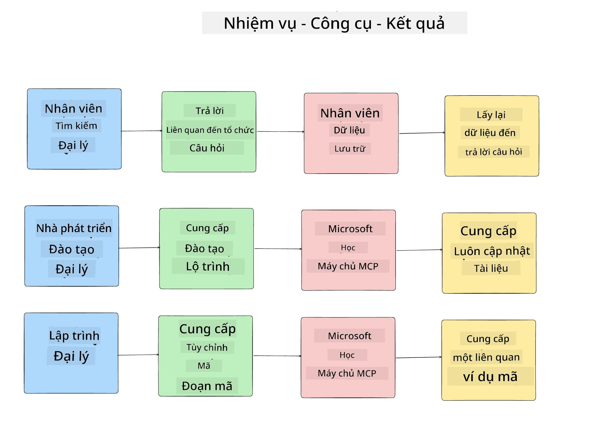
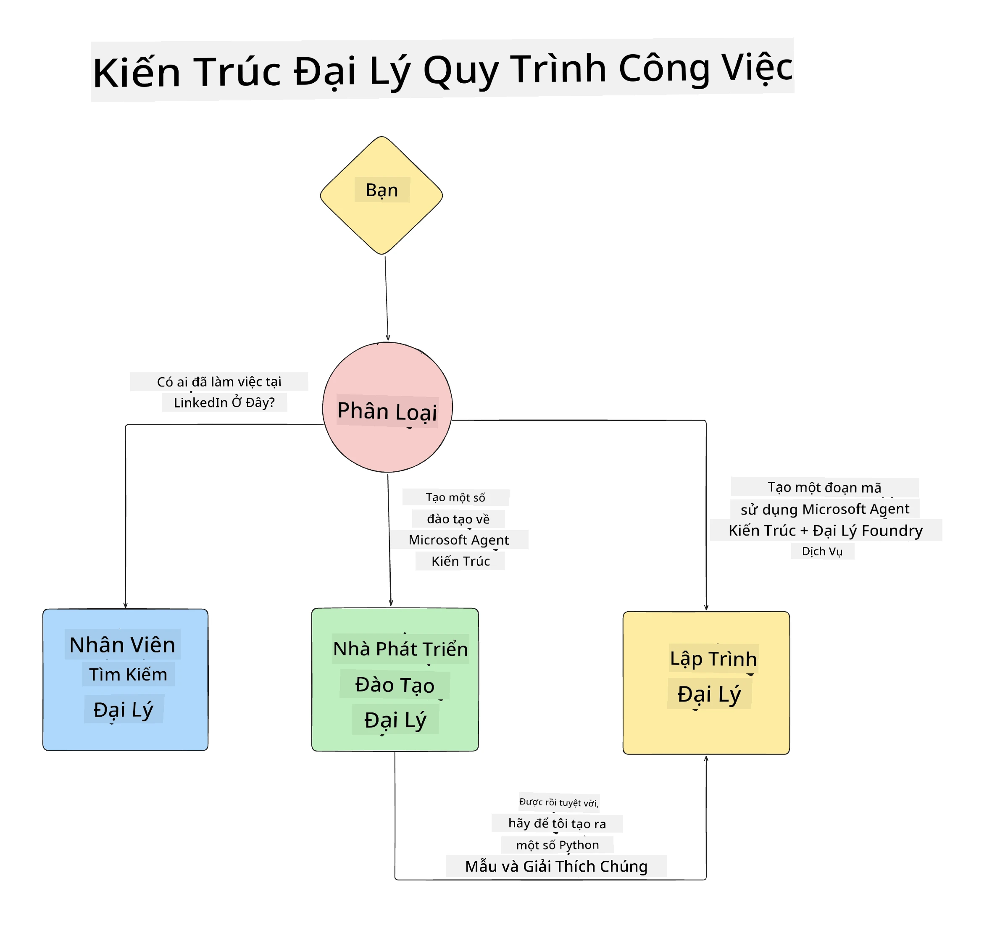

# Bài học 1: Thiết kế Đại lý AI

Chào mừng bạn đến với bài học đầu tiên của khóa học "Xây dựng Đại lý AI từ con số 0 đến sản xuất"!

Trong bài học này chúng ta sẽ đề cập đến:

- Định nghĩa Đại lý AI là gì
  
- Thảo luận về Ứng dụng Đại lý AI mà chúng ta đang xây dựng  

- Xác định các công cụ và dịch vụ cần thiết cho từng đại lý
  
- Kiến trúc Ứng dụng Đại lý của chúng ta
  
Hãy bắt đầu bằng việc xác định đại lý là gì và tại sao chúng ta lại sử dụng chúng trong một ứng dụng.

> **Trước khi bạn bắt đầu khóa học.** Bài học đầu tiên này mang tính khái niệm — không có mã nào để chạy.
> Từ [Bài học 2](../lesson-2-agent-development/README.md) trở đi bạn sẽ cần: một **gói đăng ký Azure**
> với quyền truy cập vào **Microsoft Foundry**, một mô hình **GPT-5 series đã triển khai** (ví dụ `gpt-5.1` — tránh mô hình GPT-4o / GPT-4.1 đã ngừng sử dụng), **Python 3.12+**, và **Azure CLI**
> (`az login`). Xem [Những gì bạn cần](../README.md#what-you-need) trong README của khóa học để có danh sách đầy đủ và liên kết.

## Đại lý AI là gì?

Nếu đây là lần đầu tiên bạn khám phá cách xây dựng Đại lý AI, bạn có thể có thắc mắc làm thế nào để định nghĩa chính xác Đại lý AI là gì.

Một cách đơn giản để định nghĩa Đại lý AI dựa trên các thành phần cấu thành:

**Mô hình Ngôn ngữ Lớn** - LLM sẽ là nguồn sức mạnh cho khả năng xử lý ngôn ngữ tự nhiên từ người dùng để hiểu nhiệm vụ họ muốn hoàn thành cũng như hiểu các mô tả về các công cụ có sẵn để hoàn thành các nhiệm vụ đó.

**Công cụ** - Đây sẽ là các hàm, API, kho dữ liệu và các dịch vụ khác mà LLM có thể chọn sử dụng để hoàn thành các nhiệm vụ do người dùng yêu cầu.

**Bộ nhớ** - Đây là cách chúng ta lưu trữ cả tương tác ngắn hạn và dài hạn giữa Đại lý AI và người dùng. Việc lưu trữ và truy xuất thông tin này rất quan trọng để cải thiện và lưu giữ sở thích của người dùng theo thời gian.

## Trường hợp sử dụng Đại lý AI của chúng ta

Trong khóa học này, chúng ta sẽ xây dựng một ứng dụng Đại lý AI giúp các nhà phát triển mới gia nhập đội ngũ Phát triển Đại lý AI của chúng ta!

Trước khi tiến hành phát triển, bước đầu tiên để tạo ra một ứng dụng Đại lý AI thành công là xác định các tình huống rõ ràng về cách chúng ta mong đợi người dùng tương tác với Đại lý AI của mình.

Đối với ứng dụng này, chúng ta sẽ làm việc với các tình huống sau:

**Tình huống 1**: Một nhân viên mới gia nhập tổ chức và muốn biết thêm về đội nhóm họ tham gia cũng như cách kết nối với họ.

**Tình huống 2:** Một nhân viên mới muốn biết nhiệm vụ đầu tiên tốt nhất mà họ nên bắt đầu làm.

**Tình huống 3:** Một nhân viên mới muốn thu thập tài nguyên học tập và mẫu mã để giúp họ bắt đầu hoàn thành nhiệm vụ này.

## Xác định Công cụ và Dịch vụ

Bây giờ chúng ta đã có các tình huống, bước tiếp theo là ánh xạ chúng với các công cụ và dịch vụ mà các đại lý AI của chúng ta sẽ cần để hoàn thành các nhiệm vụ.

Quá trình này thuộc loại Kỹ thuật ngữ cảnh bởi vì chúng ta sẽ tập trung đảm bảo các Đại lý AI có bối cảnh phù hợp vào đúng thời điểm để hoàn thành nhiệm vụ.

Hãy cùng thực hiện từng tình huống một và tiến hành thiết kế đại lý tốt bằng cách liệt kê nhiệm vụ, công cụ và kết quả mong muốn của từng đại lý.

### Tình huống 1 - Đại lý Tìm kiếm Nhân viên

**Nhiệm vụ** - Trả lời các câu hỏi về nhân viên trong tổ chức như ngày gia nhập, đội hiện tại, vị trí và vị trí công tác cuối cùng.

**Công cụ** - Kho dữ liệu danh sách nhân viên hiện tại và sơ đồ tổ chức

**Kết quả** - Có thể truy xuất thông tin từ kho dữ liệu để trả lời các câu hỏi chung về tổ chức và câu hỏi cụ thể về nhân viên.

### Tình huống 2 - Đại lý Đề xuất Nhiệm vụ

**Nhiệm vụ** - Dựa trên kinh nghiệm phát triển của nhân viên mới, đề xuất 1-3 vấn đề mà nhân viên mới có thể làm việc.

**Công cụ** - Máy chủ MCP GitHub để lấy các vấn đề đang mở và xây dựng hồ sơ nhà phát triển

**Kết quả** - Có thể đọc 5 cam kết gần nhất của hồ sơ GitHub và các vấn đề mở trên một dự án GitHub và đưa ra đề xuất dựa trên sự phù hợp

### Tình huống 3 - Đại lý Hỗ trợ Mã

**Nhiệm vụ** - Dựa trên các vấn đề mở được Đại lý "Đề xuất Nhiệm vụ" gợi ý, nghiên cứu và cung cấp tài nguyên đồng thời tạo các đoạn mã giúp nhân viên.

**Công cụ** - Microsoft Learn MCP để tìm nguồn tài nguyên và Bộ giải mã mã để tạo các đoạn mã tùy chỉnh.

**Kết quả** - Nếu người dùng yêu cầu giúp đỡ thêm, quy trình làm việc sẽ dùng Máy chủ Learn MCP để cung cấp liên kết và đoạn trích nguồn tài nguyên rồi chuyển giao cho đại lý Bộ giải mã mã để tạo các đoạn mã nhỏ kèm lời giải thích.

## Kiến trúc Ứng dụng Đại lý của chúng ta

Bây giờ chúng ta đã định nghĩa từng Đại lý, hãy tạo một sơ đồ kiến trúc sẽ giúp chúng ta hiểu cách từng đại lý làm việc cùng nhau và riêng biệt tùy theo nhiệm vụ:

## Các bước tiếp theo

Bây giờ chúng ta đã thiết kế từng đại lý và hệ thống đại lý của mình, hãy chuyển sang bài học tiếp theo nơi chúng ta sẽ phát triển từng đại lý này!

---

<!-- CO-OP TRANSLATOR DISCLAIMER START -->
**Tuyên bố miễn trừ trách nhiệm**:
Tài liệu này đã được dịch bằng dịch vụ dịch thuật AI [Co-op Translator](https://github.com/Azure/co-op-translator). Mặc dù chúng tôi cố gắng đảm bảo độ chính xác, xin lưu ý rằng bản dịch tự động có thể chứa lỗi hoặc sai sót. Tài liệu gốc bằng ngôn ngữ gốc nên được coi là nguồn tin chính thức. Đối với thông tin quan trọng, nên sử dụng dịch vụ dịch thuật chuyên nghiệp bởi con người. Chúng tôi không chịu trách nhiệm về bất kỳ hiểu lầm hoặc giải thích sai nào phát sinh từ việc sử dụng bản dịch này.
<!-- CO-OP TRANSLATOR DISCLAIMER END -->