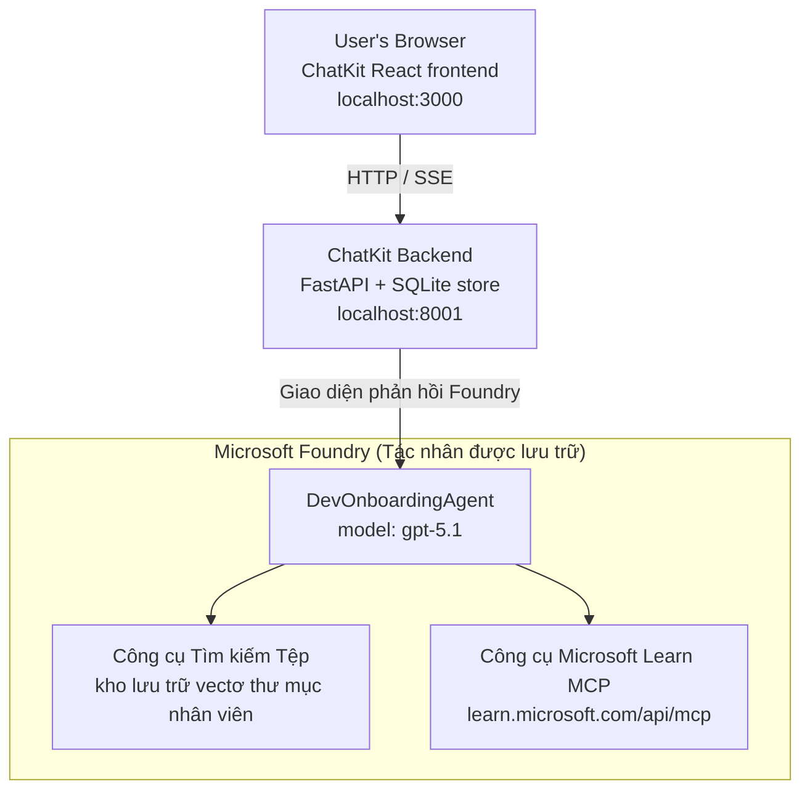

# Bài học 4: Triển khai Agent với Microsoft Foundry Hosted Agents + ChatKit

Bài học này trình bày cách triển khai một agent sử dụng công cụ lên Microsoft Foundry dưới dạng hosted agent và tạo một frontend dựa trên ChatKit để tương tác với nó.

## Kiến trúc

Hosted agent là một **`DevOnboardingAgent` đơn lẻ** (chạy trên `gpt-5.1`) trả lời các câu hỏi hướng dẫn onboarding cho nhà phát triển sử dụng hai công cụ hosted: một công cụ **Tìm kiếm File** trên kho vector employee-directory, và công cụ **Microsoft Learn MCP**. Frontend React ChatKit giao tiếp với backend FastAPI, backend gọi agent qua Foundry **Responses API**.



## Yêu cầu trước

1. **Dự án Microsoft Foundry** ở vùng North Central US
2. **Azure CLI** đã đăng nhập (`az login`)
3. **Azure Developer CLI** (`azd`) đã cài đặt
4. **Python 3.12+** và **Node.js 18+**
5. **Kho Vector** đã tạo với dữ liệu nhân viên

## Bắt đầu nhanh

### 1. Thiết lập biến môi trường

```bash
cd lesson-4-agentdeployment
cp .env.example .env
# Chỉnh sửa .env với thông tin dự án Microsoft Foundry của bạn
```

### 2. Triển khai Hosted Agent

**Tùy chọn A: Dùng Azure Developer CLI (Khuyến nghị)**

```bash
cd hosted-agent
azd auth login
azd agent deploy
```

**Tùy chọn B: Dùng Docker + Azure Container Registry**

```bash
cd hosted-agent

# Xây dựng container
docker build -t developer-onboarding-agent:latest .

# Thẻ cho ACR
docker tag developer-onboarding-agent:latest <your-acr>.azurecr.io/developer-onboarding-agent:latest

# Đẩy lên ACR
az acr login --name <your-acr>
docker push <your-acr>.azurecr.io/developer-onboarding-agent:latest

# Triển khai qua cổng Microsoft Foundry hoặc SDK
```

### 3. Khởi động ChatKit Backend

```bash
cd chatkit-server
python -m venv .venv
source .venv/bin/activate  # Trên Windows: .venv\Scripts\activate
pip install -r requirements.txt
python app.py
```

Máy chủ sẽ khởi động tại `http://localhost:8001`

### 4. Khởi động ChatKit Frontend

```bash
cd chatkit-server/frontend
npm install
npm run dev
```

Frontend sẽ khởi động tại `http://localhost:3000`

### 5. Kiểm thử ứng dụng

Mở `http://localhost:3000` trong trình duyệt và thử các truy vấn sau:

**Tìm kiếm nhân viên:**
- "Tôi là người mới! Có ai từng làm việc tại Microsoft không?"
- "Ai có kinh nghiệm với Azure Functions?"

**Tài nguyên học tập:**
- "Tạo lộ trình học cho Kubernetes"
- "Tôi nên theo đuổi chứng chỉ nào cho kiến trúc đám mây?"

**Hỗ trợ lập trình:**
- "Giúp tôi viết code Python kết nối với CosmosDB"
- "Hướng dẫn tôi cách tạo Azure Function"

**Truy vấn đa-agent:**
- "Tôi bắt đầu làm kỹ sư đám mây. Tôi nên kết nối với ai và học gì?"

## Cấu trúc dự án

```
lesson-4-agentdeployment/
├── .env.example                 # Environment variables template
├── implementation-plan.md       # Detailed implementation guide
├── README.md                    # This file
├── hosted-agent/               # Microsoft Foundry hosted agent
│   ├── main.py                 # Multi-agent workflow implementation
│   ├── requirements.txt        # Python dependencies
│   ├── Dockerfile              # Container definition
│   └── agent.yaml              # Agent deployment configuration
└── chatkit-server/             # ChatKit server application
    ├── app.py                  # FastAPI backend
    ├── store.py                # SQLite persistence layer
    ├── requirements.txt        # Python dependencies
    └── frontend/               # React frontend
        ├── package.json
        ├── vite.config.ts
        ├── tsconfig.json
        ├── index.html
        └── src/
            ├── main.tsx
            ├── App.tsx
            ├── App.css
            └── index.css
```

## Agent và Công cụ của nó

Hosted agent là một **agent đơn lẻ** (`DevOnboardingAgent`, định nghĩa trong `hosted-agent/main.py`) xử lý ba lĩnh vực onboarding. Thay vì phối hợp nhiều sub-agent riêng biệt, nó cung cấp mỗi khả năng như một công cụ (hoặc dựa trực tiếp vào mô hình):

| Khả năng | Cách xử lý | Công cụ |
|-----------|------------------|------|
| **Tìm kiếm & kết nối nhân viên** | Foundry hosted File Search trên kho vector employee-directory | `client.get_file_search_tool(vector_store_ids=[...])` |
| **Học tập & đào tạo** | Máy chủ Microsoft Learn MCP (công cụ MCP được host) | `client.get_mcp_tool(url="https://learn.microsoft.com/api/mcp")` |
| **Hỗ trợ lập trình** | Do mô hình `gpt-5.1` xử lý trực tiếp — không dùng công cụ ngoài | — |

Agent được tạo bởi `client.as_agent(name="DevOnboardingAgent", instructions=..., tools=[file_search_tool, learn_mcp_tool])` và phục vụ với `from_agent_framework(agent).run()`.

> **Ghi chú thiết kế.** Bản nháp trước của bài học này sử dụng workflow đa-agent `HandoffBuilder` (Triage → chuyên gia). Agent hiện tại sử dụng một công cụ đơn lẻ, đơn giản hơn để triển khai và xử lý cho Q&A hướng dẫn onboarding. Ví dụ workflow đa-agent và handoff xem Bài học 2 và Bài học 3.

## Kiểm thử nhanh Hosted Agent (CI Gate)

Triển khai agent hosted "thành công" chỉ chứng minh mặt điều khiển chấp nhận
định nghĩa — nó **không** đảm bảo agent trả lời. Thiếu phụ thuộc,
định tuyến model sai, hay kết nối hết hạn có thể để agent xanh nhưng im lặng.

Bài học này cung cấp một **kiểm thử nhanh** nhẹ, làm cổng sau triển khai nhanh và rẻ tiền.
Nó dùng GitHub Action [AI Smoke Test](https://github.com/marketplace/actions/ai-smoke-test)
gửi POST prompt tới endpoint **Responses** của agent trên Foundry
(`POST {project_endpoint}/agents/{agent_name}/endpoint/protocols/openai/responses`)
và kiểm tra văn bản trả về. Nó phát hiện triển khai hỏng, lỗi xác thực,
sai lệch hệ thống prompt, và lỗi luồng trong vài giây.

> Kiểm thử nhanh **không phải** thay thế cho đánh giá đầy đủ trong
> [Bài học 3](../lesson-3-agent-evals/README.md) — chúng bổ sung cho nhau. Kiểm thử nhanh
> trả lời *"agent có thể truy cập, phản hồi, và tuân thủ yêu cầu prompt cơ bản không?"*;
> đánh giá trả lời *"phản hồi tốt tới mức nào?"*. Chạy cổng rẻ tiền này mỗi lần triển khai.

### Nội dung kiểm thử

Danh mục nằm tại [`hosted-agent/tests/smoke-tests.json`](../../../lesson-4-agentdeployment/hosted-agent/tests/smoke-tests.json)
kiểm tra ba lĩnh vực của agent cùng tuân thủ prompt và trạng thái hội thoại đa lượt:

| Kiểm thử | Xác minh nội dung |
|------|------------------|
| `reachability` | Agent trả lời với văn bản không rỗng và phù hợp phạm vi |
| `employee-search` | Lĩnh vực tìm kiếm file trả về `200` khỏe mạnh (phản hồi tùy dữ liệu) |
| `learning-path` | Lĩnh vực học tập lặp lại chủ đề và đưa ra câu trả lời dạng lộ trình |
| `coding-assistance` | Lĩnh vực lập trình trả về câu trả lời Python dạng code |
| `prompt-adherence-offtopic` | Yêu cầu ngoài chủ đề được chuyển hướng, không trả lời chi tiết |
| `threading-turn-1/2` | Duy trì trạng thái hội thoại qua các lượt bằng `previous_response_id` |

### Chạy trong CI

Workflow tại [`.github/workflows/smoke-test-hosted-agent.yml`](../../../.github/workflows/smoke-test-hosted-agent.yml)
có hai công việc:

- **`static`** — cổng nhanh không dùng Azure chạy mỗi pull request và push:
  nó biên dịch tất cả mã Python (`py_compile`) và kiểm tra link Markdown. Không cần secret,
  nên chạy được trên PR fork.
- **`smoke`** — kiểm thử nhanh kết nối Azure bên dưới. Chạy theo yêu cầu
  (Actions → **Agent CI (static + smoke)** → Run workflow) và có thể chạy nối tiếp sau
  workflow deploy của bạn.

Cấu hình các **biến** và **bí mật** kho lưu trữ cho công việc smoke:

| Loại | Tên | Giá trị |
|------|------|-------|

| Biến | `FOUNDRY_PROJECT_ENDPOINT` | `https://<account>.services.ai.azure.com/api/projects/<project>` |
| Biến | `HOSTED_AGENT_NAME` | Tên agent đã triển khai (ví dụ: `dev-onboarding` — phải khớp với triển khai của bạn) |
| Bí mật | `AZURE_CLIENT_ID` / `AZURE_TENANT_ID` / `AZURE_SUBSCRIPTION_ID` | Danh tính liên kết OIDC cho `azure/login` |

Danh tính runner cần có vai trò **`Azure AI User`** ở **phạm vi dự án Foundry** để có thể
gọi các endpoint data-plane Responses (và cuộc hội thoại). Cấp cho nó với:

```bash
az role assignment create \
  --assignee <object-id-or-appId-of-runner-identity> \
  --role "Azure AI User" \
  --scope "/subscriptions/<sub>/resourceGroups/<rg>/providers/Microsoft.CognitiveServices/accounts/<account>/projects/<project>"
```

### Chạy tại máy cục bộ

Bạn có thể chạy cùng catalog trước khi đẩy lên. Lấy token data-plane với phạm vi
`https://ai.azure.com/` và trỏ runner tới triển khai của bạn:

```bash
# Đối tượng PHẢI là https://ai.azure.com/ (token cognitiveservices.azure.com bị từ chối)
export FOUNDRY_TOKEN=$(az account get-access-token --resource https://ai.azure.com/ --query accessToken -o tsv)

git clone https://github.com/JFolberth/ai-smoketest && cd ai-smoketest
python runner.py \
  --project-endpoint "https://<account>.services.ai.azure.com/api/projects/<project>" \
  --agent-name dev-onboarding \
  --tests-file ../lesson-4-agentdeployment/hosted-agent/tests/smoke-tests.json
```

Mã thoát: `0` tất cả thành công, `1` một kiểm tra thất bại, `2` lỗi runner (catalog / token sai).

## Khắc phục sự cố

### Agent không phản hồi
- Xác nhận agent được host đã triển khai và đang chạy trong Microsoft Foundry
- Kiểm tra `HOSTED_AGENT_NAME` và `HOSTED_AGENT_VERSION` có khớp với triển khai của bạn không

### Lỗi kho vector
- Đảm bảo `VECTOR_STORE_ID` được đặt đúng
- Xác nhận kho vector chứa dữ liệu nhân viên

### Lỗi xác thực
- Chạy `az login` để làm mới thông tin xác thực
- Đảm bảo bạn có quyền truy cập vào dự án Microsoft Foundry

## Tài nguyên

- [Tài liệu Microsoft Foundry Hosted Agents](https://learn.microsoft.com/en-us/azure/ai-foundry/agents/concepts/hosted-agents)
- [Microsoft Agent Framework](https://github.com/microsoft/agent-framework)
- [Ví dụ tích hợp ChatKit](https://github.com/microsoft/agent-framework/tree/main/python/samples/demos/chatkit-integration)
- [Azure Developer CLI](https://learn.microsoft.com/en-us/azure/developer/azure-developer-cli/overview)
- [AI Smoke Test GitHub Action](https://github.com/marketplace/actions/ai-smoke-test)
- [Kiểm thử Smoke Agents Microsoft Foundry với GitHub Actions (blog)](https://techcommunity.microsoft.com/blog/azuredevcommunityblog/smoke-test-microsoft-foundry-agents-with-github-actions/4531912)

---

## Các bước tiếp theo

Agent của bạn chạy trên hạ tầng do Microsoft quản lý. Để đưa nó vào sản xuất doanh nghiệp —
kiểm soát nơi dữ liệu của nó tồn tại (chủ quyền dữ liệu, mạng riêng, mang Azure của bạn
Cosmos DB / Storage / AI Search) và quản lý các công cụ của nó — tiếp tục với
**[Bài học 5: Hosted Agents trong môi trường sản xuất](../lesson-5-hosted-agents-production/README.md)**, bài học
giải thích sự khác biệt quan trọng giữa **Hosted Agents** và **Capability Hosts**.

---

<!-- CO-OP TRANSLATOR DISCLAIMER START -->
**Tuyên bố miễn trừ trách nhiệm**:
Tài liệu này đã được dịch bằng dịch vụ dịch thuật AI [Co-op Translator](https://github.com/Azure/co-op-translator). Mặc dù chúng tôi cố gắng đảm bảo độ chính xác, xin lưu ý rằng bản dịch tự động có thể chứa lỗi hoặc sai sót. Tài liệu gốc bằng ngôn ngữ gốc nên được coi là nguồn tin chính thức. Đối với thông tin quan trọng, nên sử dụng dịch vụ dịch thuật chuyên nghiệp bởi con người. Chúng tôi không chịu trách nhiệm về bất kỳ hiểu lầm hoặc giải thích sai nào phát sinh từ việc sử dụng bản dịch này.
<!-- CO-OP TRANSLATOR DISCLAIMER END -->