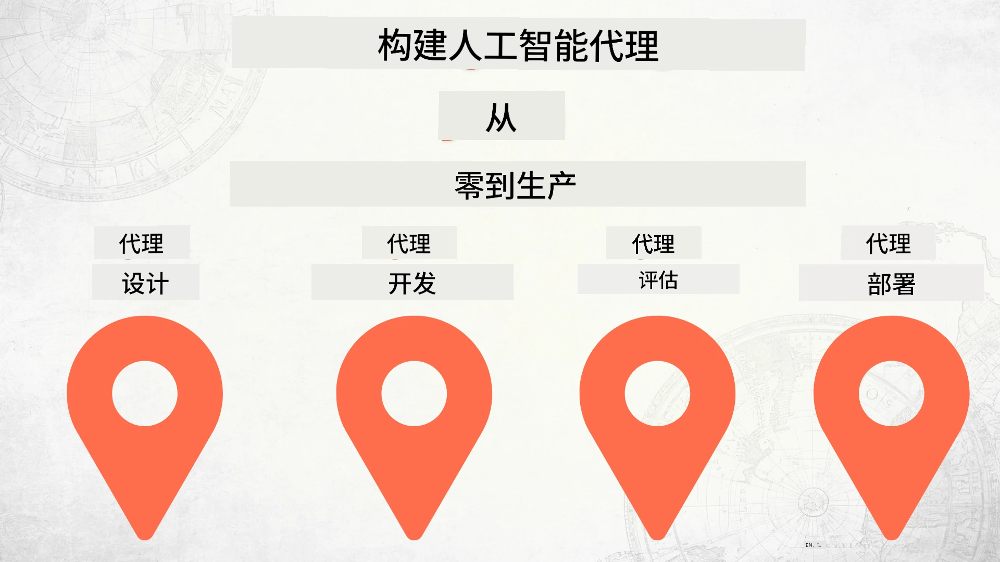

# 从零开始到生产部署构建 AI 代理



### 🌐 多语言支持

#### 通过 GitHub Action 支持（自动且始终保持最新）

<!-- CO-OP TRANSLATOR LANGUAGES TABLE START -->
[阿拉伯语](../ar/README.md) | [孟加拉语](../bn/README.md) | [保加利亚语](../bg/README.md) | [缅甸语（缅甸）](../my/README.md) | [中文（简体）](./README.md) | [中文（繁体，香港）](../zh-HK/README.md) | [中文（繁体，澳门）](../zh-MO/README.md) | [中文（繁体，台湾）](../zh-TW/README.md) | [克罗地亚语](../hr/README.md) | [捷克语](../cs/README.md) | [丹麦语](../da/README.md) | [荷兰语](../nl/README.md) | [爱沙尼亚语](../et/README.md) | [芬兰语](../fi/README.md) | [法语](../fr/README.md) | [德语](../de/README.md) | [希腊语](../el/README.md) | [希伯来语](../he/README.md) | [印地语](../hi/README.md) | [匈牙利语](../hu/README.md) | [印尼语](../id/README.md) | [意大利语](../it/README.md) | [日语](../ja/README.md) | [卡纳达语](../kn/README.md) | [韩语](../ko/README.md) | [立陶宛语](../lt/README.md) | [马来语](../ms/README.md) | [马拉雅拉姆语](../ml/README.md) | [马拉地语](../mr/README.md) | [尼泊尔语](../ne/README.md) | [尼日利亚皮钦语](../pcm/README.md) | [挪威语](../no/README.md) | [波斯语（法尔西语）](../fa/README.md) | [波兰语](../pl/README.md) | [葡萄牙语（巴西）](../pt-BR/README.md) | [葡萄牙语（葡萄牙）](../pt-PT/README.md) | [旁遮普语（古鲁姆基）](../pa/README.md) | [罗马尼亚语](../ro/README.md) | [俄语](../ru/README.md) | [塞尔维亚语（西里尔字母）](../sr/README.md) | [斯洛伐克语](../sk/README.md) | [斯洛文尼亚语](../sl/README.md) | [西班牙语](../es/README.md) | [斯瓦希里语](../sw/README.md) | [瑞典语](../sv/README.md) | [他加禄语（菲律宾语）](../tl/README.md) | [泰米尔语](../ta/README.md) | [泰卢固语](../te/README.md) | [泰语](../th/README.md) | [土耳其语](../tr/README.md) | [乌克兰语](../uk/README.md) | [乌尔都语](../ur/README.md) | [越南语](../vi/README.md)

> **更倾向于本地克隆？**

> 此仓库包含 50 多种语言的翻译，显著增加了下载大小。若想克隆不含翻译的版本，可使用稀疏检出：
> ```bash
> git clone --filter=blob:none --sparse https://github.com/microsoft/Building-AI-Agents-From-Zero-To-Production.git
> cd Building-AI-Agents-From-Zero-To-Production
> git sparse-checkout set --no-cone '/*' '!translations' '!translated_images'
> ```
> 这样能以更快的下载速度获取完成课程所需的全部内容。
<!-- CO-OP TRANSLATOR LANGUAGES TABLE END -->

## 一门教授 AI 代理开发生命周期基础课程

[](https://github.com/microsoft/Building-AI-Agents-From-Zero-To-Production/blob/master/LICENSE?WT.mc_id=academic-105485-koreyst)
[](https://GitHub.com/microsoft/Building-AI-Agents-From-Zero-To-Production/graphs/contributors/?WT.mc_id=academic-105485-koreyst)
[](https://GitHub.com/microsoft/Building-AI-Agents-From-Zero-To-Production/issues/?WT.mc_id=academic-105485-koreyst)
[](https://GitHub.com/microsoft/Building-AI-Agents-From-Zero-To-Production/pulls/?WT.mc_id=academic-105485-koreyst)
[](http://makeapullrequest.com?WT.mc_id=academic-105485-koreyst)

[](https://discord.gg/Kuaw3ktsu6)

## 🌱 快速入门

本课程包含多节课程，涵盖构建和部署 AI 代理的基础知识。

每节课都基于上一节，建议从头开始，按顺序学习至最后。

如果你想深入了解更多 AI 代理相关话题，可查看 [AI 代理初学者课程](https://aka.ms/ai-agents-beginners)。

### 结识其他学习者，获取问题解答

如果你遇到困难或有关于构建 AI 代理的任何问题，可以加入我们的专门 Discord 频道：[Microsoft Foundry Discord](https://discord.gg/Kuaw3ktsu6)。

### 你需要准备的内容

每节课都附带了本地可运行的代码示例。你可以[派生此仓库](https://github.com/microsoft/Building-AI-Agents-From-Zero-To-Production/fork)来创建自己的副本。

本课程当前使用以下内容：

- [Microsoft Agent Framework (MAF)](https://aka.ms/ai-agents-beginners/agent-framework)
- [Microsoft Foundry](https://azure.microsoft.com/products/ai-foundry)
- [Azure OpenAI 服务](https://azure.microsoft.com/products/ai-foundry/models/openai)
- [Azure CLI](https://learn.microsoft.com/cli/azure/authenticate-azure-cli?view=azure-cli-latest)

请确保在开始之前，你能够访问这些服务。

后续将推出有关模型托管和服务的更多选项。

## 🗃️ 课程内容

| **课程**         | **描述**                                                                                  |
|--------------------|--------------------------------------------------------------------------------------------------|
| [代理设计](./lesson-1-agent-design/README.md)       | 介绍我们的“开发者入职”代理用例及如何设计有效的代理  |
| [代理开发](./lesson-2-agent-development/README.md)  | 使用 Microsoft Agent Framework (MAF)，创建 3 个帮助新开发者入职的代理。       |
| [代理评估](./lesson-3-agent-evals/README.md)  | 使用 Microsoft Foundry，了解我们的 AI 代理性能如何及如何改进它们。 |
| [代理部署](./lesson-4-agent-deployment/README.md)   | 使用托管代理和 OpenAI Chatkit，了解如何将 AI 代理部署到生产环境。       |


## 🎒 其他课程

我们的团队还制作了其他课程！请查看：

<!-- CO-OP TRANSLATOR OTHER COURSES START -->
### LangChain
[](https://aka.ms/langchain4j-for-beginners)
[](https://aka.ms/langchainjs-for-beginners?WT.mc_id=m365-94501-dwahlin)
[](https://github.com/microsoft/langchain-for-beginners?WT.mc_id=m365-94501-dwahlin)
---

### Azure / Edge / MCP / 代理
[](https://github.com/microsoft/AZD-for-beginners?WT.mc_id=academic-105485-koreyst)
[](https://github.com/microsoft/edgeai-for-beginners?WT.mc_id=academic-105485-koreyst)
[](https://github.com/microsoft/mcp-for-beginners?WT.mc_id=academic-105485-koreyst)
[](https://github.com/microsoft/ai-agents-for-beginners?WT.mc_id=academic-105485-koreyst)

---
 
### 生成式 AI 系列
[](https://github.com/microsoft/generative-ai-for-beginners?WT.mc_id=academic-105485-koreyst)
[-9333EA?style=for-the-badge&labelColor=E5E7EB&color=9333EA)](https://github.com/microsoft/Generative-AI-for-beginners-dotnet?WT.mc_id=academic-105485-koreyst)
[-C084FC?style=for-the-badge&labelColor=E5E7EB&color=C084FC)](https://github.com/microsoft/generative-ai-for-beginners-java?WT.mc_id=academic-105485-koreyst)
[-E879F9?style=for-the-badge&labelColor=E5E7EB&color=E879F9)](https://github.com/microsoft/generative-ai-with-javascript?WT.mc_id=academic-105485-koreyst)

---
 
### 核心学习
[](https://aka.ms/ml-beginners?WT.mc_id=academic-105485-koreyst)
[](https://aka.ms/datascience-beginners?WT.mc_id=academic-105485-koreyst)
[](https://aka.ms/ai-beginners?WT.mc_id=academic-105485-koreyst)
[](https://github.com/microsoft/Security-101?WT.mc_id=academic-96948-sayoung)
[](https://aka.ms/webdev-beginners?WT.mc_id=academic-105485-koreyst)
[](https://aka.ms/iot-beginners?WT.mc_id=academic-105485-koreyst)
[](https://github.com/microsoft/xr-development-for-beginners?WT.mc_id=academic-105485-koreyst)

---

### Copilot 系列
[](https://aka.ms/GitHubCopilotAI?WT.mc_id=academic-105485-koreyst)
[](https://github.com/microsoft/mastering-github-copilot-for-dotnet-csharp-developers?WT.mc_id=academic-105485-koreyst)
[](https://github.com/microsoft/CopilotAdventures?WT.mc_id=academic-105485-koreyst)
<!-- CO-OP TRANSLATOR OTHER COURSES END -->

## 贡献

欢迎对本项目做出贡献和提供建议。大部分贡献都需要您同意一份贡献者许可协议（CLA），声明您有权且实际上确实授予我们使用您贡献的权利。详情请访问 <https://cla.opensource.microsoft.com>。

当您提交拉取请求时，CLA 机器人会自动判断您是否需要提供 CLA，并相应地装饰该 PR（例如，状态检查、评论）。只需按照机器人提供的指示操作即可。您在所有使用我们 CLA 的仓库中只需进行一次操作。

本项目已采用了 [微软开源行为准则](https://opensource.microsoft.com/codeofconduct/)。更多信息请参阅 [行为准则常见问题](https://opensource.microsoft.com/codeofconduct/faq/) 或通过邮件联系 [opencode@microsoft.com](mailto:opencode@microsoft.com) 咨询额外问题或反馈。

## 商标

本项目可能包含项目、产品或服务的商标或标志。微软商标或标志的授权使用须遵守并遵循 [微软商标和品牌指南](https://www.microsoft.com/legal/intellectualproperty/trademarks/usage/general)。
在本项目的修改版本中使用微软商标或标志不得引起混淆或暗示微软赞助。
对第三方商标或标志的任何使用均须遵守相关第三方的政策。

## 获取帮助

如果您遇到困难或对构建 AI 应用有任何疑问，请加入：

[](https://discord.gg/Kuaw3ktsu6)

如果您在构建过程中有产品反馈或发现错误，请访问：

[](https://aka.ms/foundry/forum)

---

<!-- CO-OP TRANSLATOR DISCLAIMER START -->
**免责声明**：
本文件使用 AI 翻译服务 [Co-op Translator](https://github.com/Azure/co-op-translator) 进行翻译。尽管我们力求准确，但请注意自动翻译可能存在错误或不准确之处。原始语言版本应被视为权威来源。对于关键信息，建议使用专业人工翻译。对于因使用本翻译而产生的任何误解或误释，我们概不负责。
<!-- CO-OP TRANSLATOR DISCLAIMER END -->