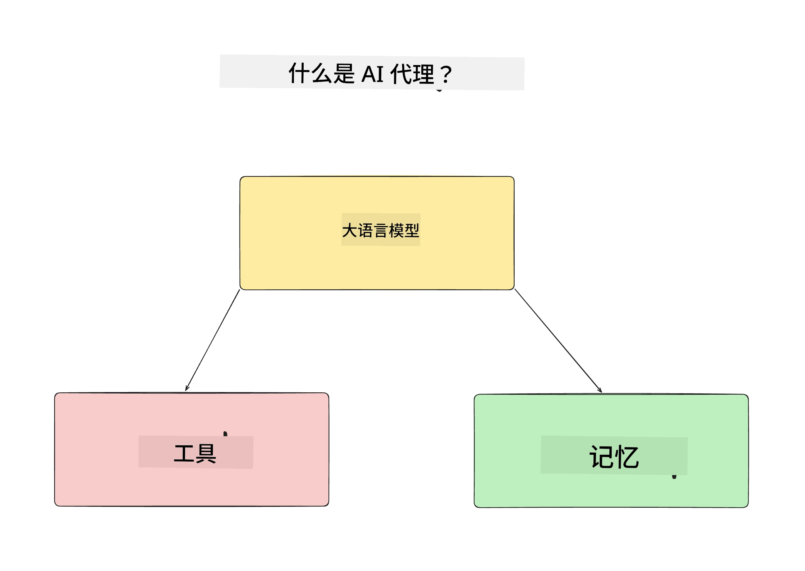
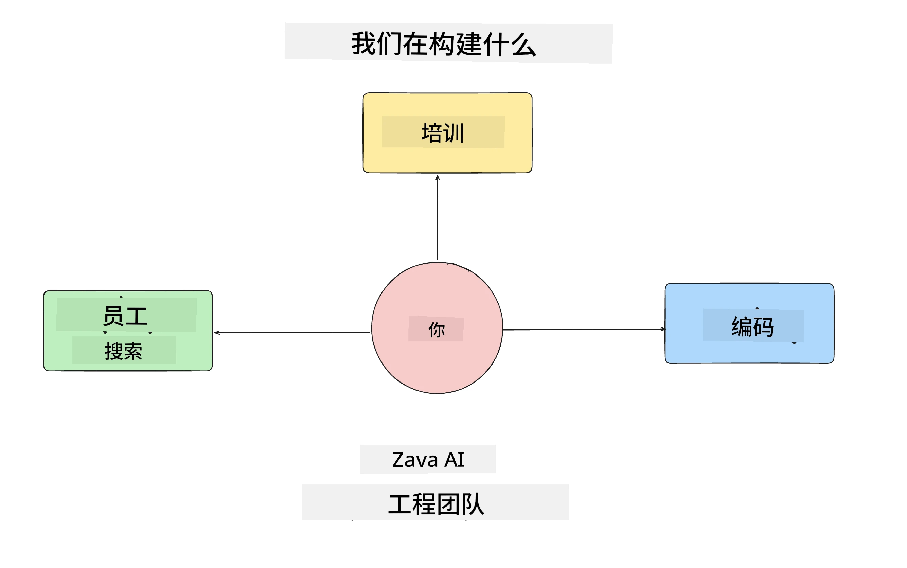
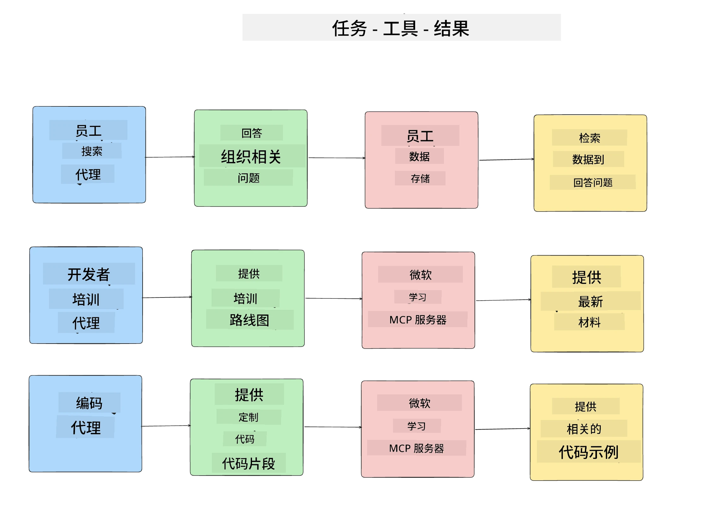
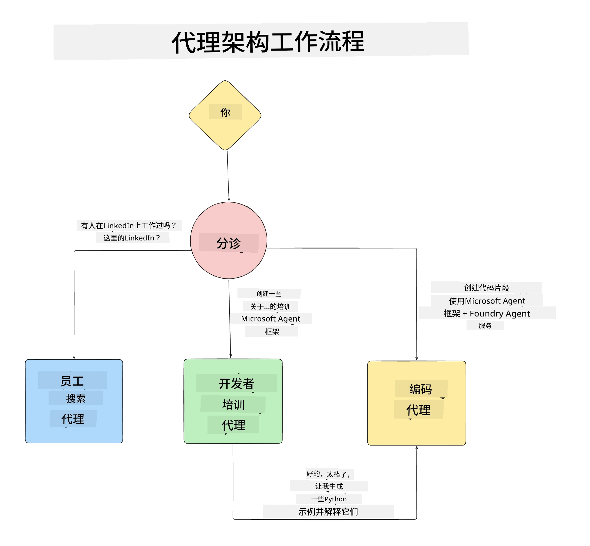

# 课程1：AI代理设计

欢迎来到“从零到生产构建AI代理课程”的第一课！

本课将涵盖：

- 定义什么是AI代理
  
- 讨论我们正在构建的AI代理应用  

- 识别每个代理所需的工具和服务
  
- 设计我们的代理应用架构
  
让我们先从定义什么是代理以及为什么在应用中使用它们开始。

> **在开始课程前。** 本节为概念介绍——无需运行代码。
> 从[课程2](../lesson-2-agent-development/README.md)开始，您将需要：一个拥有<strong>Microsoft Foundry</strong>访问权限的<strong>Azure订阅</strong>，已部署的<strong>GPT-5系列模型</strong>（例如 `gpt-5.1` — 避免使用已退休的GPT-4o / GPT-4.1），**Python 3.12+**，以及<strong>Azure CLI</strong>（`az login`）。完整需求与链接请参见课程README的[你需要什么](../README.md#what-you-need)。

## 什么是AI代理？

如果这是您第一次探索如何构建AI代理，您可能会对AI代理如何定义感到疑惑。

这里用一个简单的方法通过组成部分来定义什么是AI代理：

<strong>大型语言模型</strong> — LLM驱动自然语言处理能力，用以理解用户想完成的任务，同时理解可用工具的描述来实现任务。

<strong>工具</strong> — 这些是函数、API、数据存储和其他服务，LLM可以选择使用它们来完成用户请求的任务。

<strong>记忆</strong> — 用于存储AI代理与用户之间的短期和长期互动。存储和检索这些信息对改进和长期保存用户偏好至关重要。

## 我们的AI代理用例

在本课程中，我们将构建一个AI代理应用，帮助新开发者加入我们的AI代理开发团队！

在开始任何开发工作之前，创建成功AI代理应用的第一步是定义清晰的场景，说明我们期望用户如何与AI代理交互。

针对此应用，我们将处理以下场景：

**场景1**：一位新员工加入组织，想了解他们所加入的团队及如何与团队成员沟通。

**场景2**：新员工想知道最适合他们的第一项任务是什么。

**场景3**：新员工希望收集学习资源和代码示例，帮助他们开始完成任务。

## 识别工具和服务

既然确定了这些场景，下一步是将它们映射到AI代理完成任务所需的工具和服务。

这个过程属于上下文工程（Context Engineering），我们将专注于确保AI代理在合适的时机拥有正确的上下文来完成任务。

让我们逐个场景进行，并通过列出每个代理的任务、工具和期望结果，进行良好的代理设计。

### 场景1 - 员工搜索代理

<strong>任务</strong> — 回答有关组织内员工的问题，例如入职日期、当前团队、所在位置和上一个职位。

<strong>工具</strong> — 当前员工名单及组织架构的数据存储

<strong>结果</strong> — 能够从数据存储中检索信息，回答一般的组织问题及具体员工相关问题。

### 场景2 - 任务推荐代理

<strong>任务</strong> — 根据新员工的开发经验，提出1-3个适合新员工处理的问题。

<strong>工具</strong> — GitHub MCP服务器，用于获取未解决的问题和构建开发者档案

<strong>结果</strong> — 能够读取GitHub档案最近5次提交和项目中的未解决问题，并基于匹配进行推荐

### 场景3 - 代码助理代理

<strong>任务</strong> — 基于“任务推荐”代理推荐的未解决问题，进行资源调研并生成代码片段辅助员工。

<strong>工具</strong> — Microsoft Learn MCP查找资源，代码解释器生成定制代码片段。

<strong>结果</strong> — 如果用户请求额外帮助，流程应使用Learn MCP服务器提供链接和资源片段，再转交代码解释器代理生成带有说明的小代码片段。

## 设计我们的代理应用架构

既然定义了每个代理，让我们创建一个架构图，帮助理解各代理如何根据任务协作或单独工作：

## 后续步骤

既然已经设计了每个代理及我们的代理系统，接下来进入下一课，我们将开发这些代理！

---

<!-- CO-OP TRANSLATOR DISCLAIMER START -->
**免责声明**：
本文件由 AI 翻译服务 [Co-op Translator](https://github.com/Azure/co-op-translator) 翻译完成。尽管我们力求准确，但请注意，自动翻译可能包含错误或不准确之处。原始语言版文件应视为权威来源。对于重要信息，建议使用专业人工翻译。我们对因使用本翻译而产生的任何误解或误释不承担责任。
<!-- CO-OP TRANSLATOR DISCLAIMER END -->