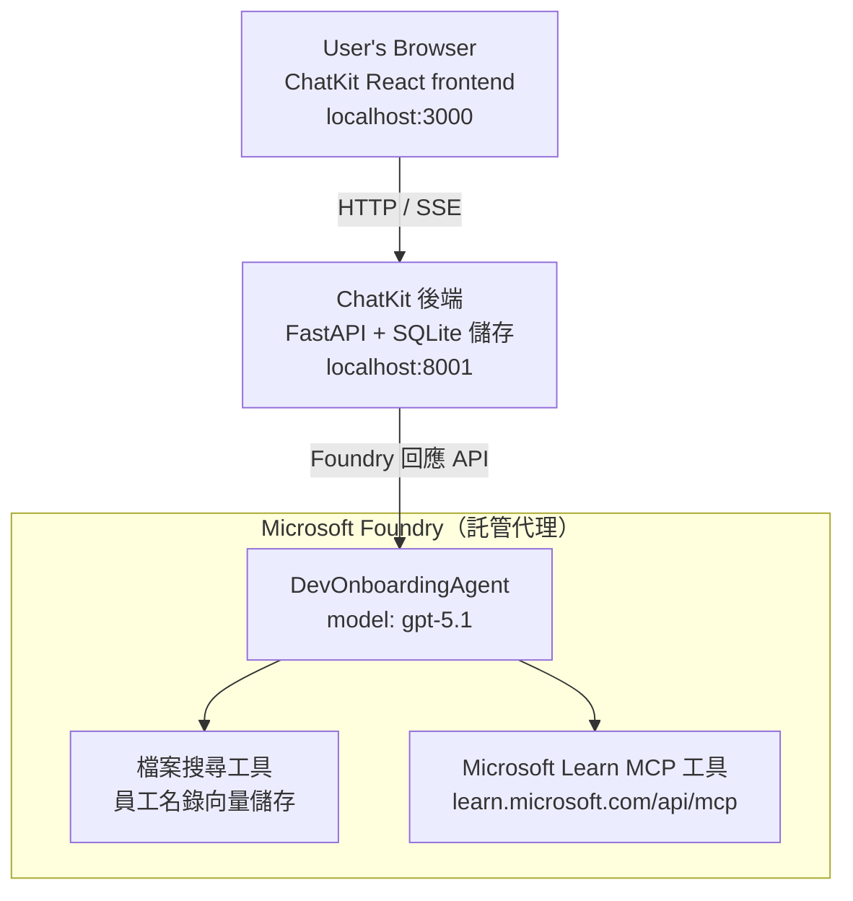

# 課程 4：使用 Microsoft Foundry 託管代理與 ChatKit 部署代理

本課程展示如何將一個使用工具的代理部署到 Microsoft Foundry 作為託管代理，並創建基於 ChatKit 的前端來與其互動。

## 架構

該託管代理是一個 **單一 `DevOnboardingAgent`**（運行於 `gpt-5.1`），使用兩個託管工具回答開發者入職問題：一個運行在員工目錄向量存儲上的 <strong>檔案搜尋</strong> 工具，以及 **Microsoft Learn MCP** 工具。ChatKit React 前端與 FastAPI 後端通信，後端透過 Foundry **Responses API** 呼叫代理。



## 先決條件

1. 位於北中美區域的 **Microsoft Foundry 專案**
2. 已認證的 **Azure CLI**（`az login`）
3. 已安裝 **Azure Developer CLI**（`azd`）
4. **Python 3.12+** 與 **Node.js 18+**
5. 使用員工數據建立的 <strong>向量存儲</strong>

## 快速開始

### 1. 設置環境變數

```bash
cd lesson-4-agentdeployment
cp .env.example .env
# 用你嘅 Microsoft Foundry 項目資料編輯 .env
```

### 2. 部署託管代理

**選項 A：使用 Azure Developer CLI（推薦）**

```bash
cd hosted-agent
azd auth login
azd agent deploy
```

**選項 B：使用 Docker ＋ Azure Container Registry**

```bash
cd hosted-agent

# 建立容器
docker build -t developer-onboarding-agent:latest .

# ACR 標籤
docker tag developer-onboarding-agent:latest <your-acr>.azurecr.io/developer-onboarding-agent:latest

# 推送到 ACR
az acr login --name <your-acr>
docker push <your-acr>.azurecr.io/developer-onboarding-agent:latest

# 透過 Microsoft Foundry 入口網站或 SDK 部署
```

### 3. 啟動 ChatKit 後端

```bash
cd chatkit-server
python -m venv .venv
source .venv/bin/activate  # 在 Windows 上：.venv\Scripts\activate
pip install -r requirements.txt
python app.py
```

伺服器將在 `http://localhost:8001` 啟動

### 4. 啟動 ChatKit 前端

```bash
cd chatkit-server/frontend
npm install
npm run dev
```

前端將在 `http://localhost:3000` 啟動

### 5. 測試應用程式

打開瀏覽器並訪問 `http://localhost:3000`，嘗試以下查詢：

**員工搜尋：**
-「我剛加入這裡！有誰在微軟工作過嗎？」
-「誰有 Azure Functions 經驗？」

**學習資源：**
-「幫我建立 Kubernetes 的學習路徑」
-「為了雲端架構，我應該考取哪些認證？」

**程式編寫協助：**
-「幫我寫連接 CosmosDB 的 Python 程式碼」
-「示範如何建立一個 Azure Function」

**多代理查詢：**
-「我準備從事雲端工程師工作。應該與誰聯繫，該學什麼？」

## 專案結構

```
lesson-4-agentdeployment/
├── .env.example                 # Environment variables template
├── implementation-plan.md       # Detailed implementation guide
├── README.md                    # This file
├── hosted-agent/               # Microsoft Foundry hosted agent
│   ├── main.py                 # Multi-agent workflow implementation
│   ├── requirements.txt        # Python dependencies
│   ├── Dockerfile              # Container definition
│   └── agent.yaml              # Agent deployment configuration
└── chatkit-server/             # ChatKit server application
    ├── app.py                  # FastAPI backend
    ├── store.py                # SQLite persistence layer
    ├── requirements.txt        # Python dependencies
    └── frontend/               # React frontend
        ├── package.json
        ├── vite.config.ts
        ├── tsconfig.json
        ├── index.html
        └── src/
            ├── main.tsx
            ├── App.tsx
            ├── App.css
            └── index.css
```

## 代理與其工具

託管代理為 <strong>單一代理</strong>（`DevOnboardingAgent`，定義於 `hosted-agent/main.py`），處理三個入職領域。不像調度多個子代理，它將每個功能以工具形式呈現（或直接依靠模型）：

| 功能 | 處理方式 | 工具 |
|-----------|------------------|------|
| <strong>員工搜尋與連結</strong> | 透過員工目錄向量存儲的 Foundry 託管檔案搜尋 | `client.get_file_search_tool(vector_store_ids=[...])` |
| <strong>學習與培訓</strong> | Microsoft Learn MCP 伺服器（託管 MCP 工具） | `client.get_mcp_tool(url="https://learn.microsoft.com/api/mcp")` |
| <strong>程式協助</strong> | 由 `gpt-5.1` 模型直接處理 — 無外部工具 | — |


該代理程式是透過 `client.as_agent(name="DevOnboardingAgent", instructions=..., tools=[file_search_tool, learn_mcp_tool])` 建立，並以 `from_agent_framework(agent).run()` 服務。

> **設計說明。** 本課程早期草稿使用了 `HandoffBuilder` 多代理工作流程（分診 → 專家）。出貨的代理程式是單一使用工具的代理，更簡單部署且方便理解，用於入職式問答。多代理協調與交接範例請參見第 2 課與第 3 課。

## 對託管代理程式進行煙霧測試（CI 門檻）

成功部署託管代理程式只是證明控制平面接受了
定義，<strong>不等於</strong>代理程式真的能回應。缺少依賴、
模型路由錯誤，或連線過期都可能導致代理程式狀態正常但無回應。

本課程提供輕量的 <strong>煙霧測試</strong> 作為部署後快速且成本低的
關卡。它使用 [AI Smoke Test](https://github.com/marketplace/actions/ai-smoke-test)
GitHub Action 對代理程式的 Foundry **Responses** 端點發送 POST 提示
(`POST {project_endpoint}/agents/{agent_name}/endpoint/protocols/openai/responses`)
並斷言回傳文字。能在幾秒內捕捉部署破損、授權回溯、
系統提示漂移以及線程斷裂問題。

> 煙霧測試<strong>不</strong>取代
> [第 3 課](../lesson-3-agent-evals/README.md)的完整評估 — 兩者互補。煙霧測試
> 回答<em>「代理程式是否可連接、回應且遵守基本提示？」</em>；
> 評估則回答<em>「回應品質如何？」</em>。請在每次部署時運行這道簡易關卡。

### 測試項目

目錄位於 [`hosted-agent/tests/smoke-tests.json`](../../../lesson-4-agentdeployment/hosted-agent/tests/smoke-tests.json)
，涵蓋代理程式三個領域以及提示遵守與多輪對話線程：

| 測試項目 | 驗證內容 |
|------|------------------|
| `reachability` | 代理程式回應非空且符合範圍 |
| `employee-search` | 檔案搜尋領域返回健康的 `200` 狀態碼（回應依資料而定） |
| `learning-path` | 學習領域回顯主題並生成路徑風格答案 |
| `coding-assistance` | 編碼領域回傳形似 Python 程式碼的答案 |
| `prompt-adherence-offtopic` | 非主題請求被重新導向，不給予詳細回答 |
| `threading-turn-1/2` | 透過 `previous_response_id` 跨回合保持對話狀態 |

### 在 CI 中執行

於 [`.github/workflows/smoke-test-hosted-agent.yml`](../../../.github/workflows/smoke-test-hosted-agent.yml)
的工作流程包含兩個作業：

- **`static`** — 一個快速且不連 Azure 的關卡，於每次拉取請求及推送時運行：
  編譯所有 Python 原始碼（`py_compile`）並檢查 Markdown 連結。無須祕密
  ，故可在分支 PR 上運行。
- **`smoke`** — 下方的 Azure 連線煙霧測試。可按需運行
  （操作 → **Agent CI (static + smoke)** → Run workflow），並可銜接在
  部署工作流程後。

配置此倉庫的 <strong>變數</strong> 和 <strong>祕密</strong> 以供 smoke 作業使用：


| 種類 | 名稱 | 值 |
|------|------|-------|

| 變數 | `FOUNDRY_PROJECT_ENDPOINT` | `https://<account>.services.ai.azure.com/api/projects/<project>` |
| 變數 | `HOSTED_AGENT_NAME` | 已部署代理名稱（例如 `dev-onboarding` — 必須與您的部署匹配） |
| 密鑰 | `AZURE_CLIENT_ID` / `AZURE_TENANT_ID` / `AZURE_SUBSCRIPTION_ID` | 用於 `azure/login` 的 OIDC 聯合身份 |

執行者身份需要在 **Foundry 專案範圍** 中擁有 **`Azure AI User`** 角色，以便
調用 Responses（和對話）資料平面端點。請授予其權限：

```bash
az role assignment create \
  --assignee <object-id-or-appId-of-runner-identity> \
  --role "Azure AI User" \
  --scope "/subscriptions/<sub>/resourceGroups/<rg>/providers/Microsoft.CognitiveServices/accounts/<account>/projects/<project>"
```

### 在本地運行

在推送之前，您可以運行相同的目錄。取得作用域為
`https://ai.azure.com/` 之資料平面令牌，並將執行者指向您的部署：

```bash
# 觀眾必須是 https://ai.azure.com/ （cognitiveservices.azure.com 代幣會被拒絕）
export FOUNDRY_TOKEN=$(az account get-access-token --resource https://ai.azure.com/ --query accessToken -o tsv)

git clone https://github.com/JFolberth/ai-smoketest && cd ai-smoketest
python runner.py \
  --project-endpoint "https://<account>.services.ai.azure.com/api/projects/<project>" \
  --agent-name dev-onboarding \
  --tests-file ../lesson-4-agentdeployment/hosted-agent/tests/smoke-tests.json
```

退出代碼：`0` 表示全部通過，`1` 表示斷言失敗，`2` 表示執行者錯誤（目錄或令牌錯誤）。

## 疑難排解

### 代理無回應
- 確認已在 Microsoft Foundry 部署並運行托管代理
- 檢查 `HOSTED_AGENT_NAME` 和 `HOSTED_AGENT_VERSION` 是否與您的部署匹配

### 向量存儲錯誤
- 確保正確設定 `VECTOR_STORE_ID`
- 驗證向量存儲中包含員工數據

### 身份驗證錯誤
- 執行 `az login` 以刷新憑證
- 確保您有權訪問 Microsoft Foundry 專案

## 資源

- [Microsoft Foundry 托管代理文件](https://learn.microsoft.com/en-us/azure/ai-foundry/agents/concepts/hosted-agents)
- [Microsoft Agent Framework](https://github.com/microsoft/agent-framework)
- [ChatKit 集成範例](https://github.com/microsoft/agent-framework/tree/main/python/samples/demos/chatkit-integration)
- [Azure 開發者 CLI](https://learn.microsoft.com/en-us/azure/developer/azure-developer-cli/overview)
- [AI 煙霧測試 GitHub 動作](https://github.com/marketplace/actions/ai-smoke-test)
- [使用 GitHub Actions 煙霧測試 Microsoft Foundry 代理（部落格）](https://techcommunity.microsoft.com/blog/azuredevcommunityblog/smoke-test-microsoft-foundry-agents-with-github-actions/4531912)

---

## 下一步

您的代理運行在 Microsoft 管理的基礎設施上。要將其推向企業生產環境——
控制其數據位置（數據主權、私人網絡、自帶 Azure
Cosmos DB / 存儲 / AI 搜索）並管理其工具——請繼續閱讀
**[課程 5：生產環境托管代理](../lesson-5-hosted-agents-production/README.md)**，該課程
解釋了 <strong>托管代理</strong> 和 <strong>功能主機</strong> 之間的關鍵差異。

---

<!-- CO-OP TRANSLATOR DISCLAIMER START -->
**免責聲明**：
本文件由 AI 翻譯服務 [Co-op Translator](https://github.com/Azure/co-op-translator) 翻譯而成。雖然我們致力於確保準確性，但請注意，機器自動翻譯可能包含錯誤或不準確之處。原始文件的母語版本應被視為權威來源。對於重要資訊，建議進行專業人工翻譯。我們不對因使用本翻譯而產生的任何誤解或誤釋承擔責任。
<!-- CO-OP TRANSLATOR DISCLAIMER END -->