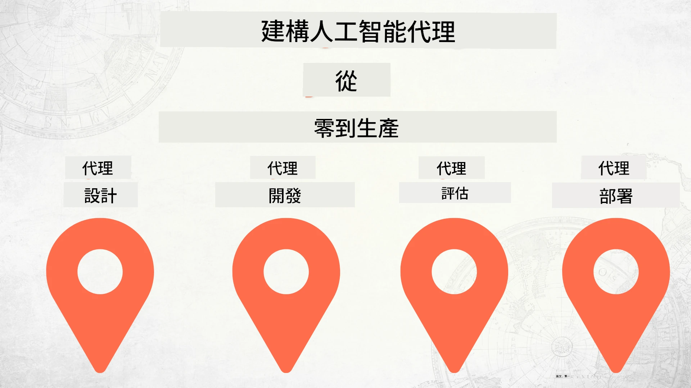

# 從零開始建立 AI 代理人直至生產



### 🌐 多語言支援

#### 透過 GitHub Action 支援（自動化與持續更新）

<!-- CO-OP TRANSLATOR LANGUAGES TABLE START -->
[阿拉伯文](../ar/README.md) | [孟加拉文](../bn/README.md) | [保加利亞文](../bg/README.md) | [緬甸語](../my/README.md) | [中文（簡體）](../zh-CN/README.md) | [中文（繁體，香港）](../zh-HK/README.md) | [中文（繁體，澳門）](./README.md) | [中文（繁體，台灣）](../zh-TW/README.md) | [克羅地亞文](../hr/README.md) | [捷克文](../cs/README.md) | [丹麥文](../da/README.md) | [荷蘭文](../nl/README.md) | [愛沙尼亞文](../et/README.md) | [芬蘭文](../fi/README.md) | [法文](../fr/README.md) | [德文](../de/README.md) | [希臘文](../el/README.md) | [希伯來文](../he/README.md) | [印地文](../hi/README.md) | [匈牙利文](../hu/README.md) | [印尼文](../id/README.md) | [意大利文](../it/README.md) | [日文](../ja/README.md) | [坎納達文](../kn/README.md) | [高棉文](../km/README.md) | [韓文](../ko/README.md) | [立陶宛文](../lt/README.md) | [馬來文](../ms/README.md) | [馬拉雅拉姆文](../ml/README.md) | [馬拉地文](../mr/README.md) | [尼泊爾文](../ne/README.md) | [奈及利亞皮欽語](../pcm/README.md) | [挪威文](../no/README.md) | [波斯文（法爾西語）](../fa/README.md) | [波蘭文](../pl/README.md) | [葡萄牙文（巴西）](../pt-BR/README.md) | [葡萄牙文（葡萄牙）](../pt-PT/README.md) | [旁遮普文（古魯穆奇字母）](../pa/README.md) | [羅馬尼亞文](../ro/README.md) | [俄文](../ru/README.md) | [塞爾維亞文（西里爾字母）](../sr/README.md) | [斯洛伐克文](../sk/README.md) | [斯洛維尼亞文](../sl/README.md) | [西班牙文](../es/README.md) | [斯瓦希里文](../sw/README.md) | [瑞典文](../sv/README.md) | [他加祿文（菲律賓語）](../tl/README.md) | [泰米爾文](../ta/README.md) | [泰盧固文](../te/README.md) | [泰文](../th/README.md) | [土耳其文](../tr/README.md) | [烏克蘭文](../uk/README.md) | [烏爾都文](../ur/README.md) | [越南文](../vi/README.md)

> **想要本地複製庫？**
>
> 本儲存庫包含 50 多種語言翻譯，顯著增加下載大小。若要無翻譯複製，請使用稀疏檢出：
>
> **Bash / macOS / Linux:**
> ```bash
> git clone --filter=blob:none --sparse https://github.com/microsoft/Building-AI-Agents-From-Zero-To-Production.git
> cd Building-AI-Agents-From-Zero-To-Production
> git sparse-checkout set --no-cone '/*' '!translations' '!translated_images'
> ```
>
> **CMD（Windows）：**
> ```cmd
> git clone --filter=blob:none --sparse https://github.com/microsoft/Building-AI-Agents-From-Zero-To-Production.git
> cd Building-AI-Agents-From-Zero-To-Production
> git sparse-checkout set --no-cone "/*" "!translations" "!translated_images"
> ```
>
> 如此可快速下載完成課程所需所有內容。
<!-- CO-OP TRANSLATOR LANGUAGES TABLE END -->

## 教您 AI 代理人開發生命週期基礎課程

[](https://github.com/microsoft/Building-AI-Agents-From-Zero-To-Production/blob/master/LICENSE?WT.mc_id=academic-105485-koreyst)
[](https://GitHub.com/microsoft/Building-AI-Agents-From-Zero-To-Production/graphs/contributors/?WT.mc_id=academic-105485-koreyst)
[](https://GitHub.com/microsoft/Building-AI-Agents-From-Zero-To-Production/issues/?WT.mc_id=academic-105485-koreyst)
[](https://GitHub.com/microsoft/Building-AI-Agents-From-Zero-To-Production/pulls/?WT.mc_id=academic-105485-koreyst)
[](http://makeapullrequest.com?WT.mc_id=academic-105485-koreyst)

[](https://discord.gg/Kuaw3ktsu6)

## 🌱 開始入門

本課程涵蓋建立及部署 AI 代理人的基礎。

每節課均建立於前一節課基礎上，建議從頭開始逐步學習至最後。

若想深入探索 AI 代理人主題，歡迎查看[AI 代理人初學者課程](https://aka.ms/ai-agents-beginners)。

### 認識其他學員，獲得答疑協助

如遇困難或對建立 AI 代理人有疑問，歡迎加入我們專屬的 Discord 頻道於 [Microsoft Foundry Discord](https://discord.gg/Kuaw3ktsu6)。

### 所需準備

每節課都有相應代碼範例可於本地運行。您可[派生此倉庫](https://github.com/microsoft/Building-AI-Agents-From-Zero-To-Production/fork)建立自己的複本。

本課程目前使用：

- [Microsoft Agent Framework (MAF)](https://aka.ms/ai-agents-beginners/agent-framework)
- [Microsoft Foundry](https://azure.microsoft.com/products/ai-foundry)
- [Azure OpenAI Service](https://azure.microsoft.com/products/ai-foundry/models/openai)
- [Azure CLI](https://learn.microsoft.com/cli/azure/authenticate-azure-cli?view=azure-cli-latest)

請確定您在開始前已可使用這些服務。

未來將有更多模型託管及服務選項。

## 🗃️ 課程內容

| <strong>課程</strong>           | <strong>說明</strong>                                                                                      |
|--------------------|-------------------------------------------------------------------------------------------------|
| [代理人設計](./lesson-1-agent-design/README.md)       | 介紹「開發者入門」代理人使用案例及如何設計高效代理人                                             |
| [代理人開發](./lesson-2-agent-development/README.md)  | 利用 Microsoft Agent Framework (MAF) 創建三個協助新人入門的代理人                                   |
| [代理人評估](./lesson-3-agent-evals/README.md)    | 利用 Microsoft Foundry 評估 AI 代理人表現並改善的方式                                           |
| [代理人部署](./lesson-4-agent-deployment/README.md)   | 利用託管代理人與 OpenAI Chatkit，展示如何將 AI 代理人部署到生產環境                                 |


## 🎒 其他課程

我們團隊還製作了其他課程！歡迎參考：

<!-- CO-OP TRANSLATOR OTHER COURSES START -->
### LangChain
[](https://aka.ms/langchain4j-for-beginners)
[](https://aka.ms/langchainjs-for-beginners?WT.mc_id=m365-94501-dwahlin)
[](https://github.com/microsoft/langchain-for-beginners?WT.mc_id=m365-94501-dwahlin)
---

### Azure / Edge / MCP / 代理人
[](https://github.com/microsoft/AZD-for-beginners?WT.mc_id=academic-105485-koreyst)
[](https://github.com/microsoft/edgeai-for-beginners?WT.mc_id=academic-105485-koreyst)
[](https://github.com/microsoft/mcp-for-beginners?WT.mc_id=academic-105485-koreyst)
[](https://github.com/microsoft/ai-agents-for-beginners?WT.mc_id=academic-105485-koreyst)

---
 
### 生成式 AI 系列
[](https://github.com/microsoft/generative-ai-for-beginners?WT.mc_id=academic-105485-koreyst)
[-9333EA?style=for-the-badge&labelColor=E5E7EB&color=9333EA)](https://github.com/microsoft/Generative-AI-for-beginners-dotnet?WT.mc_id=academic-105485-koreyst)
[-C084FC?style=for-the-badge&labelColor=E5E7EB&color=C084FC)](https://github.com/microsoft/generative-ai-for-beginners-java?WT.mc_id=academic-105485-koreyst)
[-E879F9?style=for-the-badge&labelColor=E5E7EB&color=E879F9)](https://github.com/microsoft/generative-ai-with-javascript?WT.mc_id=academic-105485-koreyst)

---
 
### 核心學習
[](https://aka.ms/ml-beginners?WT.mc_id=academic-105485-koreyst)
[](https://aka.ms/datascience-beginners?WT.mc_id=academic-105485-koreyst)
[](https://aka.ms/ai-beginners?WT.mc_id=academic-105485-koreyst)
[](https://github.com/microsoft/Security-101?WT.mc_id=academic-96948-sayoung)
[](https://aka.ms/webdev-beginners?WT.mc_id=academic-105485-koreyst)
[](https://aka.ms/iot-beginners?WT.mc_id=academic-105485-koreyst)
[](https://github.com/microsoft/xr-development-for-beginners?WT.mc_id=academic-105485-koreyst)

---
 
### Copilot 系列
[](https://aka.ms/GitHubCopilotAI?WT.mc_id=academic-105485-koreyst)
[](https://github.com/microsoft/mastering-github-copilot-for-dotnet-csharp-developers?WT.mc_id=academic-105485-koreyst)
[](https://github.com/microsoft/CopilotAdventures?WT.mc_id=academic-105485-koreyst)
<!-- CO-OP TRANSLATOR OTHER COURSES END -->

## 貢獻

本專案歡迎貢獻和建議。大部分貢獻需您同意一份
貢獻者授權協議（CLA），聲明您擁有權利，且確實授予我們
使用您貢獻的權利。詳情請訪問 <https://cla.opensource.microsoft.com>。

當您提交拉取請求時，CLA機器人會自動判斷您是否需要提供
CLA並適當標記該PR（例如，狀態檢查、評論）。請按照機器人
提供的指示操作。使用我們CLA的所有倉庫中您只需完成此一流程一次。

本專案已採用[微軟開源行為守則](https://opensource.microsoft.com/codeofconduct/)。
更多信息請參見[行為守則常見問答](https://opensource.microsoft.com/codeofconduct/faq/)，或聯絡[opencode@microsoft.com](mailto:opencode@microsoft.com)提出其他問題或意見。

## 商標

本專案可能包含項目、產品或服務的商標或標誌。授權使用微軟
商標或標誌，需遵守並依據
[微軟商標與品牌指南](https://www.microsoft.com/legal/intellectualproperty/trademarks/usage/general)。
在修改本專案版本中使用微軟商標或標誌，不得引起混淆或暗示微軟贊助。
任何第三方商標或標誌的使用，須遵守該第三方的政策。

## 尋求協助

如遇困難或在構建AI應用時有任何問題，請加入：

[](https://discord.gg/Kuaw3ktsu6)

如在開發過程中有產品反饋或錯誤，請訪問：

[](https://aka.ms/foundry/forum)

---

<!-- CO-OP TRANSLATOR DISCLAIMER START -->
**免責聲明**：  
本文件經由 AI 翻譯服務 [Co-op Translator](https://github.com/Azure/co-op-translator) 翻譯而成。雖然我們致力於確保準確性，但請注意，自動翻譯可能包含錯誤或不準確之處。原始文件的母語版本應視為權威來源。對於重要資訊，建議採用專業人工翻譯。我們不對因使用本翻譯所引起的任何誤解或誤譯承擔責任。
<!-- CO-OP TRANSLATOR DISCLAIMER END -->