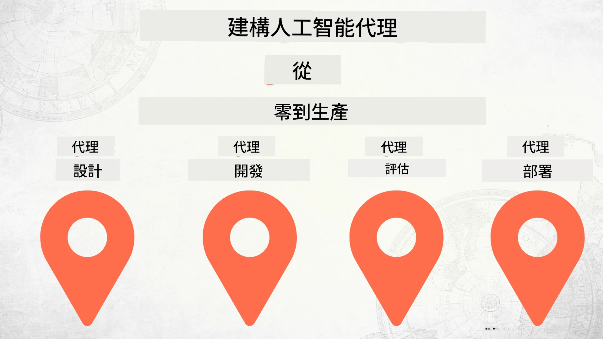

# 從零開始建立 AI 代理到生產階段



### 🌐 多語言支援

#### 透過 GitHub Action 支援（自動且始終更新）

<!-- CO-OP TRANSLATOR LANGUAGES TABLE START -->
[Arabic](../ar/README.md) | [Bengali](../bn/README.md) | [Bulgarian](../bg/README.md) | [Burmese (Myanmar)](../my/README.md) | [Chinese (Simplified)](../zh-CN/README.md) | [Chinese (Traditional, Hong Kong)](../zh-HK/README.md) | [Chinese (Traditional, Macau)](./README.md) | [Chinese (Traditional, Taiwan)](../zh-TW/README.md) | [Croatian](../hr/README.md) | [Czech](../cs/README.md) | [Danish](../da/README.md) | [Dutch](../nl/README.md) | [Estonian](../et/README.md) | [Finnish](../fi/README.md) | [French](../fr/README.md) | [German](../de/README.md) | [Greek](../el/README.md) | [Hebrew](../he/README.md) | [Hindi](../hi/README.md) | [Hungarian](../hu/README.md) | [Indonesian](../id/README.md) | [Italian](../it/README.md) | [Japanese](../ja/README.md) | [Kannada](../kn/README.md) | [Khmer](../km/README.md) | [Korean](../ko/README.md) | [Lithuanian](../lt/README.md) | [Malay](../ms/README.md) | [Malayalam](../ml/README.md) | [Marathi](../mr/README.md) | [Nepali](../ne/README.md) | [Nigerian Pidgin](../pcm/README.md) | [Norwegian](../no/README.md) | [Persian (Farsi)](../fa/README.md) | [Polish](../pl/README.md) | [Portuguese (Brazil)](../pt-BR/README.md) | [Portuguese (Portugal)](../pt-PT/README.md) | [Punjabi (Gurmukhi)](../pa/README.md) | [Romanian](../ro/README.md) | [Russian](../ru/README.md) | [Serbian (Cyrillic)](../sr/README.md) | [Slovak](../sk/README.md) | [Slovenian](../sl/README.md) | [Spanish](../es/README.md) | [Swahili](../sw/README.md) | [Swedish](../sv/README.md) | [Tagalog (Filipino)](../tl/README.md) | [Tamil](../ta/README.md) | [Telugu](../te/README.md) | [Thai](../th/README.md) | [Turkish](../tr/README.md) | [Ukrainian](../uk/README.md) | [Urdu](../ur/README.md) | [Vietnamese](../vi/README.md)

> **想本地複製？**
>
> 此儲存庫包含超過 50 種語言翻譯，這會大幅增加下載檔案大小。要在無翻譯版本中複製，請使用稀疏檢出：
>
> **Bash / macOS / Linux:**
> ```bash
> git clone --filter=blob:none --sparse https://github.com/microsoft/Building-AI-Agents-From-Zero-To-Production.git
> cd Building-AI-Agents-From-Zero-To-Production
> git sparse-checkout set --no-cone '/*' '!translations' '!translated_images'
> ```
>
> **CMD (Windows):**
> ```cmd
> git clone --filter=blob:none --sparse https://github.com/microsoft/Building-AI-Agents-From-Zero-To-Production.git
> cd Building-AI-Agents-From-Zero-To-Production
> git sparse-checkout set --no-cone "/*" "!translations" "!translated_images"
> ```
>
> 這能讓你用更快速度下載完成課程所需所有內容。
<!-- CO-OP TRANSLATOR LANGUAGES TABLE END -->

## 教你 AI 代理開發生命周期基本原理的課程

[](https://github.com/microsoft/Building-AI-Agents-From-Zero-To-Production/blob/master/LICENSE?WT.mc_id=academic-105485-koreyst)
[](https://GitHub.com/microsoft/Building-AI-Agents-From-Zero-To-Production/graphs/contributors/?WT.mc_id=academic-105485-koreyst)
[](https://GitHub.com/microsoft/Building-AI-Agents-From-Zero-To-Production/issues/?WT.mc_id=academic-105485-koreyst)
[](https://GitHub.com/microsoft/Building-AI-Agents-From-Zero-To-Production/pulls/?WT.mc_id=academic-105485-koreyst)
[](http://makeapullrequest.com?WT.mc_id=academic-105485-koreyst)

[](https://discord.gg/Kuaw3ktsu6)

## 🌱 開始入門

這門課有涵蓋打造和部署 AI 代理的基本課題。

每個課程都是建立在先前的基礎上，建議從頭開始依序學習直到結束。

若想深入探索 AI 代理相關主題，可以參考 [AI 代理入門課程](https://aka.ms/ai-agents-beginners)。

### 認識其他學習者，獲得解答

若遇到阻礙或有任何有關打造 AI 代理的問題，歡迎加入我們專門的 Discord 頻道 [Microsoft Foundry Discord](https://discord.gg/Kuaw3ktsu6)。

### 你需要的東西

每課程都有專屬的範例程式碼可供本地執行。你可以[派生此儲存庫](https://github.com/microsoft/Building-AI-Agents-From-Zero-To-Production/fork)來建立自己的版本。

本課程目前使用以下項目：

- [Microsoft Agent Framework (MAF)](https://aka.ms/ai-agents-beginners/agent-framework)
- [Microsoft Foundry](https://azure.microsoft.com/products/ai-foundry) — 一個部署了<strong>GPT-5 系列</strong>模型的項目（例如 `gpt-5.1`）。請勿使用已退役的 GPT-4o / GPT-4.1 模型。
- [Azure OpenAI Service](https://azure.microsoft.com/products/ai-foundry/models/openai)
- [Azure CLI](https://learn.microsoft.com/cli/azure/authenticate-azure-cli?view=azure-cli-latest) — 執行範例前請先以 `az login` 登入
- **Python 3.12 或更新版本**

請確保你有權限使用這些服務後再開始。

> **💰 成本與清理。** 實作課程會建立實際的 Azure 資源 — 包括 Microsoft Foundry
> 專案、一個模型部署、一個向量庫，以及（在第 4–6 課）托管代理和工具箱。
> 這些資源存在期間可能產生成本。完成課程或課程中的某課後，請刪除無需的
> 資源。最簡單的方法是把所有資源放在專用的資源群組中，完成後整組刪除：
>
>
> ```bash
> az group delete --name <your-resource-group> --yes --no-wait
> ```
>
> 你也可以在 Foundry 入口網站刪除單獨的代理、向量庫和工具箱。

> **關於模型的說明。** 本課程所有模型皆透過<strong>Microsoft Foundry</strong>提供。課程不
> 使用 *GitHub Models*，該服務將於<strong>2026 年 7 月 30 日</strong>退役 — Microsoft Foundry 是
> 官方遷移路徑。若你有舊程式碼調用 GitHub Models，請改指向 Foundry
> 模型部署。

更多模型託管與服務選項即將推出。 

## 🗃️ 課程列表

| <strong>課程</strong>         | <strong>說明</strong>                                                                                  |
|--------------------|--------------------------------------------------------------------------------------------------|
| [代理設計](./lesson-1-agent-design/README.md)       | 介紹「開發者入門」代理使用案例及如何設計有效代理                                           |
| [代理開發](./lesson-2-agent-development/README.md)  | 使用 Microsoft Agent Framework (MAF) 建立一組專門協助新開發者入門的代理                     |
| [代理評估](./lesson-3-agent-evals/README.md)  | 使用 Microsoft Foundry，了解我們的 AI 代理表現如何並學習如何改進                            |
| [代理部署](./lesson-4-agentdeployment/README.md)   | 使用 Microsoft Foundry 托管代理及 OpenAI ChatKit，學習如何將 AI 代理部署到生產環境           |
| [生產環境托管代理](./lesson-5-hosted-agents-production/README.md)   | 將托管代理投入企業生產：托管代理與能力主機、帶自己的儲存、記憶體與治理                  |
| [Microsoft 工具箱](./lesson-6-toolbox/README.md)   | 定義工具並集中管理：建立工具箱，通過一個 MCP 端點從代理消費工具，並安全版本控制工具           |
| [多代理與 A2A](./lesson-7-multi-agent-a2a/README.md)   | 將代理組成網路服務：透過開放式代理對代理（Agent-to-Agent, A2A）協定公開代理，並將遠端代理作為對等端消費 |


## 🎒 其他課程

我們團隊還有其他課程！快來看看：

<!-- CO-OP TRANSLATOR OTHER COURSES START -->
### LangChain
[](https://aka.ms/langchain4j-for-beginners)
[](https://aka.ms/langchainjs-for-beginners?WT.mc_id=m365-94501-dwahlin)
[](https://github.com/microsoft/langchain-for-beginners?WT.mc_id=m365-94501-dwahlin)
---

### Azure / Edge / MCP / Agents
[](https://github.com/microsoft/AZD-for-beginners?WT.mc_id=academic-105485-koreyst)
[](https://github.com/microsoft/edgeai-for-beginners?WT.mc_id=academic-105485-koreyst)
[](https://github.com/microsoft/mcp-for-beginners?WT.mc_id=academic-105485-koreyst)
[](https://github.com/microsoft/ai-agents-for-beginners?WT.mc_id=academic-105485-koreyst)

---
 
### 生成式 AI 系列

[](https://github.com/microsoft/generative-ai-for-beginners?WT.mc_id=academic-105485-koreyst)
[-9333EA?style=for-the-badge&labelColor=E5E7EB&color=9333EA)](https://github.com/microsoft/Generative-AI-for-beginners-dotnet?WT.mc_id=academic-105485-koreyst)
[-C084FC?style=for-the-badge&labelColor=E5E7EB&color=C084FC)](https://github.com/microsoft/generative-ai-for-beginners-java?WT.mc_id=academic-105485-koreyst)
[-E879F9?style=for-the-badge&labelColor=E5E7EB&color=E879F9)](https://github.com/microsoft/generative-ai-with-javascript?WT.mc_id=academic-105485-koreyst)

---
 
### 核心學習
[](https://aka.ms/ml-beginners?WT.mc_id=academic-105485-koreyst)
[](https://aka.ms/datascience-beginners?WT.mc_id=academic-105485-koreyst)
[](https://aka.ms/ai-beginners?WT.mc_id=academic-105485-koreyst)
[](https://github.com/microsoft/Security-101?WT.mc_id=academic-96948-sayoung)
[](https://aka.ms/webdev-beginners?WT.mc_id=academic-105485-koreyst)
[](https://aka.ms/iot-beginners?WT.mc_id=academic-105485-koreyst)
[](https://github.com/microsoft/xr-development-for-beginners?WT.mc_id=academic-105485-koreyst)

---
 
### Copilot 系列
[](https://aka.ms/GitHubCopilotAI?WT.mc_id=academic-105485-koreyst)
[](https://github.com/microsoft/mastering-github-copilot-for-dotnet-csharp-developers?WT.mc_id=academic-105485-koreyst)
[](https://github.com/microsoft/CopilotAdventures?WT.mc_id=academic-105485-koreyst)
<!-- CO-OP TRANSLATOR OTHER COURSES END -->

## 貢獻

本專案歡迎貢獻與建議。多數貢獻需要您同意一份
貢獻者授權協議 (Contributor License Agreement, CLA)，聲明您有權利並確實授予我們
使用您貢獻的權利。詳細資訊請參見 <https://cla.opensource.microsoft.com>。

當您提交拉取請求時，CLA 機械人會自動判斷您是否需要提供
CLA，並適當地標註 PR（例如狀態檢查、評論）。只需按照機械人提供的指示操作即可。
您只需在所有使用我們 CLA 的倉庫中操作一次。

本專案已採納 [Microsoft 開源行為準則](https://opensource.microsoft.com/codeofconduct/)。
更多資訊請參見[行為準則常見問題](https://opensource.microsoft.com/codeofconduct/faq/) 或
聯絡 [opencode@microsoft.com](mailto:opencode@microsoft.com) 詢問其他問題或提供意見。

## 商標

本專案可能包含專案、產品或服務的商標或標誌。授權使用 Microsoft
商標或標誌須遵守並依循
[Microsoft 商標與品牌指南](https://www.microsoft.com/legal/intellectualproperty/trademarks/usage/general)。
在本專案修改版本中使用 Microsoft 商標或標誌，不得造成混淆或暗示 Microsoft 贊助。
對第三方商標或標誌的任何使用，須遵守該第三方的政策。

## 尋求幫助

如果您遇到困難或對建立 AI 應用程式有任何疑問，歡迎加入：

[](https://discord.gg/Kuaw3ktsu6)

如果您在開發過程中有產品回饋或發現錯誤，請造訪：

[](https://aka.ms/foundry/forum)

---

<!-- CO-OP TRANSLATOR DISCLAIMER START -->
**免責聲明**：
本文件使用 AI 翻譯服務 [Co-op Translator](https://github.com/Azure/co-op-translator) 進行翻譯。雖然我們力求準確，但請注意，自動翻譯可能包含錯誤或不準確之處。原始文件的母語版本應被視為權威來源。對於重要資訊，建議尋求專業人工翻譯。我們不對因使用本翻譯而引起的任何誤解或曲解承擔責任。
<!-- CO-OP TRANSLATOR DISCLAIMER END -->