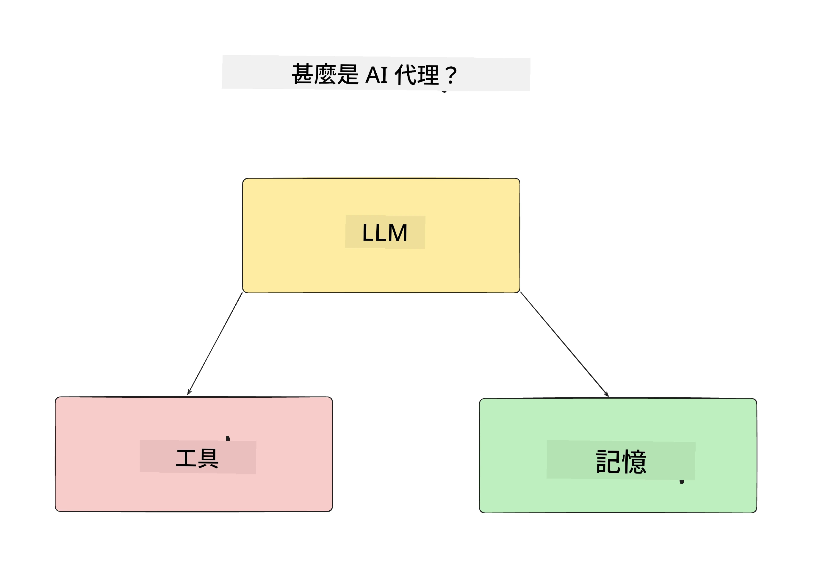
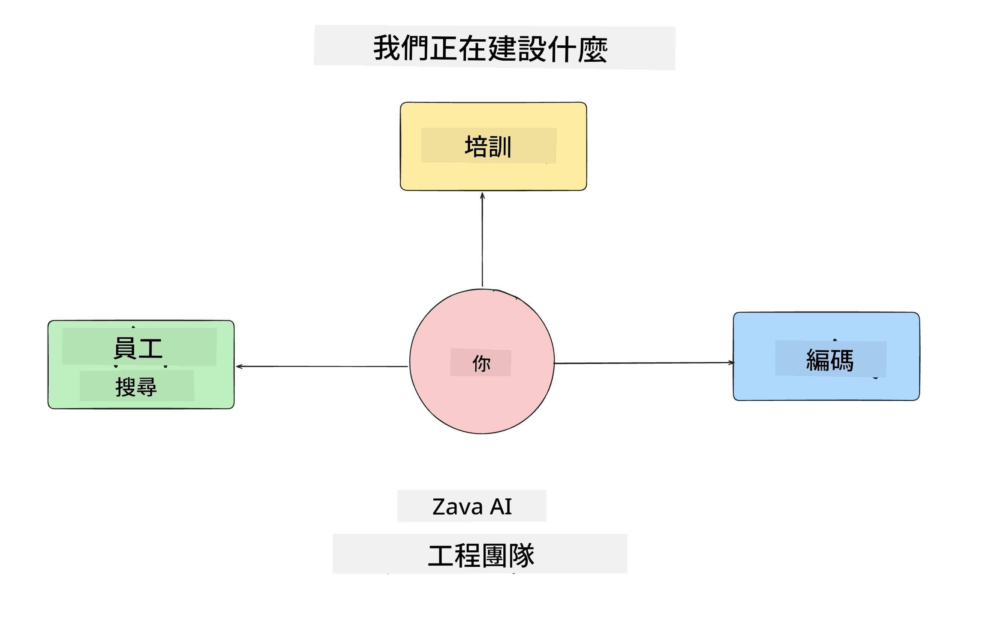
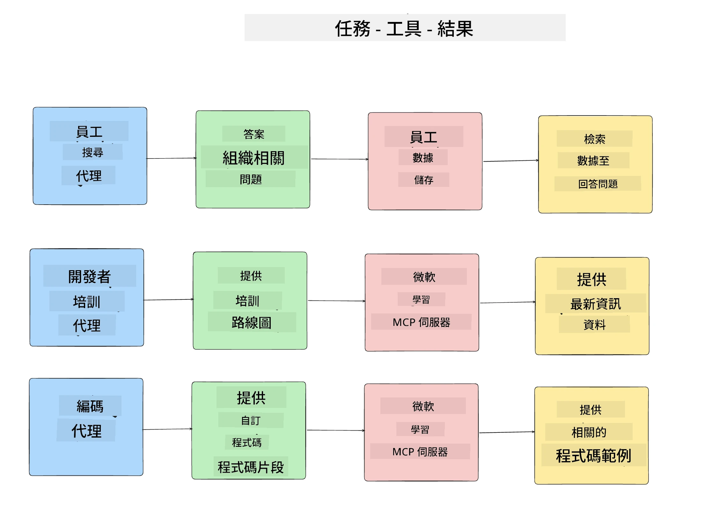
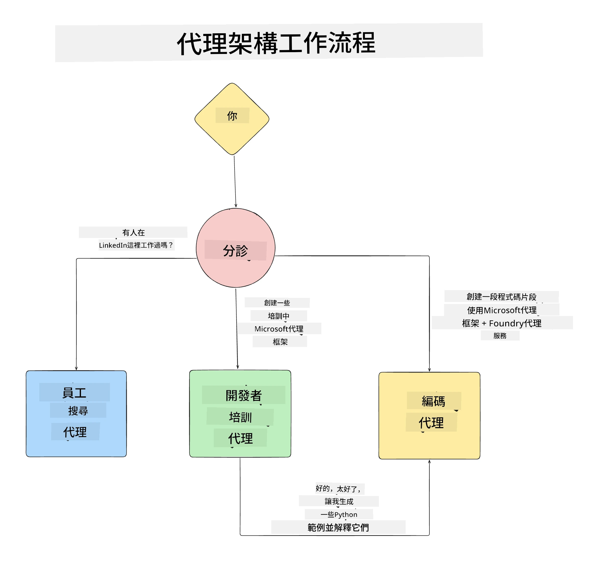

# 第一課：AI 代理設計

歡迎來到「從零開始建立 AI 代理到生產課程」的第一課！

在本課程中，我們將涵蓋：

- 定義什麼是 AI 代理
  
- 討論我們正在建立的 AI 代理應用程式  

- 確認每個代理所需的工具和服務
  
- 架構我們的代理應用程式
  
讓我們先從定義什麼是代理以及為什麼要在應用程式中使用它們開始。

> **在開始課程之前。** 本課程第一課為概念性質 — 不需執行程式碼。
> 從 [第二課](../lesson-2-agent-development/README.md) 開始你將需要：一個具備 **Microsoft Foundry** 存取權的 **Azure
> 訂閱<strong>，已部署的 </strong>GPT-5 系列模型**（例如 `gpt-5.1` — 避免使用已退役的 GPT-4o / GPT-4.1）、**Python 3.12+** 和 **Azure CLI**
> (`az login`)。完整需求列表與連結請參考課程 README 的 [你需要什麼](../README.md#what-you-need)。

## 什麼是 AI 代理？

如果這是你第一次探索如何建立 AI 代理，你可能會想知道如何準確定義 AI 代理是什麼。

一個簡單的定義方法是從組成部分來看 AI 代理：

<strong>大型語言模型</strong> - LLM 同時驅動理解使用者自然語言的能力，來判斷他們想完成的任務，以及理解可用工具的描述來完成這些任務。

<strong>工具</strong> - 這些可包含函數、API、資料庫及其他服務，LLM 可以選擇使用這些工具來完成使用者要求的任務。

<strong>記憶</strong> - 用來儲存 AI 代理與使用者之間短期及長期的互動。儲存與取回這些資訊對持續改善與保存使用者偏好非常重要。

## 我們的 AI 代理應用案例

這個課程中，我們將建立一套 AI 代理應用，幫助新進開發者加入我們的 AI 代理開發團隊！

在開始開發工作之前，建立成功 AI 代理應用的第一步，就是明確定義我們期望使用者與我們 AI 代理互動的場景。

在此應用中，我們將處理以下場景：

<strong>場景一</strong>：新員工加入組織，希望了解他們加入的團隊及如何與其聯繫。

<strong>場景二</strong>：新員工想知道最適合他們開始著手的第一個任務是什麼。

<strong>場景三</strong>：新員工想蒐集學習資源與程式碼範例，以幫助完成這項任務。

## 確認工具與服務

現在我們已有這些場景，下一步是將它們與我們 AI 代理需要使用來完成任務的工具與服務映射對應。

這個過程屬於情境工程（Context Engineering），我們重點在於確保 AI 代理在正確時間擁有正確情境以完成任務。

讓我們針對每個場景來做，並透過完善的代理設計，列出每個代理的任務、工具與期望成果。

### 場景一 - 員工搜尋代理

<strong>任務</strong> - 回答關於組織內員工的問題，例如加入日期、現任團隊、地點以及最後職位。

<strong>工具</strong> - 儲存現有員工名單與組織架構的資料庫

<strong>成果</strong> - 能從資料庫擷取資訊，回答一般組織問題及特定員工相關問題。

### 場景二 - 任務推薦代理

<strong>任務</strong> - 根據新員工的開發經驗，提出 1 至 3 個他們可著手處理的議題。

<strong>工具</strong> - GitHub MCP Server 用於取得開放議題並建立開發者檔案

<strong>成果</strong> - 能讀取 GitHub 個人檔案的最後 5 次提交記錄與 GitHub 專案的開放議題，並根據匹配結果提出建議

### 場景三 - 程式碼助理代理

<strong>任務</strong> - 根據「任務推薦」代理推薦的開放議題，研究並提供資源，生成程式碼片段以協助員工。

<strong>工具</strong> - Microsoft Learn MCP 用來尋找資源，及 Code Interpreter 生成自訂程式碼片段。

<strong>成果</strong> - 若使用者要求額外協助，工作流程應使用 Learn MCP Server 提供資源連結與程式碼片段，並交由 Code Interpreter 代理生成帶解釋的小程式碼片段。

## 架構我們的代理應用程式

現在我們定義了每個代理，接下來建立一個架構圖，協助我們了解各代理如何根據任務一起或分別運作：

## 下一步

現在我們設計好了每個代理及我們的代理系統，讓我們繼續下一課，開發這些代理吧！

---

<!-- CO-OP TRANSLATOR DISCLAIMER START -->
**免責聲明**：
本文件使用 AI 翻譯服務 [Co-op Translator](https://github.com/Azure/co-op-translator) 進行翻譯。雖然我們力求準確，但請注意，自動翻譯可能包含錯誤或不準確之處。原始文件的母語版本應被視為權威來源。對於重要資訊，建議尋求專業人工翻譯。我們不對因使用本翻譯而引起的任何誤解或曲解承擔責任。
<!-- CO-OP TRANSLATOR DISCLAIMER END -->