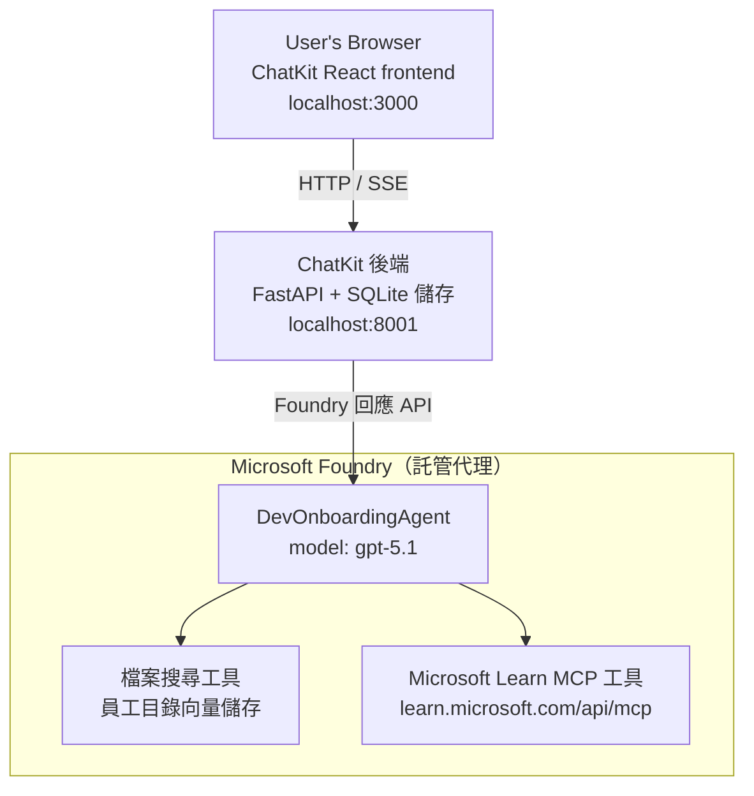

# 第四課：使用 Microsoft Foundry 托管代理與 ChatKit 進行代理部署

本課程演示如何將使用工具的代理部署到 Microsoft Foundry 作為托管代理，並建立基於 ChatKit 的前端與其互動。

## 架構

該托管代理是一個**單一的 `DevOnboardingAgent`**（運行於 `gpt-5.1`），使用兩個托管工具回答開發者入職相關問題：一個基於員工目錄向量存儲的<strong>文件搜尋</strong>工具，以及<strong>Microsoft Learn MCP</strong>工具。ChatKit React 前端與 FastAPI 後端通訊，後端透過 Foundry **Responses API** 呼叫代理。



## 前置條件

1. 位於北中美洲地區的 **Microsoft Foundry 專案**
2. 已認證的 **Azure CLI**（`az login`）
3. 安裝完成的 **Azure Developer CLI**（`azd`）
4. **Python 3.12+** 及 **Node.js 18+**
5. 已建立含員工資料的 <strong>向量存儲</strong>

## 快速開始

### 1. 設定環境變數

```bash
cd lesson-4-agentdeployment
cp .env.example .env
# 使用你的 Microsoft Foundry 項目詳情編輯 .env
```

### 2. 部署托管代理

**選項 A：使用 Azure Developer CLI（推薦）**

```bash
cd hosted-agent
azd auth login
azd agent deploy
```

**選項 B：使用 Docker + Azure Container Registry**

```bash
cd hosted-agent

# 建構容器
docker build -t developer-onboarding-agent:latest .

# ACR 標籤
docker tag developer-onboarding-agent:latest <your-acr>.azurecr.io/developer-onboarding-agent:latest

# 推送到 ACR
az acr login --name <your-acr>
docker push <your-acr>.azurecr.io/developer-onboarding-agent:latest

# 通過 Microsoft Foundry 入口網站或 SDK 部署
```

### 3. 啟動 ChatKit 後端

```bash
cd chatkit-server
python -m venv .venv
source .venv/bin/activate  # 在 Windows 上：.venv\Scripts\activate
pip install -r requirements.txt
python app.py
```

伺服器將啟動於 `http://localhost:8001`

### 4. 啟動 ChatKit 前端

```bash
cd chatkit-server/frontend
npm install
npm run dev
```

前端將啟動於 `http://localhost:3000`

### 5. 測試應用程式

在瀏覽器開啟 `http://localhost:3000`，試試以下查詢：

**員工搜尋：**
- 「我剛來這裡！有人在微軟工作過嗎？」
- 「誰有 Azure Functions 的經驗？」

**學習資源：**
- 「建立 Kubernetes 的學習路徑」
- 「我該考取哪些雲端架構相關的認證？」

**程式協助：**
- 「幫我寫連接 CosmosDB 的 Python 程式碼」
- 「示範如何建立 Azure Function」

**多代理查詢：**
- 「我剛開始做雲端工程師。應該聯絡誰？我要學什麼？」

## 專案結構

```
lesson-4-agentdeployment/
├── .env.example                 # Environment variables template
├── implementation-plan.md       # Detailed implementation guide
├── README.md                    # This file
├── hosted-agent/               # Microsoft Foundry hosted agent
│   ├── main.py                 # Multi-agent workflow implementation
│   ├── requirements.txt        # Python dependencies
│   ├── Dockerfile              # Container definition
│   └── agent.yaml              # Agent deployment configuration
└── chatkit-server/             # ChatKit server application
    ├── app.py                  # FastAPI backend
    ├── store.py                # SQLite persistence layer
    ├── requirements.txt        # Python dependencies
    └── frontend/               # React frontend
        ├── package.json
        ├── vite.config.ts
        ├── tsconfig.json
        ├── index.html
        └── src/
            ├── main.tsx
            ├── App.tsx
            ├── App.css
            └── index.css
```

## 代理與其工具

該托管代理是<strong>單一代理</strong>（`DevOnboardingAgent`，定義於 `hosted-agent/main.py`），負責三個入職領域。它不使用多個子代理協調，而是將每項能力暴露成工具（或直接透過模型）：

| 能力 | 處理方式 | 工具 |
|-----------|------------------|------|
| <strong>員工搜尋與聯繫</strong> | 透過員工目錄向量存儲的 Foundry 托管文件搜尋工具 | `client.get_file_search_tool(vector_store_ids=[...])` |
| <strong>學習與訓練</strong> | Microsoft Learn MCP 伺服器（托管 MCP 工具） | `client.get_mcp_tool(url="https://learn.microsoft.com/api/mcp")` |
| <strong>程式協助</strong> | 由 `gpt-5.1` 模型直接處理 — 無外部工具 | — |


agent 係用 `client.as_agent(name="DevOnboardingAgent", instructions=..., tools=[file_search_tool, learn_mcp_tool])` 創建，然後用 `from_agent_framework(agent).run()` 服務。

> **設計註解。** 早期版本嘅課程用咗 `HandoffBuilder` 多 agent 工作流程（Triage → 專家）。而目前交付嘅 agent 係單一使用工具嘅 agent，部署同使用時更簡單，啱用喺入門式 Q&A。至於多 agent 協調同轉交嘅例子，可以睇第 2 課同第 3 課。

## Hosted agent 嘅簡易測試（CI 門檻）

成功部署一個 hosted agent 只證明控制平臺接受咗
定義 — 唔代表 agent 真係會應答。有可能係缺少依賴、
模型路由錯誤，或者連線過期，令到 agent 呈現綠燈但無回應。

本課程交付咗輕量嘅 <strong>煙霧測試</strong>，作為一個快、廉嘅部署後
門檻。佢使用 [AI Smoke Test](https://github.com/marketplace/actions/ai-smoke-test)
GitHub Action 去 POST 提示字到 agent 嘅 Foundry **Responses** 端點
(`POST {project_endpoint}/agents/{agent_name}/endpoint/protocols/openai/responses`)
，並對返回嘅文字做斷言。佢能喺數秒內捕捉部署錯誤、認證回退、
系統提示漂移、同會話線程中斷。

> 煙霧測試並 <strong>唔係</strong> 代替完整嘅評估，
> 可以睇 [第 3 課](../lesson-3-agent-evals/README.md) — 佢哋係互補嘅。煙霧測試
> 回答 *「agent 係咪可達、會唔會回應、同遵守基本嘅提示規則？」*；
> 評估回答 *「回應質量有幾好？」*。每次部署都跑呢個廉價門檻。

### 測試內容

測試目錄喺 [`hosted-agent/tests/smoke-tests.json`](../../../lesson-4-agentdeployment/hosted-agent/tests/smoke-tests.json)
，涵蓋 agent 嘅三個領域，以及提示遵守同多輪對話線程：

| 測試 | 驗證咩內容 |
|------|------------------|
| `reachability` | Agent 回應非空、範圍內嘅文字 |
| `employee-search` | 文件搜索域返回健康嘅 `200`（回覆依數據而定） |
| `learning-path` | 學習域會回顯主題同產生路徑風格嘅答案 |
| `coding-assistance` | 程式域返回一段 Python 代碼形式嘅答案 |
| `prompt-adherence-offtopic` | 非主題請求會被重定向，唔詳細答覆 |
| `threading-turn-1/2` | 通話狀態經由 `previous_response_id` 保留跨輪回 |

### 喺 CI 內運行

工作流程喺 [`.github/workflows/smoke-test-hosted-agent.yml`](../../../.github/workflows/smoke-test-hosted-agent.yml)
，有兩個工作：

- **`static`** — 一個快速、無 Azure 嘅門檻，每個 pull request 同 push 都跑：
  編譯所有 Python 源碼（`py_compile`）同檢查 Markdown 鏈接。無需秘密
  ，所以支持 fork PR。
- **`smoke`** — 以下呢個連接 Azure 嘅煙霧測試。佢係按需
  運行（Actions → **Agent CI (static + smoke)** → Run workflow），可以串接喺你嘅
  部署工作流程之後。

配置呢啲 repository <strong>變量</strong> 同 <strong>秘鑰</strong> 用於煙霧測試工作：


| 類型 | 名稱 | 數值 |
|------|------|-------|

| 變數 | `FOUNDRY_PROJECT_ENDPOINT` | `https://<account>.services.ai.azure.com/api/projects/<project>` |
| 變數 | `HOSTED_AGENT_NAME` | 已部署的代理名稱（例如 `dev-onboarding` — 必須與你的部署相符） |
| 機密 | `AZURE_CLIENT_ID` / `AZURE_TENANT_ID` / `AZURE_SUBSCRIPTION_ID` | 用於 `azure/login` 的 OIDC 聯邦身份 |

執行者身份需要在 **Foundry 專案範圍** 擁有 **`Azure AI User`** 角色，才能
呼叫 Responses（和對話）資料平面端點。授予它此權限：

```bash
az role assignment create \
  --assignee <object-id-or-appId-of-runner-identity> \
  --role "Azure AI User" \
  --scope "/subscriptions/<sub>/resourceGroups/<rg>/providers/Microsoft.CognitiveServices/accounts/<account>/projects/<project>"
```

### 本地執行

你可以在推送之前執行同一個目錄。取得範圍為 `https://ai.azure.com/` 的資料平面權杖，
並將執行者指向你的部署：

```bash
# 受眾必須係 https://ai.azure.com/（拒絕 cognitiveservices.azure.com 令牌）
export FOUNDRY_TOKEN=$(az account get-access-token --resource https://ai.azure.com/ --query accessToken -o tsv)

git clone https://github.com/JFolberth/ai-smoketest && cd ai-smoketest
python runner.py \
  --project-endpoint "https://<account>.services.ai.azure.com/api/projects/<project>" \
  --agent-name dev-onboarding \
  --tests-file ../lesson-4-agentdeployment/hosted-agent/tests/smoke-tests.json
```

退出代碼：`0` 表示全通過，`1` 表示某項斷言失敗，`2` 表示執行者錯誤（目錄或權杖錯誤）。

## 疑難排解

### 代理無回應
- 確認 Microsoft Foundry 中的已部署代理正在運行
- 檢查 `HOSTED_AGENT_NAME` 和 `HOSTED_AGENT_VERSION` 是否與你的部署相符

### 向量庫錯誤
- 確認 `VECTOR_STORE_ID` 設置正確
- 確認向量庫包含員工資料

### 認證錯誤
- 執行 `az login` 以重新整理認證
- 確認你有權訪問 Microsoft Foundry 專案

## 資源

- [Microsoft Foundry 已部署代理文件](https://learn.microsoft.com/en-us/azure/ai-foundry/agents/concepts/hosted-agents)
- [Microsoft Agent Framework](https://github.com/microsoft/agent-framework)
- [ChatKit 整合範例](https://github.com/microsoft/agent-framework/tree/main/python/samples/demos/chatkit-integration)
- [Azure Developer CLI](https://learn.microsoft.com/en-us/azure/developer/azure-developer-cli/overview)
- [AI 煙霧測試 GitHub 動作](https://github.com/marketplace/actions/ai-smoke-test)
- [使用 GitHub Actions 對 Microsoft Foundry 代理進行煙霧測試（部落格）](https://techcommunity.microsoft.com/blog/azuredevcommunityblog/smoke-test-microsoft-foundry-agents-with-github-actions/4531912)

---

## 下一步

你的代理運行於 Microsoft 管理的基礎設施上。若要推向企業生產環境 —
控制資料所在位置（資料主權、私有網絡、自帶 Azure Cosmos DB / 儲存體 / AI 搜尋）並治理其工具 —
請繼續參閱
**[第 5 課：生產環境中已部署代理](../lesson-5-hosted-agents-production/README.md)**，其中解釋了
<strong>已部署代理</strong> 與 <strong>能力主機</strong> 之間的關鍵差異。

---

<!-- CO-OP TRANSLATOR DISCLAIMER START -->
**免責聲明**：
本文件使用 AI 翻譯服務 [Co-op Translator](https://github.com/Azure/co-op-translator) 進行翻譯。雖然我們力求準確，但請注意，自動翻譯可能包含錯誤或不準確之處。原始文件的母語版本應被視為權威來源。對於重要資訊，建議尋求專業人工翻譯。我們不對因使用本翻譯而引起的任何誤解或曲解承擔責任。
<!-- CO-OP TRANSLATOR DISCLAIMER END -->