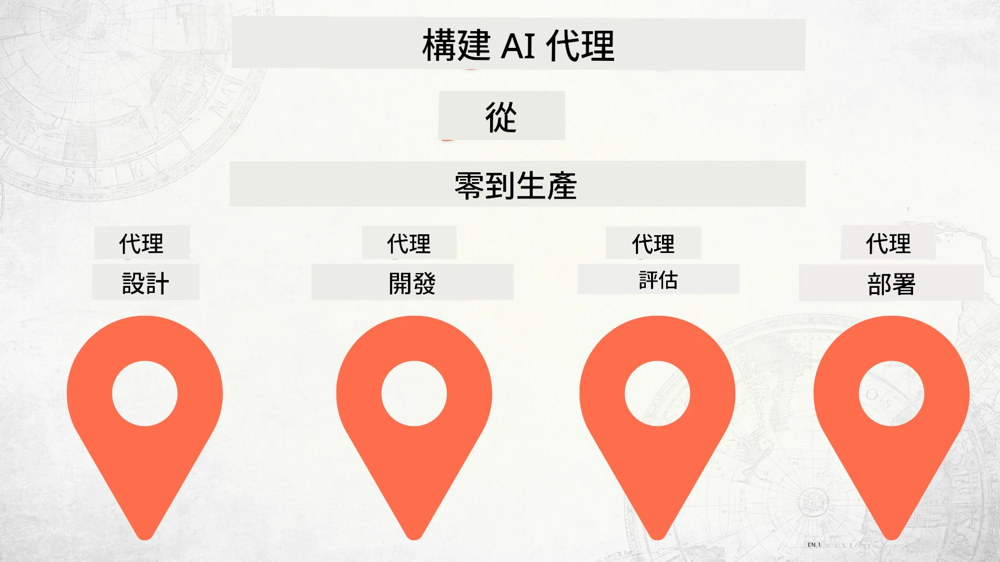

# 從零開始建構 AI 代理至生產環境



### 🌐 多語言支援

#### GitHub Action 支援（自動且保持最新）

<!-- CO-OP TRANSLATOR LANGUAGES TABLE START -->
[阿拉伯語](../ar/README.md) | [孟加拉語](../bn/README.md) | [保加利亞語](../bg/README.md) | [緬甸語 (緬甸)](../my/README.md) | [中文 (簡體)](../zh-CN/README.md) | [中文 (繁體，香港)](../zh-HK/README.md) | [中文 (繁體，澳門)](../zh-MO/README.md) | [中文 (繁體，臺灣)](./README.md) | [克羅埃西亞語](../hr/README.md) | [捷克語](../cs/README.md) | [丹麥語](../da/README.md) | [荷蘭語](../nl/README.md) | [愛沙尼亞語](../et/README.md) | [芬蘭語](../fi/README.md) | [法語](../fr/README.md) | [德語](../de/README.md) | [希臘語](../el/README.md) | [希伯來語](../he/README.md) | [印地語](../hi/README.md) | [匈牙利語](../hu/README.md) | [印尼語](../id/README.md) | [義大利語](../it/README.md) | [日語](../ja/README.md) | [坎納達語](../kn/README.md) | [高棉語](../km/README.md) | [韓語](../ko/README.md) | [立陶宛語](../lt/README.md) | [馬來語](../ms/README.md) | [馬拉雅拉姆語](../ml/README.md) | [馬拉地語](../mr/README.md) | [尼泊爾語](../ne/README.md) | [奈及利亞皮欽語](../pcm/README.md) | [挪威語](../no/README.md) | [波斯語 (法爾西語)](../fa/README.md) | [波蘭語](../pl/README.md) | [葡萄牙語 (巴西)](../pt-BR/README.md) | [葡萄牙語 (葡萄牙)](../pt-PT/README.md) | [旁遮普語 (古魯穆奇文)](../pa/README.md) | [羅馬尼亞語](../ro/README.md) | [俄語](../ru/README.md) | [塞爾維亞語 (西里爾字母)](../sr/README.md) | [斯洛伐克語](../sk/README.md) | [斯洛維尼亞語](../sl/README.md) | [西班牙語](../es/README.md) | [斯瓦希里語](../sw/README.md) | [瑞典語](../sv/README.md) | [他加祿語 (菲律賓語)](../tl/README.md) | [坦米爾語](../ta/README.md) | [泰盧固語](../te/README.md) | [泰語](../th/README.md) | [土耳其語](../tr/README.md) | [烏克蘭語](../uk/README.md) | [烏爾都語](../ur/README.md) | [越南語](../vi/README.md)

> **偏好本地複製？**
>
> 本存儲庫包含超過 50 種語言翻譯，這大幅增加了下載大小。若想複製而不含翻譯，可使用稀疏檢出：
>
> **Bash / macOS / Linux：**
> ```bash
> git clone --filter=blob:none --sparse https://github.com/microsoft/Building-AI-Agents-From-Zero-To-Production.git
> cd Building-AI-Agents-From-Zero-To-Production
> git sparse-checkout set --no-cone '/*' '!translations' '!translated_images'
> ```
>
> **CMD (Windows)：**
> ```cmd
> git clone --filter=blob:none --sparse https://github.com/microsoft/Building-AI-Agents-From-Zero-To-Production.git
> cd Building-AI-Agents-From-Zero-To-Production
> git sparse-checkout set --no-cone "/*" "!translations" "!translated_images"
> ```
>
> 這將為您提供完成課程所需的一切，且下載速度更快。
<!-- CO-OP TRANSLATOR LANGUAGES TABLE END -->

## 一門教授 AI 代理開發生命週期基礎的課程

[](https://github.com/microsoft/Building-AI-Agents-From-Zero-To-Production/blob/master/LICENSE?WT.mc_id=academic-105485-koreyst)
[](https://GitHub.com/microsoft/Building-AI-Agents-From-Zero-To-Production/graphs/contributors/?WT.mc_id=academic-105485-koreyst)
[](https://GitHub.com/microsoft/Building-AI-Agents-From-Zero-To-Production/issues/?WT.mc_id=academic-105485-koreyst)
[](https://GitHub.com/microsoft/Building-AI-Agents-From-Zero-To-Production/pulls/?WT.mc_id=academic-105485-koreyst)
[](http://makeapullrequest.com?WT.mc_id=academic-105485-koreyst)

[](https://discord.gg/Kuaw3ktsu6)

## 🌱 開始

本課程包含涵蓋建構與部署 AI 代理基礎的課程單元。

每個課程單元都建立在前面的基礎上，建議從頭開始學習並循序漸進到結束。

如果您想深入探索更多 AI 代理主題，可以參考 [AI Agents For Beginners Course](https://aka.ms/ai-agents-beginners)。

### 認識其他學習者，解決您的問題

如果您在建構 AI 代理時遇到困難或有任何問題，歡迎加入我們在 [Microsoft Foundry Discord](https://discord.gg/Kuaw3ktsu6) 的專門頻道。

### 您需要的工具

每個課程單元皆有自己的範例程式碼，可在本地執行。您也可以 [fork 本 repo](https://github.com/microsoft/Building-AI-Agents-From-Zero-To-Production/fork)，創建自己的副本。

本課程目前使用以下工具：

- [Microsoft Agent Framework (MAF)](https://aka.ms/ai-agents-beginners/agent-framework)
- [Microsoft Foundry](https://azure.microsoft.com/products/ai-foundry) — 一個部署了 **GPT-5 系列** 模型（例如 `gpt-5.1`）的項目。請 <strong>勿</strong> 使用已退役的 GPT-4o / GPT-4.1 模型。
- [Azure OpenAI 服務](https://azure.microsoft.com/products/ai-foundry/models/openai)
- [Azure CLI](https://learn.microsoft.com/cli/azure/authenticate-azure-cli?view=azure-cli-latest) — 執行任何範例前先以 `az login` 登入
- **Python 3.12 或更新版本**

請確保您在開始前能存取這些服務。

> **💰 費用與清理。** 實作課程會建立真實的 Azure 資源 — 包含 Microsoft Foundry
> 專案、模型部署、向量資料庫，以及（第4～6課程）託管代理及工具箱。
> 這些資源存在期間會產生費用。完成課程單元或整門課程後，請刪除
> 不再需要的資源。最簡單的做法是將所有資源放入專用資源群組中，
> 並在完成後刪除整個群組：
>
> ```bash
> az group delete --name <your-resource-group> --yes --no-wait
> ```
>
> 您也可以從 Foundry 入口網站刪除單獨的代理、向量資料庫和工具箱。

> **關於模型的說明。** 本課程所有模型均透過 **Microsoft Foundry** 提供。並不
> 使用即將於 **2026 年 7 月 30 日** 停用的 *GitHub Models* — Microsoft Foundry 是
> 官方的遷移路徑。如果您有舊代碼呼叫 GitHub Models，請改指向 Foundry
> 的模型部署。

更多關於模型託管與服務的選項即將推出。

## 🗃️ 課程單元

| <strong>課程</strong>         | <strong>描述</strong>                                                                                  |
|--------------------|--------------------------------------------------------------------------------------------------|
| [代理設計](./lesson-1-agent-design/README.md)       | 介紹我們的「開發者上線」代理用例及如何設計有效的代理  |
| [代理開發](./lesson-2-agent-development/README.md)  | 使用 Microsoft Agent Framework (MAF)，建構一組專門代理協助新開發者上線。       |
| [代理評估](./lesson-3-agent-evals/README.md)  | 利用 Microsoft Foundry 了解我們的 AI 代理表現及改進方法。 |
| [代理部署](./lesson-4-agentdeployment/README.md)   | 使用 Microsoft Foundry 託管代理和 OpenAI ChatKit，學習如何將 AI 代理部署到生產環境。       |
| [生產託管代理](./lesson-5-hosted-agents-production/README.md)   | 將託管代理投入企業生產：託管代理對比能力主機、自帶儲存、記憶體和治理。       |
| [Microsoft 工具箱](./lesson-6-toolbox/README.md)   | 定義工具並集中治理：建構工具箱，透過單一 MCP 端點由代理使用，且安全控制工具版本。       |
| [多代理與 A2A](./lesson-7-multi-agent-a2a/README.md)   | 將代理組合為網絡服務：透過開放的代理對代理 (A2A) 協議公開代理，並將遠端代理作為同儕使用。       |


## 🎒 其他課程

我們團隊還推出其他課程！歡迎參考：

<!-- CO-OP TRANSLATOR OTHER COURSES START -->
### LangChain
[](https://aka.ms/langchain4j-for-beginners)
[](https://aka.ms/langchainjs-for-beginners?WT.mc_id=m365-94501-dwahlin)
[](https://github.com/microsoft/langchain-for-beginners?WT.mc_id=m365-94501-dwahlin)
---

### Azure / Edge / MCP / 代理
[](https://github.com/microsoft/AZD-for-beginners?WT.mc_id=academic-105485-koreyst)
[](https://github.com/microsoft/edgeai-for-beginners?WT.mc_id=academic-105485-koreyst)
[](https://github.com/microsoft/mcp-for-beginners?WT.mc_id=academic-105485-koreyst)
[](https://github.com/microsoft/ai-agents-for-beginners?WT.mc_id=academic-105485-koreyst)

---
 
### 生成式 AI 系列

[](https://github.com/microsoft/generative-ai-for-beginners?WT.mc_id=academic-105485-koreyst)
[-9333EA?style=for-the-badge&labelColor=E5E7EB&color=9333EA)](https://github.com/microsoft/Generative-AI-for-beginners-dotnet?WT.mc_id=academic-105485-koreyst)
[-C084FC?style=for-the-badge&labelColor=E5E7EB&color=C084FC)](https://github.com/microsoft/generative-ai-for-beginners-java?WT.mc_id=academic-105485-koreyst)
[-E879F9?style=for-the-badge&labelColor=E5E7EB&color=E879F9)](https://github.com/microsoft/generative-ai-with-javascript?WT.mc_id=academic-105485-koreyst)

---
 
### 核心學習
[](https://aka.ms/ml-beginners?WT.mc_id=academic-105485-koreyst)
[](https://aka.ms/datascience-beginners?WT.mc_id=academic-105485-koreyst)
[](https://aka.ms/ai-beginners?WT.mc_id=academic-105485-koreyst)
[](https://github.com/microsoft/Security-101?WT.mc_id=academic-96948-sayoung)
[](https://aka.ms/webdev-beginners?WT.mc_id=academic-105485-koreyst)
[](https://aka.ms/iot-beginners?WT.mc_id=academic-105485-koreyst)
[](https://github.com/microsoft/xr-development-for-beginners?WT.mc_id=academic-105485-koreyst)

---
 
### Copilot 系列
[](https://aka.ms/GitHubCopilotAI?WT.mc_id=academic-105485-koreyst)
[](https://github.com/microsoft/mastering-github-copilot-for-dotnet-csharp-developers?WT.mc_id=academic-105485-koreyst)
[](https://github.com/microsoft/CopilotAdventures?WT.mc_id=academic-105485-koreyst)
<!-- CO-OP TRANSLATOR OTHER COURSES END -->

## 貢獻

本專案歡迎貢獻與建議。 大部分貢獻需您同意
贡献者许可协议（CLA），聲明您有權利並確實授權我們
使用您的貢獻。 詳細資訊請參閱 <https://cla.opensource.microsoft.com>。

當您提交拉取請求時，CLA 機器人會自動判斷您是否需要提供
CLA，並適當地標示 PR（例如，狀態檢查、留言）。只需遵循
機器人提供的指示。使用我們的 CLA，您只需在所有 repo 中執行此步驟一次。

本專案已採用 [Microsoft 開源行為守則](https://opensource.microsoft.com/codeofconduct/)。
更多資訊請參閱 [行為守則常見問題](https://opensource.microsoft.com/codeofconduct/faq/) 或
聯絡 [opencode@microsoft.com](mailto:opencode@microsoft.com) 提出任何其他問題或意見。

## 商標

本專案可能包含專案、產品或服務的商標或標誌。 授權使用 Microsoft
商標或標誌須遵循
[Microsoft 的商標與品牌指南](https://www.microsoft.com/legal/intellectualproperty/trademarks/usage/general)。
在本專案修改版中使用 Microsoft 商標或標誌不得引起混淆或暗示 Microsoft 贊助。
對第三方商標或標誌的任何使用均須遵守該等第三方的政策。

## 尋求協助

如果您遇到困難或對建構 AI 應用有任何疑問，歡迎加入：

[](https://discord.gg/Kuaw3ktsu6)

若您有產品回饋或在開發中遇到錯誤，請造訪：

[](https://aka.ms/foundry/forum)

---

<!-- CO-OP TRANSLATOR DISCLAIMER START -->
**免責聲明**：
此文件已使用 AI 翻譯服務 [Co-op Translator](https://github.com/Azure/co-op-translator) 進行翻譯。雖然我們努力追求準確性，但請注意自動翻譯可能包含錯誤或不準確之處。原始文件的母語版本應視為權威來源。對於關鍵資訊，建議採用專業人工翻譯。我們不對因使用此翻譯所產生的任何誤解或誤譯承擔責任。
<!-- CO-OP TRANSLATOR DISCLAIMER END -->