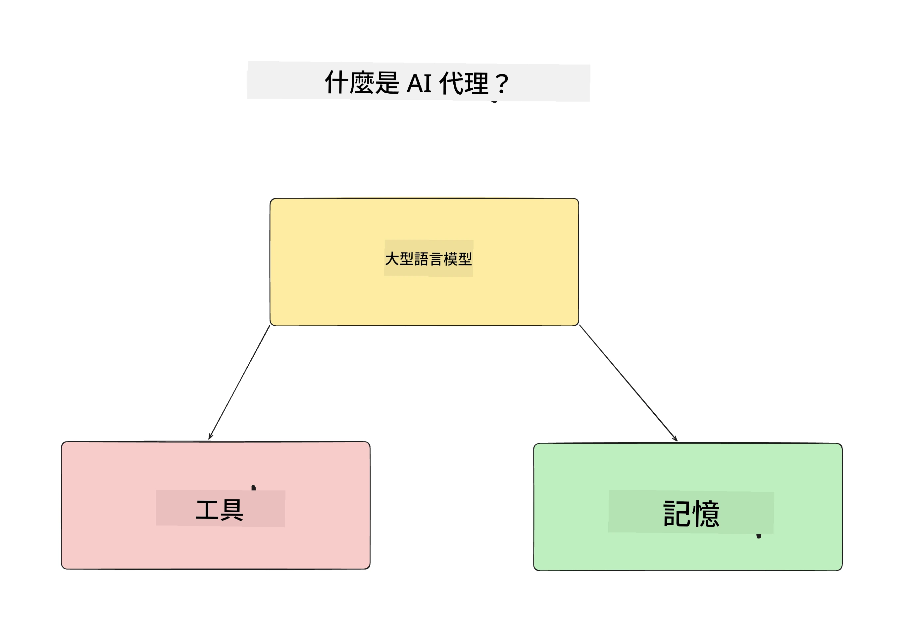
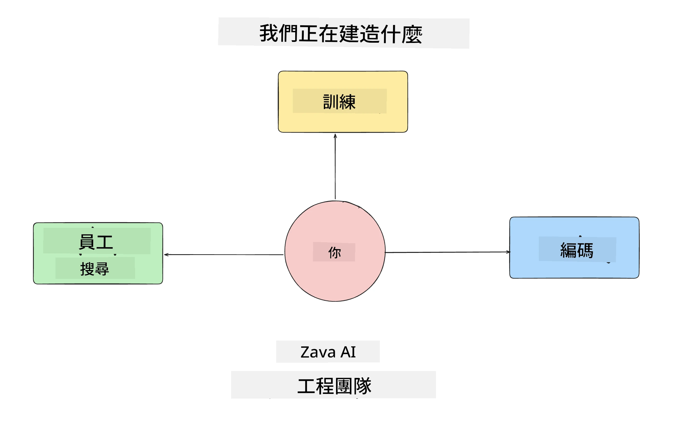
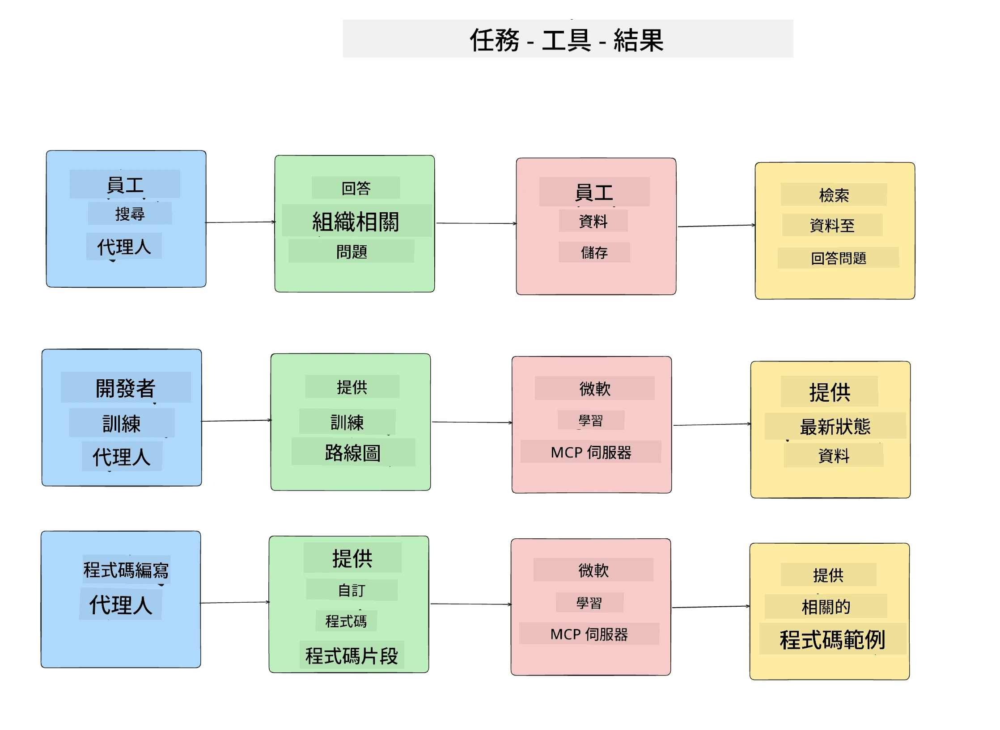
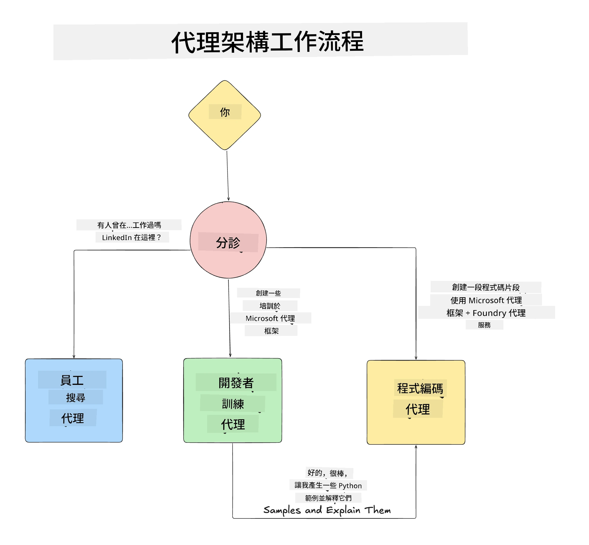

# 課程 1：AI 代理設計

歡迎來到「從零開始打造 AI 代理生產課程」的第一課！

本課程將涵蓋：

- 定義什麼是 AI 代理
  
- 討論我們正在建置的 AI 代理應用程式  

- 確認每個代理所需的工具和服務
  
- 架構我們的代理應用程式
  
讓我們先從定義什麼是代理，以及為什麼我們會在應用程式中使用它們開始。

> **在開始課程之前。** 本第一課為概念篇 — 沒有程式碼可執行。
> 從 [課程2](../lesson-2-agent-development/README.md) 開始，您將需要：具有 **Microsoft Foundry** 訪問權限的 **Azure
> 訂閱<strong>，一個已部署的 </strong>GPT-5 系列模型**（例如 `gpt-5.1` — 避免使用已淘汰的 GPT-4o / GPT-4.1）、**Python 3.12+** 以及 **Azure CLI**
> (`az login`)。完整清單和連結請參閱課程 README 中的 [您需要什麼](../README.md#what-you-need)。

## 什麼是 AI 代理？

如果您是第一次探索如何建立 AI 代理，可能會對如何準確定義 AI 代理有疑問。

透過構成元件，簡單定義 AI 代理如下：

<strong>大型語言模型</strong> — LLM 負責理解使用者自然語言的能力，用以解釋使用者想要完成的任務，以及解讀可用工具的描述，協助完成任務。

<strong>工具</strong> — 這些為函式、API、資料庫及其他服務，LLM 可選擇使用它們來完成使用者要求的任務。

<strong>記憶</strong> — 用以儲存 AI 代理與使用者間的短期及長期互動。儲存與調用這些資訊對於持續改進及保存使用者偏好極為重要。

## 我們的 AI 代理使用案例

在本課程中，我們將建置一個 AI 代理應用程式，協助新進開發者加入我們的 AI 代理開發團隊！

在進行任何開發工作之前，成功打造 AI 代理應用的第一步是定義清楚的使用場景，說明我們期望使用者與 AI 代理互動的方式。

對此應用，我們會著重以下場景：

**場景 1**：新員工加入我們組織，希望了解所加入團隊的相關資訊及如何聯繫團隊成員。

**場景 2**：新員工想知道最適合從哪個任務開始工作。

**場景 3**：新員工想蒐集學習資源和程式碼範例，協助他們開始完成任務。

## 確認工具和服務

現在有這些場景後，下一步是將其對應到 AI 代理完成任務所需的工具和服務。

這個過程屬於上下文工程，我們將專注確保 AI 代理在適當時間具備正確的上下文以完成任務。

讓我們逐場景來進行，透過列出每個代理的任務、工具與預期成果，執行良好的代理設計。

### 場景 1 - 員工搜尋代理

<strong>任務</strong> — 回答關於組織中員工的問題，例如入職日期、目前團隊、所在位置和之前職位。

<strong>工具</strong> — 目前員工名單與組織架構的資料庫

<strong>預期成果</strong> — 能夠從資料庫中檢索資訊，回答組織一般性問題及關於員工的特定問題。

### 場景 2 - 任務推薦代理

<strong>任務</strong> — 根據新員工的開發經驗，提出 1-3 項他們可以著手處理的議題。

<strong>工具</strong> — GitHub MCP 伺服器取得開放議題並建立開發者檔案

<strong>預期成果</strong> — 能讀取 GitHub 帳號最近 5 次提交和專案的開放議題，並根據匹配推薦任務。

### 場景 3 - 程式助手代理

<strong>任務</strong> — 根據「任務推薦」代理推薦的開放議題，研究並提供資源，生成協助員工的程式碼範例片段。

<strong>工具</strong> — Microsoft Learn MCP 找資源，以及 Code Interpreter 生成客製化程式碼片段。

<strong>預期成果</strong> — 若使用者請求額外協助，工作流程會使用 Learn MCP 伺服器提供資源連結和範例，然後交由 Code Interpreter 代理生成帶解說的小型程式碼片段。

## 架構我們的代理應用

既然已定義好每個代理，讓我們來創建架構圖，協助理解各代理如何根據任務一起協作或獨立運作：

## 接下來的步驟

現在我們已設計好各代理及代理系統，接下來讓我們進入下一課，開發這些代理！

---

<!-- CO-OP TRANSLATOR DISCLAIMER START -->
**免責聲明**：
此文件已使用 AI 翻譯服務 [Co-op Translator](https://github.com/Azure/co-op-translator) 進行翻譯。雖然我們努力追求準確性，但請注意自動翻譯可能包含錯誤或不準確之處。原始文件的母語版本應視為權威來源。對於關鍵資訊，建議採用專業人工翻譯。我們不對因使用此翻譯所產生的任何誤解或誤譯承擔責任。
<!-- CO-OP TRANSLATOR DISCLAIMER END -->