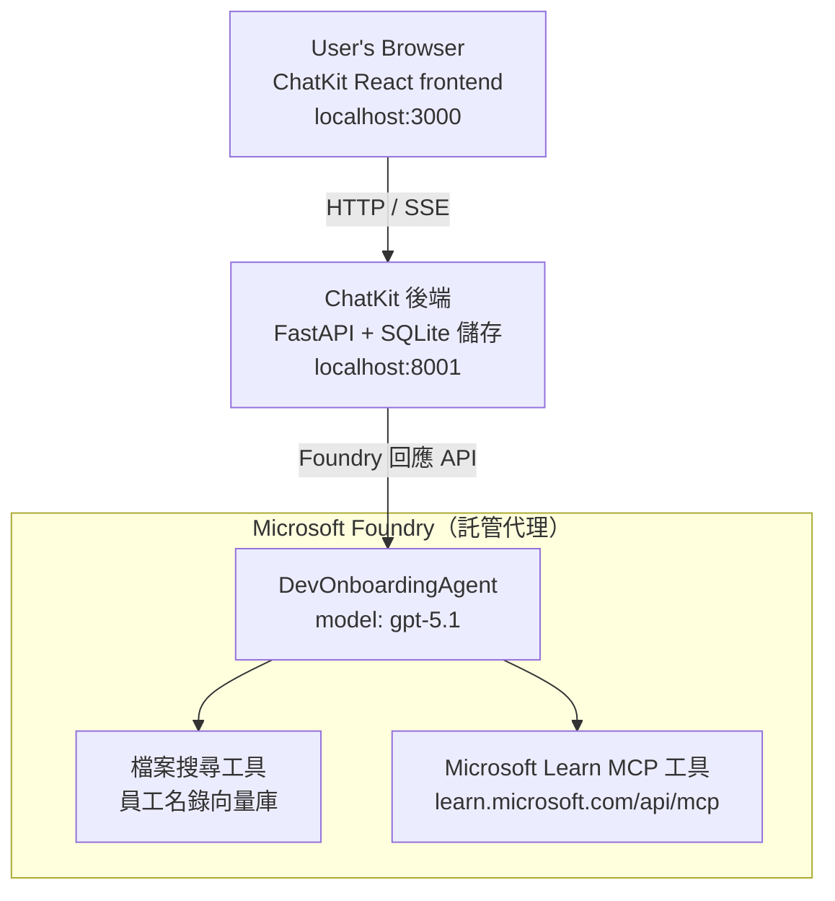

# 第4課：使用 Microsoft Foundry 託管代理和 ChatKit 部署代理

本課程示範如何將使用工具的代理部署到 Microsoft Foundry 作為託管代理，並建立基於 ChatKit 的前端與其互動。

## 架構

該託管代理是**單一 `DevOnboardingAgent`**（運行於 `gpt-5.1`），利用兩個託管工具回答開發者入職問題：員工目錄向量存儲的<strong>檔案搜尋</strong>工具，以及<strong>Microsoft Learn MCP</strong> 工具。一個 ChatKit React 前端與 FastAPI 後端通訊，後端透過 Foundry 的 **Responses API** 呼叫代理。



## 前置條件

1. 位於美國中北部區域的 **Microsoft Foundry 專案**
2. 已認證的 **Azure CLI** (`az login`)
3. 已安裝 **Azure Developer CLI** (`azd`)
4. **Python 3.12+** 與 **Node.js 18+**
5. 使用員工資料建立的 <strong>向量存儲</strong>

## 快速開始

### 1. 設定環境變數

```bash
cd lesson-4-agentdeployment
cp .env.example .env
# 使用您的 Microsoft Foundry 專案詳細資訊編輯 .env
```

### 2. 部署託管代理

**選項 A：使用 Azure Developer CLI（推薦）**

```bash
cd hosted-agent
azd auth login
azd agent deploy
```

**選項 B：使用 Docker + Azure Container Registry**

```bash
cd hosted-agent

# 建置容器
docker build -t developer-onboarding-agent:latest .

# ACR 標籤
docker tag developer-onboarding-agent:latest <your-acr>.azurecr.io/developer-onboarding-agent:latest

# 推送到 ACR
az acr login --name <your-acr>
docker push <your-acr>.azurecr.io/developer-onboarding-agent:latest

# 透過 Microsoft Foundry 入口網站或 SDK 部署
```

### 3. 啟動 ChatKit 後端

```bash
cd chatkit-server
python -m venv .venv
source .venv/bin/activate  # 在 Windows 上：.venv\Scripts\activate
pip install -r requirements.txt
python app.py
```

伺服器將啟動於 `http://localhost:8001`

### 4. 啟動 ChatKit 前端

```bash
cd chatkit-server/frontend
npm install
npm run dev
```

前端將啟動於 `http://localhost:3000`

### 5. 測試應用程式

在瀏覽器開啟 `http://localhost:3000` 並嘗試以下查詢：

**員工搜尋：**
- 「我剛來！有人曾在 Microsoft 工作過嗎？」
- 「誰有 Azure Functions 的經驗？」

**學習資源：**
- 「建立 Kubernetes 的學習路徑」
- 「我要追求哪些雲端架構認證？」

**程式協助：**
- 「幫我寫連接 CosmosDB 的 Python 代碼」
- 「示範我如何建立 Azure Function」

**多代理查詢：**
- 「我剛開始當雲端工程師。應該跟誰聯繫，該學什麼？」

## 專案結構

```
lesson-4-agentdeployment/
├── .env.example                 # Environment variables template
├── implementation-plan.md       # Detailed implementation guide
├── README.md                    # This file
├── hosted-agent/               # Microsoft Foundry hosted agent
│   ├── main.py                 # Multi-agent workflow implementation
│   ├── requirements.txt        # Python dependencies
│   ├── Dockerfile              # Container definition
│   └── agent.yaml              # Agent deployment configuration
└── chatkit-server/             # ChatKit server application
    ├── app.py                  # FastAPI backend
    ├── store.py                # SQLite persistence layer
    ├── requirements.txt        # Python dependencies
    └── frontend/               # React frontend
        ├── package.json
        ├── vite.config.ts
        ├── tsconfig.json
        ├── index.html
        └── src/
            ├── main.tsx
            ├── App.tsx
            ├── App.css
            └── index.css
```

## 代理及其工具

該託管代理是<strong>單一代理</strong>（`DevOnboardingAgent`，定義於 `hosted-agent/main.py`），處理三個入職領域。它沒有編排獨立子代理，而是將各項功能作為工具暴露（或直接依賴模型）：

| 功能 | 處理方式 | 工具 |
|-----------|------------------|------|
| <strong>員工搜尋與聯繫</strong> | Foundry 託管的檔案搜尋，基於員工目錄向量存儲 | `client.get_file_search_tool(vector_store_ids=[...])` |
| <strong>學習與培訓</strong> | Microsoft Learn MCP 伺服器（託管的 MCP 工具） | `client.get_mcp_tool(url="https://learn.microsoft.com/api/mcp")` |
| <strong>程式協助</strong> | 由 `gpt-5.1` 模型直接處理 — 無外部工具 | — |


該代理是使用 `client.as_agent(name="DevOnboardingAgent", instructions=..., tools=[file_search_tool, learn_mcp_tool])` 建立，並以 `from_agent_framework(agent).run()` 來啟動。

> **設計說明。** 本課程早期版本使用 `HandoffBuilder` 多代理工作流程（分類 → 專家）。最終發佈的是單一使用工具的代理，這對於入門式問答的部署和推理更簡單。多代理協作與交接的範例請參考第 2 課和第 3 課。

## 針對託管代理的冒煙測試（CI 閘道）

成功部署託管代理，只證明控制平面接受了
定義 — 並不代表代理確實回應。缺少依賴項、
錯誤的模型路由或已過期的連線可能導致代理狀態綠燈卻無回應。

本課程提供輕量級的<strong>冒煙測試</strong>作為快速、低成本的部署後
閘道。它使用 [AI Smoke Test](https://github.com/marketplace/actions/ai-smoke-test)
GitHub Action 向代理的 Foundry **Responses** 端點
(`POST {project_endpoint}/agents/{agent_name}/endpoint/protocols/openai/responses`)
傳送提示並對返回文字斷言。它能在幾秒內捕捉部署損壞、授權回歸、
系統提示漂移及多執行緒斷裂問題。

> 冒煙測試<strong>不是</strong>用來替代
> [第 3 課](../lesson-3-agent-evals/README.md) 中的完整評估 — 它們是輔助補充。冒煙測試
> 用以回答「代理是否可連線、能回應且遵守基本提示？」；
> 評估則回答「回應質量有多好？」。每次部署都執行此低成本閘道。

### 測試內容

目錄位於 [`hosted-agent/tests/smoke-tests.json`](../../../lesson-4-agentdeployment/hosted-agent/tests/smoke-tests.json)
並測試代理的三大領域，以及提示依從性和多回合對話

| 測試項目 | 驗證內容 |
|------|------------------|
| `reachability` | 代理回應非空且在範圍內的文字 |
| `employee-search` | 檔案搜尋領域回應健康的 `200`（回應依資料而異） |
| `learning-path` | 學習領域回顯主題並產出路徑風格回答 |
| `coding-assistance` | 程式協助領域回傳格式為程式碼的 Python 回答 |
| `prompt-adherence-offtopic` | 非主題請求會被轉向，不會詳細回答 |
| `threading-turn-1/2` | 透過 `previous_response_id` 保持跨回合對話狀態 |

### 在 CI 中執行

工作流程位於 [`.github/workflows/smoke-test-hosted-agent.yml`](../../../.github/workflows/smoke-test-hosted-agent.yml)
共有兩個工作：

- **`static`** — 每次拉取請求與推送時執行的快速、無需 Azure 的閘道：
  編譯所有 Python 原始程式碼（`py_compile`）並檢查 Markdown 連結。不需祕密，
  因此可在分叉 PR 上運作。
- **`smoke`** — 以下連接 Azure 的冒煙測試。在需要時運行
  （Actions → **Agent CI (static + smoke)** → Run workflow），且可作為
  部署工作流程的後續鏈結。

配置這些儲存庫的<strong>變數</strong>與<strong>祕密</strong>供冒煙作業使用：


| 種類 | 名稱 | 數值 |
|------|------|-------|

| 變數 | `FOUNDRY_PROJECT_ENDPOINT` | `https://<account>.services.ai.azure.com/api/projects/<project>` |
| 變數 | `HOSTED_AGENT_NAME` | 部署代理名稱（例如 `dev-onboarding` — 必須與您的部署相符） |
| 機密 | `AZURE_CLIENT_ID` / `AZURE_TENANT_ID` / `AZURE_SUBSCRIPTION_ID` | 用於 `azure/login` 的 OIDC 聯邦身份 |

執行器身份需要在 **Foundry 專案範圍** 擁有 **`Azure AI User`** 角色，以便它能
調用 Responses（與 conversations）資料平面端點。請授予它：

```bash
az role assignment create \
  --assignee <object-id-or-appId-of-runner-identity> \
  --role "Azure AI User" \
  --scope "/subscriptions/<sub>/resourceGroups/<rg>/providers/Microsoft.CognitiveServices/accounts/<account>/projects/<project>"
```

### 本機執行

您可以在推送之前執行相同的目錄。獲取一個範圍為
`https://ai.azure.com/` 的資料平面令牌，並將執行器指向您的部署：

```bash
# 受眾必須是 https://ai.azure.com/ （cognitiveservices.azure.com 代幣將被拒絕）
export FOUNDRY_TOKEN=$(az account get-access-token --resource https://ai.azure.com/ --query accessToken -o tsv)

git clone https://github.com/JFolberth/ai-smoketest && cd ai-smoketest
python runner.py \
  --project-endpoint "https://<account>.services.ai.azure.com/api/projects/<project>" \
  --agent-name dev-onboarding \
  --tests-file ../lesson-4-agentdeployment/hosted-agent/tests/smoke-tests.json
```

退出代碼：`0` 全部通過，`1` 斷言失敗，`2` 執行器錯誤（目錄錯誤／令牌錯誤）。

## 疑難排解

### 代理無回應
- 驗證 Microsoft Foundry 中的宿主代理是否已部署並正在運行
- 檢查 `HOSTED_AGENT_NAME` 和 `HOSTED_AGENT_VERSION` 是否與您的部署相符

### 向量存儲錯誤
- 確保正確設定 `VECTOR_STORE_ID`
- 驗證向量存儲中包含員工資料

### 驗證錯誤
- 執行 `az login` 以刷新認證
- 確保您有存取 Microsoft Foundry 專案的權限

## 資源

- [Microsoft Foundry 宿主代理文件](https://learn.microsoft.com/en-us/azure/ai-foundry/agents/concepts/hosted-agents)
- [Microsoft Agent Framework](https://github.com/microsoft/agent-framework)
- [ChatKit 整合範例](https://github.com/microsoft/agent-framework/tree/main/python/samples/demos/chatkit-integration)
- [Azure Developer CLI](https://learn.microsoft.com/en-us/azure/developer/azure-developer-cli/overview)
- [AI 煙霧測試 GitHub Action](https://github.com/marketplace/actions/ai-smoke-test)
- [使用 GitHub Actions 煙霧測試 Microsoft Foundry 代理（部落格）](https://techcommunity.microsoft.com/blog/azuredevcommunityblog/smoke-test-microsoft-foundry-agents-with-github-actions/4531912)

---

## 下一步

您的代理運行於 Microsoft 管理的基礎設施上。要將其投入企業生產環境 —
控制其資料所在位置（資料主權、私有網路、自帶 Azure
Cosmos DB／Storage／AI Search）並治理其工具 — 請繼續閱讀
**[課程 5：生產環境宿主代理](../lesson-5-hosted-agents-production/README.md)**，該課程
會說明 <strong>宿主代理</strong> 與 <strong>能力主機</strong> 之間的重要差異。

---

<!-- CO-OP TRANSLATOR DISCLAIMER START -->
**免責聲明**：
此文件已使用 AI 翻譯服務 [Co-op Translator](https://github.com/Azure/co-op-translator) 進行翻譯。雖然我們努力追求準確性，但請注意自動翻譯可能包含錯誤或不準確之處。原始文件的母語版本應視為權威來源。對於關鍵資訊，建議採用專業人工翻譯。我們不對因使用此翻譯所產生的任何誤解或誤譯承擔責任。
<!-- CO-OP TRANSLATOR DISCLAIMER END -->